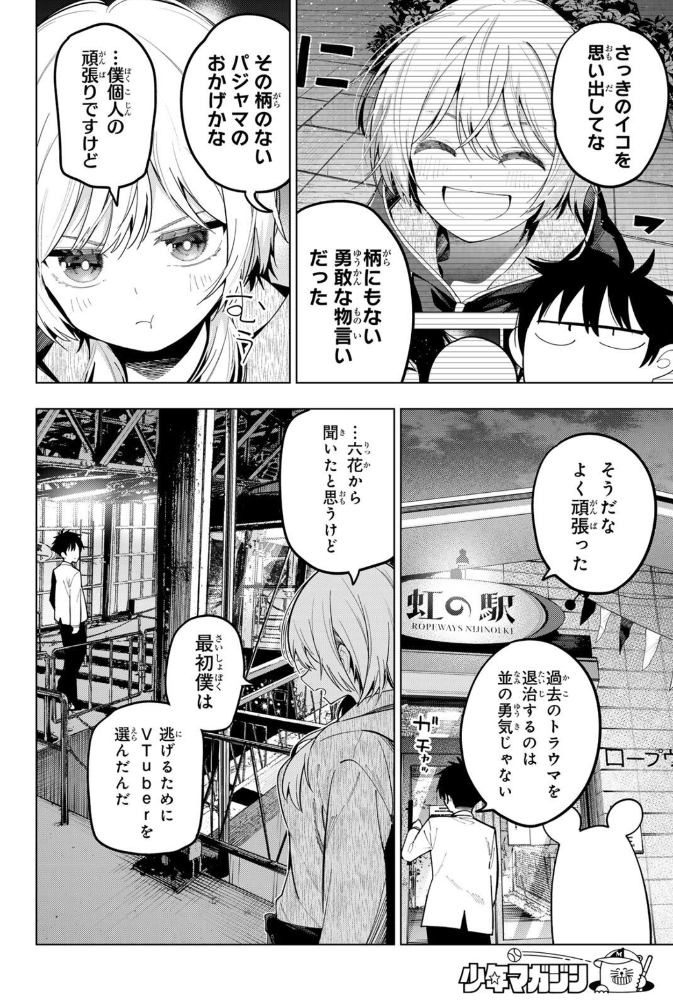
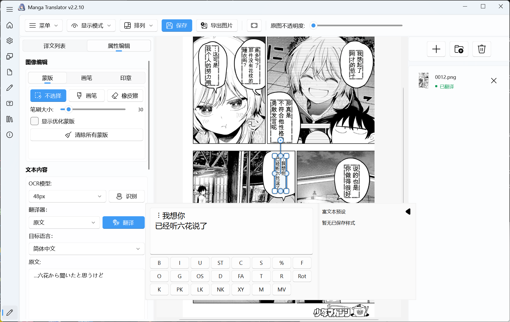
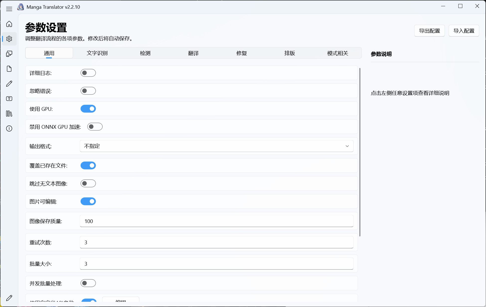

<div align="center">


**一键翻译所有主流漫画图片中的文字** — 检测 → OCR → 翻译 → 消字 → 嵌字，内置完整富文本编辑器

[](https://hgmzhn.github.io/manga-translator-ui/zh/)
[](https://github.com/hgmzhn/manga-translator-ui/releases)
[](https://github.com/hgmzhn/manga-translator-ui/issues)

[](https://github.com/zyddnys/manga-image-translator)
[](https://deepwiki.com/hgmzhn/manga-translator-ui)
[](LICENSE.txt)

[](https://github.com/bilibili/ailab)
[](https://github.com/the-database/MangaJaNai)
[](https://github.com/lhj5426/YSG)
[](https://huggingface.co/huyvux3005/manga109-segmentation-bubble)
[](https://github.com/PaddlePaddle/PaddleOCR)
[](https://github.com/kha-white/manga-ocr)
[](https://huggingface.co/PaddlePaddle/PaddleOCR-VL-1.5)

**语言 / Language**: 简体中文 | [English](README_EN.md)

</div>

**💬 QQ 交流群：1079089991（群密码：`kP9#mB2!vR5*sL1`）**

欢迎**开发者**提交 **PR**，共同改进项目；如果不确定改动是否符合项目方向，或希望先讨论实现方案，可以先提交 Issue 说明想法。提交前请阅读 **[PR 贡献规范](https://hgmzhn.github.io/manga-translator-ui/zh/community/contributing)**。

使用过程中遇到任何问题，也欢迎 **[提交 Issue](https://github.com/hgmzhn/manga-translator-ui/issues)**，并尽量附上运行环境、复现步骤、日志或截图，方便快速定位。

如果这个工具帮到了你，欢迎 **[打赏作者](#support-author)**！你的支持是持续维护的最大动力，**感谢**各位**老板**！

**🔗 友情链接：[MTU-JSON-GUI](https://github.com/charlespfan/mtu-json-gui)**：专为 [Manga Translator UI](https://github.com/hgmzhn/manga-translator-ui) 打造的 Web 端可视化嵌字工具。除了文本替换，还内置几何排版引擎，可通过算法自动处理日漫排版中的对齐、间距与透视问题。

---

## 📸 效果展示

<div align="center">

<table>
<tr>
<td align="center"><b>翻译前</b></td>
<td align="center"><b>翻译后</b></td>
</tr>
<tr>
<td></td>
<td></td>
</tr>
</table>

</div>

### 🖥️ 程序界面

<div align="center">

<table>
<tr>
<td colspan="2" align="center"><b>可视化编辑器</b></td>
</tr>
<tr>
<td colspan="2"></td>
</tr>
<tr>
<td colspan="2" align="center"><b>参数设置</b></td>
</tr>
<tr>
<td colspan="2"></td>
</tr>
</table>

</div>

---

## ✨ 核心功能

### 翻译功能

- 🔍 **智能文本检测** - 自动识别漫画中的文字区域
- 📝 **多语言 OCR** - 支持日语、中文、英语等多种语言
- 🌐 **多种翻译引擎** - OpenAI、Gemini、Vertex、Sakura（含高质量模式）
- 🎯 **高质量翻译** - 支持 GPT-4o、Gemini 多模态 AI 翻译
- 📚 **自动提取术语** - AI 自动识别并积累专有名词，保持翻译一致性
- 🎨 **AI 上色 / OCR / 渲染** - 支持多模态 AI 图像处理能力
- 🔑 **API Key 轮换与冷却** - 多 Key 自动切换，降低限流影响

### 排版与富文本

- 🎈 **智能气泡排版** - 译文自动缩进气泡形状里面，支持智能气泡、智能缩放与严格边界三种模式，以及气泡内居中和根据气泡排版开关
- ✂️ **中文语义断句** - 本地 HanLP 模型按语义决定换行点，模型缺失时自动回退普通换行
- 🤖 **AI 智能断句** - 根据上下文自动优化换行，提升译文可读性
- 🖋️ **横排 / 竖排自动判定** - 按文本方向选择合适的排版方式
- 🧩 **富文本规则自动套用** - 按规则在输入文字时自动应用样式
- 🔤 **字体管理** - 支持系统字体与 `fonts/` 自定义字体

### 可视化编辑器

- ✏️ **区域编辑** - 移动、旋转、变形文本框
- 📐 **文本编辑** - 手动翻译，逐框调整字号、颜色、描边与间距
- 🎨 **完整富文本** - 支持行内加粗、变色、描边、改字号、注音（Ruby）与竖排内横排（TCY），浮动编辑器支持预设和规则自动套用
- 🖌️ **蒙版编辑** - 画笔工具、橡皮擦、仿制印章
- 🔍 **原图对比** - 与原图双栏对比
- 📏 **多选排版** - 对齐文本框并分布间距
- ⏪ **撤销/重做** - 完整操作历史
- ⌨️ **快捷键支持** - `A/D` 切换图片，`1/2/3` 切换蒙版/画笔/印章页，`Q/W/E` 切换当前页的三个工具，`Ctrl+A` 全选文本框，`Ctrl+S` 保存工程数据，`Ctrl+Q` 导出图片，`Ctrl+Shift+R` 显示/关闭浮动富文本编辑器
- 🖱️ **鼠标滚轮快捷键** - Ctrl+滚轮缩放文本框，Shift+滚轮调整画笔大小

### 批量与自动化

- 📦 **批量处理** - 一次处理整个文件夹
- 🧰 **批量管理** - 按条件匹配区域，批量修改属性、替换文字或应用富文本样式；执行前预览命中结果，支持写回前备份与恢复
- 📥 **PSD 导出** - 导出原图、修复图和文本分层，便于继续编辑
- 🔄 **JSON / TXT 导入导出** - 导入、导出文本并支持写回
- ⌨️ **命令行模式** - 适合批量处理和自动化脚本
- 🌐 **Web UI** - 提供账号与配额管理
- 🐳 **Docker 部署** - 支持容器化运行

📖 [编辑器快捷键全表](https://hgmzhn.github.io/manga-translator-ui/zh/desktop/editor/shortcuts) ｜ [设置逐项说明](https://hgmzhn.github.io/manga-translator-ui/zh/reference/settings-index)

---

## 🚀 快速开始

> ⚠️ **Windows 用户请先安装运行库**：[Microsoft Visual C++ 运行库](https://aka.ms/vs/17/release/vc_redist.x64.exe)

### Windows

#### 便携安装包（⭐ 推荐，支持更新）

无需预装 Python。下载 [便携整合包](https://github.com/hgmzhn/manga-translator-ui/releases/tag/portable)，解压后运行 `Win-Install-or-Update.bat`，再双击 `Win-Start.bat` 启动；更新时在安装菜单选择 `[2] 更新`。 📖 [便携包安装详解](https://hgmzhn.github.io/manga-translator-ui/zh/install/windows-portable) ｜ [更新与版本切换](https://hgmzhn.github.io/manga-translator-ui/zh/install/update-and-version-switching)

#### 下载发布便携包

从 [GitHub Releases](https://github.com/hgmzhn/manga-translator-ui/releases) 下载 CPU、CUDA 13.0、CUDA 12.6 或实验性 ROCm 7.2.1 版本，解压后双击 `Win-Start.bat`。GeForce 10 系列（如 GTX 1060/1070/1080）必须下载文件名含 `cuda12.6` 的兼容版本；CUDA 13.0 仅支持 Turing（计算能力 7.5）及更新架构，RTX 20/30/40/50 系列在驱动支持 CUDA 13.0 时可选择 `cuda13.0`，RTX 50 系列推荐该版本。支持 CUDA 13.0 及以上的驱动也能运行 CUDA 12.6 包。包内已安装 Python 依赖和模型文件；ROCm 7.2.1 版本要求受支持的 AMD 显卡与 26.2.2 驱动。 📖 [发行版下载说明](https://hgmzhn.github.io/manga-translator-ui/zh/install/release-download)

#### 从源码运行（开发者）

适用于需要修改代码的用户，按 [Windows 源码安装说明](https://hgmzhn.github.io/manga-translator-ui/zh/install/source-windows) 执行。

### Linux / macOS

Linux 和 macOS 共用同一套安装脚本：

```bash
mkdir -p ~/manga-translator-ui && cd ~/manga-translator-ui
curl -L -O https://raw.githubusercontent.com/hgmzhn/manga-translator-ui/main/Unix-Install-or-Update.sh
chmod +x Unix-Install-or-Update.sh && ./Unix-Install-or-Update.sh
```

安装完成后启动：`./Unix-Start.sh`；更新代码和依赖：`./Unix-Install-or-Update.sh`。

Apple Silicon 使用 Metal/MPS；Linux 会自动选择 NVIDIA、AMD ROCm 或 CPU 依赖组。 📖 [Linux 与 macOS 安装](https://hgmzhn.github.io/manga-translator-ui/zh/install/linux-and-macos)

### Docker 部署（实验性）

```bash
docker run -d --name manga-translator -p 8000:8000 --restart unless-stopped -v manga-translator-models:/app/models -v manga-translator-fonts:/app/fonts -v manga-translator-dict:/app/dict -v manga-translator-config:/app/config -v manga-translator-server:/app/manga_translator/server/data -v manga-translator-logs:/app/logs -v manga-translator-result:/app/result hgmzhn/manga-translator:latest-cpu
```

命名卷会持久化模型、字体、词典、配置、账号数据、日志和翻译结果；删除容器不会删除这些数据。启动后访问 `http://localhost:8000`，需要 GPU 或自定义宿主机目录时参阅相关部署文档。 📖 [Docker 部署](https://hgmzhn.github.io/manga-translator-ui/zh/install/docker) ｜ [Web UI 启动与访问](https://hgmzhn.github.io/manga-translator-ui/zh/web/launch-and-access)

---

## 📖 使用教程

### 🖥️ Qt 界面模式

打开程序后，先选择源语言、目标语言和翻译器；使用在线翻译器时，请先填写 [API Key](https://hgmzhn.github.io/manga-translator-ui/zh/desktop/api-management/api-key-guide)。首次使用推荐 **高质量翻译 OpenAI** 或 **高质量翻译 Gemini**；如需单独管理 Google 官方 Key 和模型，也可以选择 **高质量翻译 Vertex**。

设置输出目录，添加图片或文件夹，然后点击“开始翻译”即可。CPU 版本请先关闭“使用 GPU”。 📖 [第一次翻译（手把手）](https://hgmzhn.github.io/manga-translator-ui/zh/introduction/first-translation)

### ⌨️ 命令行模式

适合批量处理和自动化脚本。

在项目根目录执行以下命令。依赖通过 `uv sync` 或安装脚本准备后，无需手动激活虚拟环境。

```bash
# Local 模式（推荐，命令行翻译）
uv run --no-sync python -m manga_translator local -i manga.jpg

# 或简写（默认 Local 模式）
uv run --no-sync python -m manga_translator -i manga.jpg

# 翻译整个文件夹
uv run --no-sync python -m manga_translator local -i ./manga_folder/ -o ./output/

# Web 服务器模式（带管理界面和 API）
uv run --no-sync python -m manga_translator web --host 127.0.0.1 --port 8000 --use-gpu

# 查看所有参数
uv run --no-sync python -m manga_translator --help
```

📖 想了解命令行参数？[查看命令结构与参数](https://hgmzhn.github.io/manga-translator-ui/zh/cli/command-structure)

📋 想了解其他工作流程？[查看工作流程总览](https://hgmzhn.github.io/manga-translator-ui/zh/workflows/normal)

⚙️ 想了解各项设置？[查看设置与参数说明](https://hgmzhn.github.io/manga-translator-ui/zh/reference/settings-index)

🔍 出现错误？[查看故障排查](https://hgmzhn.github.io/manga-translator-ui/zh/troubleshooting/installation-and-startup)

---

## ⭐ Star 趋势

<div align="center">

<a href="https://www.star-history.com/?repos=hgmzhn%2Fmanga-translator-ui&type=date&legend=top-left">
 <picture>
   <source media="(prefers-color-scheme: dark)" srcset="https://api.star-history.com/chart?repos=hgmzhn/manga-translator-ui&type=date&theme=dark&legend=top-left&sealed_token=wJmi34JS3-ufiYKvCyzrANr-YuO12VxLmfwOZ7j3MUXhYUg-P8-wb9yOJ4U5AhPutbjbuoMya-DHcGHo6g9x-yUNIQldu--QrADIwtoFHbhaiKamXEvPZg" />
   <source media="(prefers-color-scheme: light)" srcset="https://api.star-history.com/chart?repos=hgmzhn/manga-translator-ui&type=date&legend=top-left&sealed_token=wJmi34JS3-ufiYKvCyzrANr-YuO12VxLmfwOZ7j3MUXhYUg-P8-wb9yOJ4U5AhPutbjbuoMya-DHcGHo6g9x-yUNIQldu--QrADIwtoFHbhaiKamXEvPZg" />
   
 </picture>
</a>

</div>

---

## 🙏 致谢

**核心引擎与参考项目**

- [zyddnys/manga-image-translator](https://github.com/zyddnys/manga-image-translator) — 核心翻译引擎
- [dmMaze/BallonsTranslator](https://github.com/dmMaze/BallonsTranslator) — 文本渲染实现参考
- [charlespfan/mtu-json-gui](https://github.com/charlespfan/mtu-json-gui) — 富文本实现参考

**模型与识别**

- [bilibili/ailab](https://github.com/bilibili/ailab) — Real-CUGAN 超分辨率模型
- [the-database/MangaJaNai](https://github.com/the-database/MangaJaNai) — MangaJaNai/IllustrationJaNai 超分辨率模型
- [lhj5426/YSG](https://github.com/lhj5426/YSG) — 提供模型支持
- [huyvux3005/manga109-segmentation-bubble](https://huggingface.co/huyvux3005/manga109-segmentation-bubble) — MangaLens Bubble Segmentation 气泡分割模型
- [PaddleOCR](https://github.com/PaddlePaddle/PaddleOCR) — 提供 OCR 模型支持
- [kha-white/manga-ocr](https://github.com/kha-white/manga-ocr) — MangaOCR 模型支持
- [PaddlePaddle/PaddleOCR-VL-1.5](https://huggingface.co/PaddlePaddle/PaddleOCR-VL-1.5) — 官方 PaddleOCR-VL-1.5 模型页

以及所有贡献者和用户的支持 ❤️

---

<a id="support-author"></a>

## ❤️ 支持作者

如果这个项目对你有帮助，欢迎请作者喝杯奶茶 🧋

<div align="center">

<table>
<tr>
<td align="center" width="220"><br><sub>💚 微信赞赏</sub></td>
<td width="40"></td>
<td align="center" width="220"><br><sub>💙 支付宝赞助</sub></td>
</tr>
</table>

<sub>感谢你的支持 ✨</sub>

</div>

---

## 📝 许可证

本项目代码基于 **GPL-3.0** 许可证开源。

**模型协议声明**：本项目支持使用 MangaJaNai/IllustrationJaNai 模型进行图像超分辨率处理。这些模型权重文件采用 **CC BY-NC 4.0**（署名-非商业性使用 4.0 国际）协议，**仅供非商业用途使用**。模型来源：[MangaJaNai](https://github.com/the-database/MangaJaNai)。

---

## ⚠️ 特别声明

本项目仅提供技术演示与个人学习交流用途，不构成任何法律、商业或合规建议。
你在安装、配置、调用和分发本项目相关功能时，应自行确认并持续遵守所在地法律法规、平台规则、内容来源许可及第三方服务条款。

**免责与责任限制**

- 使用本项目产生的一切行为与后果（包括但不限于内容处理、发布、传播、二次分发、商业化使用），均由使用者独立承担责任。
- 你应自行确保输入内容、输出内容及数据来源具备合法授权，不得用于侵犯著作权、商标权、隐私权、肖像权等合法权益的场景。
- 严禁将本项目用于任何违法违规用途，包括但不限于盗版传播、未授权批量抓取与搬运、绕过平台限制、诈骗、诽谤、侵害他人合法权益等行为。
- 本项目依赖第三方模型、API、数据与库（含 OCR、翻译、超分模型等）；相关可用性、准确性、稳定性、费用、风控与合规要求由对应服务方负责，使用者需自行承担相应风险与成本。
- 对于因使用或无法使用本项目导致的任何直接或间接损失（包括但不限于数据损失、业务中断、收益损失、账户风险、第三方索赔等），项目作者与贡献者在适用法律允许范围内不承担责任。
- 若你将本项目用于团队或组织环境，应自行完成权限管理、日志审计、内容审核与合规评估，并建立必要的人工复核流程。

请在使用前审慎评估风险；继续使用即视为你已阅读、理解并同意上述声明。
