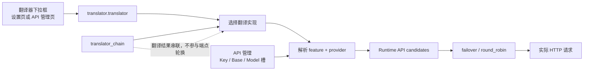
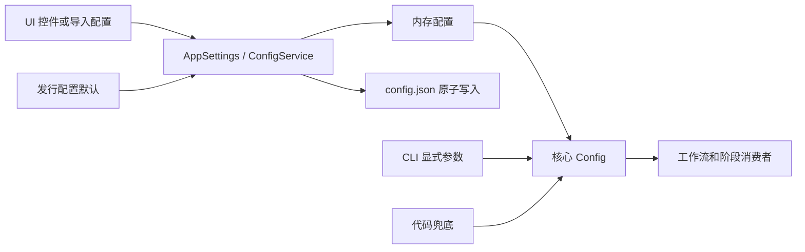

# Manga Translator Wiki 总蓝图

> 状态：仅定义站点结构、调查依据和逐页 TODO，不提前撰写完整教程。
>
> 文档站从源码、界面、i18n 和脱敏运行验证重新编写，不迁移旧 README、旧 `doc/` 正文或根目录 `wiki/` 正文。
>
> 实施进度和完成勾选统一记录在 [`TODO.md`](./TODO.md)；本文件保留需求、范围和验收依据。

## 1. 目标与硬性规则

- 文档根目录固定为 `doc/wiki/`，使用 **VitePress + Vue** 构建并部署到 GitHub Pages。
- 中文位于 `zh/`，英文位于 `en/`；两套路径、标题层级、图片和锚点完全镜像。
- 右上角提供真正的语言切换 UI，切换到当前页面的另一语言版本，不是把一个参数拆成两个页面。
- 导航按“产品形态 -> 大模块 -> 子模块 -> 具体功能”组织，不使用“入口”作为固定栏目。
- 每个功能页同时包含 **UI 操作** 与 **运行机理**。代理按前端、后端分工调查，但成品不割裂成两套互相重复的文档。
- 不建立独立的 `frontend/` 或 `backend/` 文档树。检测原理写在检测页、OCR 原理写在 OCR 页、翻译原理写在翻译器页、API 候选原理写在 API 管理页；跨模块总图只放参考索引。
- UI 英文必须先从界面代码定位 i18n key，再核对 `desktop_qt_ui/locales/en_US.json` 与 `zh_CN.json`；不得凭中文自行翻译。
- i18n 证据必须保存“UI 调用 key -> `en_US` 实际值 -> `zh_CN` 实际值”三列；key 与最终显示文字不同时使用实际值，某语言缺 key 时如实标为缺失/回退，不擅自补译。
- 参数不做“一参数一页面”。参数按功能分组为页面，每个参数在页面中有独立锚点和完整中英对照。
- 文件格式写到实际使用该文件的功能页；参考索引只负责汇总和反向链接，不另写脱离功能的文件百科。
- 正文不要求粘贴源码，但每个行为、默认值、格式和限制都必须列出定义、界面绑定和最终消费者等源码依据。
- 不读取或展示真实 `.env`、用户 `config.json`、私有提示词、API Key、用户图片和任务产物。

## 2. 翻译器与 API 通道的正确边界

这是蓝图中必须统一使用的术语，不能再把三种切换混写为“通道切换”。

| 概念 | 用户改了什么 | 实际效果 | 归属页面 |
| --- | --- | --- | --- |
| 翻译器选择 | `translator.translator` | 选择 OpenAI、Gemini、Sakura、HQ、无翻译或保留原文等翻译实现/提供商 | `desktop/translator/` |
| API 功能选择器 | API 管理页中的翻译器/OCR/上色/渲染下拉框 | 直接写入对应功能的同一个配置键；因此 API 管理页中改“翻译器”也会真的切换翻译器，并刷新所需凭据组 | `desktop/api-management/feature-selectors.md` |
| API 候选槽轮换 | Key/Base/Model 槽与 `failover`/`round_robin` | 在已经选定的提供商内部选择请求端点，处理重试、冷却、不可用和恢复；不改变翻译器实现 | `desktop/api-management/slots-and-rotation.md` |
| `translator_chain` | 翻译器串联配置 | 把上一翻译器输出交给下一翻译器继续翻译；不是 API 槽轮换 | `desktop/translator/translation-chain.md` |

必须绘制以下调用图，并在翻译器页与 API 管理页互相链接：



主要源码依据：

- 功能选择器与 API 分组：`desktop_qt_ui/ui/main_page/env_management.py`、`desktop_qt_ui/ui/main_page/dynamic_settings.py`
- 设置写入和翻译服务更新：`desktop_qt_ui/app_logic.py`
- 翻译器枚举和调度：`manga_translator/config.py`、`manga_translator/translators/__init__.py`
- 运行时候选解析：`manga_translator/runtime_api_resolver.py`
- 槽轮换和状态：`manga_translator/api_key_rotation.py`
- 凭据持久化：`desktop_qt_ui/services/config_service.py`

## 3. 站点目录设计

`en/` 与以下 `zh/` 目录完全同构；树中每个 `.md` 都是待创建页面。

```text
doc/wiki/
├─ package.json
├─ package-lock.json
├─ BLUEPRINT.md
├─ .vitepress/
│  ├─ config.ts
│  └─ theme/
│     ├─ index.ts
│     ├─ Layout.vue
│     ├─ components/{LanguageSwitch,SettingTable,OptionMatrix,SourceEvidence}.vue
│     └─ styles.css
├─ public/images/
│  ├─ desktop/{navigation,translation,settings,api,prompts,rules,batch,editor}/
│  ├─ web/{login,workspace,history,admin}/
│  ├─ cli/{install,commands,debug}/
│  └─ diagrams/{pipeline,api,batch,web}/
├─ data/
│  ├─ settings.generated.json
│  ├─ i18n.generated.json
│  ├─ coverage.generated.json
│  └─ related-projects.yml
├─ scripts/
│  ├─ build-settings-catalog.py
│  ├─ build-i18n-catalog.mjs
│  ├─ verify-route-mirror.mjs
│  ├─ verify-source-evidence.mjs
│  └─ verify-wiki-coverage.mjs
├─ zh/
│  ├─ index.md
│  ├─ introduction/
│  │  ├─ product-forms.md
│  │  ├─ first-translation.md
│  │  └─ data-and-privacy.md
│  ├─ install/
│  │  ├─ choose-edition.md
│  │  ├─ requirements.md
│  │  ├─ windows-portable.md
│  │  ├─ source-windows.md
│  │  ├─ linux-and-macos.md
│  │  ├─ docker.md
│  │  ├─ update-and-version-switching.md
│  │  └─ uninstall-and-data-cleanup.md
│  ├─ desktop/
│  │  ├─ navigation-and-language.md
│  │  ├─ translation/
│  │  │  ├─ file-list-and-input.md
│  │  │  ├─ output-directory-and-workflow.md
│  │  │  └─ progress-stop-and-task-state.md
│  │  ├─ settings/
│  │  │  ├─ index.md
│  │  │  ├─ shell-description-import-export.md
│  │  │  ├─ general-and-app.md
│  │  │  ├─ cli-batch-and-output.md
│  │  │  ├─ detection.md
│  │  │  ├─ ocr-filter-and-merge.md
│  │  │  ├─ translation.md
│  │  │  ├─ mask-and-inpainting.md
│  │  │  ├─ typesetting-and-rendering.md
│  │  │  ├─ upscale-and-colorization.md
│  │  │  └─ mode-specific.md
│  │  ├─ translator/
│  │  │  ├─ selection-and-languages.md
│  │  │  ├─ engine-dispatch.md
│  │  │  ├─ context-and-prompts.md
│  │  │  ├─ glossary-stream-and-linebreak.md
│  │  │  ├─ retry-rate-limit-and-quality.md
│  │  │  └─ translation-chain.md
│  │  ├─ api-management/
│  │  │  ├─ feature-selectors.md
│  │  │  ├─ provider-tabs.md
│  │  │  ├─ credentials-addresses-models.md
│  │  │  ├─ slots-and-rotation.md
│  │  │  ├─ failures-cooldown-and-recovery.md
│  │  │  ├─ connection-tests-and-model-list.md
│  │  │  ├─ custom-request-parameters.md
│  │  │  └─ presets-and-persistence.md
│  │  ├─ prompts/
│  │  │  ├─ list-apply-and-preview.md
│  │  │  ├─ structured-editor-and-format.md
│  │  │  ├─ system-and-translation-prompts.md
│  │  │  ├─ ai-ocr-prompt.md
│  │  │  ├─ ai-renderer-prompt.md
│  │  │  └─ ai-colorizer-prompt.md
│  │  ├─ replacement-rules/
│  │  │  ├─ table-groups-and-order.md
│  │  │  └─ raw-yaml-regex-and-save.md
│  │  ├─ rich-text-rules/
│  │  │  ├─ table-raw-and-match.md
│  │  │  └─ styles-and-presets.md
│  │  ├─ batch-management/
│  │  │  ├─ schemes-crud.md
│  │  │  ├─ conditions.md
│  │  │  ├─ actions-and-order.md
│  │  │  └─ preview-apply-restore.md
│  │  └─ editor/
│  │     ├─ layout-and-file-list.md
│  │     ├─ toolbar-and-menus.md
│  │     ├─ display-compare-and-arrange.md
│  │     ├─ canvas-tools-and-selection.md
│  │     ├─ region-list-and-text-editing.md
│  │     ├─ text-properties.md
│  │     ├─ style-properties.md
│  │     ├─ mask-paint-and-clone-stamp.md
│  │     ├─ floating-rich-text.md
│  │     ├─ shortcuts.md
│  │     └─ import-export-and-writeback.md
│  ├─ workflows/
│  │  ├─ normal.md
│  │  ├─ export-translation.md
│  │  ├─ export-original.md
│  │  ├─ translate-json-only.md
│  │  ├─ import-translation-and-render.md
│  │  ├─ colorize-only.md
│  │  ├─ upscale-only.md
│  │  ├─ inpaint-only.md
│  │  └─ replace-translation.md
│  ├─ web/
│  │  ├─ launch-and-access.md
│  │  ├─ login-language-and-session.md
│  │  ├─ upload-config-and-translate.md
│  │  ├─ progress-results-and-history.md
│  │  ├─ accounts-permissions-and-api-keys.md
│  │  ├─ resources-fonts-and-prompts.md
│  │  ├─ administrator-interface.md
│  │  └─ deployment-security-and-troubleshooting.md
│  ├─ cli/
│  │  ├─ command-structure.md
│  │  ├─ local-input-output.md
│  │  ├─ configuration-overrides.md
│  │  ├─ workflow-and-file-modes.md
│  │  ├─ subprocess-memory-and-recovery.md
│  │  ├─ output-debugging-and-exit-codes.md
│  │  └─ web-ws-and-shared-modes.md
│  ├─ developer/
│  │  ├─ architecture-and-code-boundaries.md
│  │  ├─ adding-or-changing-a-feature.md
│  │  ├─ tests-and-code-quality.md
│  │  ├─ packaging-and-release.md
│  │  ├─ web-server-ports-and-deployment.md
│  │  ├─ http-api/
│  │  │  ├─ authentication-and-errors.md
│  │  │  ├─ translation-endpoints.md
│  │  │  ├─ streaming-protocol.md
│  │  │  ├─ batch-export-import-process.md
│  │  │  ├─ config-env-and-resources.md
│  │  │  ├─ history-files-and-download-tickets.md
│  │  │  └─ admin-users-groups-quota-audit.md
│  │  ├─ internal-shared-and-websocket.md
│  │  └─ related-projects-and-links.md
│  ├─ reference/
│  │  ├─ settings-index.md
│  │  ├─ options-i18n-matrix.md
│  │  ├─ workflow-matrix.md
│  │  ├─ source-evidence-index.md
│  │  └─ debug-artifact-index.md
│  └─ troubleshooting/
│     ├─ installation-and-startup.md
│     ├─ model-gpu-and-memory.md
│     ├─ api-auth-rate-limit-and-timeout.md
│     ├─ output-json-and-rendering.md
│     └─ privacy-cleanup-and-log-sharing.md
├─ en/                         # 与 zh/ 完整同构
└─ .github/workflows/docs-pages.yml
```

## 4. 页面写作合同

每个具体功能页按以下顺序写，不额外增加空泛的“入口”栏目：

1. **功能边界**：本页解决什么问题，不负责什么。
2. **UI 操作**：控件、菜单、弹窗、快捷键、状态变化、取消和错误反馈。
3. **选项中英对照**：存储值、English UI、简体中文 UI、适用条件。
4. **运行机理**：输入如何进入配置、调度、算法或服务，最终产生什么。
5. **依赖与冲突**：前置模型、工作流限制、互斥项、性能/显存/网络影响。
6. **关联文件与格式**：只列本功能实际读写的文件、字段、标志、手改风险和兼容性。
7. **截图与流程图**：真实有头模式截图；复杂状态和数据流使用 Mermaid。
8. **源码依据**：UI 定义、i18n key、配置定义、持久化、服务/调度、最终消费者。
9. **验证记录**：源码已核对、界面已核对、运行已核对、仍待确认。

参数小节统一模板：

```md
## `<configuration.key>` — 简体中文 / English

- 控件：开关 / 输入框 / 下拉框 / 文件或提示词编辑器
- 所在界面：设置分组、行说明面板或对应二级弹窗
- 可选值：见“选项中英对照”（存储值、English、简体中文）
- 默认值：核心代码兜底 / UI 模型默认 / 发行配置默认，三者分开列
- 生效阶段：检测 / OCR / 合并过滤 / 翻译 / 修复 / 排版 / 导出
- 原理：该值如何进入算法或服务，0、空值、负值等特殊语义
- 依赖与冲突：前置模型、工作流限制、互斥项、性能影响
- 关联文件与调试产物：仅列实际关联项
- 源码依据：定义、界面绑定、持久化、最终消费者
- 验证：源码 / UI / 运行
```

## 5. 前端 UI 文档 TODO

### 5.1 主导航与翻译工作区

| 页面 | 逐项 TODO | 主要依据 |
| --- | --- | --- |
| `navigation-and-language.md` | 七个主导航项、编辑器视图、主题、语言切换、刷新范围、当前页保持、双语核对 | `desktop_qt_ui/ui/main_window.py`、`desktop_qt_ui/locales/*.json` |
| `translation/file-list-and-input.md` | 添加文件、添加文件夹、拖放、缩略图树、单项删除、清空、空/加载/就绪/错误状态、支持格式和压缩包处理 | `translation_page.py`、`file_list_view.py`、`file_service.py` |
| `translation/output-directory-and-workflow.md` | 输出路径输入/浏览/打开、九个工作流的中英选项、切换后按钮文案和提示变化 | `translation_page.py`、`workflow_service.py`、`runtime.py` |
| `translation/progress-stop-and-task-state.md` | 开始、启动中、停止、停止中、完成、失败、文件数/百分比/进度条、取消边界 | `runtime.py`、`view.py`、`translation_service.py` |

### 5.2 设置页与参数控件

- `shell-description-import-export.md`：分组页签、参数行、右侧说明面板、配置键显示、导入/导出、无效配置和覆盖确认。
- 其余设置分组页：必须逐行核对 `settings_tab_layout.json`，记录实际控件类型、存储值、显示值、禁用条件、文件编辑动作。
- 参数英文来源链：动态控件的 key -> `app_logic.py` 显示映射 -> `en_US.json`/`zh_CN.json`；不能只看布局 JSON 猜英文。
- `ai_ocr_prompt_path`、`ai_renderer_prompt_path`、`ai_colorizer_prompt_path` 等 UI 动作字段必须标为“文件编辑动作/资源路径”，不得冒充普通核心配置字段。
- 导出配置、导入配置、预设切换导致的整页重建和说明面板刷新要单独截图。

主要依据：`desktop_qt_ui/ui/main_page/pages/settings_page.py`、`dynamic_settings.py`、`settings_tab_layout.json`、`desktop_qt_ui/core/config_models.py`、`desktop_qt_ui/app_logic.py`。

### 5.3 API 管理 UI

每个页面分别写操作与状态，不把所有内容塞到“凭据”一页：

- `feature-selectors.md`：翻译、OCR、上色、渲染四个功能选择器；明确这些选择器写真实功能配置并刷新下方 API 组。
- `provider-tabs.md`：四个功能页签如何根据当前实现显示 OpenAI、Gemini、Sakura 或不需要 API 的状态。
- `credentials-addresses-models.md`：密钥显示/隐藏、地址、模型、占位值、空值语义、不可在截图中泄露密钥。
- `slots-and-rotation.md`：增删槽、删除后压紧编号、最多槽数、顺序故障切换/轮询的中英选项。
- `failures-cooldown-and-recovery.md`：冷却、不可用、恢复按钮、状态标记和恢复后刷新。
- `connection-tests-and-model-list.md`：测试单项、测试当前页、获取模型、进度弹窗、取消、网络/鉴权/地址错误。
- `custom-request-parameters.md`：预设列表、common/translator/ocr/colorizer/render 分区、模型匹配、Raw/结构化输入、模块间不串参数。
- `presets-and-persistence.md`：API 预设、自动保存、防抖写盘、退出前刷新、`.env` 与自定义参数 JSON 的边界。

主要依据：`desktop_qt_ui/ui/main_page/pages/env_page.py`、`env_management.py`、`dynamic_settings.py`、`desktop_qt_ui/ui/secondary_pages/model_selector_dialog.py`、`custom_api_params_editor.py`。

### 5.4 提示词、规则、批量和所有二级页面

- 提示词：列表新增/复制/删除/应用、预览、结构化字段、Raw 内容、保存/恢复、AI OCR/渲染/上色专用编辑器。
- 替换规则：三个分组、表格行、Raw YAML、正则、顺序、搜索、自动保存、错误定位。
- 富文本规则：匹配条件、样式编辑、表格/Raw、预设、渲染时机。
- 批量管理：方案增删改、`all`/`any`、条件字段/运算符/值、动作顺序、勾选预览、写回、`.bak`、恢复和编辑器冲突。
- 共用二级弹窗不单独堆成“弹窗百科”；模型选择器放 API 管理，提示词预览/编辑器放提示词，规则编辑器放规则，批量条件部件放批量页。
- 对话框的确认、取消、关闭、加载、校验错误和不可用状态都在所属功能页记录。

### 5.5 编辑器

编辑器至少拆为目录中 11 页，并逐项覆盖：

- 顶部菜单/工具栏：导出、撤销/重做、缩放、吸附、从中心缩放、浮动富文本、自动规则、切图自动导出。
- 显示/排列：文字与框显示、原图对比、六向对齐、水平/垂直分布。
- 画布：选择、拖拽、缩放、画笔、橡皮、仿制、蒙版、工具状态和焦点。
- 区域列表：原文/译文、查找替换、列表与画布同步、应用修改。
- 属性：图像、文本、样式三个面板分别写控件、混合选择状态和保存时机。
- 富文本：浮动编辑器、样式按钮、注音、纵中横、段落样式和预设。
- 快捷键：Ctrl+Z/Y、复制粘贴、删除、导出、Q/W/E、A/D、滚轮组合键、焦点优先级；最终以 `shortcut_manager.py` 实际注册为准。
- 导入导出：项目 JSON、图层/蒙版、回写、自动导出和兼容风险。

主要依据：`desktop_qt_ui/ui/editor/`、`desktop_qt_ui/editor/`、`desktop_qt_ui/ui/widgets/editor_toolbar.py`、`property_panel.py`、`region_list_view.py`、`rich_text_floating_editor.py`。

## 6. 参数与运行机理 TODO

### 6.1 参数总表先行

第一批实际内容只完成以下两项，其余页面先生成标题、责任边界、源码依据和 TODO 占位：

1. `reference/settings-index.md`：以脚本从 UI 模型、布局和核心配置生成参数总表，基线目标为当前界面约 110 项；若统计数量不同，必须报告差异来源，不能硬凑 110。
2. `reference/options-i18n-matrix.md`：每个下拉/枚举/模式列 `value | English | 简体中文 | 使用页面 | i18n key`。

每个参数总表行至少包含：完整键、双语名、分组页、控件、默认值来源、影响阶段、文件动作标志、消费者、验证状态。

### 6.2 配置生命周期

必须在 `settings/index.md` 画出并解释：



- 分开列核心 `Config` 默认、Qt `AppSettings` 默认和发行配置默认；三者不一致时不能写成一个“默认值”。
- 解释用户配置、默认配置、代码兜底、CLI 显式覆盖和 Web 运行时覆盖的优先级。
- 解释 250ms 合并写入、立即内存更新、显式操作刷新落盘和 Pydantic 校验。

### 6.3 各设置页的原理范围

| 参数页 | 必须讲清的原理 |
| --- | --- |
| `general-and-app.md` | 语言/主题/预设、模型卸载、编辑器偏好、过滤开关、全局蒙版参数和应用路径状态 |
| `cli-batch-and-output.md` | attempts、verbose、GPU/ONNX、context/batch、batch_concurrent、格式/质量/覆盖、文本/JSON/PSD/输出目录和特殊模式 |
| `detection.md` | 检测器、尺寸、长图重排、阈值、unclip、最小框、YOLO 标签/OBB、SFX/气泡过滤以及 `mask_raw` 产生 |
| `ocr-filter-and-merge.md` | 主/次 OCR、低置信回退、过滤、语言、AI OCR、并发、文本行几何合并、排序和气泡约束 |
| `translation.md` | 翻译器/目标语言、跳过语言、上下文、提示词、术语、流式、RPM、重试、质量检查和译后处理 |
| `mask-and-inpainting.md` | 蒙版细化、膨胀、气泡限制、修复器、尺寸/精度、Torch/ONNX、纯色填充和逐块处理 |
| `typesetting-and-rendering.md` | renderer、方向/对齐、字体/颜色/描边、间距、自动/语义/AI 断句、布局模式、模板和 AI 渲染并发 |
| `upscale-and-colorization.md` | 放大阶段与恢复尺寸、模型/倍率/瓦片；上色模型、尺寸、去噪和历史页图像上下文 |
| `mode-specific.md` | 九个工作流对参数的强制覆盖、跳过阶段、输入输出和不兼容组合 |

### 6.4 端到端运行机理

每个功能页解释自身阶段，另在 `reference/workflow-matrix.md` 汇总以下主链与旁路：

```text
上色 -> 超分 -> 检测 -> OCR -> 文本行合并/语言过滤 -> 翻译
     -> 蒙版细化 -> 图像修复 -> 文本排版 -> 导出/JSON 回写
```

必须补齐的机理主题：

- 检测结果如何形成 text regions、原始蒙版和调试图。
- 混合 OCR 何时调用次 OCR，过滤和文本行合并发生在什么位置。
- 上下文如何从最近非空历史页构建 OpenAI/Gemini 历史消息；系统提示词、自定义提示词、术语和断句提示词如何组合。
- 翻译重试、HQ 质量重试、API 同槽重试、候选槽切换四层不得混写。
- `batch_size` 与 `batch_concurrent` 分别改变什么；特殊工作流为何会禁用并发流水线。
- 蒙版细化、修复、排版、图层/覆盖层保留和 JSON 回写的顺序。
- 取消、`ignore_errors`、每图隔离、模型缓存/卸载、显存和内存清理。

主要依据：`manga_translator/manga_translator.py`、`manga_translator/utils/concurrent_pipeline.py`、`manga_translator/utils/retry.py`、各 `detection/`、`ocr/`、`translators/`、`mask_refinement/`、`inpainting/`、`rendering/`、`upscaling/`、`colorization/` 模块。

## 7. 功能文件与格式 TODO

文件只在对应功能页详细解释；本表规定归属和必须提醒的事项。

| 功能 | 文件/目录 | 页面必须说明 |
| --- | --- | --- |
| 设置 | `config/config.json`、`config/config-example.json` | 默认值差异、未知键、导入覆盖、不要直接复制私密路径 |
| API 管理 | `.env`、`config/custom_api_params.json` | Key 脱敏、功能分区、槽后缀、轮换策略、预设兼容 |
| 翻译提示词 | 系统提示词文件、`dict/prompt_example.yaml` | JSON/YAML 结构、占位字段、编码、模型差异 |
| AI OCR/渲染/上色 | `dict/ai_ocr_prompt.yaml`、`dict/ai_renderer_prompt.yaml`、`dict/ai_colorizer_prompt.yaml` | 各自消费者和格式，不把三者合并成通用提示词 |
| 替换/富文本 | `config/text_replacements.yaml`、`config/rich_text_rules.yaml` | 顺序、正则、样式字段、Raw 编辑风险 |
| 批量管理 | `config/batch_edit_schemes.yaml`、`*_translations.json`、`.bak` | `all`/`any`、动作顺序、备份/恢复和取消 |
| 工作流模板 | `config/translation_template.json` | 仅在导出/导入与 JSON 工作流页点明文件作用、必要标志和手改注意事项，不在蓝图提前展开完整字段教程 |
| 编辑器/工作区 | `manga_translator_work/json/*_translations.json`、`editor_base/`、`paint_overlay/`、`inpainted/` | 列表与画布同步、覆盖层保留、回写时机 |
| 文本导入导出 | `originals/*_original.txt`、`translations/*_translated.txt` | 文件名匹配、优先级、编码、段落/区域对应 |
| YOLO/调试 | `yolo_labels/`、`result/` 每图调试目录 | 标签格式、同名规则、启用条件和清理方式 |

翻译 JSON 页至少覆盖这些顶层/区域标志及其可选性：

- 顶层：`original_width`、`original_height`、`regions`、`mask_raw`、`mask_is_refined`、`skip_font_scaling`、`skip_text_replacements`、上色/超分元数据。
- 区域：`lines`、`text`、`translation`、`direction`、`alignment` 以及实际序列化出的字体、颜色、描边、间距、富文本等字段。
- `mask_raw` 是可选 base64 PNG；`mask_is_refined` 决定是否可以跳过再次细化，不能漏写这个标志。
- 文档样例必须由实际序列化/反序列化测试验证，兼容旧 list 与新 dict 时分别标明。

## 8. 九个工作流 TODO

每种工作流独立一页，统一写以下内容：

- UI 中英名称、开始按钮文案和提示。
- 接受的输入、查找目录、文件名匹配和输出目录。
- 执行/跳过的检测、OCR、翻译、修复、排版、上色、超分阶段。
- 会强制修改或忽略的参数，是否兼容 `batch_concurrent`。
- 关联的 TXT、JSON、图片、`translation_template.json` 和工作目录。
- 失败/取消后的可恢复性、覆盖行为和调试产物。
- 一张工作流与正常流程的差异图，不复用一张泛图代替九页。

## 9. 安装、CLI、Web 与开发者文档 TODO

### 9.1 安装

- `requirements.md`：Python `>=3.12,<3.13`、uv、CPU/GPU/AMD/Metal 互斥依赖组、硬件/模型/字体/字典前置。
- `windows-portable.md`：`Win-Install-or-Update.bat`、`Win-Start.bat`、便携 Python 优先、旧 Conda 回退、维护菜单。
- `linux-and-macos.md`：Unix 安装/启动脚本、`.venv`、uv、平台后端差异。
- `docker.md`：镜像、CPU/GPU compose、8000/8001 映射、卷、环境变量、管理员密码、healthcheck。
- `update-and-uninstall.md`：安装/更新/分支/tag/镜像/版本/语言维护项，更新参数，新便携版与旧 Conda 的不同卸载方式。

主要依据：`pyproject.toml`、`uv.lock`、`packaging/launch.py`、`Win-*.bat`、`Unix-*.sh`、`packaging/Dockerfile`、`packaging/docker-compose.yml`、`packaging/docker-entrypoint.sh`。

### 9.2 CLI

- 命令结构必须以 `manga_translator/args.py` 和实际 `--help` 双重核对。
- 只把正式顶层入口确认存在的 `local`、`web`、`ws`、`shared` 写成可用子命令；其他解析器中的遗留参数必须确认已进入执行链后才能收录。
- `local`：`-i` 多输入、输出、配置、覆盖、GPU/ONNX、格式、batch size、attempts。
- 配置覆盖：只解释显式 CLI 参数如何覆盖配置，未传值不得声称覆盖。
- 工作流/文件：load/save text、JSON-only、template、generate/export、colorize/upscale/inpaint/replace。
- 子进程与内存：`--subprocess`、内存上限/比例、每 N 张重启、断点恢复。
- 调试与退出：verbose、日志/调试目录、错误汇总、取消和退出码。
- 服务模式：`web`、`ws`、`shared` 只在 CLI 页解释如何启动，协议细节链接开发者页。

### 9.3 Web 用户文档

- `web` 默认监听 `0.0.0.0:8000`；区分监听地址与浏览器实际访问地址，写局域网暴露风险。
- 如果旧帮助、旧注释或其他解析器写了不同默认端口，以 `manga_translator/args.py` 正式入口和实际启动日志为准，并在源码差异记录中说明。
- 用户页只写登录、语言、上传、配置、开始/进度、结果、历史、管理员界面的操作，不混入 HTTP 协议细节。
- 登录同时核对旧 `/user/login` 密码 gate 与新 `/auth/*` 会话；说明 401、403、429 的用户含义。
- Web 页面英文还要从 `server/static/js/i18n.js`、HTML 和实际 JS 调用核对，不能只使用桌面 i18n。

主要依据：`manga_translator/server/static/index.html`、`admin-new.html`、`script.js`、`history-gallery.js`、`server/routes/web.py`、`auth.py`。

### 9.4 开发者 HTTP API

- 服务与端口：FastAPI/uvicorn、host/port 环境变量、keep-alive、graceful shutdown、CORS、安全边界、Docker 端口映射。
- 鉴权：`X-Session-Token`、登录/登出/检查/设置/注册/改密、管理员权限、过期、用户组功能限制、并发和每日配额。
- 翻译端点：JSON、bytes、image、multipart、stream、batch；为每类列方法、路径、content type、请求体、响应体、状态码和最小脱敏示例。
- 流协议：每帧 `1-byte status + 4-byte big-endian length + payload`；状态 0 结果、1 进度、2 错误。
- 导出/导入/处理：original/translated、JSON/TXT、upscale/colorize/inpaint 和流式变体。
- 配置/资源：配置、选项、翻译器、语言、工作流、env、预设、提示词和字体资源，说明屏蔽密钥。
- 历史/文件：列表、详情、搜索、文件/图片、临时下载票据、批量票据、GET/HEAD 和过期。
- 管理：任务取消、日志、存储/清理、用户、组、配额、审计。
- 并发机理：ThreadPoolExecutor + Semaphore、默认最大并发、全局模型复用、任务状态、协作取消和管理员强制取消。

主要依据：`manga_translator/server/main.py`、`server/routes/`、`server/request_extraction.py`、`server/to_json.py`、`server/core/task_manager.py`、`server/core/middleware.py`、`server/routes/translation_auth.py`。

### 9.5 内部 shared 与 WebSocket

- `shared` 默认 `127.0.0.1:5003`；写 `/is_locked`、`/simple_execute/{method}`、`/execute/{method}`、X-Nonce、白名单、pickle/流式响应和 429 锁状态。
- `ws` 默认连接 `ws://localhost:5000`，本地端口默认 5003；写 `x-secret`、protobuf 消息、pending/downloading/preparing/saving/uploading/error/finish 状态。
- 明确这是内部集成协议，不宣传成普通公共 Web API。

主要依据：`manga_translator/mode/share.py`、`manga_translator/mode/ws.py`、`manga_translator/server/ws_pb2.py`。

### 9.6 开发贡献与友情链接

- 只写开发注意事项：模块边界、配置字段/i18n/页面同步、路由模型与静态 JS 同步、uv 命令、测试目录、格式检查、无密钥样例、兼容性和 PR 检查表。
- 欢迎通过 PR 修改 `data/related-projects.yml`。
- 友情链接申请材料：项目名称、双语简介、公开链接、关联理由、Logo 使用授权、联系渠道、期望分类、许可证/授权状态、最后检查日期。
- 只使用仓库已公开的官方反馈渠道；未确认前不硬编码作者邮箱或社交账号。
- 收录必须人工审核、HTTPS/有效性复查；拒绝冒充、恶意下载、隐私追踪和未经授权 Logo；可随时下架，标注外链风险和无商业背书。
- 提交申请不等于自动发布链接。

## 10. 截图与图示 TODO

本蓝图只记录未来图片要求；当前蓝图阶段和当前三个调查代理均不启动界面、不截图、不生成图片。以后进入正文实施阶段时，只能使用脱敏测试配置和可公开样例。

### 10.1 有头模式截图矩阵

| 模块 | 必拍状态 |
| --- | --- |
| 主导航 | 七个主页面、编辑器视图、语言切换前后 |
| 翻译工作区 | 空列表、拖放、就绪、错误、九个工作流、启动中、进度、停止中、完成 |
| 设置 | 七个分组、参数说明面板、下拉选项、文件编辑按钮、导入/导出/预设 |
| API 管理 | 四功能页签、功能选择器联动、密钥隐藏、多个槽、两种策略、测试/取模型、冷却/不可用/恢复 |
| 提示词/规则/批量 | 列表、结构化/Raw、校验错误、预览、写回和恢复 |
| 编辑器 | 菜单展开、每种画布工具、属性面板、列表同步、原图对比、富文本、导入导出 |
| Web | 登录、上传与配置、进度、结果、历史、管理员、Swagger `/docs` |
| CLI/安装 | 维护菜单、`--help`、local 成功/失败、verbose 调试目录、Web 启动端口 |
| 调试产物 | `mask_raw`、置信热图、未过滤/过滤框、OCR、修复输入、最终蒙版、修复图、排版图、最终图 |

### 10.2 必画 Mermaid

- 主处理流水线与九种旁路。
- 翻译器选择、功能选择器和 API 槽轮换边界。
- failover/round_robin 请求时序与候选状态机。
- 上下文历史页到 OpenAI/Gemini 消息构建。
- 混合 OCR 回退。
- 蒙版 -> 修复 -> 排版数据流。
- `batch_concurrent` 关闭/开启对照：阶段队列、顺序、进度、上下文、失败隔离、显存/资源和禁用模式。
- 翻译 JSON 读写与蒙版/覆盖层保留。
- Web 单次/批量任务、鉴权、队列、取消和结果。
- verbose 调试目录树与各文件触发条件。

图片要求：有双语 alt、双语图注、生成版本/平台/主题说明；裁去用户名、绝对私有路径、密钥、历史图片和令牌。

## 11. 分阶段实施计划

### Phase 0：源码清单与验证基线

- [ ] 固定 UI 页面、二级弹窗、配置字段、i18n key、工作流、CLI 子命令和 Web 路由清单。
- [ ] 记录核心默认、UI 默认、发行默认的差异。
- [ ] 记录无法仅靠源码确认、必须运行验证的事项。
- [ ] 建立“页面 -> 源码依据 -> 截图 -> 中文 -> 英文”覆盖矩阵。

### Phase 1：VitePress/Vue 骨架和第一批文档

- [ ] 创建 VitePress 配置、Vue 主题和右上角语言切换。
- [ ] 生成 `zh/`/`en/` 完整镜像目录和每页 TODO 占位，不提前填泛化正文。
- [ ] 先生成参数总表、参数锚点和所有选项的中英对照。
- [ ] 加路由镜像、死链、i18n 缺项和参数覆盖检查脚本。
- [ ] 建 GitHub Pages workflow，并在子路径 base 下验证资源链接。

### Phase 2：桌面 UI 功能

- [ ] 主导航、翻译工作区和全部状态。
- [ ] 设置页外壳、说明面板、导入导出和每个参数控件。
- [ ] API 管理全部操作与“翻译器/槽轮换”边界。
- [ ] 提示词、替换、富文本、批量及其二级弹窗。
- [ ] 编辑器 11 个子页面、菜单、快捷键和导入导出。
- [ ] 同步采集有头模式截图和 i18n 证据。

### Phase 3：参数原理和运行机理

- [ ] 配置生命周期和三类默认值。
- [ ] 检测、OCR、合并过滤、翻译、蒙版、修复、排版、超分、上色逐参数原理。
- [ ] 上下文、提示词、术语、流式、RPM、质量和多层重试。
- [ ] API runtime resolver、候选槽、状态和自定义参数。
- [ ] 并发、批次、取消、错误隔离、缓存/卸载和调试产物。
- [ ] 九个工作流的输入、输出、跳过阶段和文件格式。

### Phase 4：安装、CLI、Web 和开发者

- [ ] Windows、Unix、Docker、升级和卸载。
- [ ] CLI local、配置覆盖、工作流、子进程/内存、日志和服务模式。
- [ ] Web 用户操作、会话和管理界面。
- [ ] HTTP API、流协议、鉴权、配置/资源、历史/票据和管理端点。
- [ ] shared/ws 内部协议、端口、nonce/secret 和状态。
- [ ] 贡献注意事项和友情链接 PR 规范。

### Phase 5：双语、图示与发布验收

- [ ] 所有英文逐项回查 UI/i18n 或代码协议名。
- [ ] 所有页面中英路径、标题、锚点、图片和 Mermaid 镜像。
- [ ] 所有截图完成脱敏和双语说明。
- [ ] VitePress 构建、链接、资源、GitHub Pages base、移动端语言切换和导航验收。
- [ ] 参数、选项、页面、二级弹窗、快捷键、工作流、CLI、路由和调试图覆盖率为 100%。

## 12. 验收标准

- 任一 UI 控件都能找到对应 Wiki 小节、中英文案和操作结果。
- 任一可见参数都能找到独立锚点、全部选项、三类默认值、影响阶段和最终消费者。
- 任一二级页面、菜单和已注册快捷键都被对应功能页覆盖。
- 翻译器选择、API 功能选择器、API 槽轮换和 `translator_chain` 不再混淆。
- 九个工作流、调试图片、提示词/模板/JSON/YAML/TXT/YOLO 文件都写在对应功能页。
- Web 用户操作与开发者 HTTP API 分开；`web`、`shared`、`ws` 的端口和协议准确。
- 所有结论有源码依据，所有视觉结论有真实运行截图；未验证内容明确标为 TODO。
- `npm ci --prefix doc/wiki` 和 `npm run docs:build --prefix doc/wiki` 成功，GitHub Pages 可从配置的仓库子路径访问。
