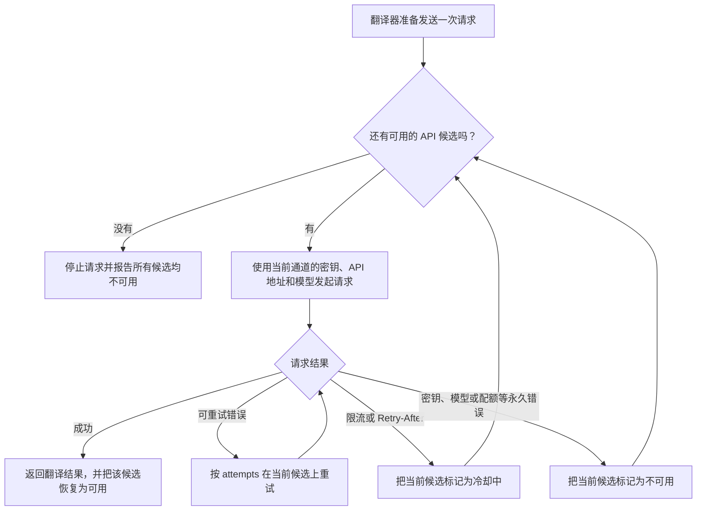
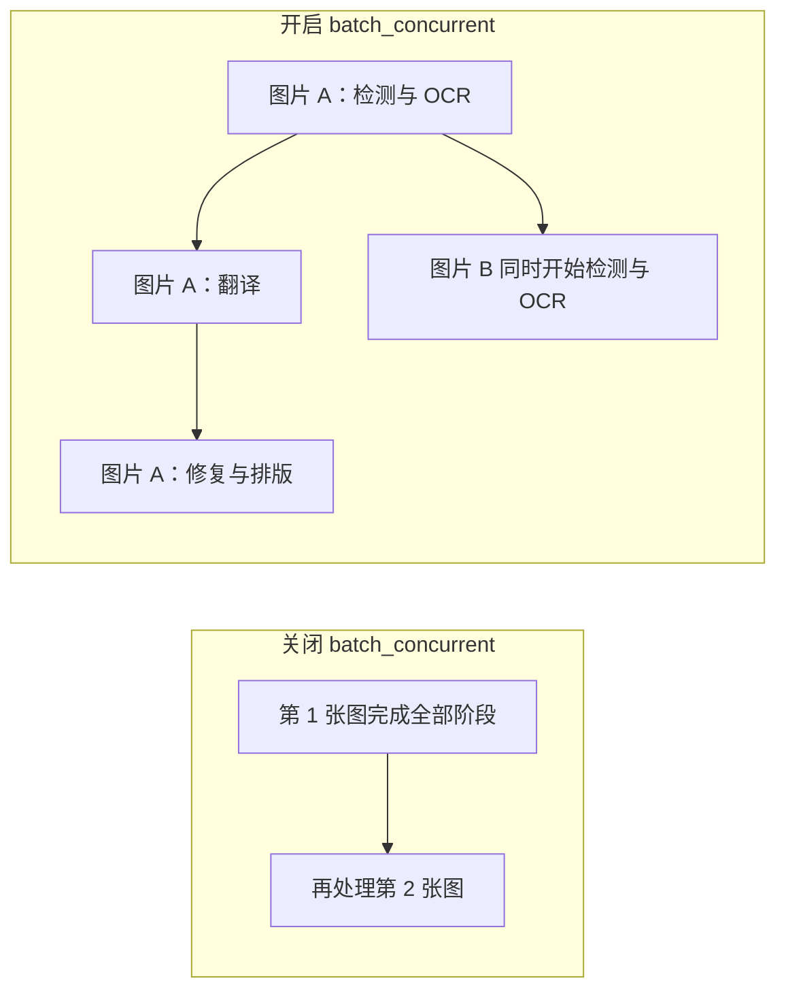

# Wiki 页面编写准则与模板

> 适用范围：`doc/wiki/zh/` 和 `doc/wiki/en/` 下的所有 VitePress 页面。

## 1. 文件格式

- 文件格式：VitePress Markdown，扩展名 `.md`。
- 编码：UTF-8；文件名使用 ASCII、小写和 kebab-case，例如 `slots-and-rotation.md`。
- 中文页面放在 `zh/`，英文页面放在 `en/`；两者路径必须完全镜像。
- 页面只使用一个一级标题 `#`；功能层级使用 `##`，子功能使用 `###`，参数使用 `####`。
- 标题按读者要完成的事情来写。同一栏目可以有相近结构，但不要让所有页面机械复用“功能边界 / UI 操作 / 运行机理 / 依赖与冲突”。
- 正文直接交代什么时候使用、怎么操作以及会得到什么结果。不要用“本页将介绍”“下面让我们深入了解”之类的开场占位置。
- 不把写作过程带进用户文档。禁止出现“没有伪造截图”“源码确认的真实分支”“待协调代理验收”“不是通用占位图”等内部验收措辞。
- 事实若只经过代码检查，应直接说明已知限制，例如“该按钮目前没有对应后端路由”；只有结论确实依赖运行环境时，才简短说明需要在目标环境确认。
- 页面内链接使用相对 `.md` 路径；跨语言链接由语言切换组件处理。
- 选项表固定保留 `存储值 | English | 简体中文` 三列，即使当前页面是英文页面。
- 操作步骤中用引号标出的页签、字段、按钮、菜单和状态必须是界面实际文案：先找 UI 调用 key，再核对 `en_US.json` 与 `zh_CN.json`，不能把环境变量名或后端术语直接改写成界面标签。
- 后端字段名只在配置表、代码标识和原理说明中使用反引号，例如 `OPENAI_API_BASE`；正文指向 UI 时使用“OpenAI API 地址 / OpenAI API Base”。
- 不在页面中写真实 API Key、Token、用户名、私有绝对路径、用户图片或私有提示词。

## 2. YAML Frontmatter

每个页面开头必须有一段 frontmatter：

```yaml
---
title: 页面标题
description: 一句话说明本页功能边界
pageId: desktop.api-management.slots-and-rotation
lang: zh-CN
outline: [2, 4]
lastUpdated: true
---
```

字段要求：

| 字段 | 要求 |
| --- | --- |
| `title` | 与页面一级标题一致；中文页使用中文，英文页使用 English |
| `description` | 说明本页解决的问题，不写宣传语 |
| `pageId` | 中英文页面相同；使用稳定的点号路径，不随标题翻译改变 |
| `lang` | 中文固定 `zh-CN`，英文固定 `en-US` |
| `outline` | 默认 `[2, 4]`，让参数和子功能出现在页面目录 |
| `lastUpdated` | 页面有源码核对记录时设为 `true` |

不要把进度状态放进 frontmatter。页面进度统一由 `TODO.md` 管理，避免出现两个互相矛盾的状态。

## 3. 标准页面骨架

页面结构以读者要解决的问题为主，不要求所有页面机械复用同一组标题。通常按以下顺序组织：

1. 先用两三句话说明“什么时候会用到这个功能”。
2. 给出实际 UI 操作，控件名称必须与界面一致。
3. 再解释关键概念、选项差异和底层行为。
4. 把失败、限制、文件和安全注意事项放到读者会遇到它们的位置。
5. 源码依据与验证记录放在页尾，不打断主要阅读流程。

以下是一段接近正式成品的中文页面示例。英文页面保持相同章节顺序、`pageId` 和显式锚点，只翻译标题与正文。

````md
---
title: API 通道与轮询策略
description: 为同一个 API 提供商配置备用凭据，并控制请求失败后的切换方式
pageId: desktop.api-management.slots-and-rotation
lang: zh-CN
outline: [2, 4]
lastUpdated: true
---

# API 通道与轮询策略

当一组 API 密钥容易触发限流，或者你同时使用官方地址和兼容服务时，可以为同一个提供商添加多个 API 通道。每个通道保存一组密钥、API 地址和模型；翻译器仍然是原来的翻译器，变化的只是下一次请求使用哪个 API 候选。

本页介绍候选通道的添加、删除和轮询。OpenAI 与 Gemini 翻译器之间的切换见[翻译器选择](../translator/selection-and-languages.md)，自定义 `temperature`、`top_p` 等请求字段见[自定义请求参数](./custom-request-parameters.md)。

## 在界面中配置备用 API {#configure-api-slots}

打开“API 管理”，选择实际使用 API 的功能页签，例如“翻译”。页面上方的翻译器选择器决定当前使用 OpenAI、Gemini 还是其他实现；下方的 API 通道只配置这个实现所使用的连接信息。

以 OpenAI 翻译为例，每张通道卡片显示以下三个字段。切换到 Gemini、OCR、上色或渲染时，字段会换成对应功能和提供商的 i18n 文案。

| UI 调用 key | English 实际值 | 简体中文实际值 |
| --- | --- | --- |
| `label_OPENAI_API_KEY` | OpenAI API Key | OpenAI API 密钥 |
| `label_OPENAI_MODEL` | OpenAI Model | OpenAI 模型 |
| `label_OPENAI_API_BASE` | OpenAI API Base | OpenAI API 地址 |
| `API slot {index}` | API slot | API 通道 |
| `+ Add API slot` | + Add API slot | + 添加 API 通道 |
| `API rotation strategy:` | Rotation strategy: | 轮询策略： |
| `Test Current Tab` | Test Current Tab | 测试当前页 |

通道标题由两部分组成：左侧徽标显示两位编号（例如 `01`），右侧显示“API 通道”（`API slot`）。代码没有把编号直接拼进标题文字。

1. 在编号 `01` 的“API 通道”卡片中填写“OpenAI API 密钥”“OpenAI 模型”和“OpenAI API 地址”。
2. 点击“+ 添加 API 通道”（`+ Add API slot`），创建第二组候选。
3. 为编号 `02` 的“API 通道”填写完整的连接信息。留空的通道不会成为有效候选。
4. 在“轮询策略：”（`Rotation strategy:`）中选择“按顺序故障切换”或“轮询”。
5. 使用“测试当前页”（`Test Current Tab`）确认至少有一个候选可以连接。

删除中间通道时，后面的通道会向前补位，因此编号始终连续。删除通道不会切换翻译器，也不会修改其他功能页签中的 OCR、上色或渲染 API。

## 两种轮换策略有什么区别 {#rotation-strategies}

| 存储值 | English | 简体中文 | 实际行为 |
| --- | --- | --- | --- |
| `failover` | Ordered failover | 按顺序故障切换 | 正常情况下优先使用靠前的通道；当前通道失败且无法继续重试时，再尝试后面的通道 |
| `round_robin` | Round robin | 轮询 | 每次请求轮换起始通道，让多个可用候选分担请求；失败时仍会继续寻找其他候选 |

如果只有一个有效通道，两种策略的结果基本相同。轮询不会把一次翻译拆给多个模型，也不会在请求过程中更改翻译器。

## 一次请求怎样选择候选 {#candidate-selection}



系统先在当前候选内部执行普通请求重试。只有当前候选无法继续使用时，才会根据轮询策略选择下一个通道。因此，“重试次数”和“API 通道数量”控制的是两个不同层级。

## 冷却、不可用和恢复 {#status-and-recovery}

| 界面状态 | 常见原因 | 系统行为 | 用户可以做什么 |
| --- | --- | --- | --- |
| 冷却中 | 429、速率限制、服务返回 `Retry-After` | 暂时跳过该候选，冷却结束后允许再次使用 | 等待冷却结束，或检查请求频率 |
| 不可用 | Key 无效、模型不存在、配额或计费错误 | 后续请求跳过该候选 | 修正配置后点击恢复按钮，再执行连接测试 |
| 可用 | 连接成功，或失败状态已被清除 | 可以参与后续候选选择 | 无需操作 |

“恢复 API 通道”只清除当前进程中的失败状态，不会替你修改 Key、地址或模型。配置本身有误时，恢复后仍会再次失败。

## 与翻译器切换的关系 {#translator-boundary}

- 把 OpenAI 翻译切换为 Gemini 翻译，是更换翻译实现和提供商。
- 在 `OPENAI_API_KEY`、`OPENAI_API_KEY_2` 之间切换，是 OpenAI 提供商内部的候选轮询。
- `translator_chain` 会把一个翻译器的结果交给下一个翻译器，和 API 候选通道没有关系。

API 管理页顶部的翻译器选择器绑定 `translator.translator`，因此在那里切换选项会真正改变翻译器；API 通道和轮询策略本身不会改变该值。

## 关联配置 {#related-configuration}

| 配置 | 作用 | 注意事项 |
| --- | --- | --- |
| `.env` 中的 Key/Base/Model 及编号通道 | 保存各 API 候选 | 文档和截图中不得展示真实密钥 |
| `*_API_ROTATION_STRATEGY` | 保存当前提供商的轮换策略 | 只影响对应 feature/provider 组 |
| `config/custom_api_params.json` | 保存请求体额外参数 | 不负责连接凭据、模型选择或 API 通道轮询 |

## 源码依据 {#source-evidence}

| 层级 | 文件 | 本页核对内容 |
| --- | --- | --- |
| UI | `desktop_qt_ui/ui/main_page/env_management.py` | 通道增删、策略下拉、测试和状态恢复 |
| 持久化 | `desktop_qt_ui/services/config_service.py` | `.env` 读取与写入 |
| 候选解析 | `manga_translator/runtime_api_resolver.py` | Key、Base、Model 和编号通道如何组成候选 |
| 请求轮换 | `manga_translator/api_key_rotation.py` | failover、round robin、冷却、不可用和恢复 |

## 验证记录 {#verification}

| 验证内容 | 状态 | 说明 |
| --- | --- | --- |
| UI 和 i18n 文案 | 未开工 | 核对两个 locale 的实际显示值 |
| 多通道连接测试 | 未开工 | 使用脱敏测试配置验证增删和测试结果 |
| 轮换与恢复 | 未开工 | 用可控失败端点验证候选状态变化 |
| VitePress 构建 | 未开工 | 运行 `npm run docs:build --prefix doc/wiki` |
````

## 参数页面专用模板

参数按功能分组，不为每个参数建立单独页面。每个参数使用一个 `####` 小节：

````md
#### `<configuration.key>` — 简体中文 / English

- 控件：开关 / 输入框 / 下拉框 / 文件编辑动作
- 所在界面：UI 页签、参数行或二级弹窗
- 存储值：
- 可选值：`value | English | 简体中文`
- 默认值：核心代码 / UI 模型 / 发行配置分别记录
- 生效阶段：检测 / OCR / 合并过滤 / 翻译 / 修复 / 排版 / 导出
- 原理：该值如何进入算法或服务；说明 0、空值、负值等特殊语义
- 依赖与冲突：
- 性能/API 成本：
- 关联文件和调试产物：
- 图示：不需要 / 开关前后对照 / 判定流程 / 状态图 / 时序图 / 数据流图
- 图示必须表达：该参数的不同取值具体改变了哪个步骤、分支、状态或输出
- 源码依据：定义、界面绑定、持久化、最终消费者
- 验证状态：未开工 / 进行中 / 完成
````

### 哪些参数必须画图

满足以下任一条件时，参数小节必须有 Mermaid 图，不能只写文字：

- 开启与关闭会改变处理阶段、执行顺序或跳过某个阶段。
- 不同枚举值会进入不同算法、模型、提供商或文件工作流。
- 涉及重试、限流、冷却、恢复、取消等状态变化。
- 涉及并发队列、背压、批次拆分、上下文隔离或资源释放。
- 参数值需要经过阈值判断、回退或多级条件组合后才生效。
- 参数会改变 JSON、蒙版、覆盖层、调试文件或最终输出的读写过程。
- 一个参数会影响三个及以上下游消费者，纯文字难以看清关系。

简单的颜色值、单一数值偏移或没有分支的显示偏好可以不画图，但必须在“图示”字段明确写“不需要：原因”。

图必须回答“改这个参数后，用户能看到什么变化”，禁止只画“配置 -> 算法 -> 输出”这种没有信息量的通用框。下面是 `cli.batch_concurrent` 的图示写法示例：



图下必须补一句限制说明，例如：开启并发并不表示所有图片同时请求 API；特殊文件工作流会强制关闭该模式。

## 三状态与 TODO

页面正文中的实施任务使用以下三种状态：

- `- [ ] [未开工]`：尚未开始。
- `- [ ] [进行中]`：已有实际内容或验证工作，但未满足完成条件。
- `- [x] [完成]`：中英文、源码依据、格式、链接和构建均已验收。

进度的唯一记录文件是 `doc/wiki/TODO.md`；页面正文中的 TODO 只描述局部待办，不代替总进度表。
