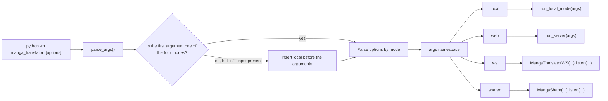
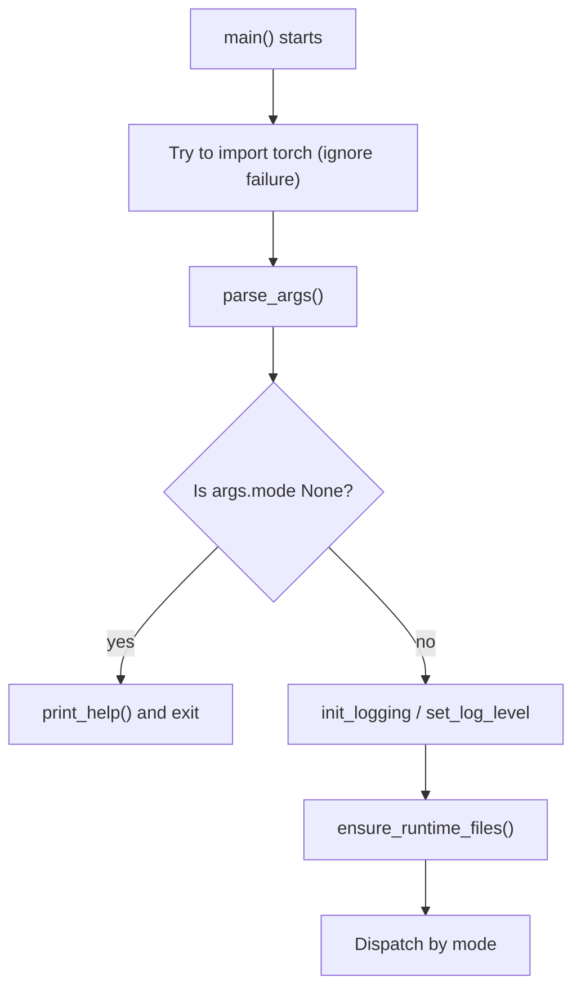

# Command Structure

Use this page when you run the tool directly from a terminal instead of the desktop UI and need to know the official entry point and subcommands. There is exactly one official CLI entry point: `python -m manga_translator <mode> [options]`; `parse_args()` parses the command line into a single `args` namespace and dispatches it to one of the `local`, `web`, `ws`, and `shared` execution chains. `--help` is provided by `argparse`: the top-level help lists only the modes, so use `<mode> --help` to inspect options.

This page fixes the entry point, subcommands, and `--help` contract only. Input/output, configuration overrides, workflows, subprocess memory, debug artifacts, and the internal protocols of the three service modes are covered by [Local input and output](./local-input-output.md), [Configuration overrides](./configuration-overrides.md), [Workflows and file modes](./workflow-and-file-modes.md), [Subprocess memory and recovery](./subprocess-memory-and-recovery.md), [Output, debugging, and exit codes](./output-debugging-and-exit-codes.md), and [web/ws/shared modes](./web-ws-and-shared-modes.md).

## Command scope {#feature-boundary}

- The only official entry point is `python -m manga_translator <mode> [options]`; in this repository the equivalent invocation under the managed runtime is `uv run --no-sync python -m manga_translator <mode> [options]`.
- The top level registers exactly four subcommands: `local`, `web`, `ws`, and `shared`; `local` is the only one that supports the implicit-mode shortcut.
- `local` is the only subcommand with a required option (`-i/--input`); all options of the other three modes have defaults.
- There are no top-level business options that apply to all four modes; `python -m manga_translator --help` lists only the modes and the help option.
- This guide does not treat standalone module entries (for example `python -m manga_translator.mode.local`) or the parser in `manga_translator/server/args.py` as part of the official top-level contract.

## Terminal operations {#terminal-operations}

### View the top-level help {#top-level-help}

Run the following from the repository root:

```powershell
uv run --no-sync python -m manga_translator --help
```

The usage line reads `__main__.py [-h] {web,local,ws,shared} ...`; the positional arguments list the four modes and options contains only `-h, --help`. The top level uses the default `argparse` formatter, so subcommand options are not expanded into the root help and parsed defaults are not printed automatically.

### View subcommand help {#subcommand-help}

Every subcommand provides `-h/--help`:

```powershell
uv run --no-sync python -m manga_translator local --help
uv run --no-sync python -m manga_translator web --help
uv run --no-sync python -m manga_translator ws --help
uv run --no-sync python -m manga_translator shared --help
```

`local` also supports the implicit-mode shortcut: when the first user argument is not one of the four modes and the argument list contains `-i` or `--input`, the parser inserts `local` before parsing. For example, `uv run --no-sync python -m manga_translator -i placeholder.png --help` shows a usage line of `__main__.py local ...`. A bare positional argument never triggers this fallback.

## Subcommands and options {#subcommands-and-options}

### Top-level subcommands {#subcommand-overview}

The top-level parser registers exactly the following four subcommands. After parsing, `__main__.py` dispatches the same `args` namespace to the corresponding execution chain.

| Subcommand | Purpose | Top-level dispatch target | Default network endpoint (if any) |
| --- | --- | --- | --- |
| `local` | Translate local images/folders | `mode.local.run_local_mode(args)` | No listening port |
| `web` | HTTP API and web UI server | `server.run_server(args)` | `0.0.0.0:8000`, overridable via `MT_WEB_HOST` / `MT_WEB_PORT` |
| `ws` | Internal WebSocket backend | `MangaTranslatorWS(...).listen(...)` | Listens on `127.0.0.1:5003`; upstream URL `ws://localhost:5000` |
| `shared` | Internal shared/API instance | `MangaShare(...).listen(...)` | `127.0.0.1:5003` |



## How the command runs {#runtime-behavior}

### Parsing and the implicit local mode {#parse-and-implicit-local}

`args.py#parse_args()` first creates the top-level parser with four subparsers, then inspects `sys.argv`: when the first argument is not one of the four modes and the argument list contains `-i` or `--input`, it inserts `local` before the first argument. After parsing, if `args.mode` is still `None`, it prints the top-level help and exits; otherwise it returns `args`. `__main__.py` tries to import `torch` before parsing (ignoring an `ImportError`), so in environments where PyTorch is missing or has incompatible DLLs, even `--help` can fail before parsing.



### Dispatch and shared initialization {#dispatch-and-shared-init}

After parsing, `__main__.py` exports `args.disable_onnx_gpu` to the environment as `MT_DISABLE_ONNX_GPU=1`, initializes logging (DEBUG with `-v`, otherwise INFO), and calls `ensure_runtime_files()` before dispatching to release the external config tables and AI prompt tables uniformly. Then it dispatches on `args.mode`: `local` runs `asyncio.run(run_local_mode(args))`; `web` runs `run_server(args)`; `ws` constructs `MangaTranslatorWS(vars(args))` and calls `listen`; `shared` constructs `MangaShare(vars(args))` and calls `listen`. The host, port, nonce, and connection fields of `ws`/`shared` are passed to the constructors through `vars(args)`; see [Top-level subcommands](#subcommand-overview) for the default endpoints. The `web` option defaults come from `MT_*` environment variables and are evaluated at process startup, so the baseline values printed by `--help` (for example `0.0.0.0`, `8000`) are not guaranteed to be the effective values of a given run.

## Limitations {#dependencies-and-conflicts}

- `python -m manga_translator.mode.local --help` returns `0`, but it is a standalone module entry, not part of the official top-level contract: its parser additionally exposes `--resume` and `--concurrent`, lacks the top-level `local` options for GPU, ONNX, format, batch size, and attempts, and its memory parameters default to `8000`, `80`, `50` instead of `0`, `0`, `0`. `__main__.py` never calls this parser.
- `manga_translator/server/args.py` defines a separate `parse_arguments()` that is not wired into the top-level dispatch; the direct module guard of `server/main.py` also imports the nonexistent `manga_translator.args.parse_arguments` (the official top level defines `parse_args`). It cannot replace the official `web` command.
- The subprocess path of `local` writes only `--use-gpu` and `--disable-onnx-gpu` into `cli_config` and hands the original config to `translate_with_subprocess`; combined with `--subprocess`, the “overrides the config file” behavior of `--format`, `--batch-size`, or `--attempts` is not present in that branch. This is a source-level difference, a code-path difference.
- The `--resume` declared by the standalone `local.py` parser is not forwarded from `run_local_mode()` to `translate_with_subprocess(..., resume=...)`; its help text does not mean the resume behavior is wired up.
- `--memory-limit`, `--memory-percent`, and `--batch-per-restart` are consumed only in the `--subprocess` path; they do not participate in translation when subprocess mode is off.
- The `web` option help text shows the source baseline values; the real defaults can be overridden by `MT_*` environment variables at startup, so effective values cannot be inferred from help text alone.
- Service startup, model/API dependencies, occupied ports, and internal protocols are covered by their respective feature pages; deployment details depend on the target environment.
