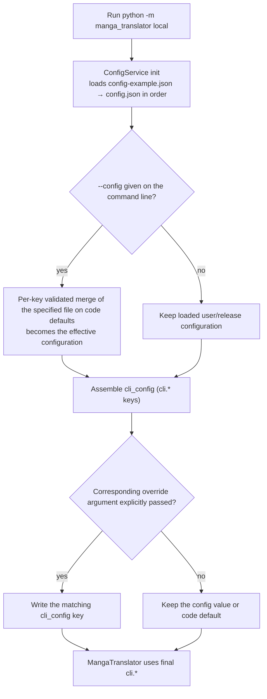
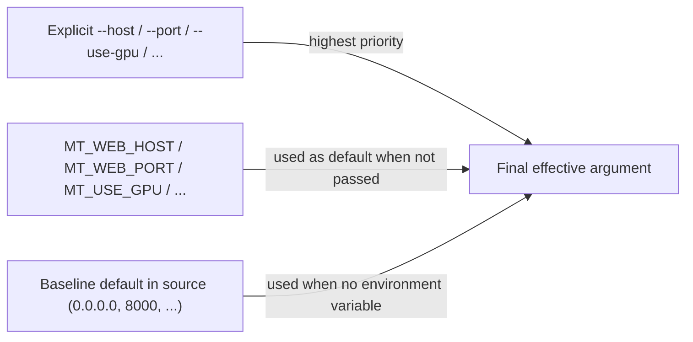
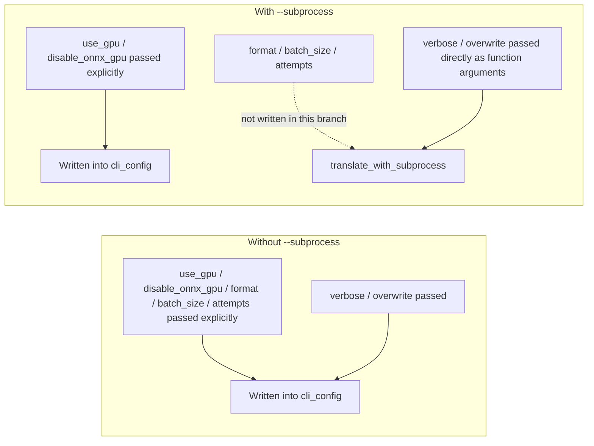

# CLI Configuration Overrides

Use this page when you run `local` from the command line and want that run to use a different configuration file, or to adjust a few settings without editing `config/config.json`. There are three paths: `--config` selects the configuration file, explicit CLI arguments override `cli.*` values from the file, and `MT_*` environment variables provide argument defaults for `web`, `ws`, and `shared`.

This guide only explains where configuration comes from and what overrides what. Command structure is covered in [Command structure](./command-structure.md), inputs and outputs in [Local input and output](./local-input-output.md), subprocess and memory arguments in [Subprocess, memory, and recovery](./subprocess-memory-and-recovery.md), and service-mode startup in [Web/WS/Shared modes](./web-ws-and-shared-modes.md).

## Command scope {#feature-boundary}

- `--config` exists only on the `local` subcommand; `web`, `ws`, and `shared` have no configuration-file option.
- Explicit CLI arguments override only `cli.*` keys from the configuration file; when a value is not passed, the file value or default is kept. The help text's “overrides the configuration file” holds only when the argument is explicitly provided.
- `MT_*` environment variables only feed default values for `web`/`ws`/`shared`; `local` has no `MT_*` argument defaults.
- CLI overrides affect the current run only and never write values back to a configuration file.
- Credentials such as API keys are resolved through `.env` and the API-management pages; they are outside this page's scope.

## Using --config to select a configuration file {#config-flag}

`local` uses `--config` to select the configuration file for the current run:

```powershell
uv run --no-sync python -m manga_translator local -i input.png --config path/to/my-config.json
```

The option's help text is hardcoded Chinese in the source; its meaning is: configuration-file path, defaulting to `config/config.json`. When `--config` is provided, `run_local_mode` calls `load_config_file()`; on failure it prints a “cannot load configuration file” message and exits with code `1`.

### Configuration loading chain {#config-load-chain}

`ConfigService` initialization loads, validates, and deep-merges in this order:

| Order | Source | Notes |
| --- | --- | --- |
| 1 | User config `config/config.json` | Loaded first and overrides the defaults below |
| 2 | Release template `config/config-example.json` | Used as the base when the user config is absent |
| 3 | Qt code defaults `AppSettings()` | Fallback when files are missing or keys are invalid |

When `--config` is provided, the specified file is loaded as a whole on top of code defaults and becomes the effective configuration; the previously loaded user `config/config.json` is not merged on top of it. Each file is validated per key; invalid keys fall back to defaults and are logged (at most the first 5 keys).

### When the specified file fails {#config-load-failure}

| Failure cause | Command-line behavior |
| --- | --- |
| File does not exist | `load_config_file` returns failure; a “cannot load configuration file” message is printed and the process exits with code `1` |
| JSON parse error | Same as above |
| Final model validation fails | Falls back to the default config and returns failure; command-line behavior is the same |

## Argument override priority {#override-priority}

Effective priority, from highest to lowest:

1. Explicit CLI arguments (override only when explicitly passed).
2. Configuration file: the `--config` file > user `config/config.json` > release `config/config-example.json`.
3. Code defaults: Qt `AppSettings()` / core `Config()`.

CLI overrides happen while assembling `cli_config` before translation starts; they do not change file contents.

### No value passed means no override {#explicit-only}

- `--use-gpu`, `--disable-onnx-gpu`, `--format`, `--batch-size`, and `--attempts` default to `None`; they write into `cli_config` only when explicitly passed, otherwise the file value or default is kept.
- `-v` and `--overwrite` are `store_true` switches; passing them only enables. If `cli.verbose` or `cli.overwrite` is `true` in the file, it takes effect even without the flag; the CLI cannot “turn off” an enabled config value by omitting the flag.
- The `--format` help lists `png/jpg/jpeg/jfif/webp/avif/bmp/tiff/tif/heic/heif`, but the parser does not set `choices`; a value outside the list fails later at save time, not at parse time.

### Subprocess-mode differences {#subprocess-difference}

With `--subprocess`, `run_local_mode` writes only explicitly passed `--use-gpu` and `--disable-onnx-gpu` into `cli_config` and hands the configuration to `translate_with_subprocess`; the “overrides the configuration file” behavior of `--format`, `--batch-size`, and `--attempts` does not enter that branch. `-v`/`--overwrite` are passed as function arguments. This is a source-level discrepancy and has not been verified at runtime; the five override arguments take effect per the help semantics only without `--subprocess`.

## Configuration file details {#config-file-details}

The configuration files involved in `local` mode are mainly the release default template `config/config-example.json` and the user configuration `config/config.json`; the original-to-translation mapping template `config/translation_template.json` is also read when exporting original text or translations. This section describes their structure and format based on the actual files in the repository, referencing only sanitized defaults from the release template and never showing real user configuration or private paths.

### Release default template config/config-example.json {#config-example-structure}

`config/config-example.json` is the default configuration template shipped with the release and the base used when no user configuration exists. It is a JSON object grouped by feature, with each group corresponding to one translation-pipeline stage:

| Config group | Stage | Example fields |
| --- | --- | --- |
| `translator` | Translation | `translator` (e.g. `openai`), `target_lang`, `keep_lang` |
| `detector` | Detection | `detector` (e.g. `default`), `detection_size`, `text_threshold` |
| `ocr` | Text recognition | `ocr` (e.g. `48px`), `secondary_ocr`, `min_text_length` |
| `inpainter` | Inpainting | `inpainter` (e.g. `lama_large`), `inpainting_size` |
| `render` | Typesetting | `renderer`, `font_family`, `layout_mode` |
| `colorizer` | Colorization | `colorizer` (e.g. `none`), `colorization_size` |
| `upscale` | Upscaling | `upscaler` (e.g. `mangajanai`), `tile_size` |
| `cli` | CLI output and batching | `verbose`, `format`, `overwrite`, `batch_size`, `save_text`, etc. |
| `app` | Desktop app state | `theme`, `ui_language`, `last_output_path` |

Besides the groups, the top level also holds cross-stage fields such as `filter_text_enabled`, `kernel_size`, `mask_dilation_offset`, and `use_custom_api_params`. The full field list is in `config/config-example.json`; the UI explanations of each group's parameters are on the settings pages and in the [UI Options Reference](../reference/options-i18n-matrix.md).

### How user config/config.json overrides the template {#user-config-override}

`config/config.json` is your own configuration and uses the same structure as the release template. `ConfigService` initialization validates and deep-merges it per key: the user configuration wins, missing or invalid keys fall back to the release template, then to code defaults. Therefore:

- You only need to write the groups or fields you want to change; the remaining keys keep the release defaults.
- When `--config` is provided, the specified file is loaded as a whole on top of code defaults and becomes the effective configuration; the user `config/config.json` is not merged on top of it.
- The final effective priority is: explicit CLI arguments > configuration file (`--config` file > `config/config.json` > `config/config-example.json`) > code defaults; see [Argument override priority](#override-priority).

### Original-to-translation mapping template config/translation_template.json {#translation-template}

`config/translation_template.json` is the mapping template used when exporting original text or translations. The first line carries the `output_format` setting, which decides the extension of the exported file (default `json`; can be changed to a safe extension such as `txt`). The rest defines the “original → translation” mapping shape: the `<original>` placeholder stands for one original text and `<translated>` for its translation. The default content shipped with the release is:

```json
"output_format": "json",
{
    "<original>": "<translated>",
    "<original>": "<translated>",
    "<original>": "<translated>"
}
```

- When exporting original text (the `cli.template` + `cli.save_text` combination, i.e. the “Export Original Text” workflow), each text region's original fills the `<original>` position; when exporting translations (`cli.generate_and_export`, i.e. the “Export Translation” workflow), the translation fills the `<translated>` position. The two exported files are named `<image name>_original.<extension>` and `<image name>_translated.<extension>`.
- `output_format` accepts only safe extension characters (letters, digits, `.`, `_`, `-`); invalid values fall back to `json`. The template must contain at least one `<original>` placeholder.
- The mapping lines do not have to be JSON: any free-form text works, for example `Original: <original> Translation: <translated>`, with each text region rendered as one line.

### CLI arguments and config keys {#cli-args-config-keys}

The `local` override arguments that write back to `cli.*` configuration keys are listed below (other arguments such as `-i`, `-o`, `--config`, `--subprocess`, and the memory arguments are run-scoped and never written into the configuration):

| CLI argument | Config key | Description |
| --- | --- | --- |
| `--use-gpu` | `cli.use_gpu` | Use GPU acceleration |
| `--disable-onnx-gpu` | `cli.disable_onnx_gpu` | Disable ONNX Runtime GPU acceleration |
| `--format` | `cli.format` | Output image format |
| `--batch-size` | `cli.batch_size` | Batch processing size |
| `--attempts` | `cli.attempts` | Retry count on translation failure |
| `-v` / `--verbose` | `cli.verbose` | Show detailed logs |
| `--overwrite` | `cli.overwrite` | Overwrite existing files |

The workflow-related keys (`cli.save_text`, `cli.load_text`, `cli.template`, `cli.generate_and_export`, `cli.upscale_only`, `cli.colorize_only`, `cli.inpaint_only`, `cli.replace_translation`, etc.) and their correspondence to the UI workflows are covered by [Workflow and file modes](./workflow-and-file-modes.md) and the [Workflow matrix](../reference/workflow-matrix.md). These keys have no official CLI argument and can only be set through the configuration file.

## Override-priority diagrams {#priority-diagram}

The following diagram answers “what `cli.*` value the user sees when an argument is or is not passed, and when `--config` is or is not given” (`local`, non-subprocess path):



Limitation: this diagram describes only the non-subprocess `local` path; the `--subprocess` branch is covered below. `-i`, `-o`, `--config`, and the memory arguments are not `cli.*` overrides.

Argument-default priority for `web`/`ws`/`shared`:



Limitation: environment-variable defaults are computed once in `parse_args()` from the process environment; `.env` loading happens at server import, later than that stage.

Override difference between subprocess and non-subprocess paths:



Limitation: this diagram comes from current code. Whether `--format`/`--batch-size`/`--attempts` really do not take effect in the subprocess branch may vary by release; the help text and source differ.

## Limitations {#dependencies-and-conflicts}

- `--config` exists only on `local`; `web`, `ws`, and `shared` have no configuration-file argument.
- CLI overrides affect the current run only and never write back to `config/config.json`; the next run loads from the file again.
- When `cli.verbose`/`cli.overwrite` is `true`, it takes effect even without `-v`/`--overwrite`; a switch argument cannot turn off an enabled config value.
- `--use-gpu`/`--disable-onnx-gpu` default to `None` on `local` (no override), which differs from `web`, where environment variables provide defaults.
- `--attempts` (`local`) and `--retry-attempts` (`web`) both accept `-1` for infinite retries but belong to different subcommands with different default sources.
- `cli.batch_concurrent` from the file is force-disabled under special workflows (see [Workflow and file modes](./workflow-and-file-modes.md)); the formal `local` parser has no `--concurrent` argument, so the CLI cannot override it.
- This guide does not cover API keys, `.env` credential resolution, or candidate rotation; see the API-management pages and [Translator selection](../desktop/translator/selection-and-languages.md).
