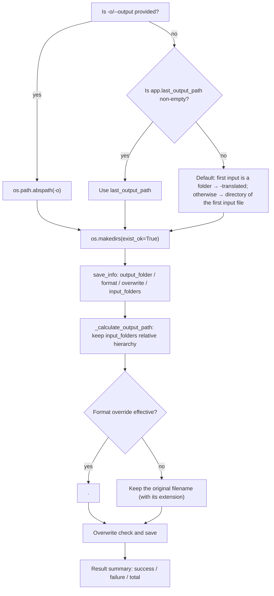

# Local Input and Output

This guide documents the input and output of the `local` mode (translating local images/folders): which paths `-i/--input` accepts, how `-o/--output` determines the output directory, where each image is finally written, and how the console summarizes results. It does not cover the internal pipeline algorithms (see the detection, OCR, translator, inpainting, and rendering pages), `--config` and explicit parameter overrides (see [Configuration overrides](./configuration-overrides.md)), or batch concurrency and subprocess memory management (see the corresponding CLI pages). The structure of the four top-level subcommands is in [Command structure](./command-structure.md). The desktop file list and output-directory controls are in [File list and input](../desktop/translation/file-list-and-input.md) and [Output directory and workflow](../desktop/translation/output-directory-and-workflow.md).

## Command scope {#feature-boundary}

- `-i/--input` is required and accepts one or more image files or folders; folders are scanned recursively for images, skipping the `manga_translator_work` working directory.
- `-o/--output` is an optional output directory; when omitted it falls back through “`-o` → `app.last_output_path` → default rule”.
- This guide focuses on `local` input/output and the result summary; explicit overrides such as GPU/ONNX, `--format`, `--batch-size`, and `--attempts` are in [Configuration overrides](./configuration-overrides.md).
- The console summary lines (success/failure/total) are hardcoded in `manga_translator/mode/local.py`, not i18n strings; see the [UI Options Reference](../reference/options-i18n-matrix.md) for the UI call keys that share the input/output concepts.

## How to use it {#ui-operations}

### Run the local command {#run-local-command}

Formal entry point (project-managed runtime):

```powershell
uv run --no-sync python -m manga_translator local -i <input image or folder>... [-o <output directory>] [options]
```

1. Pass one or more paths after `-i`: image files or folders. Folders are scanned recursively for supported image extensions.
2. Use `-o` to set the output directory when needed; when omitted, it is derived by the default rules (see [Output-directory resolution](#output-directory-resolution)).
3. Add `--overwrite` to re-translate existing output files; with the default (per configuration `cli.overwrite`) existing files are skipped.
4. When the first argument is not one of `local/web/ws/shared` and the argument list contains `-i`/`--input`, the parser inserts `local` implicitly, so `python -m manga_translator -i page.png` is equivalent to an explicit `local`.

## Input and output options {#input-output-options}

Supported input extensions (single source `manga_translator/image_formats.py`):

| Category | Extensions |
| --- | --- |
| Bitmap | `.png` `.jpg` `.jpeg` `.jfif` `.bmp` `.tiff` `.tif` |
| Web/modern | `.webp` `.avif` `.heic` `.heif` |

The `local` folder scan collects image extensions only; archives/documents (`.pdf/.epub/.cbz/.cbr/.zip`) are not auto-extracted as `local` input, unlike the desktop file list.

## How the command runs {#runtime-behavior}

### Input collection {#input-collection}

1. Each `-i` path is converted to an absolute path: files join the individual-file list, directories join the folder list.
2. Folders are naturally sorted and scanned one by one with `get_image_files_from_folder(folder, recursive=True)`; the scan skips directories named `manga_translator_work` and sorts both directories and files naturally (`file2` precedes `file10`).
3. Individual files are naturally sorted and appended after folder files, so with mixed `-i` inputs all folder images come before the individual files.
4. Each path is validated as existing and a file; when no image is found the run prints “no image files found” and exits (non-zero in subprocess mode).

### Output-directory resolution {#output-directory-resolution}



This diagram expresses the three-level output fallback and per-image output-path calculation. `-o` always wins; `app.last_output_path` is the desktop “Last Output Path” and is also used by the CLI when `-o` is omitted and the value is non-empty. For a folder input the default creates `<folder name>-translated` next to the first input folder; for a file input it writes to that file’s directory. Inside the output directory, the relative hierarchy of the input folders is preserved (`<output>/<folder name>/<relative path>/<filename>`).

### Results and summary {#results-and-summary}

- Each image prints `✅ Done: <filename>` or `❌ Translation failed: <filename>`; with `-v` the error detail is printed too.
- At the end it prints `✅ Success: N`, `❌ Failed: M`, `📊 Total: T` and the output directory; the non-subprocess path also lists the output-directory file count (with `-v`, the first 10 filenames and sizes).
- The non-subprocess path writes `result/log_<timestamp>.txt`; with `-v` the log level is DEBUG.
- Exit code is 0 on success/cancellation and 1 on configuration-load failure or an uncaught exception.

## Limitations {#dependencies-and-conflicts}

- Input files must exist and be readable, and their extensions must be in the supported set. Recursive folder scanning skips `manga_translator_work`; do not treat a working directory as an ordinary input directory.
- With overwrite disabled, images whose output file already exists are skipped (counted as “success (skipped)”); only `--overwrite` or configuration `cli.overwrite=true` re-translates them.
- Multiple input folders write into the same output directory under their own relative hierarchy; `input_folders` records only directory-type inputs.
- `cli.save_to_source_dir` is passed through the `save_info` built by desktop `app_logic.py`; the `local` `save_info` contains only `output_folder/format/overwrite/input_folders`, so CLI output always goes to the resolved output directory and never jumps to `manga_translator_work/result` beside the source image.
- Special workflows (translate JSON only, export original/translation, replace translation, etc.) change the input/output file types, but per-image output paths still go through `_calculate_output_path`; see the [workflow](../workflows/translate-json-only.md) pages.
