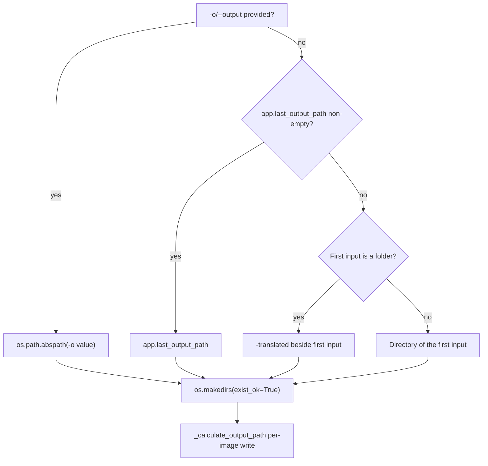
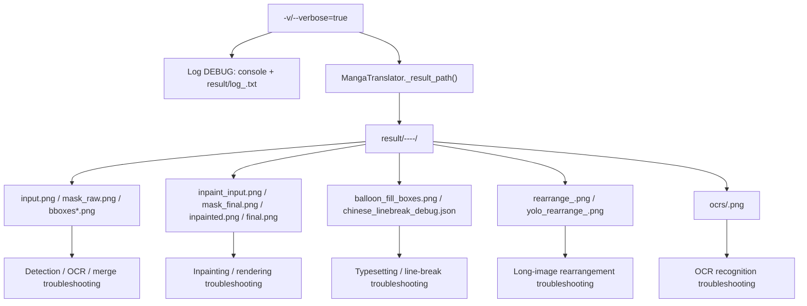

# Output, Debugging, and Exit Codes

This guide explains where you see results after running the `local` command: the output directory and filename of the final images, the logs and debug artifacts written when `-v/--verbose` is enabled, and the process exit code when the command ends. It does not cover input collection (see [Local input and output](./local-input-output.md)), explicit overrides (see [Configuration overrides](./configuration-overrides.md)), workflow and file modes (see [Workflows and file modes](./workflow-and-file-modes.md)), or subprocess memory management (see [Subprocess, memory, and recovery](./subprocess-memory-and-recovery.md)); the structure of the four top-level subcommands is in [Command structure](./command-structure.md). The per-stage meaning and redaction rules for debug artifacts are handled by the debugging pages; this guide only fixes the path contract.

## Command scope {#feature-boundary}

- `-o/--output` decides the output directory of the final images. When omitted, it falls back through “`-o` → `app.last_output_path` → default rule”; see [Output directory resolution](#output-directory-resolution).
- `-v/--verbose` only changes the log level, the log file, and the `result/` debug artifacts; it does not change the translated image itself.
- The process has three documented exit codes: `0` success/skip/cancel, `1` configuration-load failure or uncaught exception, and `2` `argparse` parse error. A single failed image does not change the exit code.
- This page never shows real `.env` files, user `config.json`, API keys, usernames, private absolute paths, user images, or private prompts; logs and debug artifacts must be redacted before sharing.

## Terminal operations {#terminal-operations}

### Run local with verbose logging {#run-local-with-verbose}

Official entry point (managed runtime in this repository):

```powershell
uv run --no-sync python -m manga_translator local -i <input image or folder>... -o <output dir> -v
```

1. Use `-o` to set the output directory; when omitted, the three-level fallback applies.
2. With `-v/--verbose`, both the console and the log file use DEBUG level and debug artifacts are written under `result/`.
3. Without `-v`, the console and log run at INFO level and no per-image debug folder is written under `result/`.
4. The console summary lines (`📤 Output directory: ...`, `✅ Success: N`, etc.) are hardcoded in `manga_translator/mode/local.py` and are not part of the i18n locales.

### Inspect output and debug artifacts {#inspect-output-and-debug}

- Final images are written to the directory resolved in [Output directory resolution](#output-directory-resolution); one file per image, named as described in [Output filename and format](#output-filename-and-format).
- With verbose, `MangaTranslator._result_path()` writes intermediate images to `result/<timestamp>-<image MD5>-<detection size>-<target lang>-<translator>/`; see [Debug folder and artifacts](#debug-tree).
- The non-subprocess path writes `result/log_<yyyyMMddHHmmss>.txt`; the desktop UI also writes a log with the same name at startup. Logs contain paths and text, so redact them before sharing.

## Output directory and naming {#output-directory-and-naming}

### Output directory resolution {#output-directory-resolution}

Both execution paths (subprocess and non-subprocess) use the same three-level fallback: `-o` first; otherwise the `app.last_output_path` setting; otherwise the default rule (when the first input is a folder, create `<folder-name>-translated` next to it; when it is a file, write to that file's directory).



Diagram note: `-o` always wins; `app.last_output_path` is the “Last Output Path” saved by the desktop, and it is used by the CLI when `-o` is missing and the value is non-empty. Folder inputs default to `<folder-name>-translated` beside the first input; file inputs default to that file's directory. Relative input-folder hierarchy is preserved inside the output directory (`<output>/<folder-name>/<relative-path>/<filename>`).

### Output filename and format {#output-filename-and-format}

- The output filename is based on the input filename: `<stem>.<extension>`.
- When `--format` or the `cli.format` setting is effective (non-empty, not “Not Specified”, not `none`), `<stem>.<format>` is used; otherwise the original filename (with its original extension) is kept.
- Save quality is controlled by `cli.save_quality`: the core `MangaTranslator.parse_init_params`, the Qt model, and the release config all default to `100` (the `95` fallback shown by the `mode/local.py` summary print is only a display difference; the actual save consumer default is `100`).
- The CLI builds `save_info` containing only `output_folder/format/overwrite/input_folders`; it never includes `save_to_source_dir`, so CLI output always goes to the resolved output directory and never jumps to `manga_translator_work/result` beside the source.

## Verbose debugging {#verbose-debugging}

### Logs {#logs}

- With `-v`, `set_log_level(DEBUG)` is called after `init_logging()`; the default is `INFO`. The Formatter in `manga_translator/utils/log.py` colors ERROR/WARN, prints DEBUG lines as `[name] message`, and forces stdout flushing.
- The non-subprocess path creates a `result/log_<yyyyMMddHHmmss>.txt` file handler in `translate_files()`; with `-v` the file log level is DEBUG and the console prints `📝 Log file: ...`.
- The subprocess path initializes logs at DEBUG/INFO in the worker process and writes `verbose` back into `cli_config`.
- The desktop UI also writes `result/log_<timestamp>.txt` at startup (`desktop_qt_ui/main.py`) with the same format as the CLI.

### Debug folder and artifacts {#debug-tree}

With verbose, each input image gets a per-image subfolder named `{timestamp_ms}-{input_md5}-{detection_size}-{target_lang}-{translator}` from `_set_image_context()`; `_result_path()` writes intermediates to `BASE_PATH/result/<subfolder>/<filename>`. `result_sub_folder` defaults to an empty string in this repository and is never assigned later, so verbose paths do not have an extra grouping level.



Diagram note: enabling `-v` adds DEBUG logs and the debug folder; not every run produces every artifact. All artifacts below are conditional writes under `verbose=True`, with trigger conditions from the current code (`research/phase0-debug-artifact-path-trace.md`); they are not guaranteed on every run:

| Artifact | Trigger (always requires verbose) | Troubleshooting purpose |
| --- | --- | --- |
| `input.png` | Before processing starts | Input image for detection/OCR |
| `mask_raw.png` | Detection returns `ctx.mask_raw` | Raw confidence heatmap (with color bar) |
| `bboxes_unfiltered.png` | Text lines exist after detection | Unfiltered text-line boxes |
| `bboxes_unfiltered_labeled.png` | Previous condition + `merge_special_require_full_wrap` + non-empty text lines | Labeled boxes for model-assisted merging |
| `bboxes_with_scores.png` / `mask_binary.png` | Detector returns a debug tuple | Detector score boxes and binary mask |
| `hybrid_detection_boxes.png` | Detector returns an image + `use_yolo_obb` | Merged boxes of main detection and YOLO OBB |
| `bboxes.png` | `text_regions` exist after OCR merge | Final text-block visualization |
| `mask_bubble_clip_debug.png` | `limit_mask_dilation_to_bubble_mask` and non-empty bubble mask | Bubble-constrained mask overlay |
| `inpaint_input.png` / `mask_final.png` | Translation done and `ctx.mask` exists | Inpaint input and final mask |
| `inpainted.png` | Normal flow | Inpainted image |
| `balloon_fill_boxes.png` | `layout_mode='balloon_fill'` and renderer returns non-empty debug view | Balloon-fill typesetting debug view |
| `chinese_linebreak_debug.json` | Previous condition + non-empty line-break records | AI line-break records |
| `final.png` | `ctx.result` non-empty (after size revert) | Final rendered image |
| `rearrange_<n>.png` | Long-image rearrangement plan + verbose | Padded batch before detection |
| `yolo_rearrange_<n>.png` | YOLO OBB rearrangement plan + verbose | Single YOLO rearrangement patch |
| `ocrs/<index>.png` | OCR implementation gets verbose and region is not pre-filtered | Perspective-cropped OCR input |
| `<stem>_photoshop_script.jsx` | PSD export with verbose or `script_only` | Photoshop script |

`final.png` is written into the debug folder in `_revert_upscale()`; `ctx.debug_folder` stores that subfolder name with verbose for Web-mode cache access. Debug artifacts may contain user images, text, or local paths; redact them before sharing, and do not describe conditional artifacts as present on every run.

## Exit codes {#exit-codes}

The `python -m manga_translator <mode> ...` process exit-code contract is as follows:

| Exit code | Scenario | Source |
| --- | --- | --- |
| `0` | Translation succeeded or all files skipped; user cancelled (`KeyboardInterrupt` / `asyncio.CancelledError`); `--help` | `mode/local.py`, `__main__.py`, `argparse` |
| `1` | `--config` load failure; subprocess mode found no images; uncaught exception; no mode and no `-i` (prints help, then exits) | `mode/local.py`, `args.py`, `__main__.py` |
| `2` | `argparse` parse error (for example missing required `-i/--input`, unknown option) | Standard `argparse` behavior |

Key points:

- A single failed image does not change the process exit code: `translate_files()` returns normally after summarizing failures, so the exit code stays `0`; failures only appear in the `❌ Failed: N` summary line. When scripting, rely on the summary line or the log.
- The non-subprocess path prints `❌ No image files found` and returns normally when no images are found (exit code `0`); the subprocess path prints the same message and then calls `sys.exit(1)`. This is a difference between the two paths.
- With no mode and no `-i/--input`, `parse_args()` prints the help and exits with `1`.
- With `-v`, exceptions additionally print a traceback, but the exit code still follows the table above.

## Limitations {#dependencies-and-conflicts}

- Debug artifacts are written only when `verbose=True`; otherwise `result/` is used for logs (non-subprocess path) or for Web/WS final-image caching.
- `-v` increases disk usage; long-image rearrangement, hybrid detection, bubble constraints, PSD export, and each OCR implementation have independent triggers and are not guaranteed to appear together.
- The exit code is not based on the failed-image count: `ignore_errors` and per-image failure summaries do not change the `0`/`1` decision.
- `--subprocess` and `--memory-*` only affect the subprocess-path log/exit branches; memory-threshold early exits are handled by `subprocess_manager` (see [Subprocess, memory, and recovery](./subprocess-memory-and-recovery.md)).
- The verbose debug folder name contains the image MD5 and the target-language/translator fields; do not put paths containing user-image MD5s into public reports.
