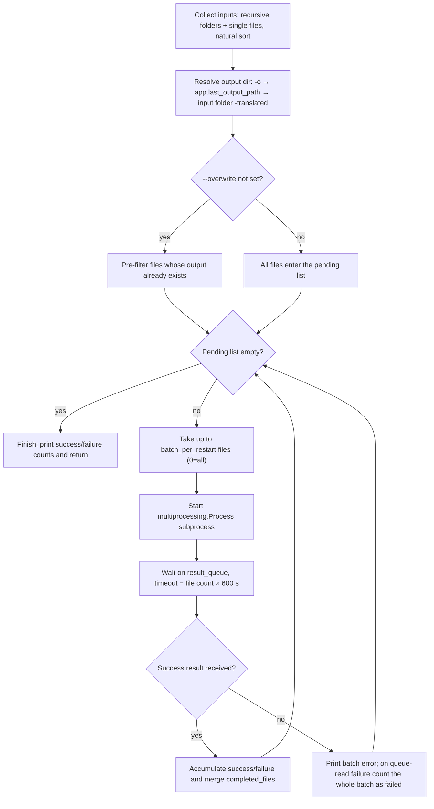
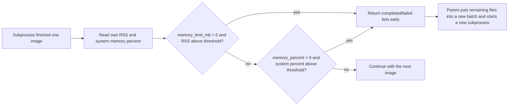

# CLI Subprocess, Memory, and Recovery

Use this page when translating a large batch at once and memory consumed by models and intermediate results keeps growing during a long run. The `local` subprocess mode runs each batch in an independent subprocess while the parent process only collects files, assigns batches, and gathers results. When `--memory-limit`, `--memory-percent`, or `--batch-per-restart` is reached, the current subprocess exits early and a new subprocess continues with the remaining files; files that already completed are not translated again.

This guide focuses on the `local --subprocess` subprocess, memory-limit, and recovery mechanics. Ordinary (non-subprocess) local translation is in [Local input and output](./local-input-output.md); command structure and the official entry point are in [Command structure](./command-structure.md); configuration overrides are in [Configuration overrides](./configuration-overrides.md); output and exit codes are in [Output, debugging, and exit codes](./output-debugging-and-exit-codes.md).

## Command scope {#feature-boundary}

- `--subprocess` changes only the `local` execution path: file collection, output directory, and skip-existing logic match the normal mode, but translation runs batch by batch inside a `multiprocessing.Process` subprocess.
- `--memory-limit`, `--memory-percent`, and `--batch-per-restart` are consumed only when `--subprocess` is enabled; the plain `local` path ignores all three.
- “Recovery” has three layers here: after an in-run memory limit is hit, a new subprocess continues; after a subprocess exception, the same batch is retried automatically; re-running without `--overwrite` skips files whose output already exists. The official top-level `local` has no usable cross-run `--resume` option; see the [`--resume` parameter](#resume).
- This guide does not cover `cli.attempts` (API-call retries), API candidate-slot rotation (see the API-management pages), `cli.batch_size`/`cli.batch_concurrent` (batch concurrency, see [CLI batch and output](../desktop/settings/cli-batch-and-output.md)), or the `web`/`ws`/`shared` service modes (see [Web, WS, and shared modes](./web-ws-and-shared-modes.md)).

## Command-line operations {#command-line-operations}

### Enable subprocess mode

From the repository root, call with the project-managed runtime:

```powershell
uv run --no-sync python -m manga_translator local -i ./manga_folder/ --subprocess
```

- `-i`/`--input` is required and may be given multiple times; folders are scanned recursively for images and individual files are processed in natural name order.
- `-o`/`--output` sets the output directory; when omitted, the parent uses `app.last_output_path` from configuration, then the input folder plus a `-translated` suffix, then the directory of the first input file.
- `--config` selects a configuration file; a load failure prints an error and exits (code 1).
- Without `--overwrite`, the parent first pre-filters files whose output already exists; only the remaining files enter subprocesses.

### Set memory and restart thresholds

- Limit only the subprocess's own memory and restart above 4000 MB: `--memory-limit 4000`.
- Limit only the system-memory share and restart above 85%: `--memory-percent 85`.
- Restart a subprocess every 20 images to release memory: `--batch-per-restart 20`.
- Set an absolute memory limit and a per-batch count together: `--memory-limit 6000 --batch-per-restart 30`.

```powershell
uv run --no-sync python -m manga_translator local -i ./manga_folder/ --subprocess --memory-limit 4000
uv run --no-sync python -m manga_translator local -i ./manga_folder/ --subprocess --memory-percent 85
uv run --no-sync python -m manga_translator local -i ./manga_folder/ --subprocess --batch-per-restart 20
uv run --no-sync python -m manga_translator local -i ./manga_folder/ --subprocess --memory-limit 6000 --batch-per-restart 30
```

See [Parameters and options](#parameters-and-options) for threshold semantics and official defaults. The absolute and percent limits can be set at the same time and both are checked; they are not the same metric.

## Parameters and options {#parameters-and-options}

> For the UI-copy and storage-key correspondence shared with desktop settings, see the [UI Options Reference](../reference/options-i18n-matrix.md).

#### --subprocess {#subprocess}

Add `--subprocess` to enable subprocess mode: each batch runs in an independent subprocess while the parent process only collects files, assigns batches, and gathers results; when a memory or batch-count threshold is reached, the current subprocess exits early and a new subprocess continues with the remaining files, and files that already completed are not translated again. Options: `--subprocess` (enabled) or omitted (disabled, default). Default: `false`.

#### --memory-limit {#memory-limit}

Limits the memory usage of the subprocess itself (in MB): when the threshold is exceeded during processing, the current subprocess exits early and the remaining files are handed to a new subprocess. Options: positive integers (MB); `0` means unlimited. Default: `0`.

#### --memory-percent {#memory-percent}

Limits the share of system memory: when whole-machine memory usage exceeds the threshold, the current subprocess exits early and the remaining files are handed to a new subprocess. Options: positive integers (percent); `0` means unlimited. Default: `0`.

#### --batch-per-restart {#batch-per-restart}

Restarts a subprocess after every N images to release memory. Options: positive integers (image count); `0` means no restart by image count (all pending files are processed in one run). Default: `0`.

#### --resume {#resume}

The resume flag exists only in the standalone module parser (`python -m manga_translator.mode.local --help`); the official top-level `local` has no such option, so do not rely on it for cross-run continuation. Cross-run recovery actually relies on the pre-filter that skips files whose output already exists when `--overwrite` is not set; use `--overwrite` to re-translate files that already exist. Options: `--resume` (declared) or omitted. Default: `false` (not present in the official parser).

## How the command runs {#runtime-behavior}

### Parent scheduling loop

The subprocess branch of `run_local_mode()` hands all inputs to `translate_with_subprocess()`. It keeps a `completed_files` set as the in-run “checkpoint”: each round it takes up to `batch_per_restart` files from the pending list (`0` means all), starts a subprocess, waits for the result queue, merges completed files into the set, and loops until no pending files remain.



Inside the subprocess, each image goes through `translate_batch`: `Config` is built only from the explicit keys `render`/`upscale`/`translator`/`detector`/`colorizer`/`inpainter`/`ocr` plus `kernel_size`, `mask_dilation_offset`, and `force_simple_sort`; `cli.verbose`/`cli.overwrite` are written back into configuration and `font_family` is copied to the top level; each image handle is closed immediately after processing.

### Memory check and early exit

After each image, the worker reads “own RSS” and “system memory percent” (both via psutil) and independently checks the two thresholds; if either is exceeded it returns the completed list early without processing the remaining files. The parent hands the remaining files to a new subprocess in the next round and increments `restart_count`.



- Display rule: when `--memory-limit > 0` only the absolute threshold is shown; otherwise when `--memory-percent > 0` the percent and its approximate MB value are shown; when `--batch-per-restart > 0` the per-batch count is shown.
- When both limits are set they are both enforced: `--memory-limit` watches the subprocess's own RSS while `--memory-percent` watches whole-machine memory usage; they are not the same metric.
- When psutil is unavailable both readers return `0`, the memory checks are skipped entirely, and only the image-count restart remains.

### Failure and recovery

Results travel between the subprocess and the parent over a `multiprocessing.Queue`. Recovery behavior per failure location is below (all are current code paths, not a guarantee for every environment):

| Event | Parent behavior | Effect on results |
| --- | --- | --- |
| Top-level subprocess exception (returns an error result) | Prints “批次错误” plus a traceback (with `-v`) | Not counted as failed; the same batch stays in the pending list and is retried in the next round |
| Result-queue read timeout or exception | Prints “无法获取子进程结果” and adds this batch's file count to `failed_count` | The batch is both counted as failed and, because it never entered `completed_files`, retried in the next round, risking double counting |
| A single image fails inside the subprocess | Counted in `failed_count`, not added to `completed_files` | The file stays pending and re-enters later batches; a reproducible failure can loop indefinitely |
| Subprocess does not exit within 30 seconds | `terminate()`, then `kill()` if still alive after 5 seconds | Completed files survive; unfinished files re-enter the next round per the rules above |
| Memory limit hit, early return | Receives the `success` result normally | Completed files survive; remaining files enter a new subprocess (batch count +1) |
| User presses Ctrl+C | Terminates the current subprocess and exits with code 0 | Output already written survives; re-running without `--overwrite` skips existing files |

What “checkpoint resume” actually means:

- Within one run: `completed_files` guarantees that files already completed never re-enter a new batch after a memory-limit restart.
- Across runs: the official top-level `local` has no usable `--resume`; cross-run recovery actually relies on the pre-filter that skips files whose output already exists when `--overwrite` is not set.
- The worker also contains a torch/CUDA check block that runs every 5 images; in the current source it is a no-op (it does not free VRAM). Recorded as a static observation only.

## Limitations {#dependencies-and-conflicts}

- psutil is optional: when missing, both RSS and system-memory reads return `0`, memory limits silently stop working, and only the image-count restart remains.
- The three default layers must not be mixed: the official `local` defaults for `--memory-limit`/`--memory-percent`/`--batch-per-restart` are `0/0/0`; the `subprocess_manager.py` function-signature constants are `0/80/50`; the standalone parser in `manga_translator/mode/local.py` uses `8000/80/50`. Only `0/0/0` from the official `args.py` belongs to the top-level `local --help` contract.
- The help text of `--format`, `--batch-size`, and `--attempts` says “overrides the configuration file”, but in the subprocess branch only the GPU/ONNX overrides are written into `cli_config`; those three values never reach `translate_with_subprocess`. This is a source discrepancy, a code-path difference.
- Subprocess mode runs exactly one subprocess at a time with no parallelism; `cli.batch_concurrent` does not participate in subprocess scheduling.
- The memory limits target RAM (subprocess RSS / whole-machine memory), not GPU VRAM; VRAM exhaustion is covered by [Models, GPU, and memory](../troubleshooting/model-gpu-and-memory.md).
- `app.unload_models_after_translation` (“Unload Models After Translation”) is a desktop-side unload switch for after a translation finishes, different from the runtime thresholds here.
- The parent's result-queue timeout is “this batch's file count × 600 seconds”; with `--batch-per-restart 0` and many files the wait can be extremely long.
