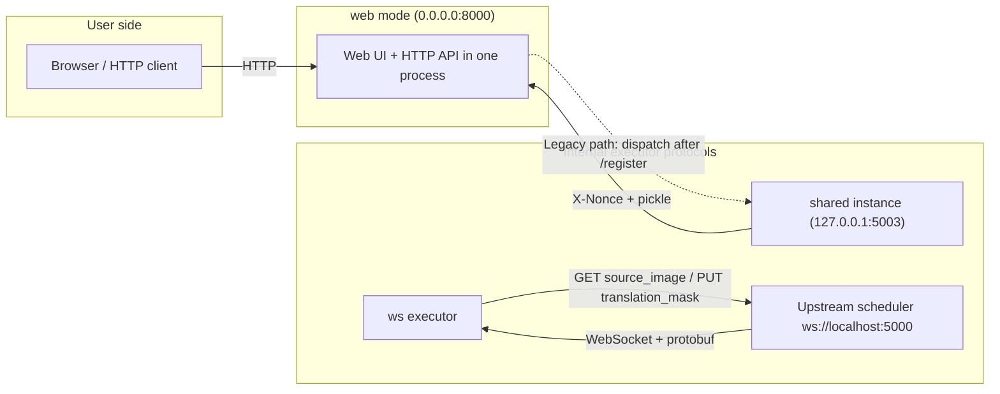
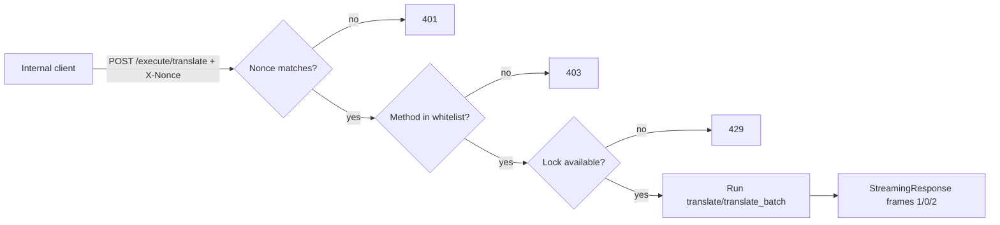
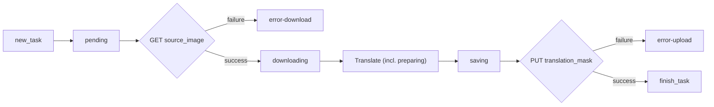

# Web, WS, and Shared Modes

Use this page when you want to expose translation as a service. Besides `local`, there are three sibling service subcommands: `web` provides a browser UI and HTTP API, `shared` provides a nonce-protected internal executor API, and `ws` acts as a client that connects to an upstream WebSocket scheduler and processes tasks. This page fixes how to start the three modes, their default ports, and their internal protocol boundaries, and explains which endpoints are user/developer interfaces and which must never be exposed directly.

See [Local input and output](./local-input-output.md) for `local` input/output, [Web launch and access](../web/launch-and-access.md) for browser operations of `web`, and the developer pages for the HTTP API contract and internal protocol details.

## Command scope {#feature-boundary}

- `web` is the only service for user-facing and developer HTTP clients: one process serves the `GET /` main workspace, the `GET /admin` admin UI, `/static/*` assets, and all JSON/form/streaming APIs. It listens on `0.0.0.0:8000` by default and can be overridden with `MT_WEB_HOST`/`MT_WEB_PORT` or `--host`/`--port`.
- `shared` is an internal shared/API instance: it listens on `127.0.0.1:5003` by default, exposes only three controlled endpoints, protects them with the `X-Nonce` header, and returns pickle-serialized results. Browsers never access it directly.
- `ws` is an internal WebSocket executor: it connects to the upstream `ws://localhost:5000` by default, authenticates with the `x-secret` header, and receives protobuf tasks while reporting status back. The parser declares `--host 127.0.0.1 --port 5003` for it, but the current implementation does not consume these two fields.
- The three modes never share a default port: `web` uses `8000`, the parser default for `shared`/`ws` is `5003`, and the actual connection target of `ws` is the upstream `ws://localhost:5000`. Do not mix up `5000`, `5003`, and `8000`.
- CLI options are fixed Chinese help strings in the source and do not go through i18n; the GPU/ONNX/retry/logging switches shared with desktop settings map to `label_*` keys; see the [UI Options Reference](../reference/options-i18n-matrix.md).

## Modes and ports {#modes-and-ports}

| Mode | Default endpoint | Role | Who can access |
| --- | --- | --- | --- |
| `web` | Listens on `0.0.0.0:8000` (overridable via `MT_WEB_HOST`/`MT_WEB_PORT` or `--host`/`--port`) | HTTP API + Web UI | Browser users, HTTP API clients |
| `shared` | Listens on `127.0.0.1:5003` | Internal shared/API instance | Internal clients holding the nonce |
| `ws` | Binds no listen port; parser default `127.0.0.1:5003`; connects to upstream `ws://localhost:5000` | Internal WebSocket executor | Upstream WebSocket scheduler |



Shared-executor dispatch is a legacy path retained in the source: `run_server()` currently forces `args.start_instance=False`, so the `web` mode does not automatically spawn a separate shared instance; `ws` mode only connects to the upstream as a client.

## Terminal operations {#terminal-operations}

### Start web mode {#start-web-mode}

```powershell
uv run --no-sync python -m manga_translator web
```

This is equivalent to `--host 0.0.0.0 --port 8000`. After startup, open `http://127.0.0.1:8000` (or the server's LAN address) in a browser; `0.0.0.0` binds every network interface and is exposed by default. See [Web launch and access](../web/launch-and-access.md) for the full startup steps, Docker, and network notes.

### Start shared mode {#start-shared-mode}

```powershell
uv run --no-sync python -m manga_translator shared --host 127.0.0.1 --port 5003 --nonce <nonce>
```

Replace `<nonce>` with a value agreed with the caller. Once a nonce is set, every `/simple_execute/*` and `/execute/*` request must carry a matching `X-Nonce` header or it returns `401`.

### Start ws mode {#start-ws-mode}

```powershell
uv run --no-sync python -m manga_translator ws --ws-url ws://localhost:5000
```

This repository is missing `manga_translator/server/ws_pb2.py` (the generated protobuf module), so `from ..server import ws_pb2` inside `listen()` raises `ImportError` and `ws` mode cannot actually start; `ws --help` is unaffected. This is a source-level difference, not a verified runtime behavior.

## How the command runs {#runtime-behavior}

### web mode {#web-runtime}

`__main__.py` dispatches `web` to `server.run_server(args)`: it loads `.env` from the application directory, initializes the server configuration and data directories, then starts Uvicorn with `args.host`/`args.port` (`timeout_keep_alive=1800`, 30-second graceful shutdown). An internal nonce is generated at startup (`MT_WEB_NONCE` or `secrets.token_hex(16)`) and printed in the logs. Translation tasks run in-process in a translator thread via `_run_translate_sync`/`_run_translate_batch_sync` in `request_extraction.py`; the source retains the legacy shared-executor registration/dispatch path, but `run_server()` forces `args.start_instance=False`, so no separate shared instance is spawned automatically, and external instances can register via `POST /register` (with `X-Nonce`).

### shared internal protocol {#shared-protocol}

`MangaShare` wraps a `MangaTranslator` and exposes three endpoints with FastAPI:

| Endpoint | Behavior |
| --- | --- |
| `GET /is_locked` | Returns `{"locked": true/false}` |
| `POST /simple_execute/{method_name}` | Synchronous execution; returns a pickle byte stream on success or 4xx/5xx on failure |
| `POST /execute/{method_name}` | Streaming execution returning `application/octet-stream`; each frame is 1-byte status + 4-byte big-endian length + payload |

Every execution endpoint runs these checks in order: nonce validation (once set, `X-Nonce` must match or it returns `401`), method whitelist (only `translate` and `translate_batch`, otherwise `403`), method existence (`404`), and a non-blocking lock (`429` when busy). In the request JSON, images are PNG base64 and the config is `Config.model_dump(mode="json")`; invalid image/config/batch requests return `422`. Streaming frame statuses: `0` result (pickle), `1` progress (UTF-8 status string), `2` error. When a result carries `use_placeholder`, only a 1×1 white placeholder image is transferred to avoid moving large images.



### ws internal protocol {#ws-protocol}

`MangaTranslatorWS` extends `MangaTranslator`; `listen()` connects to the `--ws-url` upstream as a client: `websockets.connect(url, extra_headers={'x-secret': secret}, max_size=1_000_000)`. The secret comes from the `ws_secret` parameter or the `WS_SECRET` environment variable (empty string by default). Messages are `ws_pb2.WebSocketMessage` protobufs: the upstream sends `new_task` (task id, `source_image`, `translation_mask`, and translation parameters) and the executor sends back `status` and `finish_task`.

Single-task flow: `pending` → HTTP GET `source_image` to download (on failure send `error-download`) → `downloading` → translate → `preparing` → `saving` (result converted to PNG; in verbose mode also saved as `result/<id>/ws_final.png`) → `uploading` → HTTP PUT `translation_mask` to upload (on failure send `error-upload`) → `finish_task(success, has_translation_mask)`. Status frames are throttled with a 0.2-second throttler, tasks are scheduled with a `PriorityLock`, and images larger than 1200 pixels on either side force `upscale_ratio=1`. On Windows it calls `WSAStartup` and sets the `ProactorEventLoopPolicy` first.



## Limitations {#dependencies-and-conflicts}

- Port boundaries: `web` defaults to `8000`, the parser default for `shared`/`ws` is `5003`, and the connection target of `ws` is `ws://localhost:5000`; they never overlap. Startup fails when a port is occupied, which is an environment issue.
- `ws --host/--port/--nonce` exist in the parser, but the current `MangaTranslatorWS` does not consume them; do not infer from the help text that `ws` listens on `5003`.
- This repository is missing `ws_pb2.py`, so `ws` mode cannot start until that generated module is supplied.
- `shared`/`ws` are internal protocols: never access them directly from a browser and never expose them to the public internet; nonce/secret handling and pickle deserialization carry security risks, and the nonce printed in logs must not be copied into public reports.
- This page never reads or shows real `.env` contents, `WS_SECRET`, nonces, API keys, tokens, usernames, or private paths.
