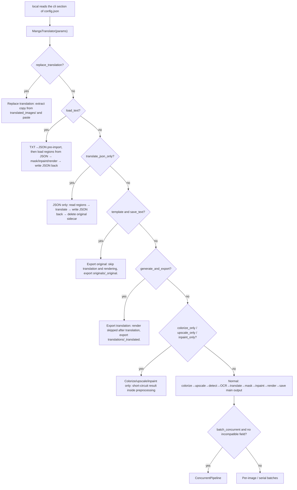

# Workflows and File Modes

The CLI `local` mode has no “workflow” command-line switch; the nine workflows are expressed as boolean fields in the `cli` section of the configuration file, the same fields written by the desktop “Translation Workflow Mode:” dropdown. This guide explains how those fields reach `MangaTranslator`, which pipeline stages and output files each field changes, and how the main output image and the `manga_translator_work` sidecar files (project JSON, original/translation template exports, inpainted images, editor base images, and replace-translation pair images) are read and written for each image.

This guide does not repeat `local` input collection or output-directory resolution (see [Local input and output](./local-input-output.md)), does not explain `--config` or explicit parameter overrides (see [Configuration overrides](./configuration-overrides.md)), and does not expand the full UI walkthrough of each workflow (see [Output directory and workflow](../desktop/translation/output-directory-and-workflow.md) and the `workflows/` pages; the summary table is [Workflow matrix](../reference/workflow-matrix.md)). The structure of the four top-level subcommands is in [Command structure](./command-structure.md).

## Command scope {#feature-boundary}

- The official `local` subcommand has no workflow switch among its options; workflow fields come from the `cli` section of the configuration file (Qt `CliSettings` or the release config example), and `MangaTranslator` reads them from the merged parameter dictionary.
- The nine workflow fields are `cli.load_text`, `cli.translate_json_only`, `cli.template`, `cli.generate_and_export`, `cli.colorize_only`, `cli.upscale_only`, `cli.inpaint_only`, and `cli.replace_translation`, plus `cli.save_text`, which is used together with `cli.template`.
- The main output image is written to the directory resolved from `-o/--output` (the CLI `save_info` does not carry `save_to_source_dir`); project JSON, original/translation template files, inpainted images, editor base images, and replace-translation pair images are always written to `manga_translator_work/` next to the source image directory, regardless of `-o`.
- Subprocess mode (`--subprocess`) consumes the same `cli` workflow fields; memory management and resume are covered in [Subprocess, memory, and recovery](./subprocess-memory-and-recovery.md).
- The exact branches, skipped stages, and file outputs of each field are defined in the `workflows/` pages; this guide focuses on the CLI-facing dispatch order and file read/write boundary.

## Workflow parameters {#workflow-parameters}

### Mutual exclusion and priority {#exclusive-and-priority}

- Normal desktop switching guarantees mutual exclusion: `on_workflow_mode_changed()` first clears `load_text`, `translate_json_only`, `template`, `generate_and_export`, `colorize_only`, `upscale_only`, `inpaint_only`, and `replace_translation` to `false`, then sets only one field; reading back from configuration selects the dropdown index with the priority `replace_translation → inpaint_only → upscale_only → colorize_only → load_text → translate_json_only → template → generate_and_export → normal`.
- Manually editing the config file to set several fields to `true` is not a supported combination; core `translate_batch()` has a fixed dispatch order: `replace_translation` returns the earliest, and inside the batch loop `load_text` and `translate_json_only` are prioritized before the “template export / generate-and-export / normal chain”.
- “Export Original Text” enters `is_template_save_mode` only when both `template=true` and `save_text=true`; setting `template` without `save_text` does not export the original-text template.

### Relationship with the concurrent pipeline {#concurrency-relationship}

`batch_concurrent` (desktop “Concurrent Batch Processing”) applies only to “Normal Translation”. Both `local` and core `translate_batch()` treat `load_text`, `translate_json_only`, `template and save_text`, `generate_and_export`, `colorize_only`, `upscale_only`, `inpaint_only`, and `replace_translation` as incompatible modes: `local` resets `cli.batch_concurrent` to `false` and prints “concurrent pipeline disabled”, while core `translate_batch()` does not create a `ConcurrentPipeline` when it finds an incompatible field, falling back to per-image/serial processing. In other words, workflow fields are not switches that make concurrency run; they are bypasses that force concurrency off.

Diagram note: this is the dispatch order of `translate_batch()`; the `load_text` pre-import only converts TXT to JSON and the batch-inner branch still applies afterwards. When several fields are `true` at once, this order applies instead of the GUI mutual-exclusion rule.

## File modes {#file-modes}

### Main output image {#main-output-image}

- The output path is computed by `MangaTranslator._calculate_output_path()`: inside the directory resolved from `-o`, the relative hierarchy of input folders is preserved; when `cli.format` is empty, `none`, or “Not Specified”, the original file name (including its extension) is kept, otherwise `<stem>.<format>` is used.
- The CLI `save_info` contains only `output_folder`, `format`, `overwrite`, and `input_folders`; it does not contain `save_to_source_dir`, so the CLI never jumps to `manga_translator_work/result/` next to the source image. This differs from the desktop.
- When `--overwrite` is off, images whose main output already exists, or whose workflow sidecar already exists, are skipped; `local` performs an overwrite pre-check at startup.

### Per-image work directory {#per-image-work-directory}

Project JSON, template exports, inpainted images, editor base images, and replace-translation pair images are rooted at `manga_translator_work/` next to the source image directory and named after `<stem>` (the input file name without extension):

| Resource | Relative path / file name | Read/write rule |
| --- | --- | --- |
| Project JSON | `manga_translator_work/json/<stem>_translations.json` | Lookup tries the new location first, then falls back to the legacy `<image-dir>/<stem>_translations.json` |
| Original export | `manga_translator_work/originals/<stem>_original.<template-ext>` | Falls back to `json` when the template format is missing or unreadable |
| Translation export | `manga_translator_work/translations/<stem>_translated.<template-ext>` | Same as above |
| Inpainted image | `manga_translator_work/inpainted/<stem>_inpainted.<original-ext>` | Written when `save_text` is enabled and inpainting finished |
| Editor base image | `manga_translator_work/editor_base/<original-file-name>` | Written when colorization or upscaling ran |
| Replace-translation pair image | `manga_translator_work/translated_images/<stem><ext>` | Same extension first, then iterate supported extensions |
| Paint overlay | `manga_translator_work/paint_overlay/<stem>_overlay.png` | Written when the editor saves a color paint overlay |
| YOLO labels | `manga_translator_work/yolo_labels/<stem>.txt` | Written when YOLO label import/export is enabled |

These directory names are reserved by `manga_translator/utils/path_manager.py`; folder scanning skips the whole `manga_translator_work` directory, so do not treat the work directory as ordinary input.

### Project JSON {#translation-json}

- The project JSON records each image’s regions, source/translation text, masks, and post-rendering fields; it is written to `manga_translator_work/json/` when `save_text` (desktop “Editable Image”) is enabled, on template export, or on JSON-only write-back.
- `_save_text_to_file()` writes `skip_font_scaling` and `skip_text_replacements` depending on the mode: original-text export / JSON-only write `false` (re-run smart layout when importing for rendering), translation export writes `true` (replay the generated result), and a rendered image writes `skip_text_replacements=true` to prevent a second replacement pass.
- JSON-only and import-and-render modes require a parseable JSON; the parse-failure fuse skips the write-back so that the project file is not overwritten and regions are not permanently lost. Field structure is detailed in the `workflows/` pages and the editor import/export page.

### Original and translation template exports {#template-exports}

- The default template file is `config/translation_template.json` (overridable by the `MANGA_TEMPLATE_PATH` environment variable or a UI file picker).
- Template text uses the `<original>` and `<translated>` placeholders; `translation_template.py` parses the first `output_format:` line to obtain the export extension (a safe 1–32 character extension), falling back to `json` when missing or invalid.
- “Export Original Text” calls `generate_original_text` and “Export Translation” calls `generate_translated_text`; the `load_text` pre-import of “Import Translation and Render” uses `safe_update_large_json_from_text` to write TXT content back into JSON using the same template.

### Replace-translation pair image {#replace-translation-pairs}

`replace_translation` needs a translated image as the “translation source”: `find_translated_image()` always looks in `manga_translator_work/translated_images/`, matching the same extension first and then iterating supported extensions; the translation JSON is also located inside that directory or in the legacy position. Once found, OCR obtains the paired regions and `render.enable_template_alignment` selects the “direct paste” or “re-render” branch; see [Replace translation](../workflows/replace-translation.md).

## How the command runs {#runtime-behavior}

### Workflow dispatch order {#workflow-dispatch}

The dispatch order is described in [Mutual exclusion and priority](#exclusive-and-priority) and the diagram note above. Key points:

- `local` copies the `cli` section of `config_service.get_config().model_dump()` into `translator_params`, and `MangaTranslator` reads the nine fields with calls such as `params.get('load_text', False)`; the config-file field names are therefore the stored values.
- In batch processing, `translate_batch()` first performs the `load_text` TXT→JSON pre-import; `replace_translation` then returns the earliest; inside the batch loop the branches run in the order `load_text → translate_json_only → normal preprocessing → template+save_text → generate_and_export → normal render and save`.
- `template+save_text` forces `batch_size=1` (per-image disk writes); other workflows batch by `cli.batch_size`.
- Colorize/upscale/inpaint only short-circuit inside normal preprocessing (`colorize_only` returns the colorized result, `upscale_only` returns the upscaled result, `inpaint_only` returns the inpainted result after mask refinement); all of them skip translation and rendering.

## Limitations {#dependencies-and-conflicts}

- Workflow fields conflict with `batch_concurrent`: all eight special branches (including `template and save_text`) force the concurrent pipeline off.
- `cli.format` affects only the main output image extension; it does not affect the project JSON (always `.json`) or the template-export extension (decided by the template `output_format`).
- The `--subprocess` branch explicitly writes only `use_gpu`/`disable_onnx_gpu` into `cli_config`; the other workflow fields still come from the config file, and `--format`/`--batch-size`/`--attempts` do not enter that branch’s override writes (source difference; see [Configuration overrides](./configuration-overrides.md)).
- Stacking several workflow fields manually runs in the core dispatch order, a combination the desktop does not guarantee; on JSON parse failure, JSON-only/import-and-render skip the write-back to protect the project file.
- Sidecar files are written next to the source image directory even when `-o` points elsewhere; before deleting, migrating, or sharing `manga_translator_work/`, check whether it contains user images and text.
