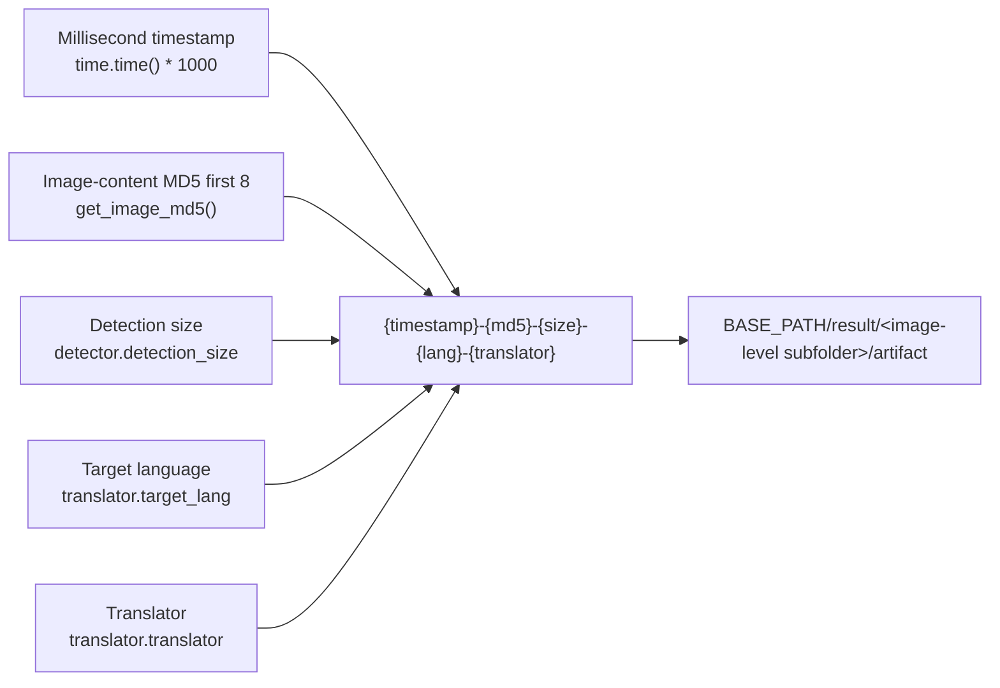
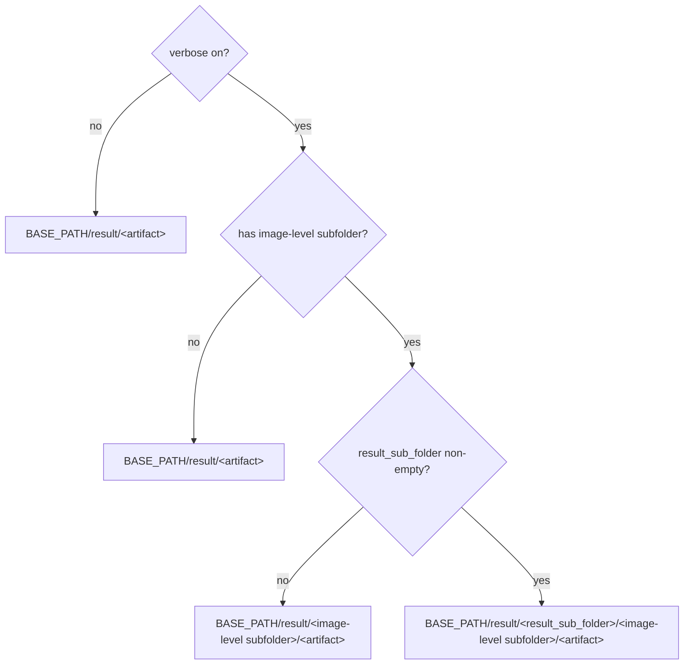

# Debug Folder Naming and Overview

When you enable “Verbose Logging”, the app creates one debug subfolder per input image under `result/` and writes intermediate files for detection, OCR, masks, inpainting, and rendering. This guide explains the subfolder naming rule, the layout of `result/`, and the stage and trigger condition of each debug artifact, so you can locate a specific run from its folder name and tell which files always appear from those that only appear under specific settings or workflows.

This guide does not dig into each artifact: detection and rearrangement are covered in [Input detection and rearrangement](./input-detection-and-rearrangement.md), OCR and text regions in [OCR and text regions](./ocr-and-text-regions.md), masks, inpainting and rendering in [Mask, inpainting and rendering](./mask-inpainting-and-rendering.md), and special workflows in [Special workflows and WebSocket](./special-workflows-and-websocket.md). Cleanup, sanitization, and sharing of debug artifacts are covered in [How to read and share a debug run](./how-to-read-and-share-a-debug-run.md).

## What to inspect

- The “Verbose Logging” switch decides whether per-image debug subfolders are generated; when off, no timestamped image-level subfolder is created.
- The image-level debug subfolder name is fixed as `{timestamp_ms}-{image_md5_8}-{detection_size}-{target_lang}-{translator}`, built when each input image starts processing.
- Debug directories live under `BASE_PATH/result/`; `BASE_PATH` is the executable directory in frozen (packaged) runs and the repository root in source runs.
- This guide focuses on naming and the artifact overview; each artifact is handled in depth by its own debugging page.

## Inspect debug artifacts

### Enable verbose logging in Settings

1. Open “Settings” and select the “General” group.
2. Turn on the “Verbose Logging” switch. The description panel on the right shows the text for this setting.
3. After starting a translation, intermediate artifacts are written to the image-level subfolder under `BASE_PATH/result/`, named per the rule below.
4. When a translation fails, the “Translation Error” dialog offers an “Open log folder” button that opens `result/` directly.

The CLI `local` mode supports the same behavior through `-v/--verbose`; see the CLI documentation.

## How artifacts are produced

### Image-level subfolder naming

The debug subfolder name is generated when each input image starts processing:

```text
{timestamp_ms}-{input_md5}-{detection_size}-{target_lang}-{translator}
```

| Field | Source | Example | Description |
| --- | --- | --- | --- |
| `timestamp_ms` | `str(int(time.time() * 1000))` | `1785860417472` | Millisecond timestamp; keeps folder names unique |
| `input_md5` | `get_image_md5(image)` | `3415b69c` | First 8 characters of the image-content MD5; identical content yields the same value |
| `detection_size` | `config.detector.detection_size` | `2048` | Detection size; fallback `1024` |
| `target_lang` | `config.translator.target_lang` | `CHS` | Target-language code; fallback `unknown` when missing |
| `translator` | `config.translator.translator` | `openai` | Translator identifier; fallback `unknown` when missing |

The image content is first normalized to RGB, encoded to PNG bytes, and hashed with MD5, keeping only the first 8 hexadecimal characters to avoid overly long folder names; on failure it falls back to `fallback_{timestamp_ms}`. When no image is passed, the MD5 field is `unknown`.

For example, `result/1785860417472-3415b69c-2048-CHS-openai/` matches exactly these five fields: millisecond timestamp `1785860417472`, image MD5 `3415b69c`, detection size `2048`, target language `CHS`, and translator `openai`. The folder name itself only contains a hash and configuration values, never user text; files inside it are user content and must be sanitized before sharing.



### Debug path composition

The debug path is decided by verbose, the image context, and `result_sub_folder`, and parent directories are created automatically:

| Condition | Returned path |
| --- | --- |
| `verbose=True`, image context present, `result_sub_folder` non-empty | `BASE_PATH/result/<result_sub_folder>/<image-level subfolder>/<artifact>` |
| `verbose=True`, image context present, `result_sub_folder` empty | `BASE_PATH/result/<image-level subfolder>/<artifact>` |
| Non-verbose (or no image-level path), `result_sub_folder` empty | `BASE_PATH/result/<artifact>` |
| Non-verbose, `result_sub_folder` non-empty | `BASE_PATH/result/<result_sub_folder>/<artifact>` |



### Directory overview

```text
BASE_PATH/result/
├─ log_20260807120000.txt          # Qt UI / CLI run log (timestamp is yyyyMMddHHmmss)
└─ 1785860417472-3415b69c-2048-CHS-openai/   # verbose per-image debug folder
   ├─ input.png                     # input image before processing
   ├─ bboxes.png                    # merged text-block visualization
   ├─ mask_raw.png                  # raw detection confidence heatmap
   ├─ inpaint_input.png             # inpainting input preview
   ├─ mask_final.png                # final mask used for inpainting
   ├─ inpainted.png                 # inpainting result
   ├─ final.png                     # final output (after size revert)
   ├─ ocrs/                         # perspective-cropped OCR inputs per region
   │  ├─ 0.png
   │  └─ 1.png
   └─ ...                           # conditional artifacts below
```

### Artifact overview: core artifacts

The following artifacts are the most common in a normal verbose run; whether each one is actually written still depends on detection/OCR results and translation progress:

| Artifact | Stage | Trigger condition | Content and use |
| --- | --- | --- | --- |
| `input.png` | At the start of the translation flow | `verbose=True` | Input image before processing; detection/OCR troubleshooting |
| `mask_raw.png` | After detection | `verbose=True` and detection returns `ctx.mask_raw` | Raw detection confidence heatmap with color bar; detection-threshold troubleshooting |
| `bboxes_unfiltered.png` | After detection | `verbose=True` and text lines remain after detection | Unfiltered text-line boxes on the image; detection/OCR filtering troubleshooting |
| `bboxes.png` | After OCR and text-line merge | `verbose=True` and `ctx.text_regions` exists | Final text-block visualization; merge/sort troubleshooting |
| `inpaint_input.png` | Before inpainting | `verbose=True` and `ctx.mask` exists after translation | Inpainting input preview |
| `mask_final.png` | Before inpainting | same as above | Final mask used for inpainting |
| `inpainted.png` | After inpainting | normal verbose flow | Inpainted image |
| `final.png` | When the size is reverted | size revert called, `ctx.result` exists, and verbose | Final (or size-reverted) PIL output |
| `ocrs/<index>.png` | OCR stage | `verbose=True` and region not filtered beforehand | Perspective-cropped OCR inputs; vertical text is rotated; 48px/Manga OCR/PaddleOCR compress to 200px |

### Artifact overview: conditional artifacts

The following artifacts are only generated under specific settings, detectors, workflows, or modes; they must not be described as present in every verbose run:

| Artifact | Trigger condition | Content and use |
| --- | --- | --- |
| `bboxes_unfiltered_labeled.png` | `ocr.merge_special_require_full_wrap=True` and the label drawer receives non-empty text lines | Text-line boxes with index/labels; model-assisted merge troubleshooting |
| `bboxes_with_scores.png`, `mask_binary.png` | detector third return value is a score-box/binary-mask debug tuple | Detection score boxes and the paired binary mask |
| `hybrid_detection_boxes.png` | detector third return value is an image and `detector.use_yolo_obb=True` | Combined main-detection and YOLO OBB boxes |
| `rearrange_<index>.png` | default/DBConvNext/CTD detector triggers a long-image rearrange plan | Square padded batches sent to the detection network; long-image rearrange troubleshooting |
| `yolo_rearrange_<index>.png` | `use_yolo_obb=True` and YOLO OBB gets a rearrange plan | Single YOLO OBB rearrange patch |
| `mask_bubble_clip_debug.png` | `limit_mask_dilation_to_bubble_mask=True` and a non-empty bubble mask is obtained | Overlay of bubble clip and protected areas |
| `balloon_fill_boxes.png` | `layout_mode='balloon_fill'` and the renderer returns a non-empty debug image | Balloon-fill layout debug image |
| `chinese_linebreak_debug.json` | same as above and non-empty line-break records accumulated | Chinese line-break records; may contain source/translation text; sanitize before sharing |
| `replace_debug_match.jpg`, `debug_extracted_text.png`, `inpainted.png` | replace-translation workflow and verbose | Match boxes/overlap info, extracted text, and the replace-flow inpainted image |
| `ws_final.png`, `ws_render_in.png`, `ws_render_out.png`, `ws_mask.png`, `ws_inmask.png`, `ws_output.png` | WebSocket mode and verbose | WS rendering intermediates and final images |
| `<input-stem>_photoshop_script.jsx` | editable PSD export and verbose or `psd_script_only` | Photoshop automation script; may contain layer text and file paths; sanitize before sharing |
| `log_<yyyyMMddHHmmss>.txt` | Qt UI startup or CLI local log initialization | App-level run log; not part of a per-image debug subfolder |

### Actual artifacts vs conditional artifacts

- The tables above list the complete set that the current source **may** produce across modes, settings, and workflows, not the set that a single run necessarily generates.
- Pages without text, early exits, failures/cancellations, and special workflows (replace translation, WebSocket, JSON-only, and so on) skip different stages and therefore skip the corresponding artifacts.
- These files are terminal diagnostic writes for verbose-enabled operators or bug-report recipients.
- To determine which artifacts a run “actually contains”, locate its subfolder under `result/` using the naming rule above and cross-check the runtime settings and workflow; do not treat conditional artifacts as always present.

## Artifacts and privacy

- Image-level subfolders depend on the verbose switch, the image context, and `result_sub_folder`; missing any of them falls back to a path without an image-level subfolder.
- The `ocrs/` subfolder is produced by `_run_ocr()` in verbose mode via a temporary `MANGA_OCR_RESULT_DIR` pointing at the image-level `ocrs/`; direct OCR calls without that environment variable fall back to `result/ocrs/`.
- `BASE_PATH` points to different locations in frozen packaged runs versus source runs (executable directory vs repository root); keep this in mind when comparing folders across machines.
- Qt UI creates the `result/log_*.txt` file log at startup and the file handler is always DEBUG level, so it exists even with verbose off; verbose mainly affects the console log level and image-level debug subfolders.
- Debug folders may contain full page images, recognized text, box coordinates, translation results, or local paths inside JSX; never package them for upload or publish them directly.
