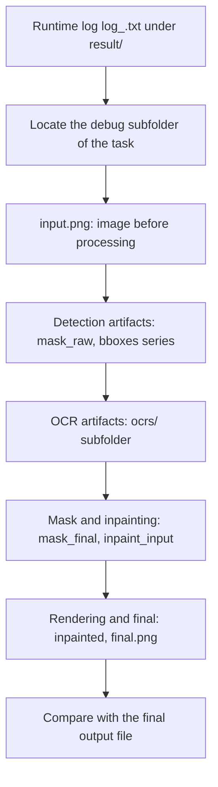
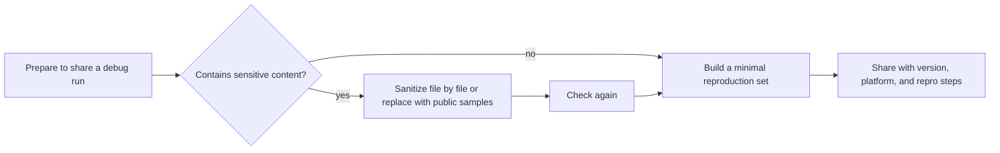

# How to Read and Share a Debug Run

Use this page when a translation result looks wrong, an error occurs, or you need to report a problem to the developers. It explains how to enable “Verbose Logging” to produce debug artifacts, in which order to read them, and the cleanup, sanitization, and sharing rules. Per-file stages, trigger conditions, and troubleshooting purposes live in [Debug folder naming and overview](./folder-naming-and-overview.md) and the other debug subpages; this guide does not repeat them and does not replace the troubleshooting or privacy/cleanup pages.

## What to inspect {#scope}

- The “Verbose Logging” switch only decides whether intermediate artifacts are written under `result/` and raises the console log level; it does not change the translation result. The final output path is decided by the output configuration (including “Save to Source Directory”).
- The runtime log file is always written at DEBUG level to disk; “Verbose Logging” affects the console level and whether debug intermediate files are generated.
- This guide focuses on “reading order, cleanup, sanitization, sharing”; each artifact's meaning is owned by its own debug page.

## Inspect debug artifacts {#ui-operations}

### Enable verbose logging {#enable-verbose-logging}

1. Open “Settings” and select the “General” group.
2. Turn on “Verbose Logging” and save.
3. Run a translation task again. Qt UI already creates `result/log_<timestamp>.txt` at startup whether verbose logging is enabled or not; with it enabled, the task also creates one debug subfolder per image.
4. When a “Translation Error” dialog appears, click “Open log folder” to jump straight to the log directory.

### Locate the log and debug directory {#locate-logs-and-debug-directory}

- Both the desktop app and the CLI write `log_<yyyyMMddHHmmss>.txt` under `result/` in the application root (repository root in development, the executable directory in packaged builds).
- Each input image maps to a debug subfolder named `{timestamp-ms}-{image-MD5}-{detection-size}-{target-lang}-{translator}`. The UI description abbreviates this as “timestamp-image-name-target-language-translator”; the “image-name” position is actually the image MD5.
- In batch tasks every image has its own subfolder, distinguished by timestamp; cross-check the image path in the log against the subfolder name.

## Reading order {#reading-order}

The recommended order is: read the runtime log first to locate the stage and error, then open the matching image debug subfolder and check intermediate artifacts in pipeline order, and finally compare against the final output.

- Log first: it contains the per-image timeline, warnings, and error traces; error messages may embed local paths that must be handled before publishing.
- Subfolder next: start from `input.png` and follow “detection → OCR → mask/inpainting → rendering → final” to find which step deviates from expectations.
- Output last: `final.png` under `result/` is a verbose debug copy; the actually saved image is written elsewhere according to the output configuration. They should match; a difference points to the saving step.
- Conditional artifacts are not guaranteed every run: no-text early exit, special workflows, WebSocket mode, and some OCR/rendering branches skip files, so a missing file is not necessarily an anomaly.

## Cleanup {#cleanup}

Quit the Qt UI (or stop the CLI) completely before cleaning; otherwise the log file is held by the file handler and deletion can fail on Windows. Delete `log_*.txt` and the matching timestamp debug folders together, not only one of them.

| Artifact | Location | Cleanup method |
| --- | --- | --- |
| Runtime log | `result/log_<yyyyMMddHHmmss>.txt` | Close the app, then delete |
| Per-image debug folder | `result/<timestamp>-<MD5>-<size>-<lang>-<translator>/` | Close the app, then delete the whole folder |
| OCR input crops | `ocrs/` subfolder inside the folder above | Deleted together with the debug folder |
| PSD/JSX | `manga_translator_work/psd/` (in the input image directory when `psd_script_only`) | Delete separately; not part of `result/` |
| Runtime config tables | `text_replacements.yaml`, `rich_text_rules.yaml`, `filter_list.json`, `translation_template.json` and prompt files under `config/` | Deleted files are recreated as defaults by `ensure_runtime_files()` on next start, but custom edits are lost |

## Sanitization {#sanitization}

Any image, JSON, JSX, or log under `result/` may contain the full page image, recognized text, box coordinates, translations, local paths, or even credentials, so it cannot be uploaded as-is. `mask_raw` is only a base64-encoded PNG; encoding is not sanitization.

| Data category | Where it can appear | Treatment before sharing |
| --- | --- | --- |
| API keys, auth keys, tokens | `.env`, environment variables, request logs, imported configs | Remove or replace with clearly fake placeholder text |
| User images, source text, translations, OCR text, box coordinates, masks | Debug PNG/JPG, `ocrs/`, per-image JSON, `mask_raw` | Use public samples; check file by file |
| Local absolute paths | Logs, error messages, PSD JSX, export directories in JSON | Replace with relative paths or placeholders |
| Private prompts | Custom prompt JSON/YAML | Do not show the body; describe the structure only |
| Session/auth tokens | Server logs, request headers | Delete the value; keep only the header name |

## Sharing {#sharing}

The goal of sharing a debug run is to let the receiver reproduce the problem without your images or keys. Prepare a minimal reproduction set instead of packing the whole `result/` directory or the whole working directory.

| Include | Do not include |
| --- | --- |
| App/CLI version and operating system | Real API keys, tokens, or passwords |
| Repro steps, target language, translator, and key parameters | User images or large source/translation text |
| The relevant excerpt from `log_*.txt` | The whole `result/` directory or the whole working directory |
| The sanitized matching timestamp debug folder | Local absolute paths or private prompts |
| Sanitized config excerpts | Session tokens or auth information |

## Artifacts and privacy {#dependencies}

- `verbose` and the final output location are independent: debug artifacts go to `BASE_PATH/result/` while the final image is computed from “Save to Source Directory” or the output folder; do not treat them as one location.
- A debug subfolder is what actually existed in that run; the current source may produce more files in other modes, so do not describe conditional artifacts as present in every run.
- Batch, concurrency, and context history do not break debug-folder isolation: each image still has its own subfolder keyed by image MD5 and timestamp.
- After `verbose` is turned off, new runs stop generating debug intermediates, but old `result/` content is not deleted automatically; clean it manually as described above.
