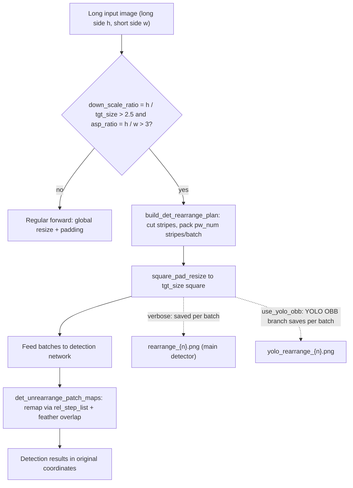
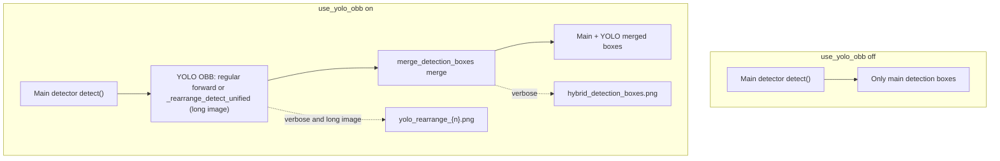

# Input, Detection, and Rearrangement Debug Artifacts

When an image "detects no text", "boxes are misplaced", or "a long image is split oddly", enable "Settings → General → Verbose Logging", run again, and inspect the input image, detection-box debug images, and long-image rearrangement batches in the per-image debug folder under `result/`. This guide documents when these artifacts are generated, what they show, and how to use them for troubleshooting, with emphasis on the difference between input/detection artifacts and the two long-image rearrangement branches `rearrange_{n}.png` and `yolo_rearrange_{n}.png`.

For the overall debug-folder naming and structure, see [Debug folder naming and overview](./folder-naming-and-overview.md); for OCR and text-region artifacts, see [OCR and text regions](./ocr-and-text-regions.md); for mask, inpainting, and rendering artifacts, see [Mask, inpainting, and rendering](./mask-inpainting-and-rendering.md). This page never shows real `.env` files, user images, private absolute paths, or real API keys; sanitize debug images and paths before sharing.

## What to inspect {#feature-boundary}

- Every artifact on this page is gated by the “Verbose Logging” switch: when it is off, no per-image debug subfolder is created and the detection stage writes no debug image.
- `input.png`, `mask_raw.png`, `bboxes_with_scores.png`, `mask_binary.png`, `hybrid_detection_boxes.png`, `bboxes_unfiltered.png`, `bboxes_unfiltered_labeled.png`, and `bboxes.png` are the "input/detection-stage" debug artifacts.
- `rearrange_{n}.png` and `yolo_rearrange_{n}.png` are produced only when the image satisfies the long-image rearrangement condition; they are conditional artifacts, not files every run must contain.
- The two rearrangement artifacts belong to different branches: the main detectors (default/DBConvNext/CTD) produce `rearrange_{n}.png`; the YOLO OBB auxiliary detector produces `yolo_rearrange_{n}.png` when “Enable YOLO Detection” is on.
- These files are terminal diagnostics: a static search found no later read-back of these filenames inside the repository; the consumers are operators troubleshooting a run or recipients of an issue report.

## Inspect debug artifacts {#ui-operations}

### Enable verbose logging and collect input/detection artifacts {#enable-verbose-and-collect}

1. Open “Settings” and select the “General” group.
2. Enable “Verbose Logging”.
3. Start translating. With it enabled, each input image creates a `{timestamp}-{image-md5}-{detection-size}-{target-lang}-{translator}` subfolder under `result/`, and the detection stage writes `input.png` and detection-box debug images.
4. When troubleshooting, open the files in the order "input image → detection boxes → rearrangement batches" and compare them with the tables on this page to locate the failing stage.

### Tune detection and long-image rearrangement parameters {#tune-detection-parameters}

Open “Settings” → “Detection”. “Detection Size” is both the regular detection scaling size and the target size of long-image rearrangement; “Long Image Rearrange Min Short Side” controls the effective short-side resolution preserved when packing batches; “Enable YOLO Detection” decides whether `yolo_rearrange_{n}.png` and `hybrid_detection_boxes.png` are produced.

## Input and detection-box debug artifacts {#input-and-detection-artifacts}

The table below lists, in detection-stage order, the debug artifacts owned by this page.

| Artifact | Write point | Trigger | What it shows | Troubleshooting use |
| --- | --- | --- | --- | --- |
| `input.png` | `manga_translator/manga_translator.py` `_translate_until_translation()` | `verbose=True` | The input image before processing (converted RGB→BGR when saved) | Confirm the image fed to the pipeline; check it first when detection/OCR looks wrong |
| `mask_raw.png` | `manga_translator/manga_translator.py` (after detection returns `ctx.mask_raw`) | `verbose=True` and detection returned a raw mask | Confidence heatmap with color mapping and a "Confidence" color bar (`_create_confidence_heatmap`) | Detection-threshold and missed-text troubleshooting |
| `bboxes_with_scores.png` | `manga_translator/manga_translator.py` (when the detector's third return is a debug tuple or image) | `verbose=True`, detector returned a scored-box debug image | Scored detection boxes overlaid by the detector | Detector-internal debug output |
| `mask_binary.png` | Same as above (binary/triple debug tuple) | Same as above | Binary mask paired with the scored-box image | Detection-output troubleshooting |
| `hybrid_detection_boxes.png` | Same as above (third return is an image and `use_yolo_obb=True`) | `verbose=True`, `use_yolo_obb=True` | Boxes after merging main detection with YOLO OBB (from the dispatch's `draw_detection_debug_image`) | Hybrid-detection merge troubleshooting |
| `bboxes_unfiltered.png` | `manga_translator/manga_translator.py` (after detection, before OCR) | `verbose=True` and text lines remain after detection | Unfiltered text-line boxes on the image (boxes labeled `other` are skipped) | Detection/OCR filtering troubleshooting |
| `bboxes_unfiltered_labeled.png` | `manga_translator/manga_translator.py` → `_save_labeled_textline_debug_image()` | Previous condition, `ocr.merge_special_require_full_wrap=True`, and non-empty text lines | Colored text-line boxes with `index:label` captions (colored per label) | Model-assisted merge / label-routing troubleshooting |
| `bboxes.png` | `manga_translator/manga_translator.py` (after textline merge) | `verbose=True` and `ctx.text_regions` exists | Final text-block visualization (whether panels are shown depends on `force_simple_sort`) | Merge/sort troubleshooting |

## Long-image rearrangement: trigger and splitting {#rearrange-trigger-and-splitting}

The rearrangement plan first normalizes along the long side: if `h < w` it transposes so that `h` is the long side. It computes `down_scale_ratio = h / tgt_size` (`tgt_size` is `detector.detection_size`, default `2048`) and `asp_ratio = h / w`; rearrangement is required only when `down_scale_ratio > 2.5` and `asp_ratio > 3`; otherwise the regular forward path is used.

When rearranging, the long strip is cut into stripes and packed by `pw_num`: `pw_num` is derived from the "no-downscale stripe count `floor(tgt_size / w)`", the "resolution cap computed from `det_rearrange_min_effective_short_side`", and the "legacy cap `floor(2 * tgt_size / w)`"; each composed batch packs `pw_num` stripes side by side. Each batch is padded and resized to a `tgt_size × tgt_size` square before entering the network. Detection outputs are mapped back to original-image coordinates, and overlapping stripe regions are merged with feather weighting based on distance from the stripe cut edges, so text cut at a seam does not lose boxes.

Rearrangement avoids shrinking an extremely long image down to the detection size, which would make text too small; packing batches also bounds the VRAM used by each network call. A higher `det_rearrange_min_effective_short_side` packs fewer stripes per batch and preserves a higher effective short-side resolution, making text clearer but detection slower (matching the settings description).

## Rearrangement artifact branches {#rearrange-artifact-branches}

### `rearrange_{n}.png`: square padded batches of the main detector {#rearrange-artifact-main}

The write point is `det_rearrange_forward()` → `_patch2batches()` in `manga_translator/utils/generic.py`. Triggers: the default, DBConvNext, or CTD detector calls `det_rearrange_forward()`, the image satisfies the `build_det_rearrange_plan()` condition, and `verbose=True`. Content: the square padded batches fed to the detection network — each `{n}` is one composed batch (`pw_num` stripes side by side, padded to `tgt_size`), used to troubleshoot long-image rearrangement: check whether cutting/packing is correct, stripes are complete, and the padding direction is as expected. With verbose, the console prints an "Input image will be rearranged to square batches..." notice.

### `yolo_rearrange_{n}.png`: single YOLO OBB rearrange patch {#rearrange-artifact-yolo}

The write point is `_rearrange_detect_unified()` in `manga_translator/detection/yolo_obb.py`. Triggers: `use_yolo_obb=True`, YOLO OBB also receives a long-image rearrangement plan, the current patch is valid (not an all-zero padding patch and not empty), and `verbose=True`. Content: a single YOLO OBB rearrange patch — YOLO OBB uses the same `build_det_rearrange_plan()` splitting logic as the main detector, so its cuts should match `rearrange_{n}.png`, helping hybrid-detection long-image troubleshooting. All-zero padding patches are skipped, so the indices `{n}` may be non-contiguous.

## Paths and fallbacks {#paths-and-fallbacks}

- The regular detection dispatch passes `self._result_path` as `result_path_fn` to detectors in `_run_detection()`, so both rearrangement artifacts land in the per-image debug folder by default: `result/<timestamp>-<md5>-<detection-size>-<target-lang>-<translator>/rearrange_{n}.png` and `yolo_rearrange_{n}.png` in the same folder.
- When no callback is provided, `det_rearrange_forward()` falls back to `result/rearrange_{n}.png` at the repository root (`generic.py`), and YOLO OBB falls back to `result/yolo_rearrange_{n}.png` (`yolo_obb.py`). In the current source, the call in `manga_translator/utils/ctd_replace.py` does not pass the callback; the regular detection dispatch does.
- The debug-folder name contains the input image MD5; do not put a path containing a user-image MD5 into a public report. Debug PNGs can directly contain pixels of the user image; check every file before sharing.

## Parameters and options {#parameters-and-options}

> Detailed parameter information (UI names, storage keys, default values, and effective stages) on this page is in the [debug artifact reference index](../reference/debug-artifact-index.md).

#### Detection Size {#detection-size}

“Detection Size” is an integer input in Settings → Detection. It sets the scaling size for regular detection and is also the target size of long-image rearrangement. For details, see [Detection](../desktop/settings/detection.md).

#### Long Image Rearrange Min Short Side {#det-rearrange-min-effective-short-side}

“Long Image Rearrange Min Short Side” is an integer input in Settings → Detection. It constrains the effective short-side resolution preserved when packing long-image rearrangement batches. For details, see [Detection](../desktop/settings/detection.md).

#### Enable YOLO Detection {#use-yolo-obb}

“Enable YOLO Detection” is a switch in Settings → Detection. When enabled, the detection dispatch runs YOLO oriented-bounding-box detection after the main detector and merges the results; when disabled, only the main detector runs. For details, see [Detection](../desktop/settings/detection.md).

#### Verbose Logging {#cli-verbose}

“Verbose Logging” is a switch in Settings → General. It is the master switch for the debug artifacts on this page: when enabled, each input image gets its own debug subfolder with the debug images listed on this page, and the console log level is raised. For details, see [CLI, Batch, and Output](../desktop/settings/cli-batch-and-output.md).

## Artifacts and privacy {#dependencies-and-conflicts}

- Every artifact depends on `verbose=True`; when disabled, `result/` gets no per-image debug folder.
- Early exit on no text (no text lines after detection) skips `bboxes_unfiltered*.png` and the later `bboxes.png`; `bboxes_unfiltered_labeled.png` additionally depends on `ocr.merge_special_require_full_wrap`.
- `hybrid_detection_boxes.png` and `yolo_rearrange_{n}.png` depend on `use_yolo_obb`; `import_yolo_labels` replaces the final detection boxes, but the detection dispatch still runs first (rearrangement artifacts may still exist with verbose).
- Long-image rearrangement artifacts are conditional: they do not appear for ordinary images, a large enough `detection_size`, or non-extreme aspect ratios.
- Do not present "artifacts that actually exist in one run" as "always produced"; do not zip and upload a debug folder directly, and note that the `mask_raw` heatmap and rearrangement batches may contain user-image content.
