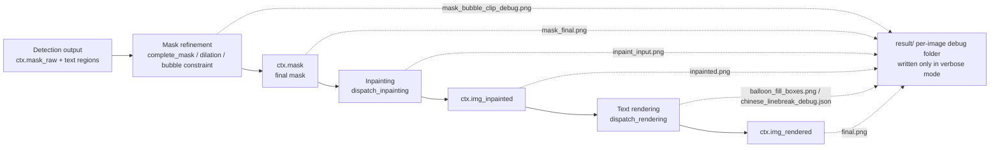

# Mask, Inpainting and Rendering Debug Artifacts

When “Verbose Logging” is enabled, every input image gets its own debug subfolder under `result/`, where the mask-refinement, inpainting, and text-rendering stages write images and JSON for troubleshooting. This guide documents the order in which these artifacts are produced, their trigger conditions, what each image or JSON shows, and how to use them for debugging. The detection-stage confidence heatmap and OCR crops live in [Input, detection and rearrangement debugging](./input-detection-and-rearrangement.md) and [OCR and text-region debugging](./ocr-and-text-regions.md); replace-translation and WebSocket artifacts are covered in [Special workflows and WebSocket debugging](./special-workflows-and-websocket.md).

The settings that control these stages (the “Inpainting” and “Typesetting” groups) are documented in [Mask and inpainting settings](../desktop/settings/mask-and-inpainting.md) and [Typesetting and rendering settings](../desktop/settings/typesetting-and-rendering.md); this guide does not repeat parameter defaults.

## Debugging scenarios {#when-to-use}

- When text is not fully erased or the background is damaged, use `inpaint_input.png`, `mask_final.png`, and `inpainted.png` to tell whether the mask scope or the inpainting model is at fault.
- When the mask looks wrong after enabling “Keep Dilation Inside Bubble Mask”, use `mask_bubble_clip_debug.png` to inspect clipping and restoration.
- When “Smart Bubble” layout overflows or falls back, use `balloon_fill_boxes.png` to inspect the bubble mask, render boxes, and overflow candidates.
- When Chinese semantic line breaking picks an unexpected result, use `chinese_linebreak_debug.json` to inspect candidate evaluations and the final selection.
- Debug images, line-break JSON, and logs can contain full pages, source text, translations, coordinates, or base64 masks. Sanitize every file before sharing it.

## Data flow and artifact locations {#data-flow-and-location}

The normal translation pipeline produces `ctx.mask`, `ctx.img_inpainted`, and `ctx.img_rendered` in the “mask generation → inpainting → rendering” stages. In verbose mode the intermediates are written to the current image's debug subfolder:

- In verbose mode, the debug folder name is built as `{timestamp_ms}-{input_md5}-{detection_size}-{target_lang}-{translator}`, and artifacts are written to `BASE_PATH/result/<per-image-subfolder>/`. Folder naming and the overall tree are covered in [Debug folder naming and overview](./folder-naming-and-overview.md).
- `ctx.mask_raw` is the detector's raw mask (usually a confidence map); `ctx.mask` is the refined binary mask. Mask refinement consumes only `ctx.mask_raw` and `text_regions`; it does not depend on the detection heatmap PNG.
- Special workflows change this artifact set: AI renderers (OpenAI/Gemini renderers) skip inpainting; `renderer=none` skips text drawing; inpaint-only, translate-JSON-only, and replace-translation take their own branches, as detailed below and on the special-workflows page.

## Mask-stage artifacts {#mask-artifacts}

The mask stage calls `_run_mask_refinement()` from `_complete_translation_pipeline()`, which runs `complete_mask()` through `dispatch_mask_refinement()` with `method='fit_text'` and optionally applies “Expand Bubble Repair Range” and “Keep Dilation Inside Bubble Mask”. In verbose mode the following files are written:

| Artifact | Trigger condition | What it shows | Troubleshooting use |
| --- | --- | --- | --- |
| `mask_final.png` | `verbose=True`; `ctx.mask` exists after translation | The final binary mask used for inpainting (`255` = area to erase), written directly from `ctx.mask` | Compare with `inpaint_input.png` to judge whether the mask is too large or too small; too large erodes background or neighboring bubbles, too small leaves text edges |
| `mask_bubble_clip_debug.png` | Previous condition; `ocr.limit_mask_dilation_to_bubble_mask=True`; the bubble model returns a non-empty mask | Overlay on the original: blue=bubble mask, green=kept mask after clipping, yellow=protected restoration, red=removed pixels, legend in the top-left corner | Check whether clipping and restoration under “Keep Dilation Inside Bubble Mask” behave as expected |
| `mask_raw.png` | `verbose=True`; detection returns `ctx.mask_raw` | The raw detection confidence heatmap with a color bar | A detection-stage artifact; it is the input source for mask refinement, see [Input, detection and rearrangement debugging](./input-detection-and-rearrangement.md) |

If mask refinement fails: inpaint-only mode falls back to a simple dilation of `ctx.mask_raw` (`cv2.dilate` with a `config.kernel_size` kernel and `mask_dilation_offset // kernel_size` iterations); export/template mode falls back directly to `ctx.mask_raw`. These fallbacks do not produce extra debug files. The mask saved in the per-image JSON and the `mask_is_refined` flag are covered in the [debug artifact reference index](../reference/debug-artifact-index.md).

## Inpainting-stage artifacts {#inpainting-artifacts}

The inpainting stage calls `dispatch_inpainting()` through `_run_inpainting()`. `inpaint_input.png` is generated with `Inpainter.none` (mask areas painted solid white); the real inpainter then produces `ctx.img_inpainted`. In verbose mode the following files are written:

| Artifact | Trigger condition | What it shows | Troubleshooting use |
| --- | --- | --- | --- |
| `inpaint_input.png` | `verbose=True`; `ctx.mask` exists after translation | Inpainting-input preview with mask areas painted white (`Inpainter.none` result) | Confirm at a glance which areas will be erased; compare with `mask_final.png` |
| `inpainted.png` | Normal full pipeline `verbose=True` | The full-page `ctx.img_inpainted` output of the inpainting stage | Check whether text is erased cleanly and background is intact; in AI-renderer mode inpainting is skipped, so this file equals the original work image |

- When an OpenAI/Gemini renderer is selected, `_should_skip_inpainting_for_ai_renderer()` returns true, the inpainting stage is skipped, and `ctx.img_inpainted = ctx.img_rgb`. `inpainted.png` is still written, but its content is not a model-inpainted result.
- For extreme-aspect-ratio images, `dispatch_inpainting()` splits the image into overlapping tiles using `INPAINT_SPLIT_RATIO = 3.0`; with “Per-Block Inpainting” enabled, each isolated connected component of the final mask is inpainted in a cropped window. Both tiling modes only change the tiles fed to the model; `inpainted.png` remains a full-page image.
- When `save_text` is enabled, the inpainted result is also saved next to the source image as `manga_translator_work/inpainted/<stem>_inpainted.<source extension>` for the editable-image feature; that file is not a `result/` debug artifact.

## Rendering-stage artifacts {#rendering-artifacts}

The rendering stage calls `dispatch_rendering()` through `_run_text_rendering()`. With `layout_mode='balloon_fill'` and verbose mode, the renderer returns a debug image and line-break records. In verbose mode the following files are written:

| Artifact | Trigger condition | What it shows | Troubleshooting use |
| --- | --- | --- | --- |
| `balloon_fill_boxes.png` | `verbose=True`; `render.layout_mode='balloon_fill'`; the renderer returns a non-empty debug image | Overlay on the original: red=OCR box, yellow=region bubble component, blue=global bubble mask, green=final render box, orange=overflow candidate box, legend in the top-left corner | Debug “Smart Bubble” layout: whether a region is fully enclosed by a bubble, when it falls back to strict layout, and whether overflow candidates are used |
| `chinese_linebreak_debug.json` | Previous condition; `render.semantic_linebreak=True`; Chinese target language; non-empty line-break records | `version: 1`, `type: chinese_linebreak_debug`; the `records` array stores `stage`, `region_index`, `input`, candidate evaluations, the selected result, and a `mask` (`png_base64`) | Debug candidate selection and overflow for Chinese semantic line breaking; records contain source text and translations, so sanitize before sharing |
| `final.png` | `_revert_upscale()` is called; `ctx.result` exists; `verbose=True` | The final (or size-reverted) PIL output | Compare with the normally saved result to confirm the final layout matches the export |

With `renderer=none`, `_run_text_rendering()` returns the base image directly, draws no text, and produces no line-break records. Neither AI renderers (OpenAI/Gemini renderers) nor `renderer=none` generate `balloon_fill_boxes.png` or `chinese_linebreak_debug.json` (the former requires `layout_mode='balloon_fill'`, which AI renderers typically do not use together).

## Dependencies and limits {#dependencies-and-limits}

- “Verbose Logging” is the master switch for these artifacts; when it is off, the normal pipeline does not write the `result/` debug directory (except the Web/server branch that saves `final.png`).
- Conditional artifacts are not present in every run: `mask_bubble_clip_debug.png` requires the option enabled and a non-empty bubble-model mask; `chinese_linebreak_debug.json` requires `balloon_fill` plus Chinese semantic line breaking plus non-empty records; `inpaint_input.png` and `mask_final.png` require `ctx.mask` after translation.
- The three debug images are written only by the normal full pipeline `_complete_translation_pipeline()`. Inpaint-only, translate-JSON-only, replace-translation, and WebSocket modes take their own branches with different artifact sets (see [Special workflows and WebSocket debugging](./special-workflows-and-websocket.md)).
- `inpaint_input.png` uses `Inpainter.none` to paint mask areas white; it is not the real inpainter's input preprocessing, only a visualization of the area to erase.
- AI renderers skip the inpainting stage; `renderer=none` skips text drawing. These skips directly change whether `inpainted.png` and the line-break records appear.
- The inpainting model scales its input to `inpainting_size` and, for extreme aspect ratios, splits it with `INPAINT_SPLIT_RATIO=3.0`. Tiling and per-block inpainting change only the model input, not the full-page debug images.
- Debug images and JSON may contain full user pages, OCR text, translations, coordinates, base64 masks, or local paths. Treat them as user content and inspect each file before sharing. This page never shows real keys, user images, or private absolute paths.
