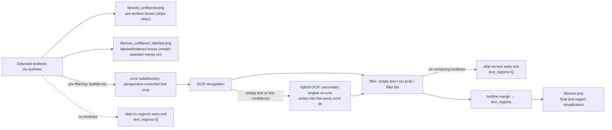

# OCR and Text Region Debug Artifacts

Use this page when OCR misrecognizes or misses text, merges multiple lines into one, or when text-region merging and ordering do not follow the reading order. It explains the OCR input crops, text-region boxes, and the `ocrs/` subdirectory written under `result/` when verbose logging is enabled. These are conditionally written static debug files: they are triggered only by the “Verbose Logging” switch, do not participate in the final result, and are not generated on every run.

This guide focuses on the OCR-input and text-region visual artifacts. Detection thresholds and `mask_raw.png`, `bboxes_with_scores.png`, `mask_binary.png`, `hybrid_detection_boxes.png` are covered in [Detection and rearrangement](./input-detection-and-rearrangement.md); OCR engines, hybrid OCR, filtering, and merge parameters are covered in [OCR, filtering, and textline merge](../desktop/settings/ocr-filter-and-merge.md); debug folder naming and global cleanup are covered in [Debug folder naming and overview](./folder-naming-and-overview.md).

## What to inspect {#feature-boundary}

- Artifacts covered here: `ocrs/<index>.png` (per-line OCR input crops), `bboxes_unfiltered.png` and `bboxes_unfiltered_labeled.png` (textline boxes before OCR), `bboxes.png` (final text-region boxes after merging), plus the path, trigger conditions, visual meaning, and troubleshooting use of the `ocrs/` subdirectory.
- The artifacts are written only when “Verbose Logging” is enabled; the desktop toggle lives in Settings → General, and the CLI uses `-v/--verbose`. Full details of the toggle are in [CLI, batch, and output](../desktop/settings/cli-batch-and-output.md).
- Mask, inpainting, rendering, replacement-translation, and WebSocket debug artifacts are covered elsewhere (e.g. [Mask, inpainting, and rendering](./mask-inpainting-and-rendering.md)); conditional artifacts are never described as present on every run.

## Inspect debug artifacts {#ui-operations}

### Enable verbose logging {#enable-verbose}

1. Open “Settings”, select the “General” group, and enable “Verbose Logging”.
2. Alternatively, pass `-v/--verbose` when using the CLI, e.g. `python -m manga_translator local -i <input path> -v`.
3. Re-run the image you want to investigate. Debug files are written under `result/<image debug subfolder>/`, and `ocrs/` is one of its subdirectories.
4. Before finishing and sharing, close the application first, then delete unneeded log files and debug folders under `result/`.

## Debug artifacts and trigger conditions {#debug-artifacts-and-triggers}

Debug files are located under `result/<image debug subfolder>/` (`result/` beside the executable in packaged builds). With “Verbose Logging” enabled, the OCR stage creates the `ocrs/` subdirectory, and the other images are written into the same debug subfolder. All artifacts listed below are conditional and not present on every run.

### Artifact table {#artifact-table}

| Artifact | Stage | Trigger condition | Visual/content meaning | Troubleshooting use |
| --- | --- | --- | --- | --- |
| `ocrs/<index>.png` | OCR stage | `verbose=True` and the textline passes OCR pre-filtering (e.g. bubble filtering) | Perspective-corrected crop of a single textline, i.e. the input sent to the OCR network; vertical text is rotated to horizontal; the 48px and PaddleOCR paths cap the long side at 200px | When OCR misrecognizes or misses text, check whether the crop is correct, rotated, or compressed |
| `bboxes_unfiltered.png` | After detection, before OCR | `verbose=True` and textlines remain after detection | Raw textline boxes drawn on the image, skipping boxes labeled `other` | Check which boxes enter OCR and whether the boxes fully cover the text |
| `bboxes_unfiltered_labeled.png` | After detection, before OCR | `verbose=True`, model-assisted merge enabled (`ocr.merge_special_require_full_wrap`), and non-empty textlines received | Colored textline boxes with index and label (`balloon`, `qipao`, `other`, etc.), preferring the full detection set | Troubleshoot label routing and model-assisted merge input |
| `bboxes.png` | After textline merge | `verbose=True` and `ctx.text_regions` is non-empty | Final text-region (`TextBlock`) visualization: panel boxes (when simple sorting is off), region boxes, line polylines, angle/coordinate labels, and region indices | Troubleshoot textline merging, reading order, and panel splitting |

### No-text early exit {#no-text-early-exit}

- If detection produces no textlines: the run reports `skip-no-regions`, `ctx.text_regions` is set to an empty list, `bboxes_unfiltered*.png` and `bboxes.png` are not written, and the run proceeds to the size-restore stage.
- If OCR produces no textlines (all empty, low confidence, or matching the filter list): the run reports `skip-no-text`, `ctx.text_regions` is set to an empty list, and `bboxes.png` is not written.
- Therefore, a missing `bboxes.png` in the debug folder does not necessarily mean a write failure; it may be a no-text early exit. Check the log for `skip-no-regions` / `skip-no-text` first.

## How artifacts are produced {#runtime}

### Debug chain from textlines to text regions {#data-flow}

### How the `ocrs/` subdirectory is written and indexed {#ocrs-writing-and-indexing}

- When verbose is enabled, OCR crops are written to `<result>/<image debug subfolder>/ocrs/` (one level deeper when `result_sub_folder` is configured).
- OCR engines that write crops: 32px, 48px, 48px-CTC, Manga OCR, and PaddleOCR. AI OCR (OpenAI/Gemini) and PaddleOCR-VL do not write per-region crops.
- Indices follow textline processing order: PaddleOCR uses the original line index (`{i}.png`), 32px uses a running index (`{ix}.png`), and 48px/48px-CTC/Manga OCR use the in-batch global index (`{ix-N+i}.png`). Pre-filtered lines are not written, so the indices are not contiguous.
- Vertical text is rotated by 90° before saving; the 48px and PaddleOCR paths cap the long side at 200px and use high-compression PNG.
- When the image-level debug subfolder is unavailable, the fallback is `result/ocrs/` (without the image-level subfolder).

### What the text-region boxes show {#text-region-box-meaning}

What `bboxes.png` shows:

- panel boxes are magenta rectangles with panel indices, drawn only when simple sorting is off (`force_simple_sort=False`);
- each text region gets a green bounding box, cyan line polylines with line numbers, and a yellow minimum-area rectangle;
- the region center shows the angle `a:`, the top-left corner coordinates `x:`/`y:`, and the top-left corner shows the region index.

### How filtering and hybrid OCR affect the artifacts {#filter-and-hybrid-effects}

- The filter stage drops empty text, low-confidence lines below `ocr.prob`, and lines matching the filter list (`filter_text_enabled`); dropped lines do not appear in `text_regions` or `bboxes.png`.
- Hybrid OCR (`ocr.use_hybrid_ocr`) re-runs lines that the primary OCR left empty or below confidence with `ocr.secondary_ocr`; both runs write to `ocrs/`, so indices may collide and be overwritten, and which run the final file keeps must be confirmed per run.
- The no-text early exit happens after filtering; `bboxes.png` is then not generated. This does not affect other stage artifacts such as `input.png` or `final.png`.

## Artifacts and privacy {#dependencies}

- `ocrs/` and all box images depend on `cli.verbose=True`; with verbose off, none of the artifacts on this page are produced.
- `bboxes_unfiltered_labeled.png` depends on the model-assisted merge toggle (`ocr.merge_special_require_full_wrap`); it is not written when the toggle is off.
- Whether `bboxes.png` draws panel boxes depends on `force_simple_sort`; with simple sorting on, only region boxes are drawn.
- Hybrid OCR reuses the same `ocrs/` directory for both runs, so the index does not guarantee a one-to-one mapping to the final text region; do not treat `ocrs/<index>.png` as evidence of the final region order.
- The artifacts come from the user's source image and OCR text and may contain user images, source text, and coordinates; inspect and sanitize every file before sharing.
