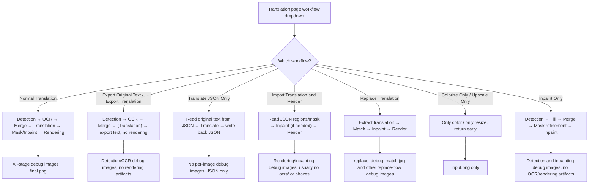
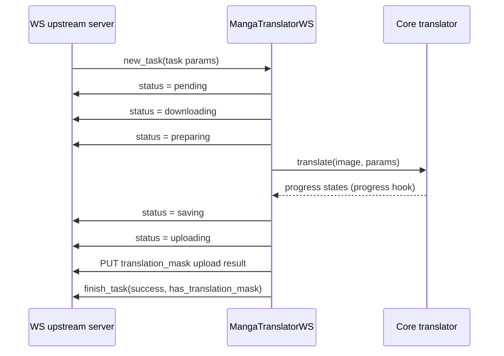

# Special Workflows and WebSocket Debug Artifacts

When modes such as Export Original Text, Export Translation, Translate JSON Only, Import Translation and Render, Replace Translation, or Colorize Only / Upscale Only / Inpaint Only skip parts of the standard pipeline, this guide explains which debug artifacts they do (or do not) produce. The two internal transport modes, `ws` and `shared`, additionally write `ws_*` debug images and transport-related files of their own. Per-stage debug images for the normal pipeline are covered in [Debug Folder Naming and Overview](./folder-naming-and-overview.md), [OCR and Text Regions](./ocr-and-text-regions.md), and [Mask, Inpainting and Rendering](./mask-inpainting-and-rendering.md); the full protocol contract for `ws`/`shared` lives in [Internal Shared and WebSocket Protocol](../developer/internal-shared-and-websocket.md).

## What to inspect

- Debug artifacts fall into three groups: conditional artifacts of special workflows that skip stages, the `ws_*` images written by the `ws` mode rendering callback, and the logs and directories produced while `shared`/`ws` run.
- Unless stated otherwise, every debug artifact requires `verbose` to be enabled; otherwise only business files such as the final image, JSON, or text exports are written.
- "Artifacts that actually exist in one run" differs from "all artifacts the current source may generate in that mode": for example, Import Translation and Render only triggers the detection branch when a mask is missing or detection must be rerun.
- This guide does not repeat the endpoints, ports, authentication, or pickle/protobuf serialization details of `shared`/`ws`; those belong to [Internal Shared and WebSocket Protocol](../developer/internal-shared-and-websocket.md).

## Inspect debug artifacts

### Choosing a workflow mode on the translation page

Open the "Translation" page. The dropdown at the top is labeled "Translation Workflow Mode:" and the hint below is "Choose translation workflow mode before starting the task.". The dropdown has 9 options; selecting one writes the corresponding backend flag into the configuration and saves it immediately. The start button text also changes with the mode.

### Enabling verbose logging in settings

Open "Settings" → the "General" group and check "Verbose Logging". Qt UI creates the runtime log `result/log_<timestamp>.txt` at startup regardless of this setting. With verbose logging enabled, it additionally raises console output to DEBUG level and creates a per-image debug subfolder containing cached intermediate artifacts; with it disabled, those image-level debug subfolders are not created. The `local`, `ws`, `shared`, and `web` CLI subcommands each provide their own `-v/--verbose` switch.

## Special workflow debug artifacts

The 8 non-default modes in the dropdown each skip part of the standard pipeline, so the table below lists "conditional artifacts this mode may produce with verbose enabled", not files that appear on every run.

| Workflow mode (UI) | Skipped/changed stages | Conditional verbose artifacts |
| --- | --- | --- |
| Normal Translation | None | Full standard set: `input.png`, `mask_raw.png`, `bboxes*.png`, `ocrs/`, `mask_final.png`, `inpaint_input.png`, `inpainted.png`, rendering debug images, `final.png` |
| Export Original Text | Skips translation and rendering; forces single-image batches | `input.png`, `mask_raw.png`, `bboxes*.png`, `ocrs/`, `bboxes.png`; no inpainting/rendering/`final.png`; also exports original text |
| Export Translation | Skips rendering | Detection/OCR artifacts (as above); no inpainting/rendering/`final.png`; also exports translated text |
| Translate JSON Only | Skips detection/OCR/rendering; only reads and writes JSON | No per-image debug images; rewrites JSON on success and deletes `imagename_original.txt` |
| Import Translation and Render | Skips detection/OCR/translation; renders directly | Usually only rendering/inpainting artifacts (`inpaint_input.png`, `mask_final.png`, `inpainted.png`, `final.png`); detection branch only when a mask is missing or YOLO label import is enabled |
| Replace Translation | Does not run normal translation; extracts translation → matches → inpaints → renders | `replace_debug_match.jpg`, `inpainted.png`, `debug_extracted_text.png` |
| Colorize Only | Only colorizes | `input.png`; no detection/OCR/rendering/`final.png` |
| Upscale Only | Only upscales | `input.png`; no detection/OCR/rendering/`final.png` |
| Inpaint Only | Detection → fill → merge → mask refinement → inpainting; no OCR/translation/rendering | `input.png`, detector debug images (e.g. `bboxes_with_scores.png`), `inpaint_input.png`, `mask_final.png`, `inpainted.png` |



The diagram describes real branches in the source; no run screenshots are faked. The actual artifacts of each branch also depend on whether the detector returns debug images, whether text regions exist, and whether a mask is missing; conditional artifacts must not be described as present on every run.

### Export workflows

- "Export Original Text": preprocessing runs as usual (so verbose still writes `input.png`, `mask_raw.png`, `bboxes*.png`, `ocrs/`, `bboxes.png`), then original text is exported directly; translation, mask, inpainting, and rendering are skipped, so there is no `final.png`. The JSON records `skip_font_scaling: false`, so the next import render re-runs smart typesetting.
- "Export Translation": detection/OCR/translation run as usual, but rendering is skipped and translated text is exported. The JSON records `skip_font_scaling: true` to replay the generated result.
- "Translate JSON Only": reads original text from JSON, translates, writes the result back, and deletes the matching `imagename_original.txt` on success. This branch never enters the per-image debug writes, so verbose produces no per-image debug images.
- All three export flows write under `manga_translator_work/` into the `json/`, `originals/`, and `translations/` subdirectories; these are business files, not debug artifacts. The template format is decided by `config/translation_template.json`, which is parsed as a text template and must not be assumed to be strict JSON.

### Import and replace workflows

- "Import Translation and Render": reads regions and masks from `_translations.json` (or an in-memory payload) and renders directly, skipping detection/OCR/translation. When the JSON already carries a refined mask, no detection debug images are generated; the detection branch only triggers when the JSON lacks a mask or "import YOLO labels" requires regenerating a mask. The inpainted image may come from an editor in-memory payload, a disk file under `manga_translator_work/inpainted/`, or a fresh inpainting run; `inpaint_input.png`/`mask_final.png`/`inpainted.png` only appear when inpainting actually runs.
- "Replace Translation": place translated images with matching filenames under `manga_translator_work/translated_images/`; the program extracts the translated text, matches regions on the raw image, inpaints the original text regions, and renders the translation. With verbose it writes `replace_debug_match.jpg` (raw boxes, translated boxes, match lines and overlap ratios), `inpainted.png` (the inpainted raw image), and `debug_extracted_text.png` (the extracted translated text in direct-paste mode).

### Single-stage workflows

- "Colorize Only" / "Upscale Only": save `input.png` (verbose) at the per-image entry and return immediately; they never enter detection/OCR/translation/rendering, so there is no `mask_raw.png`, `ocrs/`, `inpainted.png`, or `final.png`.
- "Inpaint Only": runs "detection → fill placeholder text → textline merge → mask refinement → inpainting" and skips OCR, translation, and rendering. With verbose it produces `input.png`, detector debug images (e.g. `bboxes_with_scores.png`/`mask_binary.png`/`hybrid_detection_boxes.png`), and inpainting artifacts (`inpaint_input.png`, `mask_final.png`, `inpainted.png`); no `ocrs/`, no rendering debug images, and no `final.png`.

## WebSocket and shared-transport debug artifacts

In `ws` mode (`MangaTranslatorWS`), verbose additionally writes the following rendering-related images into the per-image debug subfolder. `shared` mode has no dedicated files of its own, but with verbose it uses the same `_result_path()` debug directory as the normal pipeline.

| Artifact | Write point | Trigger | Content and consumer |
| --- | --- | --- | --- |
| `ws_render_in.png` | `manga_translator/mode/ws.py#_run_text_rendering` | `ws` mode and verbose | Image before rendering, `ctx.img_rgb` |
| `ws_render_out.png` | Same | `ws` mode and verbose | Rendered output before mask clipping |
| `ws_mask.png` | Same | `ws` mode and verbose | Final render mask (white 255), merged from pixels changed by rendering and `ctx.mask` |
| `ws_inmask.png` | Same | `ws` mode and verbose | Input image masked to the render region (RGBA × mask) |
| `ws_output.png` | Same | `ws` mode and verbose | Rendered output masked to the render region (RGBA × mask), i.e. the content actually uploaded |
| `ws_final.png` | `manga_translator/mode/ws.py#server_process_inner` | `ws` mode and verbose, and translation succeeded | Final result resized back to the original dimensions (LANCZOS) |
| `result/<task_id>/` | `manga_translator/mode/ws.py#server_process_inner` | `ws` mode and verbose | Cleaned and recreated before processing; the current source writes `ws_*` debug images into the per-image subfolder via `_result_path()`, so the relationship between `result/<task_id>/` and the per-image subfolder may vary by release |

The only transport-related files of `shared` mode are the runtime log and the debug subfolders themselves: `MangaShare` creates the translator with `MangaTranslator(params)`, `verbose` is passed through the parameters, and debug images land in the same `result/<image-subfolder>/` location as normal mode. `result/log_<timestamp>.txt` is the global DEBUG log configured by the desktop Qt UI at startup in `desktop_qt_ui/main.py`; it is not part of a per-image debug subfolder.

## How artifacts are produced

### Debug directory and trigger conditions

The subfolder name is built at the start of each input image:

```text
{millisecond timestamp}-{first 8 chars of image MD5}-{detection_size}-{target_lang}-{translator}
```

The MD5 is computed over a PNG-normalized copy of the image content and truncated to 8 characters, falling back to `fallback_<timestamp>` on failure. With verbose and an image context present, artifacts are written to `BASE_PATH/result/<image-subfolder>/<artifact>` and the parent directory is created; `BASE_PATH` is the executable directory in packaged builds and the repository root in development. The settings description text simplifies this to "timestamp-image-target-language-translator", but the actual middle fields are the MD5 and detection size.

These terminal diagnostic files (e.g. `input.png`, `mask_raw.png`, `bboxes*.png`, `ocrs/`, `inpaint_*.png`, `inpainted.png`, `final.png`) are for operators who enable verbose or for issue-report recipients.

### WebSocket mode protocol and artifacts

`ws` mode acts as an internal worker client that actively connects to an upstream server, downloads the image from the address given by the upstream, uploads the result after translation, and continuously reports `status` messages (`pending` → `downloading` → `preparing` → `saving` → `uploading`, plus `error-download` and `error-upload`). Endpoint, authentication, and message-format details are covered in [Internal Shared and WebSocket Protocol](../developer/internal-shared-and-websocket.md).



With verbose, `ws_render_in`/`ws_render_out`, `ws_mask`, `ws_inmask`, and `ws_output` are written, and `ws_final.png` is saved before upload; their meaning is covered in “WebSocket and shared-transport debug artifacts” above.

### Shared transport protocol and artifacts

`shared` mode starts an internal service locally and only allows the `translate` and `translate_batch` methods; with verbose its debug artifacts are the same as the normal mode (written into the per-image debug subfolder). Address, authentication, and message-frame details are covered in [Internal Shared and WebSocket Protocol](../developer/internal-shared-and-websocket.md).
## Artifacts and privacy

- Every debug artifact requires `verbose`; `desc_cli_verbose` describes the Qt UI behavior, while each CLI mode controls it with `-v` separately — do not mix the two.
- Special workflows are incompatible with `batch_concurrent`: when any of `load_text`, `translate_json_only`, `template+save_text`, `generate_and_export`, `colorize_only`, `upscale_only`, `inpaint_only`, or `replace_translation` is enabled, `batch_concurrent` is ignored and processing falls back to sequential; `template+save_text` also forces `batch_size=1`.
- `ws`/`shared` are internal execution links, not the public Web API; do not mix the web-mode `0.0.0.0:8000`, the shared `127.0.0.1:5003`, and the ws upstream `ws://localhost:5000` ports.
- Debug images, `ocrs/` crops, `replace_debug_match.jpg`, `ws_*` images, JSON, and logs can all contain user images, original/translated text, or local paths; each file must be sanitized before sharing, and `mask_raw` base64 or a PNG debug image is not the same as sanitized data.
