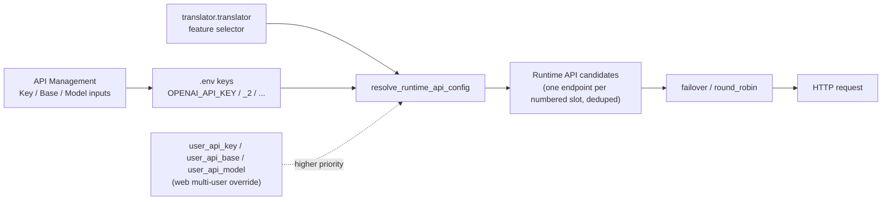

# API Credentials, Addresses, and Models

Use this page when you call remote APIs such as OpenAI, Gemini, or Sakura. It documents the three credential fields — key (Key), API address (Base), and model name (Model) — how they are stored in `.env`, how they are reused through numbered channels (`_2`, `_3`, …), and how the UI hides and masks them. This guide does not cover provider tabs, feature selectors, slot rotation, connection tests, custom request parameters, or presets; those are documented in [Provider tabs](./provider-tabs.md), [Feature selectors](./feature-selectors.md), [Slots and rotation](./slots-and-rotation.md), [Connection tests and model list](./connection-tests-and-model-list.md), [Custom request parameters](./custom-request-parameters.md), and [Presets and persistence](./presets-and-persistence.md).

## Configuration scope

- Key/Base/Model are the three fields of an “API slot” card: Key stores the secret, Base stores the request URL, and Model stores the model name. Each maps to its own `.env` key.
- Only the provider group activated by the current feature selector shows credential cards. OpenAI/Gemini use Key/Base/Model; Sakura has only an address and a dictionary path, with no Key or Model.
- `.env` is the only credential persistence location on desktop. `config.json` and `config/config-example.json` do not store API keys. The `user_api_key`/`user_api_base`/`user_api_model` fields are configuration overrides for the multi-user web scenario, not inputs on this page.
- Numbered suffixes such as `_2`, `_3` are candidate channels within the same provider, not new translators; switching translators is still driven by `translator.translator`.

## Use it in API Management

### Fill in credentials in API Management

1. Open “API Management” (`API Management`) in the left navigation. The page subtitle reads “Manage API keys and environment variables for each translator”.
2. Choose a tab: “Translation” (`Translation`), “OCR” (`OCR`), “Colorization” (`Colorization`), or “Render” (`Render`).
3. Each tab starts with a feature-selector row (label such as “Translator:”) and a “Test Current Tab” (`Test Current Tab`) button. Changing the selector refreshes the credential groups below; see [Feature selectors](./feature-selectors.md) for the exact boundary.
4. The active provider shows one or more “API slot” cards. Each card header starts with a drag handle, followed by a two-digit badge (for example `01`, `02`) and the “API slot” title; a delete button (`Delete`) sits in the top-right corner. The number appears only in the badge, not in the title text.
5. Each card lists three fields in order: Key (for example “OpenAI API Key”), Model (for example “OpenAI Model”), and Base (for example “OpenAI API Base”).
6. Secret inputs start masked (password echo mode). The inline eye icon toggles between “Show key” (`Show key`) and “Hide key” (`Hide key`).
7. The Key row has a “Test” (`Test`) button on the right, the Model row has a “Get Models” (`Get Models`) button, and the Base row has no button.
8. Clicking “+ Add API slot” (`+ Add API slot`) creates the next numbered channel (`_2`) for the current provider; the button hides once the UI limit is reached.
9. Hold the drag handle to change slot order; the complete Key/Model/Base group is rewritten to new consecutive indexes. Any field edit updates the in-memory value and `os.environ` immediately, then is coalesced over 250 ms and atomically rewritten to `.env` on a background thread.

## Numbered channel fields

The three fields of one provider can be numbered to form multiple candidate channels. Numbering starts at `1`, where `1` is the base key itself, and indexes `2` and above append `_<index>` to the key name:

- `OPENAI_API_KEY`, `OPENAI_MODEL`, and `OPENAI_API_BASE` form channel 1.
- `OPENAI_API_KEY_2`, `OPENAI_MODEL_2`, and `OPENAI_API_BASE_2` form channel 2, and so on.

- `get_indexed_env_key(base_key, index)` generates the numbered key: `index <= 1` returns the base key, otherwise it returns `f"{base_key}_{index}"`.
- `get_rotation_slot_count()` scans the current `.env` for all keys shaped like `<base>_<index>` and uses the highest index as the channel count; empty slots still render cards.
- The UI limit is `API_ROTATION_UI_MAX_SLOTS = min(10, MAX_ROTATION_SLOTS)`, where the engine-level `MAX_ROTATION_SLOTS` is `30`; once the limit is reached, the “+ Add API slot” button is hidden.
- “+ Add API slot” first writes empty values for the new index's three keys, then refreshes. Drag-reordering uses `_build_api_rotation_reorder_updates()` to rewrite each numbered Key/Model/Base group as one unit. Deleting a card calls `_delete_api_rotation_slot()`, which shifts all later slots forward to keep numbering consecutive, then deletes the last slot's keys.
- Each provider group also has a strategy key such as `OPENAI_API_ROTATION_STRATEGY` or `OCR_OPENAI_API_ROTATION_STRATEGY`, written by the “Rotation strategy:” dropdown; how the strategy orders requests is covered in [Slots and rotation](./slots-and-rotation.md).
- At runtime the resolver reads Key/Base/Model for indexes 1..channel count and drops duplicate endpoints whose `(api_key, base_url, model)` tuple is identical.

## Hiding and masking

- `_is_secret_env_key()` treats any key containing `API_KEY`, `AUTH_KEY`, or `TOKEN` as secret, for example `OPENAI_API_KEY`, `DEEPL_AUTH_KEY`, and `CAIYUN_TOKEN`.
- Secret fields use password echo mode (`QLineEdit.EchoMode.Password`). The inline eye icon toggles between “Show key” (`Show key`) and “Hide key” (`Hide key`); the tooltip text comes from the `Show Secret` / `Hide Secret` locale keys.
- The key and token placeholders are “Paste your key” and “Paste your token” respectively and never contain real values.
- `.env` is a plain-text local file located next to the packaged executable or at the project root in development. Never commit, export, or screenshot real keys. Presets may store API environment variables, but exported config JSON explicitly excludes API keys; see [Presets and persistence](./presets-and-persistence.md).

## How requests are handled

On startup, `ConfigService` reads `.env` into memory and loads it into `os.environ` (`load_app_dotenv(override=True)`). Every edit updates the in-memory value and `os.environ` immediately, is coalesced by a `QTimer` over 250 ms, and is then atomically rewritten to `.env` as `KEY="value"` lines on the “config-writer” background thread. Translators, OCR, colorizers, and renderers call `resolve_runtime_api_config()` in `parse_args()`, read environment variables per numbered slot, build candidate endpoints, and hand them to the `failover`/`round_robin` strategy for the actual HTTP request.

For OpenAI-compatible local endpoints (`localhost`, private IPs, `.local`, etc.), an empty key is normalized to the `ollama` placeholder so local services such as Ollama work without a key; non-local endpoints still require a real key.

## Credentials, network, and errors

- The feature selector decides which provider group is shown; changing the translator inside API Management writes the same `translator.translator` key and refreshes the required credential groups.
- With hybrid OCR (`ocr.use_hybrid_ocr`) enabled, the OpenAI/Gemini groups for the primary and secondary OCR may be shown at the same time.
- The Sakura group has only an address and a dictionary path; with no Key/Model there is no “Get Models” button, but “Test” still runs against the address.
- In the web scenario, `translator.user_api_key`/`user_api_base`/`user_api_model` and server-side `_runtime_api_overrides` take priority over `.env`; desktop mode has none of these overrides by default.
- The fields on this page are unrelated to custom request parameters (`config/custom_api_params.json`); the model name becomes the `model` field in the request body, and custom parameters match presets by model name.
- API keys are sent in HTTP request headers. If a key contains Chinese, full-width, or invisible characters, the desktop app stops before making a network request and reports their positions; copy a clean key from the provider instead of guessing by deleting characters.
- Inactive legacy environment variables (DeepL, Caiyun, Baidu, Youdao, Groq, DeepSeek, Together, etc.) are not shown in the UI, but their read logic remains in the code.
