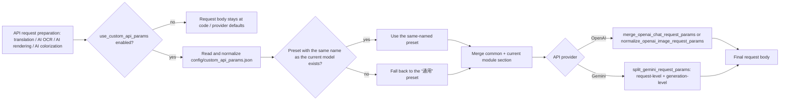
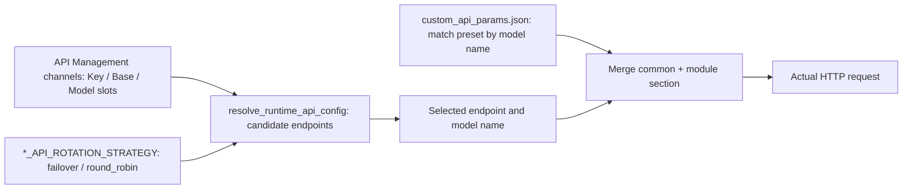

# Custom Request Parameters

When you need to attach extra request-body fields such as `temperature`, `top_p`, or `max_tokens` to translation, AI OCR, AI rendering, or AI colorization requests, this guide documents the file structure of `config/custom_api_params.json`, model-preset matching, how module sections merge into OpenAI/Gemini request bodies, and the boundary with `*_API_ROTATION_STRATEGY`. It does not cover connection credentials, model selection, or API channel rotation; see [API Credentials, Addresses, and Models](./credentials-addresses-models.md) and [Slots and rotation](./slots-and-rotation.md). The master switch lives in [Settings → General](../settings/general-and-app.md).

## Configuration scope

- `config/custom_api_params.json` is the extra-request-parameters file: it only appends fields to OpenAI/Gemini request bodies. It does not store connection credentials (Key/Base/Model live in `.env`), does not select a model, and does not participate in `*_API_ROTATION_STRATEGY` candidate rotation.
- The top-level boolean key `use_custom_api_params` decides whether the file is read; a legacy value stored at `translator.use_custom_api_params` is migrated to the top level on load.
- The file root is a “model preset” object. The default preset is literally named “通用”; that string is a stored value and is not translated with the UI language.
- Every preset contains exactly five sections: `common`, `translator`, `ocr`, `colorizer`, and `render`. At runtime only `common` plus the current API module's section are merged; sections of other modules never leak into the request.
- Presets are matched by the model name actually used by the request: a top-level preset with the same name wins; otherwise the “通用” preset is used as the fallback.

## Use it in API Management

### Open the custom-parameter editor {#open-editor}

1. Open “Settings” and select the “General” group.
2. Find the “Use Custom API Params” switch; it binds the top-level configuration key `use_custom_api_params`.
3. Click the inline “Edit” button to open the “Edit Custom API Params” dialog; if the file is missing, the backend creates the default file first.
4. The “Model Preset” combo at the top selects the preset being edited; “通用” is selected by default. Use “Add Preset”, “Rename”, or “Delete” for presets other than “通用”.
5. On the “Grouped API Params” tab, edit field rows per section tab: Key, Type, Value, and a Delete button. The type combo is fixed to String, Number, Boolean, Null, and JSON.
6. Or switch to the “Raw Edit” tab to edit the whole JSON file directly.
7. Click “Save” to write the file back; the status bar shows “Saved successfully”. JSON syntax or structure errors show the corresponding message and nothing is written.

## Parameters and options

> For the mapping of UI names, storage keys, and default values for this page's parameters, see the reference page [UI Options Reference](../../reference/options-i18n-matrix.md).

#### Use Custom API Params {#use-custom-api-params}

“Use Custom API Params” is a toggle on Settings → General. When enabled, each API module matches a parameter preset by the current model name and merges only `common` plus its own module section into the request body; when disabled, the request body stays at the code/provider defaults. When enabled, use the inline “Edit” button to open the “Edit Custom API Params” dialog. Default: `true`.

## The custom request parameters file (custom_api_params.json)

`config/custom_api_params.json` is the “custom request parameters” preset file: the app reads it by model preset and merges the fields into the request bodies of translation, AI OCR, AI colorization, and AI rendering. The file root is a JSON object whose keys are preset names. The default preset is literally named “通用” (that string is a stored value and is not translated with the UI language). To give one model its own parameters, add a top-level preset named after that model; requests using that model pick it first, and every other model falls back to “通用”.

Every preset contains five sections: `common`, `translator`, `ocr`, `colorizer`, and `render`. At runtime only `common` plus the section of the current module are merged — translation uses `translator`, AI OCR uses `ocr`, AI colorization uses `colorizer`, and AI rendering uses `render` — so sections of other modules never leak into a request. Top-level groups other than these five are not read by any module.

Sanitized example structure (no real keys or user data):

```json
{
  "通用": {
    "common": {},
    "translator": {
      "temperature": 0.3,
      "top_p": 0.95
    },
    "ocr": {
      "temperature": 0.0
    },
    "colorizer": {},
    "render": {}
  },
  "gpt-4o": {
    "common": {},
    "translator": {
      "temperature": 0.7,
      "max_tokens": 2048
    },
    "ocr": {},
    "colorizer": {},
    "render": {}
  }
}
```

### How to edit

- The recommended way is to open Settings → General, find “Use Custom API Params”, and click its inline “Edit” button. In the “Edit Custom API Params” dialog, use the “Model Preset” combo at the top to select a preset and add, rename, or delete presets; on the “Grouped API Params” tab add field rows per section (Key, Type, Value); or switch to the “Raw Edit” tab to edit the whole JSON directly.
- You can also edit the file with any text editor. If the file is missing, the app creates the default file automatically; existing content is never overwritten.
- Saves are written as UTF-8 with 2-space indentation; on JSON syntax or structure errors nothing is written and the editor shows the error message.
- Do not put API keys, tokens, or private prompts into this file: the values are sent verbatim into request bodies and may appear in logs or debug artifacts.

### Relationship with “Use Custom API Params”

The “Use Custom API Params” toggle (configuration key `use_custom_api_params`) decides whether this file is read. When enabled, each API module matches a preset by the model name actually used by the request — a same-named preset wins, otherwise it falls back to “通用” — and merges only `common` plus its own section. When disabled, the file is not read at all and request bodies stay at the code/provider defaults. A legacy value stored at `translator.use_custom_api_params` is migrated to the top level on load.

## How requests are handled

### Preset matching and merging {#preset-resolution}

Every API request resolves custom parameters in the following order:

1. `is_custom_api_params_enabled(config)` reads the top-level `use_custom_api_params`, falling back to the legacy `translator.use_custom_api_params`; when disabled it returns empty parameters immediately.
2. `load_custom_api_params_file()` reads and normalizes the file; invalid JSON logs an error and returns empty presets.
3. `resolve_custom_api_params_for_model()` takes the model name used by the request (leading/trailing whitespace stripped); a top-level preset with the same name is selected, otherwise the “通用” preset is used.
4. Merge = the preset's `common` + the current module section; `section` must be `translator` / `ocr` / `colorizer` / `render`, and any other value raises `ValueError`.
5. The consumer calls the provider-specific merge helper and writes the result into the final request body.



The model name comes from the API-management channels or translator defaults, not from this file; the same configuration may therefore match different presets on different models.

## Boundary with API rotation strategy {#rotation-boundary}



Custom parameters match a preset by the model name actually used in the current round; the model name itself comes from the endpoint selected by the channels and rotation, not from this file. Rotation changes the order and selection of candidate endpoints, not request-body fields; channel retries, cooldown, unavailability, and recovery never alter the already-merged custom parameters.

## Credentials, network, and errors

- Preset matching depends on the model name used by the request; the name comes from the API-management channels or translator defaults, so the same file may select different presets on different models.
- Custom parameters are unavailable on JSON syntax or structural errors: parsing failures are logged and empty presets are returned, and translation continues with default parameters.
- Ordinary retries, quality retries, and API channel rotation never modify the already-merged custom parameters; every request re-resolves, so the preset may change when the model name changes with rotation.
- Do not put API keys, tokens, or private prompts into this file: the values are sent verbatim into request bodies and may appear in logs/debug artifacts.
- The file is independent of context-page count, prompt files, RPM, and the streaming switch; those control different dimensions of a request, see the translator and settings pages.
- In web mode `use_custom_api_params` is a server-side key and is not shown in the web user configuration interface.
