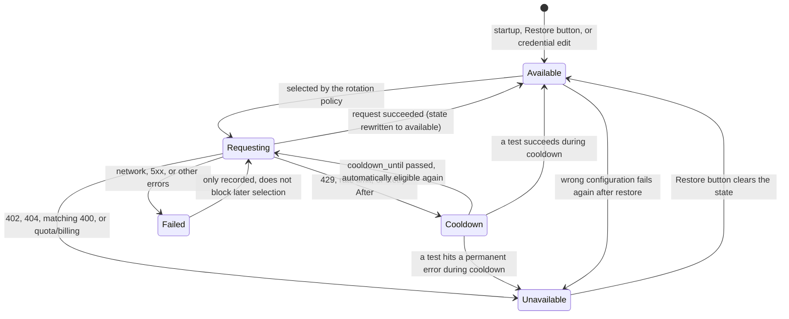
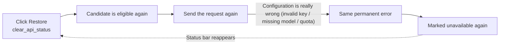

# Failures, Cooldown, and Recovery

When a request to an API candidate channel (a numbered slot used by translation, OCR, colorization, or rendering) fails, the program keeps an in-memory status for that candidate and uses it to decide whether later requests may still select it. This guide documents the state machine after a failure — cooldown, unavailability, recovery to available, and why a wrong configuration fails again after being restored — and lists the cooldown and timeout parameters.

This guide does not cover adding/deleting slots, numbering badges, or the two rotation policies (see [API Slots and Rotation](./slots-and-rotation.md)), the connection-test dialogs (see [Connection Tests and Model List](./connection-tests-and-model-list.md)), or the full parameters of ordinary request retries (see [Retries, Rate Limits, and Quality](../translator/retry-rate-limit-and-quality.md)).

## Configuration scope {#feature-boundary}

- This guide covers per-candidate endpoint status: each candidate is identified by feature, provider, slot, base URL, model, and a key fingerprint; the status lives in memory and is never written to `.env` or `config.json`.
- Only rate-limit errors enter “Cooling down”, and only permanent errors enter “Unavailable”; every other error is recorded as “Failed” and does not prevent the candidate from being selected again.
- The state machine applies to the translation, OCR, colorization, and rendering API groups alike, because all four consumers call the same rotation entry point `run_with_api_candidates`.
- Status is process-local: restarting the app or editing Key/Base/Model (which changes the status identity) invalidates old state; clicking the “Restore” (`Restore`) button on a card actively clears one candidate’s state.

## UI status and operations {#ui-status-and-operations}

Open “API Management” (`API Management`). A status bar appears below the title of a slot card. The bar appears only for “Cooling down” or “Unavailable”; an ordinary “Failed” state shows no bar. The “Restore” (`Restore`) button on the right calls `clear_api_status` and only clears the in-process failure state; it never edits any `.env` value.

1. Use “Test Current Tab” (`Test Current Tab`) or the inline “Test” (`Test`) button to verify a channel. A successful test marks the candidate available; a failed test enters cooldown, unavailability, or a plain failure record depending on the error type.
2. A cooling-down candidate is automatically considered again after its cooldown expires; an unavailable candidate stays excluded until you click Restore or edit the credentials.
3. Before starting a translation, the app runs a candidate-availability check: if every candidate of a required feature group is unavailable, startup is blocked with “No available API candidates” (`No available API candidates`), the details list the affected channels, and the suggestion is to re-enable the matching key/channel or use “Test Current Tab” before starting.

The status bar text distinguishes only “Cooling down” and “Unavailable”; the remaining cooldown time is not shown in the UI.

## State machine: cooldown, unavailability, recovery, and re-failure {#state-machine}

- **Available**: no status record, or the last request/test succeeded. The candidate may take part in later selection.
- **Cooldown**: the status record contains `cooldown_until`; until that time `is_endpoint_unavailable` returns true and the candidate is skipped. After expiry it becomes eligible again automatically, but the state field still reads “Cooldown” until the next success rewrites it to “Available”.
- **Unavailable**: a permanent error; excluded for the whole process until `clear_api_status` (the Restore button), a credential edit, or an app restart.
- **Failed**: other errors only record `last_error`; they do not affect later selection, and the same candidate may be picked again by the next request.
- **Requesting**: the candidate was selected and an actual request is sent; success, rate limit, permanent error, or ordinary error rewrite the state to the corresponding state above.

`run_with_api_candidates` builds the candidate list once at the start of a call via `iter_api_candidates`: unavailable or cooling-down candidates are filtered out from the beginning, so the state machine mainly affects the *next* request, not the one currently running.

## Cooldown and timeout parameters {#cooldown-and-timeout-parameters}

There is **no settings control for the cooldown duration**; it is decided entirely by the server response and code constants. The only related UI setting is the ordinary retry count on the same candidate (`cli.attempts`).

“Ordinary retries” (`cli.attempts`), “Cooldown”, and “Unavailable” are three different layers: ordinary retries run inside the same candidate, while cooldown and unavailability decide whether later requests select the candidate at all. Do not mistake the ordinary retry count for the cooldown duration.

## What makes a candidate available again {#recovery-conditions}

| Recovery path | Trigger | Effect | Note |
| --- | --- | --- | --- |
| Cooldown expires | `cooldown_until` has passed | The candidate is automatically eligible again | The state field still reads “Cooldown” until the next success rewrites it to “Available” |
| Request/test succeeds | `record_api_success` | State rewritten to “Available” | Any successful request or connection test triggers this |
| Manual restore | Click “Restore” (`Restore`) on the status bar | `clear_api_status` deletes the status record | Clears state only; never edits Key/Base/Model |
| Credential edit | Edit Key/Base/Model | Status identity changes, old state no longer applies | For example a new key is not affected by the old “Unavailable” record |
| App restart | Quit and relaunch the app | All state is cleared | `_API_STATUS` and the status secret are process-random |

## When the configuration itself is wrong: it fails again after restore {#refailure-after-recovery}

The Restore button, a credential edit, or an app restart only clears the **status record**; they do not fix the connection information in `.env`. If the failure is real (invalid key, missing model, exhausted quota, or billing error), the next request fails with the same error, the candidate is marked “Unavailable” again, and the status bar reappears. Cooldown expiry is the same: cooldown is only a temporary skip and does not mean the candidate became healthy; if the server is still rate limiting, the candidate enters “Cooldown” again.

So the debugging order is: first confirm that the key, address, and model are actually correct, then click Restore and run “Test Current Tab”; do not use repeated Restore clicks as a substitute for fixing the configuration.

## Credentials, network, and errors {#dependencies-and-conflicts}

- Cooldown/unavailable state is kept per `feature:provider` group: a translation cooldown does not affect OCR, colorization, or rendering groups, and vice versa.
- Status only affects candidate selection; it never changes the translator implementation (`translator.translator`) and is not used by `translator_chain`. See [Feature Selectors](./feature-selectors.md) and [Translation Chaining](../translator/translation-chain.md) for the boundary.
- Ordinary retries, HQ/quality retries, region retries, and API candidate switching are four different mechanisms; do not conflate them. Ordinary retries are fully documented in [Retries, Rate Limits, and Quality](../translator/retry-rate-limit-and-quality.md).
- Test results share the same `_API_STATUS` as real requests: a failed test marks the candidate cooling down or unavailable, so later real requests also skip it (until restored).
- In the web/server scenario, `_runtime_api_overrides` fixes the candidate list to a single endpoint with `failover`; there is no multi-candidate rotation, but that single endpoint still records cooldown/unavailable state. The desktop app has no such overrides by default.
