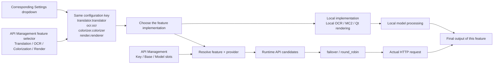
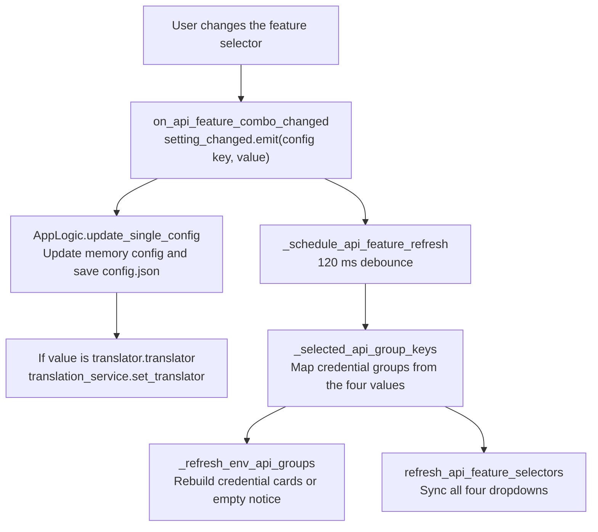

# Feature Selectors

Use the feature selector at the top of each API Management tab when you need to switch the translation, OCR, colorization, or rendering implementation without leaving the page. These selectors are not a separate "API configuration": they write directly to the same configuration key as the corresponding feature, so changing "Translator" here from OpenAI to Gemini really switches the translator and immediately refreshes the credential groups required by the current tab.

This guide documents which configuration key each of the four feature selectors writes, how a change refreshes the credential groups, and how a selection actually changes the feature implementation. Detailed differences between translation implementations are in [Translator selection and target languages](../translator/selection-and-languages.md); candidate slots and rotation strategies are in [Slots and rotation](./slots-and-rotation.md); credential-field editing and connection tests are in [Credentials, addresses, and models](./credentials-addresses-models.md) and [Connection tests and model list](./connection-tests-and-model-list.md) respectively.

## Configuration scope {#feature-boundary}

- The "Translation", "OCR", "Colorization", and "Render" tabs in API Management each have a feature selector at the top, bound to `translator.translator`, `ocr.ocr`, `colorizer.colorizer`, and `render.renderer` respectively.
- Difference from "translator selection": the "Translator" dropdown on the Settings "Translation" tab and the translator dropdown at the top of the API Management translation tab write the same `translator.translator` key and share the same options and display mapping. Changing "Translator" in API Management therefore really changes the translation implementation and refreshes the required credential groups; it does not only change connection information.
- Difference from "API candidate slot rotation": Key/Base/Model slots with `failover`/`round_robin` only pick request endpoints inside the already selected implementation, handling retries, cooldown, unavailability, and recovery; they never change the implementation itself.
- `translator_chain` feeds one translator's output into the next translator; it is unrelated to these four selectors.

## Use it in API Management {#ui-operations}

### Switch feature implementations in API Management {#api-tab-selectors}

1. Open “API Management”. The page header shows the title and description, followed by four tabs: “Translation”, “OCR”, “Colorization”, and “Render”.
2. Each tab has one feature-selector row at the top: a label on the left, a dropdown in the middle, and a “Test Current Tab” button on the right.
3. Choose a new value in the dropdown. The selection immediately writes the corresponding configuration key and saves it to `config/config.json`; after a debounce of about 120 ms the tab's credential groups are refreshed and all four selectors are re-synced.
4. When you select an implementation that needs an API (for example OpenAI/Gemini translation, AI OCR, AI colorization, or AI rendering), the tab shows the matching Key/Base/Model slots; local or no-API implementations show a notice card such as “The current translator does not require an OpenAI/Gemini API key.”
5. Click “Test Current Tab” to run connection tests against every configured candidate slot on that tab; the test target is derived from the current selector value and the environment-variable prefix. See [Connection tests and model list](./connection-tests-and-model-list.md) for the full flow.

## Feature-selector parameters {#parameters}

> For the mapping of UI names, storage keys, and default values for this page's parameters, see the reference page [UI Options Reference](../../reference/options-i18n-matrix.md).

#### Translator {#translator-translator}

The “Translator” dropdown is at the top of the API Management translation tab and is the first row of the Settings “Translation” group. Options: OpenAI, OpenAI High Quality, Google Gemini, Gemini High Quality, Sakura, None, Original. Selecting a value immediately writes the configuration and really switches the translation implementation; API-based options show the corresponding credential group on the tab. Default: `openai`. See [Translator Selection and Target Languages](../translator/selection-and-languages.md) for details.

#### OCR Model {#ocr-ocr}

The “OCR Model” dropdown is at the top of the API Management OCR tab and in the “OCR” group in Settings. The options show stored values directly: 32px, 48px, 48px_ctc, mocr, paddleocr, paddleocr_korean, paddleocr_latin, paddleocr_thai, paddleocr_vl, openai_ocr, gemini_ocr. The first nine are local OCR engines; openai_ocr and gemini_ocr use OpenAI/Gemini vision requests and require the corresponding credential group. Default: `48px`. See [OCR, Filtering, and Text-Line Merging](../settings/ocr-filter-and-merge.md) for details.

#### Colorization Model {#colorizer-colorizer}

The “Colorization Model” dropdown is at the top of the API Management colorization tab and in the colorization group in Settings. Options: None (no colorization), Manga Colorization v2 (local), OpenAI Colorizer, Gemini Colorizer. The OpenAI/Gemini colorizers require the corresponding credential group. Default: `none`. See [Upscale and Colorization](../settings/upscale-and-colorization.md) for details.

#### Renderer {#render-renderer}

The “Renderer” dropdown is at the top of the API Management render tab and in the typesetting/rendering group in Settings. Options: Default, OpenAI Renderer, Gemini Renderer, None. The OpenAI/Gemini renderers require the corresponding credential group, skip inpainting, and use the original image as the render base; “None” outputs the base image directly without typesetting rendering. Default: `default`. See [Typesetting and Rendering](../settings/typesetting-and-rendering.md) for details.

## How requests are handled {#runtime-behavior}

### From selector to implementation {#selector-to-implementation}

All four selectors share the same chain: the configuration value is handed to the registry of the corresponding feature, which decides between API candidates and a local model. Only OpenAI/Gemini-style implementations require credential resolution; local models (such as 32px OCR, MC2, or the Default renderer) do not go through candidate resolution.

`translator_chain` chains one translator's output to the next translator during the translation stage; it does not participate in endpoint rotation and does not write any of these four keys.

### Credential-group refresh linkage {#credential-group-refresh}

After a feature-selector change, the UI first writes the configuration and then uses a 120 ms debounce to merge two refreshes — credential-group rebuild plus selector sync — so that rapid switching does not rebuild widgets repeatedly.

`_selected_api_group_keys(config)` reads the four configuration values and returns the credential groups to show on each tab — for example `translator_openai` when the translator is `openai`/`openai_hq`, or `ocr_openai` when OCR is `openai_ocr`. `_refresh_env_api_groups` then rebuilds the Key/Base/Model slots of the current tab; implementations without an API requirement show a "No … API required" empty notice. Changing any of `translator.translator`, `ocr.ocr`, `ocr.secondary_ocr`, `ocr.use_hybrid_ocr`, `colorizer.colorizer`, or `render.renderer` in Settings also calls the same refresh function after about 100 ms, so Settings changes update the API Management credential groups as well.

### Synchronization with translator selection {#translator-selector-sync}

- The "Translator" dropdown on the Settings "Translation" tab and the translator dropdown at the top of the API Management translation tab bind to the same `translator.translator` key and share the same `get_options_for_key("translator")` / `get_display_mapping("translator")` source.
- Either place writes back the configuration and calls `translation_service.set_translator()` when the key is `translator.translator`; that is why "changing the translator in API Management really switches the translator".
- API candidate slot rotation does not write this key; it only affects request endpoints inside the selected implementation. `translator_chain` does not write this key either.

## Credentials, network, and errors {#dependencies-and-conflicts}

- The four selectors share configuration keys with the corresponding Settings dropdowns; they are not independent settings, the last change wins, and there is no "API page overrides Settings page" priority.
- Credential values live in `.env` (or runtime overrides), not in these four keys; see [Credentials, addresses, and models](./credentials-addresses-models.md).
- With hybrid OCR enabled, the OCR tab also considers an AI engine in `ocr.secondary_ocr` and shows its credential group; the `ocr.ocr` selector represents only the primary OCR.
- When `render.renderer` is `openai_renderer`/`gemini_renderer`, inpainting is skipped and the original image is used as the render base; `none` skips typesetting rendering entirely.
- `sakura` translation needs no Key/Model slots, only `SAKURA_API_BASE` and a dictionary path.
- Switching implementations does not reset that feature's request parameters, custom parameters, or prompts; those belong to the corresponding feature pages.
