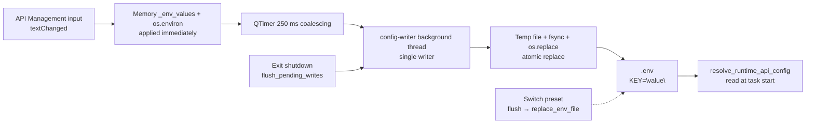

# Presets and Persistence

Use this page when you want to switch whole groups of API credentials between different service configurations, or when you need to know exactly when the Key/Base/Model fields in API Management are written to disk. It documents how `.env` is read and written (`config_service.py`), how API presets (`PresetService`) are added, switched, and deleted, how configuration is reloaded or restored, and the masking boundaries for export, import, screenshots, and reports. The Key/Base/Model fields themselves are covered in [API credentials, addresses, and models](./credentials-addresses-models.md); numbered channels and rotation strategies are covered in [Slots and rotation](./slots-and-rotation.md).

## Configuration scope

- `.env` is the only credential persistence location on desktop: the Key/Base/Model fields, numbered channels, and rotation strategies in API Management are all written to `.env`; `config/config.json` and `config/config-example.json` do not store API keys.
- An API preset is a whole-group snapshot of `.env` environment variables, saved as a flat JSON file at `presets/<name>.json`; `app.current_preset` in `config.json` only records the currently selected preset name (default `"默认"`) and does not duplicate the preset contents.
- Applying a preset replaces `.env` wholesale: only the keys contained in the preset are kept, and keys in `.env` that are not in the preset are removed. This is not an incremental merge.
- This guide covers adding, deleting, and switching presets; automatic `.env` saving (250 ms debounce plus atomic background writes); reloading and exit-time flushing; and the credential-masking boundary when exporting or importing configuration.
- This guide does not cover: Key/Base/Model inputs and masking (see [API credentials, addresses, and models](./credentials-addresses-models.md)), numbered-slot add/delete and rotation strategies (see [Slots and rotation](./slots-and-rotation.md)), failures, cooldown, and recovery (see [Failures, cooldown, and recovery](./failures-cooldown-and-recovery.md)), connection tests and the model list (see [Connection tests and model list](./connection-tests-and-model-list.md)), or the “model presets” in custom request parameters (see [Custom request parameters](./custom-request-parameters.md)).

## Use it in API Management

### Manage presets in API Management

1. Open “API Management” (`API Management`) in the left navigation. Below the page subtitle “Manage API keys and environment variables for each translator” is the global preset toolbar, which applies to all four tabs — Translation, OCR, Colorization, and Render — at the same time.
2. The preset toolbar has three parts: the label “Preset:” (`Preset:`), a read-only dropdown, and the `+` (add new preset) and “Delete” (`Delete`) buttons. The button hints come from “Add new preset” (`Add new preset`) and “Delete selected preset” (`Delete selected preset`).
3. Clicking `+` opens the “Add Preset” (`Add Preset`) dialog, which asks for “Enter preset name:” (`Enter preset name:`). An empty name warns “Preset name cannot be empty” (`Preset name cannot be empty`); a duplicate name asks “Preset '{name}' already exists. Overwrite?” (`Preset '{name}' already exists. Overwrite?`). A new preset is blank by default: it contains every known API environment-variable key with empty values and does not copy the current `.env` contents.
4. Selecting another preset in the dropdown starts a switch: pending unsaved writes are flushed first, the current `.env` values are saved back into the old preset, the new preset replaces `.env` wholesale, and finally all inputs and placeholders are refreshed from the new values.
5. Clicking “Delete” (`Delete`) first asks “Are you sure you want to delete preset '{name}'?” (`Are you sure you want to delete preset '{name}'?`). After confirmation the file `presets/<name>.json` is removed and “Preset deleted successfully” (`Preset deleted successfully`) is shown.

### Export and import configuration in Settings

1. Open “Settings” (`Settings`). The header on the right contains “Export Config” (`Export Config`) and “Import Config” (`Import Config`) buttons.
2. Export writes the current settings as JSON while excluding the `app` section and `cli.verbose`; because API keys live only in `.env`, the exported file contains no credentials, and the dialog says “Sensitive information like API keys are not included.” (the exact display text follows the current locale).
3. Import deep-merges the selected JSON into the current settings, preserves the current `app` section, and never writes `.env`; the dialog says “Your API keys and sensitive information have been preserved.”, so existing API keys are unaffected.
4. After a successful import, the `config_loaded` signal is emitted, the Settings page is rebuilt and the description panel refreshes; API credentials in `.env` are not rewritten by the import.

## How requests are handled

### Startup load

`ConfigService.__init__` first determines the `.env` path: next to the executable in packaged builds, and in the project root during development, then stores it in `MANGA_TRANSLATOR_ENV_PATH`. It reads `.env` into the in-memory `_env_values` with `read_dotenv_file()`, then calls `load_app_dotenv(override=True)` to load every key into `os.environ`, overriding same-named variables.

`PresetService.__init__` ensures the `presets/` directory exists and creates the default preset `默认.json` if missing: every known API key is empty, with `OPENAI_API_BASE=https://api.openai.com/v1` and `OPENAI_MODEL=gpt-4o`. Configuration is loaded with priority: user config `config/config.json` > default config `config/config-example.json` > code defaults; `app.current_preset` locates the current preset at startup and on rebuild.

### Editing, debounce, and atomic writes

An input’s `textChanged` → `_debounced_save_env_var` → `env_var_changed` signal → `MainAppLogic.save_env_var` → `ConfigService.save_env_var`. `save_env_vars` updates the in-memory `_env_values` and `os.environ` immediately, validates keys (`validate_env_key`), and strips leading/trailing whitespace; the disk write is coalesced by a 250 ms single-shot `QTimer` (`SAVE_DEBOUNCE_MS = 250`), so continuous typing produces only one write.

When the timer fires, `_write_snapshots` runs on a single-writer `ThreadPoolExecutor(max_workers=1)` named `config-writer`: `_merge_dotenv_updates` preserves untouched lines in `.env` (including comments and original formatting), rewrites only changed keys, and appends new ones; the file is then replaced atomically via a temp file plus `os.replace`, after `fsync`. Deleting keys (`delete_env_vars`) marks the value as `None`, removes the line on rewrite, and deletes the key from memory and `os.environ`. A failed write emits the `write_failed` signal, and subsequent saves automatically switch to a full-file replacement to restore consistency.

### Preset switching and full replacement

`load_preset` reads `presets/<name>.json` and normalizes it (fills in every known API key and keeps extra custom keys), then calls `replace_env_file`. `replace_env_file` replaces `.env` wholesale with the preset contents: the in-memory `_env_values` becomes exactly the preset key set, old keys not in the preset are removed from `os.environ`, and the pending disk write is marked as a full-file replacement. Before switching, `flush_pending_writes()` runs so that debounced edits land on disk first and are then saved into the old preset.

### Reload and exit-time flushing

`reload_config()` forces a complete reload: it flushes pending writes, reloads `.env` into `os.environ`, rebuilds `AppSettings`, reloads configuration with priority, and finally emits `config_changed` so the UI rebuilds; `reload_from_disk()` only reloads configuration from the current `config_path`. Before starting a translation, pending writes are drained (`_flush_all_pending_env_vars`); `flush_pending_writes()` stops the timer, submits, and waits for all writes to finish. On exit, `main.py` calls `ConfigService.shutdown()`, which flushes pending writes and then stops the writer thread, so no 250 ms pending content is lost.

The diagram above only describes the write lifecycle for credentials and presets. Empty keys, local empty-key placeholders, numbered slots, and rotation-candidate resolution are covered in [API credentials, addresses, and models](./credentials-addresses-models.md) and [Slots and rotation](./slots-and-rotation.md); `config.json` shares the same 250 ms debounce and writer thread, but the settings fields themselves are out of scope here.

## Masking and file safety

- `.env` and `presets/*.json` store real credentials in plaintext, and both are ignored by `.gitignore`; never commit, screenshot, or paste any line, whole file, or screenshot from them into a repository or public report.
- Inputs whose key contains `API_KEY`, `AUTH_KEY`, or `TOKEN` use password echo and an eye icon to toggle “Show key”/“Hide key”; showing a key is a UI behavior only and does not make files or logs safe.
- “Export Config” excludes the `app` section and `cli.verbose`, and `config.json` itself contains no API keys, so the exported file has no credentials; “Import Config” never writes `.env`, so existing API keys are preserved.
- Switching presets saves the current `.env` values into the old preset, so preset files you create or update can accumulate real keys over time; this page never displays preset contents or real key values.

## Credentials, network, and errors

- `.env`, `presets/*.json`, `config/config.json`, and `config/custom_api_params.json` have different roles: credentials/environment variables, preset snapshots, UI settings, and request-body parameters. Switching presets affects only `.env`; importing configuration affects only `config.json`; the “model presets” in `custom_api_params.json` are unrelated to the API presets on this page (see [Custom request parameters](./custom-request-parameters.md)).
- Applying a preset replaces `.env` wholesale, so keys you added by hand or keys unknown to the preset are deleted when it is applied; do not hand-edit the same file while the app still has pending writes.
- In the multi-user web scenario, overrides such as `translator.user_api_key`/`user_api_base`/`user_api_model` take priority over `.env` (see [API credentials, addresses, and models](./credentials-addresses-models.md)); desktop mode has none of these overrides by default.
- Preset names are sanitized by `_sanitize_filename` (`< > : " / \ | ? *` become `_`); the preset dropdown only lists `*.json` files under `presets/` with the suffix removed.
- Exit-time `shutdown` only guarantees that already-submitted writes finish; it does not re-read the inputs, because normal typing has already been committed to memory by the 250 ms debounce.
