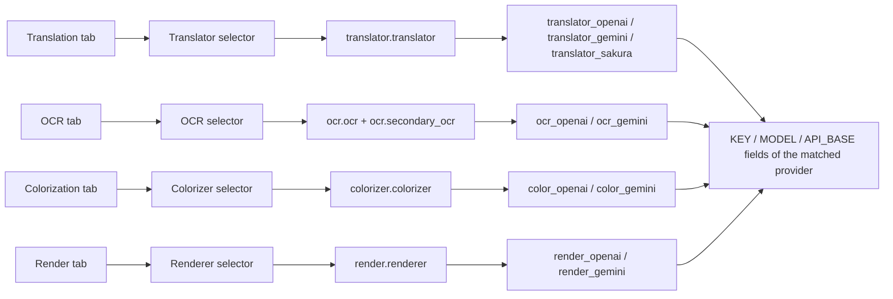

# API Management Tabs and Provider Fields

Use this page when you need to configure the API credentials used separately by translation, OCR, colorization, and rendering. Open “API Management” (`API Management`): the page is split into four feature tabs, one per feature. Each tab shows that feature’s selector at the top and only the credential field group of the currently selected provider below it.

This guide covers the layout and switching of the four tabs and which provider’s field group each tab shows. For the full options and write behavior of the feature selectors, see [Feature selectors](./feature-selectors.md); for the meaning of the Key/Base/Model fields, see [Credentials, addresses, and models](./credentials-addresses-models.md); for candidate slots and rotation, see [API slots and rotation](./slots-and-rotation.md); for connection tests and the model list, see [Connection tests and model list](./connection-tests-and-model-list.md).

## Configuration scope

- API Management always contains four tabs with the route keys `env_translation`, `env_ocr`, `env_colorization`, and `env_render`, mapping to the translation, OCR, colorization, and rendering features.
- Each tab has a feature-selector dropdown at the top that writes to `translator.translator`, `ocr.ocr`, `colorizer.colorizer`, and `render.renderer` respectively; the OCR tab also reads `ocr.secondary_ocr` when hybrid OCR is enabled.
- A tab is only a navigation container: clicking a tab switches the stacked page on the right and does not change any configuration. Only the feature selector inside a tab writes configuration.
- The provider groups shown by a tab are decided by the current value of that feature selector; when no API provider matches, the tab shows a “no API required” empty state instead of credential cards.
- Translator selection, API feature selectors, and API candidate-slot rotation are three different boundaries: this page and [Feature selectors](./feature-selectors.md) cover the tabs, selectors, and field groups; translator implementation selection via `translator.translator` is covered by [Translator selection](../translator/selection-and-languages.md); slot rotation is covered by [API slots and rotation](./slots-and-rotation.md).

## Use it in API Management

### Open API Management and switch tabs {#open-and-switch-tabs}

1. Choose “API Management” (`API Management`) in the left navigation. Below the title the subtitle reads “Manage API keys and environment variables for each translator”, and below the subtitle is the global API preset toolbar (the “Preset:” dropdown, “Add new preset”, and “Delete selected preset” buttons). Adding, deleting, and loading presets is covered by [Presets and persistence](./presets-and-persistence.md).
2. Click “Translation”, “OCR”, “Colorization”, or “Render” in the tab bar to switch tabs; the page opens on the “Translation” tab by default.
3. Switching tabs does not save or discard any input and does not change any configuration key; the credential fields of the four tabs are independent.

### Feature-selector row inside each tab {#feature-selector-row}

Each tab contains one section card whose first row is a fixed “feature-selector row”: a label on the left, a dropdown in the middle, and a “Test Current Tab” button on the right. The labels and the configuration keys written by the four tabs are listed below; the dropdown options reuse the same enum values and display mapping as the Settings page, and a change is written to the matching configuration key immediately and refreshes the field groups.

“Test Current Tab” runs a batch connection test over all configured keys of the current tab’s feature only; see [Connection tests and model list](./connection-tests-and-model-list.md).

### Provider field groups and the empty state {#provider-groups-and-empty-state}

- Every provider matched by the selector gets one credential card. OpenAI/Gemini cards contain a “Rotation strategy:” dropdown, numbered slot cards (Key, Model, and Base fields), and a “+ Add API slot” button; Sakura is a simplified two-field card (address and dictionary path) with no rotation strategy or slots.
- Each slot card starts with a drag handle, followed by a two-digit badge (for example `01`) and the fixed “API slot” title; field labels inside the card carry no index. Indexed names such as “OpenAI API Key #2” are used in batch-test result lists. Dragging reorders the complete Key/Model/Base candidate group.
- Secret fields (API Key / AUTH Key / Token) are masked by default and can be toggled with the eye button (“Show key” / “Hide key”); every key row has a “Test” button on its right and every model row has a “Get Models” button.
- When the current selector value needs no OpenAI/Gemini credentials (for example translator `none`/`original`, OCR `48px`, colorizer `none`, or renderer `default`), the card area shows the matching “no API required” hint and renders no credential fields.

## Tab structure {#tab-structure}

The diagram below shows the fixed mapping “tab → feature selector → config key → provider field groups”; OpenAI/Gemini groups display the KEY / MODEL / API_BASE field columns.

## How tabs relate to feature selectors {#tab-selector-relationship}

- A tab represents a feature; the feature selector represents the implementation/provider currently chosen for that feature. Together they decide which field group is rendered below the tab.
- When a selector changes, the UI emits `setting_changed` (with the config key and the stored value) and then rebuilds the field groups of the four tabs and re-populates all selectors through a 120 ms debounce timer.
- The selectors of all four tabs read the same configuration: after `translator.translator`, `ocr.ocr`, `colorizer.colorizer`, or `render.renderer` is changed on the Settings page or in the editor, returning to API Management rebuilds the field groups from the new value.
- The OCR tab is special: with hybrid OCR enabled, the primary OCR (`ocr.ocr`) and the secondary OCR (`ocr.secondary_ocr`) can each be `openai_ocr`/`gemini_ocr`, so both provider groups can appear in the same tab at the same time.
- When no provider matches, the tab shows the “no API required” empty state (see the three-column table above) instead of a blank or broken state.

## Credentials, network, and errors

- Switching tabs does not write configuration; only the feature selectors and the field editors do. Merely viewing a tab never changes a setting.
- Credential fields are `.env` keys; edits enter memory immediately and are flushed on the shared save cadence. Field groups are rebuilt from the current selector value, so a provider group that is not selected is not displayed even if its `.env` keys contain values.
- A selector on this page and the Settings page share the same configuration key: they are two edit entry points for the same setting, not two independent configurations.
- Sakura translation has no Key/Model/Base slot cards, only the address and dictionary path; the “Rotation strategy:” dropdown and “+ Add API slot” appear only in OpenAI/Gemini groups.
- Cooldown/unavailable/recovery markers are slot state; see [Failures, cooldown, and recovery](./failures-cooldown-and-recovery.md). This guide does not expand on rotation internals.
