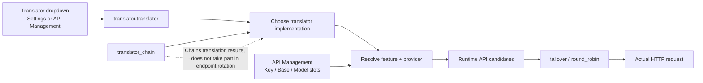
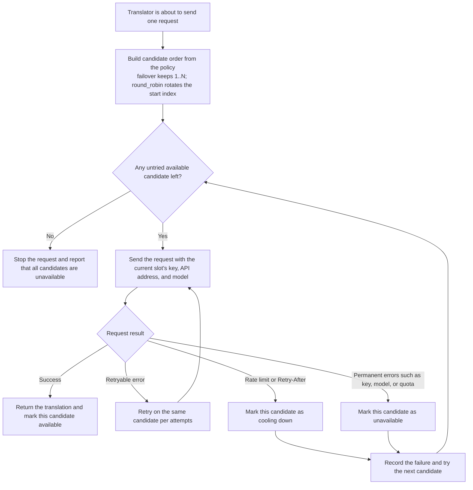

# API Slots and Rotation

Use this page when a set of API keys often hits rate limits, or when you use the official address and compatible services at the same time. You can add multiple API slots for the same provider; each slot stores one key, API address, and model. The translator stays the same — only the API candidate used by the next request changes.

This guide covers adding, deleting, drag-reordering, numbering badges, and the two rotation policies of candidate slots, and how they form the runtime candidate list. Switching between the OpenAI and Gemini translators is covered by [Translator selection](../translator/selection-and-languages.md); `translator_chain` is covered by [Translation chaining](../translator/translation-chain.md). For the tab layout see [API management tabs and provider fields](./provider-tabs.md); for the Key/Base/Model fields and `.env` key mapping see [Credentials, addresses, and models](./credentials-addresses-models.md); for the full cooldown/unavailable/recovery behavior see [Failures, cooldown, and recovery](./failures-cooldown-and-recovery.md); for connection tests see [Connection tests and model list](./connection-tests-and-model-list.md).

## Configure backup APIs in the UI {#configure-api-slots}

Open “API Management” (`API Management`) and choose the feature tab that uses an API, for example “Translation”. The feature selector at the top decides whether the current implementation is OpenAI, Gemini, or something else; the API slots below only configure the connection information used by that implementation.

Using OpenAI translation as an example, each slot card shows the following three fields. When you switch to Gemini, OCR, colorization, or rendering, the fields change to the i18n labels of the matching feature and provider.

The far left of each slot header is a drag handle, followed by a two-digit badge (for example `01`) and the “API slot” title. The number appears only in the badge, not in the title text.

1. Fill in “OpenAI API Key”, “OpenAI Model”, and “OpenAI API Base” on the `01` “API slot” card.
2. Click “+ Add API slot” (`+ Add API slot`) to create a second candidate. The three `.env` keys of the new slot are first written as empty values, then the UI refreshes.
3. Fill in complete connection information on the `02` “API slot”. Empty slots do not become valid candidates (except for local OpenAI-compatible endpoints, where an empty key is normalized to the `ollama` placeholder value).
4. Hold the move icon at the far left of a card header and drag the card above or below another card. The insertion line previews the new position; on release the complete Key/Model/Base group is rewritten to consecutive slot indexes, so ordered failover immediately follows the new order.
5. In the “Rotation strategy:” (`Rotation strategy:`) dropdown, choose “Ordered failover” (`Ordered failover`) or “Round robin” (`Round robin`).
6. Use “Test Current Tab” (`Test Current Tab`) to confirm that at least one candidate can connect.

“Test Current Tab” only tests every configured slot of the current feature tab (concurrency 3) and does not test other tabs; the result dialog shows “{total} total, {available} available, {unavailable} unavailable” and marks each slot as available, cooling down, or unavailable, refreshing the status bar on the matching card. If the current feature has no slot to test, the UI shows “No API channels to test”.

Drag-reordering moves complete slots only: it never separates Key/Model/Base and does not change the rotation policy or other feature tabs. When you delete a middle slot, later slots move forward so numbering stays consecutive and the deleted slot's `.env` keys are removed. The UI caps the number of slots at 10 (`API_ROTATION_UI_MAX_SLOTS = min(10, 30)`); the “+ Add API slot” button is hidden once the cap is reached.

## What is the difference between the two rotation policies {#rotation-strategies}

With only one valid slot, the two policies behave almost identically. Round robin never splits one translation across multiple models and never changes the translator mid-request.

## Candidate resolution and rotation call graph {#candidate-resolution}

The call graph below puts this page together with translator selection, the feature selectors, and the `translator_chain` boundary: the Key/Base/Model slots in API Management only take part in “resolve feature + provider” and the construction of the candidate list; rotation happens inside the already-selected provider, and only then is an HTTP request sent.

At runtime, `resolve_runtime_api_config()` builds the candidates in the following order:

- It first reads the strategy key of the current feature/provider (for example `OPENAI_API_ROTATION_STRATEGY`) and the numbered `.env` keys such as `_2`, `_3`, to obtain the slot count and the policy.
- For each number `1..N` it reads Key, Base, and Model; all three fields must be present (the Key may be empty for local OpenAI-compatible endpoints) for a candidate endpoint to be created, and fully duplicated `(key, base_url, model)` endpoints are removed.
- Only the provider group activated by the current feature selector appears in the UI and the candidate pool; the value of `translator.translator` decides which implementation sends the final request.
- In the web multi-user case, when `user_api_key`/`user_api_base`/`user_api_model` exist as configuration overrides, the resolver builds a single candidate endpoint and fixes the policy to `failover`; numbered-slot rotation does not participate.

## How one request picks a candidate {#candidate-selection}

The system first performs ordinary request retries inside the current candidate; only when the current candidate can no longer be used does it choose the next slot according to the rotation policy. Therefore the “retry count” (`cli.attempts`, see [Retries, rate limits, and quality](../translator/retry-rate-limit-and-quality.md)) and the “number of API slots” control two different layers.

## Cooldown, unavailability, and recovery {#status-and-recovery}

| UI status | Common cause | System behavior | What the user can do |
| --- | --- | --- | --- |
| Cooling down | 429, rate limit, or `Retry-After` from the service | Temporarily skips this candidate; allows it again after the cooldown ends | Wait for the cooldown, or check the request rate |
| Unavailable | Invalid key, missing model, or quota/billing errors | Skips this candidate on later requests | Fix the configuration, click Restore, then run a connection test |
| Available | Connection succeeded, or the failure state was cleared | May take part in later candidate selection | Nothing to do |

The status bar and restore button appear below the slot card title; “Restore” (`Restore`) only clears the failure state in the current process and does not edit the Key, address, or model for you. If the configuration itself is wrong, it will fail again after being restored. See [Failures, cooldown, and recovery](./failures-cooldown-and-recovery.md) for the complete state machine.

## How this relates to translator switching {#translator-boundary}

- Switching the OpenAI translator to Gemini is changing the translator implementation and provider.
- Switching between `OPENAI_API_KEY` and `OPENAI_API_KEY_2` is candidate rotation inside the OpenAI provider.
- `translator_chain` hands the output of one translator to the next translator; it has nothing to do with API candidate slots.

The translator selector at the top of API Management binds to `translator.translator`, so changing the option there really changes the translator; API slots and the rotation policy never change that value. For the full boundary, see [Feature selectors](./feature-selectors.md) and [Translation chaining](../translator/translation-chain.md).
