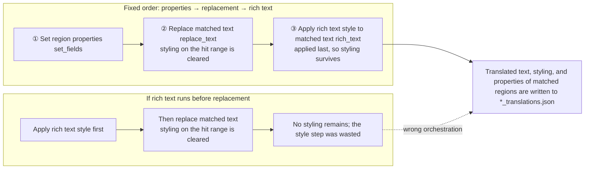

# Batch Actions and Order

When you need to edit translated regions across the main file list, the “Batch actions” card decides what happens to each matched region: set properties, replace text, or apply rich-text styling. This guide documents the three action blocks, how they are stored in a scheme file, and why they always run in the fixed order properties → text replacement → rich text.

Scheme creation, copy, rename, and delete are covered by [Scheme management](./schemes-crud.md); condition fields, operators, and the `all`/`any` logic by [Match conditions](./conditions.md); and preview, checkboxes, write-back, and restore by [Preview, apply, and restore](./preview-apply-restore.md). Rich-text style fields share the same style editor as rich-text rules; see [Rich-text styles and presets](../rich-text-rules/styles-and-presets.md).

## When to use it {#feature-boundary}

- The “Batch actions” card contains exactly three action blocks: `set_fields` (Set region properties), `replace_text` (Replace matched text), and `rich_text` (Apply rich text style to matched text).
- Actions always run in the fixed order `set_fields` → `replace_text` → `rich_text`; the UI offers no drag or move-up/move-down reordering. Entries inside the same block run top to bottom.
- The reason for the fixed order: replacing text clears rich-text styling on the changed range, so styling must come last. Putting styling before replacement is wasted work.
- “Set region properties” produces at most one action per scheme (all rows packed into one `fields` dict); “Replace matched text” and “Apply rich text style to matched text” produce one action per entry.
- Conditions select which regions are in scope; each action uses its own pattern to locate a substring inside the region's translation. The two layers are separate, so there is no ambiguity about which condition's hit range is the target.
- This guide does not cover condition editing (see [Match conditions](./conditions.md)), preview/apply/restore (see [Preview, apply, and restore](./preview-apply-restore.md)), or every rich-text style field (see [Rich-text styles and presets](../rich-text-rules/styles-and-presets.md)).

## Use it in Batch Management {#ui-operations}

### Configure actions in Batch Management

1. Open the “Batch Management” page. The title is “Batch Management” and the subtitle is “Match regions across the main file list and edit their text, styling, and properties in bulk”.
2. In the “Batch actions” card, each action block has its own enable checkbox. Checking an empty “Replace matched text” or “Apply rich text style to matched text” block adds one blank entry automatically; unchecking disables the block and both preview and apply ignore it.
3. In the “Set region properties” block, click “Add property” to add a row: a field dropdown, a value editor, and a remove button. The dropdown lists writable fields only; read-only/derived fields can be used in conditions but cannot be written here.
4. In the “Replace matched text” block, click “Add replacement” to add an entry: “Match text” holds the pattern, the “Regex” toggle decides whether the pattern is a regular expression, and “Replace with” holds the replacement text. With regex on, the replacement supports backreferences like `\1`.
5. In the “Apply rich text style to matched text” block, click “Add style entry” to add an entry: a mode dropdown, “Match text”, an optional “Match rich text” condition, and the target-style “Edit Style” button.
6. The hint below the card title states the fixed order directly: “Applied in a fixed order: properties, then text replacement, then rich text. Changing the text clears styling on the changed range, so styling must come last. Within a block, entries run top to bottom.”

Action-block enablement and entries are saved with the scheme; any change to a condition or action row invalidates the previous preview.

## The three action types {#action-types}

### Set region properties

The controls are listed as “field + value” rows; every row in the block is packed into a single `set_fields` action (a `fields` dict). Writable fields include: `translation` (translation; whole rewrite), `translation_raw` (pre-replacement translation), `font_family` (font family), `target_lang` (target language), `source_lang` (source language), `direction` (text direction), `alignment` (alignment), `font_size` (font size), `angle` (angle), `line_spacing` (line spacing), `letter_spacing` (letter spacing), `stroke_width` (stroke width), `fg_colors` (text color), and `bg_colors` (stroke color). For color and layout field values and the editor write format, see [Rich Text Styles and Presets](../rich-text-rules/styles-and-presets.md) and [Rich-Text Rules Table, Raw Editing, and Matching](../rich-text-rules/table-raw-and-match.md).

Read-only/derived fields (`text` Source Text, `prob` OCR Confidence, `has_rich_text` Has Rich Text, `line_count` Line Count, `region_index` Region Index) do not appear in the “Add property” dropdown and are usable only in [Match conditions](./conditions.md).

Writing `translation` is a whole-rewrite: the old `translation_rich` is dropped and `translation_raw` is synced to the same text, unless the block also writes `translation_raw`, in which case your written value is kept.

### Replace matched text

Each entry produces one `replace_text` action with `pattern`, `regex`, and `replace` fields. An entry with an empty pattern produces no action; the engine collapses consecutive newlines before locating substrings. With regex on, the replacement supports backreferences like `\1`, and invalid references are treated literally so the whole batch does not crash.

Replacement is written back by replaying edit operations: unchanged characters keep their rich-text and ruby/tcy node ownership, only the replaced characters lose styling, and the inserted text inherits the style of the first character of the matched range (when the range originally had several styles, only one can be carried over). For regex matching and replacement semantics (including `\1` backreferences and literal handling of invalid references), see [Replacement Rules: Raw YAML Editing, Regex, and Saving](../replacement-rules/raw-yaml-regex-and-save.md).

### Apply rich text style to matched text

Each entry produces one `rich_text` action. Three modes:

- Overwrite: your set entries win; other entries on the hit range are kept as-is.
- Fill: an existing entry of the same name on the hit range wins and only missing entries are added; if a ruby/tcy range already has any node, the whole range yields.
- Replace: the original styles and nodes on the hit range are cleared first, then the new style is applied.

An empty pattern targets the whole region. An optional `match_style` filters the hit by its existing rich-text styling using “Match all”/“Match any”. Actions with empty `style`, `ruby`, and `tcy` are dropped. The engine applies hit ranges right-to-left so coordinates do not shift. For the exact meaning and compatibility of style fields, see [Rich Text Styles and Presets](../rich-text-rules/styles-and-presets.md).

## Fixed execution order {#execution-order}

The `actions` list in the scheme file does not have to be hand-sorted: `normalize_scheme()` applies a stable sort with `ACTION_ORDER = (set_fields, replace_text, rich_text)`, so entries of the same type keep the order in which they were written.

“Styling on the hit range is cleared” refers to the rewrite of the matched substring, not a guarantee that the whole region loses styling: unchanged characters keep their styles through edit replay. The fixed order ensures that rich-text styling added last is not cleared again by a replacement action in the same scheme.

## Limitations and notes {#dependencies-and-conflicts}

- Conditions decide which regions enter the preview; actions only locate substrings inside those regions. Conditions do not participate in action execution.
- Preview requires at least one enabled action block (`Enable at least one batch action first.`); a scheme with no actions cannot be previewed.
- A preview is invalidated whenever any condition or action row changes, and “Preview matches” must be run again.
- The rich-text style editor is shared with the rich-text rules page (`RichTextStyleDialog`); style fields and compatibility are documented there.
- Batch write-back can conflict with in-memory editor data: the UI warns and reloads the editor after applying; see [Preview, apply, and restore](./preview-apply-restore.md).
- Batch management only touches the desktop-side `*_translations.json` files and the scheme file. It does not enter the `manga_translator` rendering pipeline and never reads or writes API credentials.