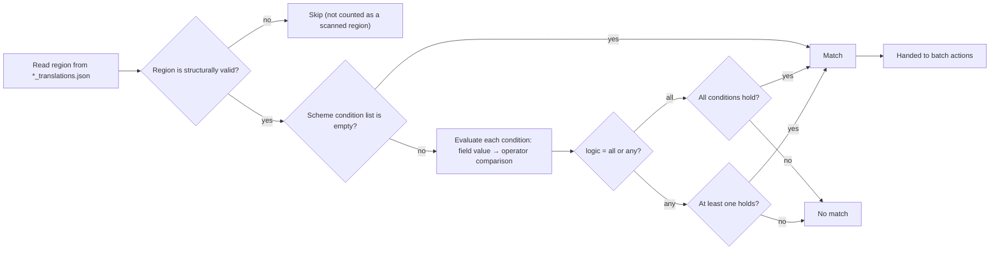

# Batch Condition Matching

Use this page when regions across a set of images must be filtered by content, layout, or properties before bulk edits. The “Batch Management” page uses match conditions to select regions, then batch actions edit their text, rich-text styling, or properties; the two are separate, so there is no ambiguity about which condition's match range is the target.

This guide covers condition fields and matching rules only. Scheme CRUD is documented in [Scheme management (CRUD)](./schemes-crud.md), batch actions in [Batch actions and execution order](./actions-and-order.md), and preview, apply, backup, and restore in [Preview, apply, and restore](./preview-apply-restore.md).

## When to use it {#feature-boundary}

- A scheme has two parts: `match` (`logic` + `conditions`) and `actions`; conditions are the first half and only filter regions.
- With an empty condition list, every region in scope matches (“No conditions means every region in scope is selected.”).
- Conditions are evaluated only on structurally valid regions; malformed regions are skipped during both scanning and applying.
- Batch-management conditions operate on region data in the `*_translations.json` files from the main file list. They have nothing to do with `batch_size` or `batch_concurrent` (image batching/concurrent translation) in the translation pipeline.

## Use it in Batch Management {#ui-operations}

### Configure match conditions in Batch Management

1. Open the “Batch Management” page in the main navigation.
2. Select or create a scheme (see [Scheme management (CRUD)](./schemes-crud.md)).
3. In the “Match conditions” card, first choose “Match all” or “Match any” from the logic combo box.
4. Click “Add condition” to create a condition row `[Field ▾] [Operator ▾] [Value] [×]`. The field combo lists every matchable field, operators change with the field kind, and the value editor is built dynamically from the field kind plus operator.
5. Changing the field or operator rebuilds the value editor; operators that need no value (`empty`, `not_empty`, `is_true`, `is_false`) hide it.
6. Click `×` at the end of a row to remove that condition (tooltip “Remove condition”).
7. Any change marks the scheme as dirty and auto-saves it to `config/batch_edit_schemes.yaml` after about 600 ms, while clearing the previous preview result.

### Condition rows and value editors

Each condition row `[Field ▾] [Operator ▾] [Value] [×]` gets its value editor built from the field kind and operator:

| Field kind | Value editor | Notes |
| --- | --- | --- |
| Text | Single-line input | Placeholder text is “Value” |
| Enum | Combo box | Shows raw storage values, not translated; e.g. direction `h`/`v`/`hr`/`vr`/`auto` |
| Number | Number input | Integer range -100000…100000; decimals keep 3 places with step 0.05 |
| Number range | Low + “to” + high | Two number inputs |
| Color | Color picker | “Close to color” adds “Tolerance”, range 0…442, default 30 |
| Boolean | “Yes”/“No” combo | Stores `true`/`false` |
| Font | Font combo | Lists system fonts |

## Condition fields {#condition-fields}

The following fields appear in the field combo box. Fields marked “No” are condition-only and cannot be targets of the “set region properties” action.

Field-value notes:

- `translation` matches the region body: it prefers the visible text of the rich-text document (newlines as `\n`) and falls back to the `translation` field when parsing fails. Matching does not run on `[BR]`-based `translation`, so the four characters of `[BR]` never pollute character indices.
- `text`, `prob`, `has_rich_text`, `line_count`, and `region_index` are read-only and never appear in the “set region properties” action.
- `direction` values are alias-normalized: `horizontal` → `h`, `vertical` → `v`, and `h`/`v`/`hr`/`vr`/`auto` are accepted.
- Empty `fg_colors`/`bg_colors` fall back to `font_color`/`bg_color`, keeping compatibility with historical editor-saved shapes.

## Operators and matching rules {#operators-and-rules}

Operators are determined by the field kind and are listed per kind.

Matching rules:

- Text: normalized with `str()` first; `contains`/`not_contains` are substring checks and `eq`/`ne` are whole-string equality; `empty`/`not_empty` judge the text after stripping leading/trailing whitespace.
- Regex: uses a `re.search` substring search; when the pattern is invalid, both `regex` and `not_regex` return no match (an invalid pattern never aborts the whole scan).
- Enum: both sides are stripped and lowercased before comparison; direction is alias-normalized as well.
- Number: if the value cannot be parsed as a number, the condition does not match; `eq`/`ne` use floating-point approximate comparison (relative/absolute tolerance `1e-9`); `between` is inclusive and swaps the bounds when low is greater than high.
- Color: compared by RGB distance; `color_eq` requires distance 0 and `color_near` requires distance ≤ tolerance (default `30.0` when no tolerance is provided; UI range 0…442).
- Boolean: `is_true` requires a truthy value and `is_false` requires a falsy value.
- An unknown field, an unknown operator, or a field/operator kind mismatch always makes the condition not match (returns false).

## Condition matching flow {#matching-flow}

The diagram below is the per-region decision flow from file to “match or not” (“executing actions” is covered by [Batch actions and execution order](./actions-and-order.md)):

Limits: the diagram reflects the real source evaluation path. The `translation` body is the rich-text visible text (`\n`), so operators such as `contains`/`regex` see `\n` newlines, not `[BR]` markers. The apply stage re-reads the files and re-runs the same conditions instead of reusing the preview cache.

## Limitations and notes {#dependencies-and-conflicts}

- Conditions only filter regions; each action carries its own `pattern` to locate substrings inside the translation. Conditions and actions do not share a “match range”.
- Condition evaluation depends on region fields such as `texts`/`lines`/`translation`/rich text; regions with missing OCR text or malformed structure are skipped and can never be “selected”.
- After any scheme change, the previous preview is invalidated; click “Preview matches” again to regenerate the match list.
- Batch-management conditions are unrelated to `context_size`, `batch_size`, and `batch_concurrent` in translation settings: the former operate on region data of translated JSON, while the latter control batching and concurrency of the translation pipeline.
- This page never reads or displays real `.env`, user `config.json`, or task artifacts; scheme YAML records only condition and action structure and contains no credentials.