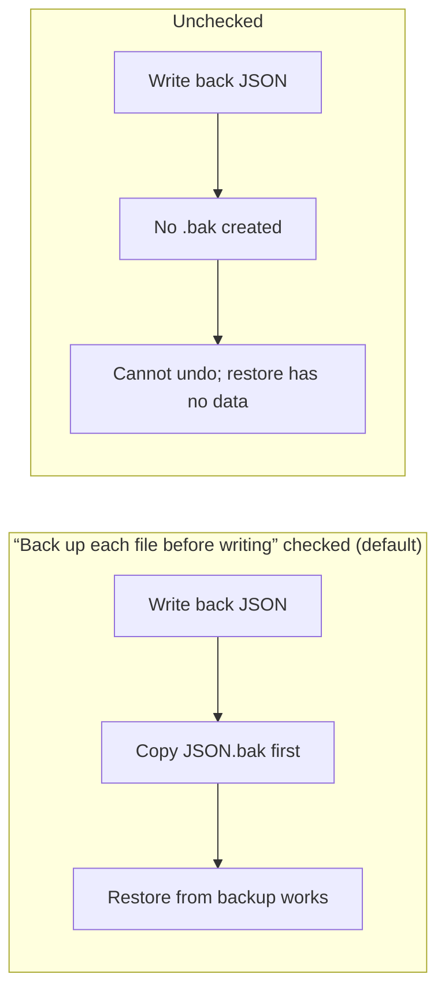
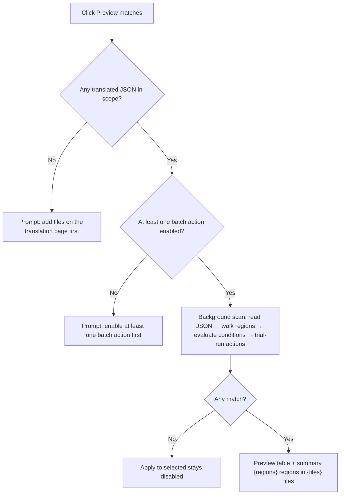
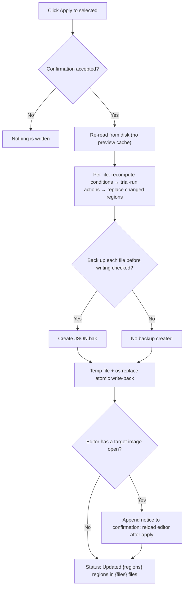
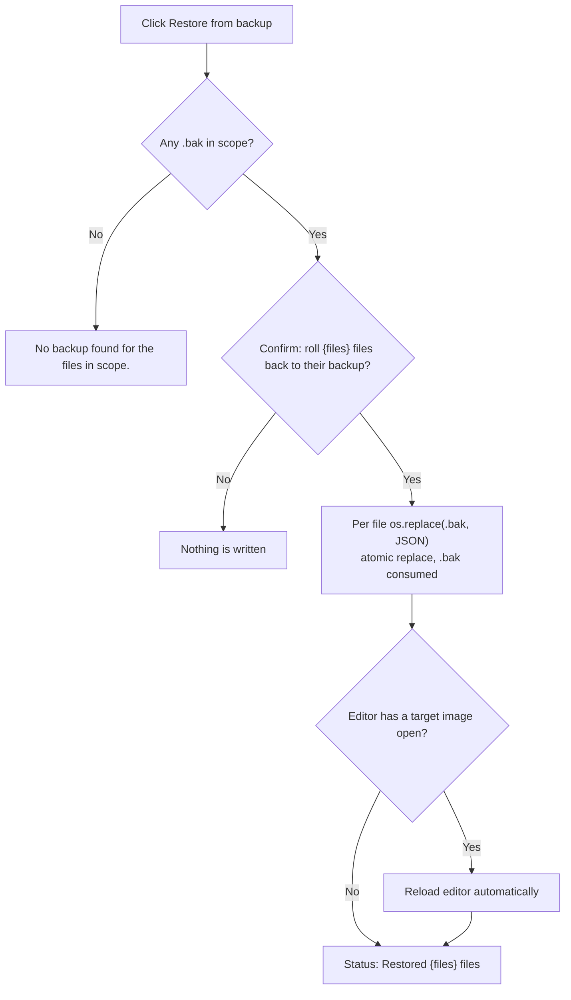

# Batch Preview, Apply, and Restore

The Batch Management page works on the translated files in the main file list. You first run “Preview matches”, review every region that would be changed in the table, tick the rows to write back, and finally use “Apply to selected”. Before writing, the app copies each JSON to a `.bak` by default, so most mistakes can be undone with “Restore from backup”.

This guide covers preview, selection, write-back, backup, and restore only. Scheme create/rename/duplicate/delete and autosave are in [Batch scheme management](./schemes-crud.md), condition fields and the `all`/`any` logic are in [Match conditions](./conditions.md), and the three action types with their fixed order are in [Actions and order](./actions-and-order.md). The editor's own save and write-back is documented in [Editor import, export, and write-back](../editor/import-export-and-writeback.md).

## When to use it {#feature-boundary}

- Batch write-back targets per-image JSON (`<stem>_translations.json`), not final images; Batch Management never enters the rendering pipeline.
- Preview is mandatory: there is no “apply without previewing” button.
- The scope comes from the `json_by_file` mapping (image path → JSON path) in the main file list snapshot. The panel does not rescan the disk itself; the main window pushes a new snapshot whenever the file list changes.
- “Apply to selected” always re-reads the files from disk and re-runs the scheme; it never reuses cached preview results.
- Restore can only roll a file back to its sibling `.bak`; the `.bak` is consumed in the process and no longer exists afterwards.
- The “Match conditions” card and the “Batch actions” card live on the same panel, but their details are covered by [Match conditions](./conditions.md) and [Actions and order](./actions-and-order.md) respectively.

## Use it in Batch Management {#ui-operations}

### Check the scope and preview matches {#preview-matches}

Open “Batch Management”. The status bar at the bottom of the page shows “Scope: {count} translated files from the main file list” on the right.

After configuring conditions and actions:

1. Click “Preview matches”.
2. If the main file list has no translated files yet, you see “The main file list has no translated files yet. Add files on the translation page first.”.
3. If no batch action is enabled, you see “Enable at least one batch action first.”.
4. The scan runs in a progress dialog labeled “Scanning...”; it can be cancelled.
5. Matches are written into the preview table, one row per region, with six columns: check, image, region, before, after, changes.

- The “Image” column shows the file name; hovering shows the full JSON path. “Region” shows the region index. “Before”/“After” show the visible translation text (line breaks are displayed as `\n`). “Changes” lists the fields that would be modified (for example `line_spacing, translation`).
- “Select All” and “Select None” toggle the check state of every row at once.
- With no matches, “Apply to selected” stays disabled; with matches, the summary shows “{regions} regions in {files} files”.
- Regions with an invalid structure are skipped and the status line appends “{count} malformed regions skipped”; unreadable files open an error dialog titled “{count} files could not be read”.
- As soon as a condition or action changes, the previous preview is invalidated (the table is cleared and Apply is disabled again); you must preview again.

### Apply changes in bulk {#apply}

1. Tick the rows you want to write back in the preview table.
2. “Back up each file before writing” is checked by default; when you uncheck it, the confirmation dialog appends “Backups are disabled. This cannot be undone.”.
3. Click “Apply to selected”; the confirmation asks “Apply this scheme to {regions} regions in {files} files?”.
4. If the editor currently has an image from the target scope open, the confirmation appends a notice that the in-memory copy will overwrite these changes when switching images and that the editor will be reloaded after applying.
5. The progress dialog is titled “Apply to selected” and shows “Writing...”; it can be cancelled. After cancellation the status line shows “Cancelled” and nothing is written.
6. On completion the status line shows “Updated {regions} regions in {files} files”; files that could not be written are listed in an error dialog titled “{count} files could not be written”.
7. After a successful write-back the preview table is cleared — the on-disk content has changed, so the old preview is no longer trustworthy.

### Restore from backup {#restore}

1. Click “Restore from backup”; its tooltip reads “Roll every file in scope back to its .bak, then delete the .bak”.
2. If no file in scope has a `.bak`, you see “No backup found for the files in scope.”.
3. When backups exist, the confirmation asks “Roll {files} files back to their backup? The backup is consumed.”; if the editor has a target image open, the reload notice is appended as well.
4. The progress dialog shows “Restoring...”; it can be cancelled.
5. On completion the status line shows “Restored {files} files”; files that could not be written are listed in the “{count} files could not be written” error dialog.

Restore also uses the “translated files from the main file list” scope: it only handles the sibling `.bak` files of those JSON files, never scans the whole disk, and never creates new backups.

## Options and statuses {#options-and-statuses}

#### “Back up each file before writing” {#backup-option}

Check “Back up each file before writing” in the header of the preview card (checked by default). When checked, each JSON that would be modified is copied to a `.bak` before applying; when unchecked there is no `.bak`, so a later “Restore from backup” cannot roll those files back.

Unchecking only affects the next click on “Apply to selected”: it does not delete leftover `.bak` files, and it does not stop “Restore from backup” from using backups that already exist.

## How a scheme is applied {#runtime-behavior}

### Preview scanning {#scan-mechanism}

Clicking “Preview matches” hands the current scheme (conditions + actions) and the JSON paths in scope to a background thread. For each JSON the thread: reads and parses it (keeping the detected indentation) → walks the `regions` under every top-level image entry → skips regions with an invalid structure → evaluates the conditions per region → applies the scheme to a copy of the region. When the trial result differs from the original, one match row is produced.

The “Before”/“After” columns show the visible translation text: rich text wins when present, otherwise it falls back to `translation`; line breaks are displayed as `\n`. Preview only computes; it never writes to disk.

### Applying changes {#apply-mechanism}

“Apply to selected” carries the rows the user ticked (JSON path + image key + region index), not the whole match list. During execution the engine re-reads the files and re-runs sanity checks, condition evaluation, and the scheme for every target region, then:

1. Only the region entries that actually changed are replaced; the other top-level keys (`mask_raw`, `mask_is_refined`, overlays, dimensions, etc.) and unmatched regions are preserved as-is.
2. When backup is checked, `<json>.bak` is created first with `shutil.copy2`.
3. A temp file (`.batch_edit_*.tmp`) is written in the same directory, `fsync`ed, and `os.replace` swaps it in atomically.
4. The original indentation is preserved (the backend writes 4, the editor writes 2) and `ensure_ascii=False`, keeping diffs minimal.
5. Only files with actual changes are written; files without changes are neither modified nor backed up.

Write-back only modifies text/style entries in the JSON; it does not re-render images automatically. Re-export from the translation or editor workflow when you need new images.

### Restoring {#restore-mechanism}

“Restore from backup” runs `os.replace(backup, json_path)` for every JSON in scope that has a `.bak`: this changes a directory entry instead of moving data, so it is faster than byte-by-byte copying and is itself atomic. After a successful restore the `.bak` is consumed (it no longer exists), which is why the button tooltip says “then delete the .bak”. Files without a `.bak` are skipped; if none exist you see “No backup found for the files in scope.”.

### Cancellation and background execution {#cancel-and-threading}

Preview, apply, and restore run in the background so the UI stays responsive; you can cancel at any time. A cancelled run writes nothing and the status line shows “Cancelled”. The progress dialog can be closed, which is equivalent to cancelling.

### Editor conflicts and reload {#editor-conflict}

The editor keeps regions in memory and does not listen for file changes; when you switch images its auto-export overwrites the on-disk JSON from the stale in-memory copy. So when the apply/restore target includes the image currently open in the editor, the panel appends the notice “The editor currently has '{name}' open.” to the confirmation, and after success it calls the editor reload entry point to load that image again, so the in-memory copy cannot wipe out the changes just written.

## Limitations and notes {#dependencies-and-conflicts}

- The scope comes entirely from the main file list snapshot: JSON files outside the file list are never previewed, applied, or restored; the panel does not scan the disk itself.
- Preview again before applying: changing a condition or action invalidates the old preview.
- If you uncheck “Back up each file before writing” when applying, those files have no `.bak`, so a later “Restore from backup” cannot roll them back.
- Restore only works on the `.bak` files in scope: it cannot restore files that were never backed up, and it cannot roll back to an earlier version (there is only one `.bak` and it is consumed).
- Write-back only replaces region entries in the JSON; masks, overlays, and dimensions are preserved, but if the editor is not reloaded after the write, its auto-export on image switch can still overwrite the whole JSON.
- Batch write-back is unrelated to the rendering pipeline: changes do not re-render images automatically.