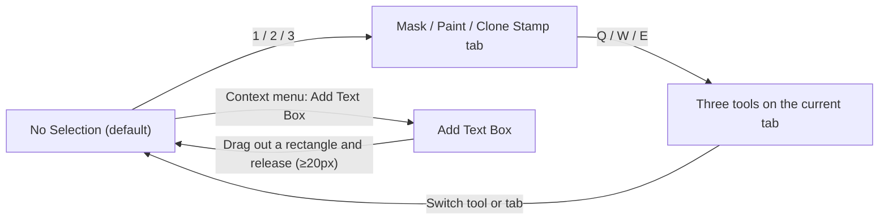
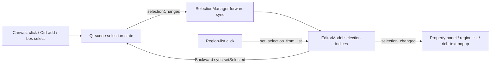

# Canvas Tools and Selection

Once you enter the editor, the canvas is the main workspace for adjusting text regions and retouching the image. This guide explains how to switch each canvas tool (selection, mask brush, eraser, color paint, clone stamp) and how to select, drag, and zoom the canvas and its text regions. How mask strokes are written into the refined mask and how the paint/stamp layers and their clear buttons work are covered in [Mask, Paint, and Clone Stamp](./mask-paint-and-clone-stamp.md); toolbar menus, display modes, and arrange actions are covered in [Toolbar and Menus](./toolbar-and-menus.md); shortcut registration and focus priority are covered in [Shortcuts](./shortcuts.md).

## What you can do

- The canvas tool is a single active state `active_tool`. Its values are `select`, `brush`, `eraser`, `paint`, `paint_erase`, `clone`, `stamp_erase`, and the temporary drawing state `draw_textbox`. The UI changes it through the Property Editor buttons, the `1`/`2`/`3` and `Q`/`W`/`E` keys, and the context-menu item “Add Text Box”.
- Selection (click, box select, multi-select) and region dragging happen only under the `select` tool. With a brush-like tool, pressing the left button no longer selects regions; it draws a stroke instead.
- View zoom and panning (wheel zoom, zoom in/out, fit to window, middle-button drag) transform the whole canvas view and never change region data. `Ctrl+wheel` resizes the font of selected regions and `Shift+wheel` changes the shared brush size; both combinations belong to the [Shortcuts](./shortcuts.md) page.
- The selection is synchronized bidirectionally between the canvas, the region list, and the Property Editor. Region source/translation editing, find-and-replace, OCR/Translate buttons, and list behavior are covered in [Region List and Text Editing](./region-list-and-text-editing.md).
- Mask refinement and the data structure and rendering of the paint/stamp layers belong to [Mask, Paint, and Clone Stamp](./mask-paint-and-clone-stamp.md); this guide only explains the tool entry points and pointer semantics.

## Use it in the editor

### Switch canvas tools in the Property Editor

After opening the editor, the left panel defaults to “Property Editor”. In the “Image Editing” group there are three tabs, `Mask`, `Paint`, and `Clone Stamp`; hover a tab to see its `1`/`2`/`3` shortcut. Each tab offers a set of mutually exclusive tool buttons. All three tabs share one button group, so checking a tool on any tab unchecks the tools on the other tabs.

The tool buttons on the three tabs emit the active values `select`, `brush`, `eraser`, `paint`, `paint_erase`, `clone`, and `stamp_erase` respectively, and the checked state is mirrored back from the model when the active tool changes. When you switch tabs and the current tool does not belong to the new tab, the active tool is reset to that tab’s “No Selection” button, avoiding cross-tab tool conflicts.

The Mask tab additionally offers “Show Refined Mask” and “Clear All Masks”; the Paint tab offers “Show Paint Layer”, “Clear Paint Layer”, and “Brush Color:”; the Clone Stamp tab offers “Show Stamp Layer” and “Clear Stamp Layer”. All three tabs share one “Brush Size:” model field with a range of 5–200 and an initial value of 30.

Without opening the panel, press `1`/`2`/`3` to switch to the Mask/Paint/Clone Stamp tab. `Q`/`W`/`E` always choose the three buttons from left to right on the current tab: No Selection, Brush (Clone Stamp on the third tab), and Eraser. Right-clicking blank canvas and choosing “Add Text Box” enters the `draw_textbox` drawing mode.

### Canvas pointer operations

The table below lists pointer semantics per active tool; the input layer treats every brush-like tool as drawing and never as region selection.

| Active tool | Left button | Right button | Notes |
| --- | --- | --- | --- |
| Selection Tool | Click to select a region; drag inside the white frame to move it; drag handles to resize/rotate; drag on blank canvas to box-select | Opens the context menu | Region selection and geometry editing |
| Add Text Box | Drag out a rectangle to create a new text region; returns to the selection tool on release | Entered through the “Add Text Box” context-menu item | Creation is discarded when the rectangle is under 20×20 px |
| Mask Brush | Press and drag to write white strokes into the refined mask | — | Commits `MaskEditCommand` and triggers an inpaint stroke |
| Eraser | Press and drag to erase mask strokes to 0 | — | Commits `MaskEditCommand` |
| Color Brush | Press and drag to write the brush color into the paint layer | — | Writes `paint_overlay` |
| Color Eraser | Press and drag to erase the paint layer | — | Writes `paint_overlay` |
| Clone Stamp | Press and drag to clone paint into the stamp layer | Right-click samples; the context menu is suppressed | Sample-circle marker; offset locks on the first dab |
| Stamp Eraser | Press and drag to erase the stamp layer | — | Writes `stamp_overlay` |

Brush, eraser, paint, clone stamp, and stamp eraser all show a circular cursor whose radius follows the brush size and the current zoom; `draw_textbox` shows a cross cursor. An in-progress box select or stroke is cleaned up uniformly when you switch tools, open the context menu, press `Escape`, or the window loses focus: switching tools commits with the old tool semantics, while the context menu and focus loss discard it.

### Select, drag, and zoom

- Selection: with the `select` tool, click a text region to select it; hold `Ctrl` and click to add to the selection; press and drag on blank canvas to draw a dashed selection box, then on release regions intersecting the box are hit precisely (including rotated and thin regions), and the old selection is cleared unless `Ctrl` is held. Clicking blank canvas (a zero-size box) is equivalent to deselecting.
- Dragging: drag a selected region (inside its white frame) to move it; other selected regions follow in the same drag. Drag the white square handles around the selection to resize the frame and drag the rotation handle to rotate. On release the geometry is written back through `update_region_geometry` and enters the undo history.
- Zooming: the wheel zooms in by a factor of 1.15 and out by 1/1.15, clamped to 0.05–50, anchored at the mouse position. The “Zoom In (+)”, “Zoom Out (-)” items in the “Menu” and the persistent “Fit to Window” button drive the same view transform.
- Panning: press and hold the middle mouse button and drag to pan. Pressing the middle button internally switches to `ScrollHandDrag`; releasing restores `NoDrag`.
- The view state (transform matrix and center) is emitted through `view_state_changed` to the original-compare panel and the floating rich-text editor for positioning.

## Tool and selection flow

The diagrams below sketch the tool state transitions and the bidirectional selection sync. Switching tools first commits the in-progress interaction under the old tool semantics, so a mask stroke cannot be committed to the wrong tool; after `draw_textbox` commits, the tool returns to the selection tool.

The selection changes at either end are mirrored to the other end: clicks/box selects on the canvas first land in the Qt scene selection state, then `SelectionManager` converts them into the model’s index list, and the Property Editor, region list, and floating rich-text editor all read the same model selection; clicking in the region list writes back through the controller to the model and refreshes the canvas selection.

## How changes are saved

### Tool state machine

`session.py` initializes `active_tool` to `select`. `EditorModel.set_active_tool()` emits only when the value changes; `GraphicsView._on_active_tool_changed()` first commits the in-progress box select or stroke under the old tool semantics, then switches the internal `_active_tool` and updates the cursor. Switching away from `clone` clears the clone-stamp sample point and offset.

`draw_textbox` is not one of the Property Editor buttons: only the context-menu item “Add Text Box” (`enter_drawing_mode`) clears the selection and sets the active tool to `draw_textbox`. After the rectangle is dragged out, `_finish_textbox_drawing` creates the region and returns to `select`; creation is discarded when the rectangle is under 20 px wide or high. The new region inherits font, color, alignment, and similar styles from the last selected region as a template, and the text direction is inferred from the box width/height.

### Bidirectional selection sync

`SelectionManager` uses a `_syncing` flag to prevent feedback loops: Qt scene `selectionChanged` → model `set_selection`; model `selection_changed` → `setSelected` on each item. Box selection uses `scene.items(rect, IntersectsItemShape)` for precise hits instead of `boundingRect`, so rotated and thin regions are not mis-selected. After the region items are rebuilt, `restore_selection_after_rebuild` restores the selection.

## Limitations and notes

- Region selection only happens under the `select` tool; the left button of a brush-like tool always draws and cannot pick a region.
- `Delete` region deletion and `Ctrl+Z`/`Ctrl+Y` undo/redo are focus-aware: with focus in a text control they are left to text editing, and only with canvas focus do they act on regions; see [Shortcuts](./shortcuts.md).
- `Ctrl+wheel` and `Shift+wheel` are intercepted by the shortcut manager to resize the selected regions’ font and the shared brush size respectively, and never fall through to canvas zoom.
- Switching tabs resets the tool to that tab’s “No Selection”, so the mask brush and the color paint brush cannot be active at the same time.
- The context-menu labels are translated through the `en_US.json` / `zh_CN.json` locale keys `OCR Selected Regions`, `Translate Selected Regions`, `Copy Region`, `Paste Style`, `Delete Selected Regions`, `Add Text Box`, `Paste Region`, and `Refresh View`; the delete label receives the selected-region count. While the clone stamp is active the right button is reserved for sampling and the menu is fully suppressed.
- View zoom is clamped between 0.05 and 50 to keep wheel zoom from runaway and to avoid stroke artifacts at extremely small scales; zoom only changes the view transform, never the region data.
