# Floating Rich Text Editor

Use the floating rich-text editor when a line of translation needs inline styling such as bold, color, ruby, or vertical-in-horizontal (TCY). It is an independent window docked next to the currently selected text region on the canvas and provides body editing, per-run style cards, ruby input, and saved style presets. This guide covers opening, editing, and saving with the floating window; the parameter details and rendering effects of each style are covered in [Style properties](./style-properties.md), plain text fields, find/replace, and the region list are covered in [Region list and text editing](./region-list-and-text-editing.md), rich-text rule matching and preset files are covered in [Rich text styles and presets](../rich-text-rules/styles-and-presets.md), and shortcuts and focus conflicts are covered in [Shortcuts](./shortcuts.md).

## What you can do {#feature-boundary}

- The floating rich-text editor is a top-level tool window created by `EditorView` (`Qt.Tool` plus frameless), not a child overlay of the canvas, so it is never clipped by the canvas viewport and can be dragged onto other panels or monitors.
- It is shown only when exactly one region is selected and the menu toggle “Show Rich Text Editor Popup” is enabled; multi-selection, clicking blank canvas, starting to drag a region, or turning the toggle off hides it and clears its binding.
- It edits three fields of the current region: `translation` (final translation), `translation_raw` (pre-replacement translation), and `translation_rich` (a `richtext.v1` document). The document has no separate “Save” button: body and style changes are written back to the model automatically after a 180 ms debounce, and flushed immediately on hide, close, region switch, or body focus loss.
- “Auto Apply Rich Text Rules While Editing” in the top “Menu” controls whether rich-text rules are applied incrementally while typing (on by default; styles only, characters never change).
- Not covered here: region-level style parameters (font size, color, stroke, spacing, angle, alignment, direction) are in [Style properties](./style-properties.md); plain text editing, find/replace, and list sync in the property panel are in [Region list and text editing](./region-list-and-text-editing.md); canvas tools and selection are in [Canvas tools and selection](./canvas-tools-and-selection.md); shortcut registration and focus priority are in [Shortcuts](./shortcuts.md).

## Use it in the editor {#ui-operations}

### Open, position, and close the floating editor {#open-position-close}

1. Open the editor, load an image, and select one text region on the canvas with the selection tool. The floating window appears automatically above that text box (below it when there is not enough room above), horizontally centered on the text box, and clamped to the available geometry of the current screen.
2. Move the mouse to the window border (about 12 px) and hold the left button to drag the whole window elsewhere. Once dragged manually, the automatic docking position is remembered, and later canvas scrolling, zooming, or style-area height changes no longer move it.
3. Showing the window never steals canvas focus (`WA_ShowWithoutActivating`): `focus_text()` is not called when a region is selected, so canvas shortcuts such as `Delete` and `A`/`D` image switching keep their canvas semantics until you click the body.
4. The window hides on deselect or multi-selection, blank-canvas click, starting to drag the current region, or turning off “Show Rich Text Editor Popup”. Pending changes are flushed before hiding (see [Edit-to-save write-back flow](#edit-save-flow)).
5. After a region drag ends, the window re-docks around the text box’s new position and reappears; switching away from the editor page and back also restores a visible window when needed.
6. Turning off “Show Rich Text Editor Popup” flushes, unbinds, and hides the window; turning it back on rebinds immediately from the current model selection.

### Edit the translation body {#edit-translation-body}

1. The body is a plain-text edit box (14 pt, 120 px high) showing the current region’s translation text. On load, `[BR]`, ` `, `【BR】`, and real newlines are normalized to line breaks; on save, line breaks are merged back into `[BR]` for `translation`.
2. Type, delete, or paste to modify the body. Each change is committed automatically after a 180 ms debounce, and immediately on hide, close, region switch, or body focus loss.
3. Qt undo/redo is enabled on the body; consecutive rich-text write-backs are merged into one undoable step by the controller using `merge_key`.
4. With “Auto Apply Rich Text Rules While Editing” on (default), each edit applies the rich-text rules incrementally to the document: rules only add styles and never change characters, and matched ranges that already carry manual rich-text traces are skipped entirely.

### Apply styles with the toolbar and style cards {#toolbar-and-style-cards}

1. The toolbar is a grid of 8-column toggle buttons whose button text is the style storage key (`B`, `I`, `U`…); hover hints and accessible names show the translated style name.
2. With no text selected, a style button applies to the whole text; with a selection, it applies to the selection only. Clicking the same button again removes that style (`transform` sub-keys are cleared individually so sibling values survive).
3. The style-card area shows one card per contiguous run of identically styled text in the selected range. The card header shows that run’s text and selects it as the edit target when clicked; the header has “Save Style” and “Clear all styles from this text”.
4. Each card lists property rows (key label + style name + control + remove button) for the styles the run actually carries; numeric, color, and combo controls edit in place and commit immediately. When only style values change, cards refresh in place instead of being rebuilt, so a control being typed into or clicked is not interrupted.
5. Ruby: click toolbar `R` (or the ruby row inside a card) for the selected text, type the ruby text in the “Ruby text” input, and commit with “Apply” or Enter; switching selection, losing body focus, or hiding the window also commits an unapplied ruby draft first.
6. TCY: click `T` to wrap the selected text as a `tcy` node; click it again to unwrap.
7. Width/height stretch: select text and click `WH`, then adjust the width (W) and height (H) factors independently in its style card. `1.00` keeps the original dimension, values above `1.00` stretch it, and values below `1.00` compress it. The glyph vector outlines are transformed before one rasterization pass, so the feature does not enlarge an existing bitmap and blur it.

### Manage rich-text style presets {#manage-style-presets}

1. The right “Rich Text Presets” sidebar lists saved style presets; with none it shows “No saved styles”. The sidebar can be collapsed/expanded, switching width between 248 px expanded and 38 px collapsed.
2. Click a preset name to apply it: all styles are cleared from the selection first, then the preset’s style/ruby/tcy are applied.
3. The card header’s “Save Style” opens a name prompt for the current run’s style (“Enter style preset name:”, default name “Rich Text Preset N”); the name cannot be empty, and a duplicate asks to confirm “Style preset '{name}' already exists. Overwrite?”.
4. Each sidebar row has rename and delete buttons; deleting asks for confirmation. A config write failure shows the “Failed to save style preset” error box and rolls back the in-memory presets.

## How changes are saved {#runtime-behavior}

### Edit-to-save write-back flow {#edit-save-flow}

```mermaid
flowchart LR
    A["Canvas single selection"] --> B["RichTextFloatingEditor.set_region"]
    B --> C["Body input / toolbar / style cards / ruby"]
    C --> D["State machine apply_qt_contents_change / replace_document"]
    D -->|"auto rules on"| E["apply_rich_text_rules adds styles only"]
    D -->|"auto rules off"| F["mark_document_emitted after 180ms debounce"]
    E --> F
    F -->|"rich_text_changed(region_index, document, plain_text)"| G["EditorController.update_translation_rich"]
    G --> H["UpdateRegionCommand merge key region:index:translation_rich"]
    H --> I["EditorModel updates translation / translation_raw / translation_rich"]
    I -->|"regions_changed"| J["View _on_regions_changed_for_rich_editor"]
    J -->|"skips editor's own write-back"| K["refresh_region_if_changed refreshes document"]
```

The diagram is the real data flow: body or style changes enter the editor state machine, optionally apply auto rich-text rules, then commit after a 180 ms debounce; the controller writes the whole document to the model and merges consecutive edits by `merge_key`; the model notifies the view, which skips the editor’s own write-back and only refreshes the document from model data.

Flush trigger summary:

| Trigger | Behavior |
| --- | --- |
| 180 ms debounce expires after a body change | Commit the pending document (`mark_document_emitted`) |
| Hide/close the window (`hideEvent`/`closeEvent`) | Commit the ruby draft and body debounce first, then unbind |
| Body loses focus (`focus_lost`) | `flush_pending_changes` commits immediately |
| Switch region (new single selection) | Flush the previous region first, then bind the new region data |
| Turn off “Show Rich Text Editor Popup” | `clear_region`: flush first, then unbind and hide |

### Focus and shortcut priority {#focus-and-shortcuts}

- The floating editor is shown with `WA_ShowWithoutActivating`: selecting a region does not steal canvas focus, so canvas shortcuts (`Delete`, `A`/`D` image switching, `1`/`2`/`3` image-editing tab switching, and `Q`/`W`/`E` current-tab tool switching) keep their canvas semantics until the body is clicked.
- Once focus enters the floating editor (another top-level `Qt.Tool` window), `EditorShortcutManager` detects that the window of `QApplication.focusWidget()` is no longer the editor main window and returns early for all context-aware editor shortcuts, preventing a stale main-window focus from deleting canvas regions.
- While the body holds focus, Qt text controls handle text undo/redo and copy/paste; style changes are committed through the document and merged by the controller command.

## Limitations and notes {#dependencies-and-conflicts}

- The floating editor only works with a single selection; it is hidden for multi-selection, no selection, or when the popup toggle is off. Selection changes from the region list and property panel drive the floating window through the same model selection.
- “Auto Apply Rich Text Rules While Editing” affects only the incremental style application inside the editor; the rule files, matching, and preview belong to the rich-text-rules pages. Rules add styles only, never change characters, and skip ranges that already carry manual rich-text traces.
- Rich-text write-back shares the same fields as the property panel’s `translation`/`translation_raw` editing: body changes overwrite both `translation` and `translation_raw`, style-only edits keep `translation_raw`; model changes refresh the editor document through `regions_changed` (skipping its own write-back) so a stale document never overwrites the model.
- Consecutive rich-text edits merge into one undo step by `merge_key` (`region:{index}:translation_rich`); the body’s own Qt undo/redo acts on text only.
- Style presets are stored in the application config `app.saved_rich_text_presets`, not in region data; a failed save rolls back and shows “Failed to save style preset”.
- Positioning is screen-aware: automatic docking chooses above/below within the current screen’s available geometry; manual dragging disables auto-movement, and dragging the text box on the canvas re-docks around the new position.
