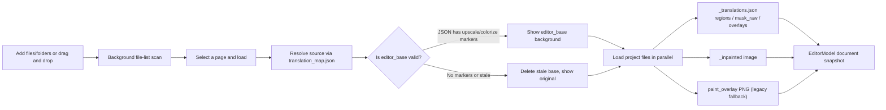
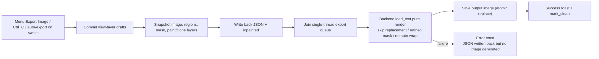
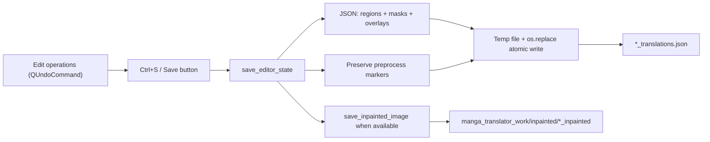

# Editor Import/Export and Writeback

The editor loads project data produced by the translation pipeline so you can adjust text, geometry, style, masks, and paint/clone layers region by region. “Save” writes the project data without rendering; “Export Image” renders the current snapshot without writing project data. This guide covers the import formats, rendering and output-path rules for export, and the formats of project data written by the explicit save action.

The right-panel file list is covered by [Layout and File List](./layout-and-file-list.md); toolbar actions and persistence are covered by [Toolbar and Menus](./toolbar-and-menus.md); shortcut dispatch such as `Ctrl+S`, `Ctrl+Q`, and `Ctrl+Shift+R` is covered by [Shortcuts](./shortcuts.md); masks and paint/clone layers are covered by [Mask Painting and Clone Stamp](./mask-paint-and-clone-stamp.md).

## What you can do {#feature-boundary}

- This guide covers the data boundary between the editor and disk: which project files are read on import, what is rendered and where it is written on export, and the formats of project data written by explicit save.
- Editor export is not a full re-run of the translation pipeline: it renders the current snapshot directly and does not re-run detection, OCR, translation, colorization, or upscaling; the mask is treated as refined and the inpainted image is reused.
- The translation page’s “Import Translation and Render” workflow shares the same `_translations.json` format with the editor, but the entry points differ: that is a translation-page workflow, while the editor reads project data automatically when a file is loaded from its list.
- This page never shows real user images, project JSON, secrets, or private paths; formats are described with key names and sanitized structures only.

## Use it in the editor {#ui-operations}

### Import images and project data {#import-images-and-project-data}

1. In the right panel, click “Add Files”, “Add Folder”, or drag and drop files/folders to add images to the page list; the full list-button operations are covered by [Layout and File List](./layout-and-file-list.md).
2. Click a row (or press `A`/`D` to switch pages) to load that image: the editor reads the associated `*_translations.json`, inpainted image, and paint layers in the background, then shows the canvas for editing.
3. After a translation task finishes, the main window shows a “Task Completed” confirmation; choosing “Yes” enters the editor and opens the source image behind the result (resolved through `translation_map.json` or this task’s output mapping).

### Save and export the current image {#export-current-image}

1. Click “Save” or press `Ctrl+S` to persist JSON, masks, overlays, and the current inpainted image. Saving does not render a final image.
2. Click “Export Image” or press `Ctrl+Q` to flush pending drafts and queue a final-image render. Exporting does not write project data or clear the unsaved state.
3. “Auto Save on Image Switch” and “Auto Export on Image Switch” are independent switch actions. If both are enabled, both run when switching from a dirty page.

### Unsaved changes and page switching {#unsaved-changes-and-switching}

When both automatic switch actions are disabled, “Do Not Warn About Unsaved Changes” determines whether the confirmation dialog is shown. If enabled, switching discards unsaved project changes without prompting; if disabled, the dialog offers save, discard, or cancel.

| Button | Behavior |
| --- | --- |
| Save | Writes project data, marks the state clean, and continues switching |
| Don’t Save | Discards the unsaved edits and loads the target page directly |
| Cancel | Aborts the switch and stays on the current page |

## Import: files and project data {#import-files-and-project-data}

The loadable page-image extensions match the main list: `.png`, `.jpg`, `.jpeg`, `.jfif`, `.webp`, `.avif`, `.bmp`, `.tiff`, `.tif`, `.heic`, `.heif`.

### Import flow {#import-flow}

## Export: rendering, output paths, and queue {#export-rendering-output-and-queue}

### What export does {#what-export-does}

“Export Image” does not re-run detection/OCR/translation/colorization/upscaling. It hands the current snapshot to the backend `load_text` render directly: `translator='none'`, `load_text=True`, `save_text=False`; the mask is treated as refined (`mask_is_refined`) and the inpainted image is reused; the export config also forces `render.disable_auto_wrap=True` because the text boxes were laid out by the user.

Two persistence steps happen before rendering: the project data is written back to `*_translations.json` (see [Writeback: JSON and inpainted image](#writeback-json-and-inpainted)), and the current inpainted image (the base image when none exists) is written to the `_inpainted` file so the backend `load_text` skips its own inpainting step. Only then is the render job added to the export queue.

### Output path and filename {#output-path-and-filename}

The output directory is chosen in this order:

1. `last_export_dir` recorded in the image’s JSON (the last export directory).
2. When `cli.save_to_source_dir` is enabled: `<source-dir>/manga_translator_work/result`.
3. `app.last_output_path` (when set and valid).
4. The source image’s directory.

Filename rules: when `cli.format` is non-empty and not “不指定”, its extension (lowercased) is used; otherwise the source extension is kept; if neither exists, `.png` is used. Image quality comes from `cli.save_quality`. When `cli.export_editable_psd` is enabled, an editable PSD is also exported to `manga_translator_work/psd/` after rendering (`cli.psd_script_only` exports the script only).

### Export queue and “saved” semantics {#export-queue-and-clean-state}

Export is an asynchronous single-threaded queue (`ThreadPoolExecutor(max_workers=1)`):

- Automatic exports for the same image are coalesced: submitting a new one cancels the previous not-yet-started automatic export for that image; manual exports are not coalesced.
- Once the project data is written back, the job is queued and `mark_clean()` is called (QUndoStack clean state). “Unsaved” is therefore determined by whether the export was queued, not by whether rendering eventually succeeded; on render failure the JSON is already written back, no output image is produced, and an error toast is shown.
- While exporting, the toast reads “正在导出…” or “正在导出（N 个任务）”; on success it reads “导出成功\n{output-path}\n已同步 JSON”; on failure it reads “{filename} 导出失败：{reason}”.
- Closing the app with unfinished jobs first shows the “导出任务尚未完成” confirmation; choosing “Yes” drains the export queue before exiting, and choosing “No” cancels the close.

### Export flow {#export-flow}

## Writeback: JSON and inpainted image {#writeback-json-and-inpainted}

### JSON writeback {#json-writeback}

On explicit “Save”, `EditorControllerExportService.save_editor_state()` writes the current project snapshot to the `*_translations.json` found by `find_json_path()`:

- The top-level key is the absolute source path; regions, masks, paint/clone overlays, and existing preprocess markers are preserved through the atomic JSON write.
- Writes use a temp file in the same directory plus `os.replace`, so the editor never leaves a half-written JSON file.

“Export Image” does not call this writeback path. It creates an immutable in-memory render snapshot and queues final-image rendering only.

### Inpainted writeback {#inpainted-writeback}

`save_inpainted_image()` writes the current inpainted image to `manga_translator_work/inpainted/<image-name>_inpainted.<ext>` as part of explicit Save, using a temp file plus `os.replace`.

### Save writeback flow {#writeback-flow}

## Limitations and notes {#dependencies-and-conflicts}

- Editor export forces `disable_auto_wrap=True`, so the result is not affected by auto-wrap settings such as AI line breaking; text-box size and position are taken from the editor.
- Auto-export on switch depends on the export queue: a rejected automatic export aborts the switch, while automatic save is a separate synchronous writeback action.
- `editor_base` is valid only when the JSON has upscale/colorize markers; without them the editor deletes the stale base and falls back to the original.
- If no JSON exists, the explicit Save action creates it; Export Image alone does not create project JSON.
