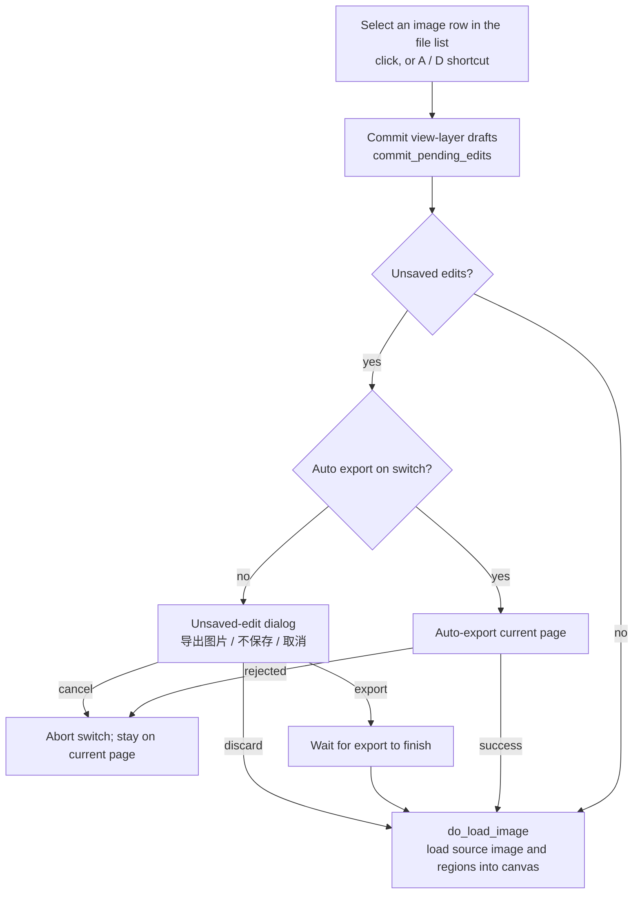

# Editor Layout and File List

When you need to adjust translation results page by page, enter the editor view from the left navigation. The editor opens exactly one "current page" at a time, and the file list on the right is the page switcher: adding images or folders, clicking a row to switch pages, or deleting a row changes the canvas content directly. This guide covers how to enter the editor, the four layout zones, and adding/removing, selecting, status, and switching of the file/page list.

Top-bar menus and persistent controls are covered in [Toolbar and Menus](./toolbar-and-menus.md), canvas tools and selection in [Canvas Tools and Selection](./canvas-tools-and-selection.md), display modes and arrangement in [Display, Compare, and Arrange](./display-compare-and-arrange.md), the left region list and text editing in [Region List and Text Editing](./region-list-and-text-editing.md), import/export and write-back in [Import, Export, and Write-back](./import-export-and-writeback.md), and shortcuts in [Shortcuts](./shortcuts.md). The relationship between the main "Translation Interface" file list and the editor file list is covered in [File List and Input](../translation/file-list-and-input.md).

## What you can do {#feature-boundary}

- This guide covers the editor view's entry points, layout zones, and the right file/page list: add files, add folder, clear list, drag-and-drop, tree expansion, per-row removal, translated/untranslated status, current-page selection, and A/D page switching.
- It does not cover the three top-bar dropdown menus, persistent controls, or the five editor toggles and their persistence (see [Toolbar and Menus](./toolbar-and-menus.md)); canvas zoom, tools, and selection (see [Canvas Tools and Selection](./canvas-tools-and-selection.md)); or left region-list content editing (see [Region List and Text Editing](./region-list-and-text-editing.md)).
- The editor file list shares the same background catalog service as the main-page list, but at runtime they are two independent lists: removing a single file on the main page does not sync to the editor, and only a full "Clear List" on the main page clears the editor.
- Only one image is edited at a time; every image row in the file list is a "page", and clicking a row or pressing a shortcut loads that row into the canvas immediately.

## Use it in the editor {#ui-operations}

### Enter the editor view {#enter-editor}

1. Click "Editor View" at the bottom of the left navigation: it only switches the view without reloading the file list; if there are no files yet, the list shows the empty-state hint.
2. Double-click any image in the file list of the "Translation Interface": the editor opens and loads that image directly.
3. After a translation task finishes, click "Yes" in the "Task Completed" confirmation dialog: the editor opens the source image that corresponds to the results. The prompt appears only when the configuration is not in an incompatible mode such as `translate_json_only`, `template`, `generate_and_export`, `colorize_only`, `upscale_only`, or `inpaint_only`; `replace_translation` or `load_text` modes always prompt.

When the file list is empty, a placeholder hint is shown; while the background scan runs, "正在加载文件列表..." is displayed; when scanning or parsing fails, the error message is shown in red text.

### Layout zones {#layout-zones}

The editor view is a vertical stack of the top toolbar and a horizontal splitter; the splitter can be dragged to resize the three panels.

| Zone | Contents | Layout behavior |
| --- | --- | --- |
| Top toolbar | The "Menu", "Display Mode", and "Arrange" dropdowns, plus the persistent "Fit to Window" and "Original Image Opacity:" controls | Fixed height `56` px; does not scroll with content |
| Left panel | Two route tabs, "Editable Translation" and "Property Editor"; "Property Editor" is shown by default | Minimum width `280` px, draggable; the property editor contains text, style, actions, and image-editing sections |
| Center | The canvas `GraphicsView`; the original-image two-panel compare preview container | Splitter stretch factor `1`, grows with the window; the compare preview is hidden by default and sits next to the canvas when "Display Mode → Compare with Original (Two Panels)" is enabled |
| Right panel | "Add Files", "Add Folder", and "Clear List" buttons plus the file tree | Width `220`–`300` px; fixed and does not stretch with the window |

### Manage the file list {#manage-file-list}

1. Click "Add Files": a native file picker opens supporting multi-select. The dialog title "添加文件到编辑器" is a hard-coded Chinese string in the source, and the file-type filter is `Image Files (...)` (from `IMAGE_FILE_DIALOG_FILTER`).
2. Click "Add Folder": a multi-select folder picker opens; the selected folders are scanned recursively for supported images and added to the list.
3. Click "Clear List": removes every file, clears the canvas, and releases the image cache.
4. Drag and drop files or folders onto the list: equivalent to "Add Files"/"Add Folder".
5. Each row shows a 40×40 thumbnail (or a folder/archive/document icon before it is ready), the file name, a status dot with "Translated" or "Untranslated", and a trailing `×` remove button. Folder nodes expand into a tree, and child images use the same translated/untranslated coloring.
6. Click an image row: it becomes the current page and loads into the canvas; clicking a folder row only expands/collapses it and does not switch pages.

### Select and switch pages {#switch-page}

- Click an image row to switch pages; with canvas focus, press `A` / `D` to switch to the previous / next image (with focus in a text widget, `A` / `D` are typed as text; see [Shortcuts](./shortcuts.md)).
- If there are unsaved edits before switching:
  - With "Auto Save on Image Switch" enabled, project data is saved automatically;
  - With "Auto Export on Image Switch" enabled, a rendered-image export is queued automatically; export does not save project data;
  - With both automatic actions disabled, "Do Not Warn About Unsaved Changes" skips the dialog and discards unsaved project changes; otherwise a three-button dialog offers "Save", "Don't Save", or "Cancel".

## How changes are saved {#runtime-behavior}

### File snapshot and background scan {#snapshot-and-scan}

- The file list is built by `FileListDataService` as an immutable snapshot (`FileCatalogSnapshot`) on background threads; the GUI thread only receives the result. While scanning, the list shows the loading state, and cancellation or clearing increments the generation so stale snapshots are discarded.
- The editor uses the snapshot's `images_only()` projection: image and folder nodes are kept recursively and archive nodes are filtered out. Archives (`.pdf`, `.epub`, `.cbz`, `.cbr`, `.zip`) are visible in the main-page file list but never enter the editor's page list.
- Supported image extensions come from `manga_translator/image_formats.py#SUPPORTED_IMAGE_EXTENSIONS`: `.png`, `.jpg`, `.jpeg`, `.jfif`, `.webp`, `.avif`, `.bmp`, `.tiff`, `.tif`, `.heic`, `.heif`.
- Sorting uses natural ordering on file names (digit runs compare numerically, the rest compares case-folded text).
- Thumbnails load asynchronously for visible rows (40×40, `QImageReader` first with a PIL fallback) and are cached in memory (up to 200 entries); row data comes only from the in-memory snapshot, and the GUI thread never touches the disk.
- Whether an image row shows "Translated" is decided by whether the file is associated with `*_translations.json` metadata (`json_path`), not by the image content.

### Page load and switch flow {#load-and-switch-flow}

When files are added while the list is empty, the `load_first` flag loads the first image automatically once the snapshot is ready; when entering from a double-click on the main page or from "Task Completed", the target path is loaded instead. Before every load, pending drafts in the debounce window of the floating editor are committed so that switching pages right after typing does not lose content.

### Remove and clear {#remove-and-clear}

- Clicking the trailing `×` removes a row: the path is first removed from the view, then added to an exclusion set (folders go to `excluded_folders`, images to `excluded_files`), and the background snapshot rebuild keeps the removal. If the removed row is the current page, the canvas state is cleared.
- "Clear List": cancels the background scan, clears source paths and exclusion sets, clears the canvas state, and releases the image cache.
- When the main "Translation Interface" clears its file list, the main window calls the editor's `clear_list()` in sync; a single-file removal on the main page does not sync to the editor's file list, but if the removed file (or the folder containing it) is the currently loaded image, the editor clears the canvas state.

## Limitations and notes {#dependencies-and-conflicts}

- The editor file list is independent of the main-page list, so after a metadata refresh the Translated/Untranslated status and the main-page thumbnail list may briefly disagree for the same file; they agree again after the snapshot is rebuilt.
- Auto-export on switch depends on the export queue: a rejected auto-export aborts the switch, and choosing "导出图片" waits for the export to finish. Export details are in [Import, Export, and Write-back](./import-export-and-writeback.md).
- Only image rows act as pages in the file list. Archives and unsupported extensions never appear in the editor page list and cannot be opened as editor pages.
- Untranslated images load normally for editing and only log a warning; after another translation run generates the JSON, the row status becomes "Translated".
- The three list states (empty, loading, error) show the placeholder hint, the loading text, and a red error message respectively; a language switch refreshes only locale-backed texts such as Translated/Untranslated, while the placeholder and loading hints do not refresh because their keys are missing.
- The left panel defaults to "Property Editor"; switching to the "Editable Translation" tab first flushes pending region edits so the list rows and canvas data do not disagree.
