# Region List and Text Editing

When you need to check OCR results one by one, adjust a speech line, or re-recognize a text box in the editor, use the “Editable Translation” region list in the left panel and the “Text Content” section of the property panel. This guide covers browsing the region list, find/replace, batch apply, source/translation editing in the property panel, and list synchronization; styles, rich text, masks, and import/export are covered on their own pages.

## What you can do {#feature-boundary}

- The left panel has two routes: “Editable Translation” (the region list) and “Property Editor” (the property panel), with the latter shown by default. This guide covers the full region-list interaction plus the “Text Content” and “Actions” sections of the property panel.
- Each region-list row shows “number: source text” and an editable translation box. In-row edits are only list drafts; they reach the model only after you click “Apply All Translation Changes”.
- The property-panel text section maintains three text fields: source `text`, final translation `translation`, and pre-replacement translation `translation_raw`. “Show Translation (Raw)” is checked by default; when checked you edit `translation_raw`.
- Not covered here: style settings see [Style properties](./style-properties.md); the floating rich-text editor see [Floating rich text](./floating-rich-text.md); masks, paint, and clone stamp see [Mask paint and clone stamp](./mask-paint-and-clone-stamp.md); import/export and write-back see [Import, export, and write-back](./import-export-and-writeback.md); shortcuts see [Shortcuts](./shortcuts.md).

## Use it in the editor {#ui-operations}

### Open the left panel and browse the region list {#open-region-list}

1. After opening an image in the editor, the left panel shows “Property Editor” by default. Click “Editable Translation” to switch to the region list.
2. Each row shows the number plus source text in the form `1: source text`, plus an editable translation box. The translation box placeholder is a hardcoded Chinese literal “译文” without an i18n key, so there is no `en_US`/`zh_CN` pair and it does not switch with the language.
3. Clicking or rubber-band selecting regions on the canvas updates the model selection, which selects the matching list rows; clicking a list row sets that region as the current selection for the canvas and the property panel through the controller.
4. Editing a row's translation only changes the list draft; clicking “Apply All Translation Changes” commits the changed rows in a batch.

### Find/replace and apply all translation changes {#find-replace-apply}

1. Type the text to find in “Find” and the replacement in “Replace with”.
2. Click “Replace All” to run a plain-text replacement (`str.replace`, not regex) over the translation drafts of every list row; nothing happens when the find box is empty.
3. “Replace All” only edits drafts. After you click “Apply All Translation Changes”, the controller collects all row translations, skips unchanged regions, and merges the changes into one undoable batch-update command.
4. A row that is being edited (has focus) is not overwritten when the model refreshes, so focus, cursor, and IME composition are preserved.

### Edit text in the property panel {#edit-text-in-property-panel}

With a single selection, the “Text Content” section is enabled; with a multi-selection it is disabled while the style and action sections stay enabled.

1. The “Original Text:” box writes back to the region source `text` field.
2. “Show Translation (Raw)” is checked by default: the “Translated Text:” box then edits `translation_raw`, and every change runs the replacement rules in real time to produce `translation`. Unchecking it edits the final `translation` instead.
3. The translation box shows line breaks as `↵`; when saved, `↵` becomes the model-stored `[BR]`. When displayed, `[BR]`, ` `, `【BR】`, and real newlines are all converted to `↵`.
4. Click “Placeholder” to insert the full-width underscore `＿` at the cursor, or “Newline↵” to insert `↵`.
5. The “Character count: 0” label is a static string in the source; there is no dynamic character-counting logic.
6. Pick an entry in “OCR Model:” and click “Recognize” to re-run OCR on the current selection; pick “Translator:” and “Target Language:” and click “Translate” to translate the current selection. The three dropdown options come from config display mappings, not fixed i18n enums.

### Copy, paste, and delete regions {#copy-paste-delete}

The “Actions” section is available for both single and multi selection:

- “Copy”: copies the selected region data to the internal clipboard.
- “Paste”: with a single selection it pastes the style (keeping position and text, overwriting font, size, color, alignment, direction, line spacing, and letter spacing); with a multi-selection or no selection it pastes the whole region at the mouse position or a default offset.
- “Delete”: deletes the selected regions in one undoable action. When the editor-menu “Delete and Recover Removed Text” toggle is enabled, it also removes the corresponding original and refined masks so the erased area is restored to the original image; the region deletion and mask changes can be undone/redone together.

## How changes are saved {#runtime-behavior}

### List synchronization flow {#list-sync-flow}

`EditorModel` is the single source of truth for region state; every region change goes through a model mutation that broadcasts a `RegionChange`. The region list refreshes minimally by kind (`reset`/`updated`/`inserted`/`removed`); incremental updates preserve uncommitted drafts and never overwrite a focused translation box.

```mermaid
flowchart LR
    A["Canvas click or rubber-band selection"] --> B["EditorModel.set_selection"]
    C["Click a region-list row"] -->|region_selected| D["EditorController.set_selection_from_list"]
    D --> B
    B -->|selection_changed| E["RegionListView.update_selection"]
    B -->|selection_changed| F["PropertyPanel.on_selection_changed"]
    F -->|translated_text_modified / translation_raw_modified / original_text_modified| G["EditorController text-update commands"]
    E -->|Apply All Translation Changes| H["EditorController.update_multiple_translations"]
    G --> I["MultiRegionUpdateCommand / UpdateRegionCommand"]
    H --> I
    I --> J["EditorModel.update_region / update_regions"]
    J -->|regions_changed| E
    J -->|regions_changed| F
    K["OCR / translation async results (located by stable region_id)"] --> L["EditorController.on_regions_update_finished"]
    L --> I
```

Sync-channel summary:

| Direction | Signal / action | Receiver | Key behavior |
| --- | --- | --- | --- |
| List → model selection | `region_selected` | `controller.set_selection_from_list` → `model.set_selection` | Clicking a row switches the canvas and property panel to that region |
| Model selection → list | `selection_changed` | `RegionListView.update_selection` | Selection changes from canvas/panel select matching list rows in reverse |
| Model regions → list | `regions_changed` | `RegionListView.on_regions_changed` | Kind-based incremental refresh; drafts preserved, focused rows not overwritten |
| List → model | “Apply All Translation Changes” | `controller.update_multiple_translations` | Collects drafts, skips unchanged regions, one undoable command |
| Property panel → model | text-modification signals | `controller.update_translated_text` etc. | Writes `translation`/`translation_raw`/`text` in real time |
| Async task → model | stable `region_id` lookup | `controller.on_regions_update_finished` | Inserts/deletes during the wait cannot write to the wrong target |

## Limitations and notes {#dependencies-and-conflicts}

- The region list, property panel, and toolbar align/distribute buttons all listen to the same model selection instead of keeping their own copies; any change from one side refreshes the others.
- Focused list rows and property-panel text boxes are not overwritten by ordinary refreshes; only async write-backs (`source="async"`) force-refresh the text fields so a stale document cannot overwrite the model.
- `translation` and `translation_raw` are two fields of the same region, not two regions; “Show Translation (Raw)” only changes which field you edit.
- “Auto Apply Rich Text Rules While Editing” is controlled by an editor-menu toggle; rule definitions and render timing belong to the rich-text-rules pages.
- There are interactions with batch-management write-back and real-time replacement rules; batch write-back, `.bak`, and restore belong to the batch-management pages.
- When focus is in a text control, `Delete` does not delete regions and `1`/`2`/`3`/`Q`/`W`/`E`/`A`/`D` are forwarded as text instead of switching tabs, tools, or images; see [Shortcuts](./shortcuts.md).
