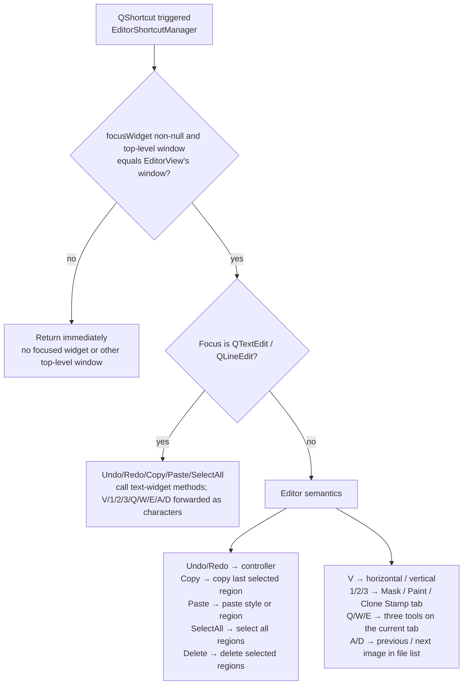
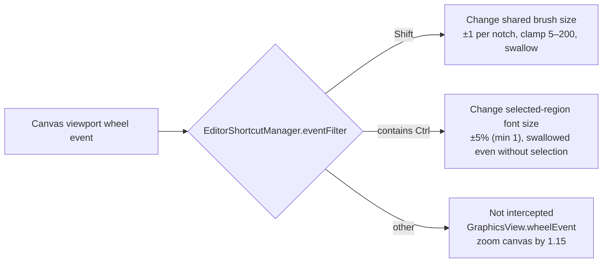

# Editor Shortcuts

Most high-frequency editor actions can be triggered with the keyboard or the mouse wheel: save/export, undo/redo, copy/paste/delete, toggling text direction, switching canvas tools, switching images, toggling the floating rich-text editor, and wheel combos for brush size and selected-region font size. This page lists every shortcut and wheel combo actually registered by `EditorShortcutManager`, and explains who receives a key when focus is in a text widget, on the canvas, or in the floating rich-text window.

The full operations of the toolbar and menus, canvas tools, region list, property panels, floating rich text, and import/export live in the linked editor pages. This guide only answers “which key does what”.

## What you can do {#feature-boundary}

- All editor keyboard shortcuts are registered by `desktop_qt_ui/ui/editor/shortcut_manager.py#EditorShortcutManager`; the toolbar never registers `QAction` shortcuts and only appends hint text to the “Export Image”, “Undo”, and “Redo” menu items.
- `Undo`, `Redo`, `Copy`, `Paste`, `Select All`, and `Delete` are registered with `QKeySequence.StandardKey`; on Windows the primary bindings are `Ctrl+Z`, `Ctrl+Y`, `Ctrl+C`, `Ctrl+V`, `Ctrl+A`, and `Del`. The displayed mapping follows the Qt platform.
- `Ctrl+S` saves project data without rendering; `Ctrl+Q` renders the current snapshot without saving project data; `Ctrl+Shift+R` toggles the floating rich-text editor and works while that tool window has focus.
- `V` toggles selected text boxes between horizontal and vertical, `1`/`2`/`3` switch the Image Editing tab, `Q`/`W`/`E` choose the three tools on the current tab, and `A`/`D` navigate images. These literal shortcuts are forwarded as ordinary characters while a text widget has focus. The tab numbers are shown in hover hints rather than in the tab labels.

## Use it in the editor {#ui-operations}

### View shortcut hints in the Menu {#toolbar-hints}

Open the editor toolbar's “Menu”: “Export Image”, “Undo”, and “Redo” have `(Ctrl+Q)`, `(Ctrl+Z)`, and `(Ctrl+Y)` hint text appended by code. These hints are text only; the real shortcuts are registered by `EditorShortcutManager`.

### Keyboard shortcut reference {#shortcut-reference}

The following table lists every keyboard shortcut actually registered by `_setup_editor_shortcuts()`. Behavior differs when focus is in a text widget (`QTextEdit` or `QLineEdit`) versus on the canvas; with text focus, `V`/`1`/`2`/`3`/`Q`/`W`/`E`/`A`/`D` are forwarded to the widget as ordinary characters instead of changing direction, tabs, tools, or images.

| Shortcut | With focus in a text widget | Canvas focus |
| --- | --- | --- |
| `Ctrl+S` | Saves project data; does not render | Saves project data; does not render |
| `Ctrl+Shift+R` | Toggles the floating rich-text editor | Toggles the floating rich-text editor |
| `Ctrl+Q` | Still exports (flushes pending floating rich-text changes first) | Still exports |
| `V` | Types the character `v` | Toggles from the last selected text box's direction and applies the resulting horizontal/vertical direction to the full selection |
| `1` | Types the character `1` | Switches to the Mask tab |
| `2` | Types the character `2` | Switches to the Paint tab |
| `3` | Types the character `3` | Switches to the Clone Stamp tab |
| `Q` | Types the character `q` | Chooses the first tool (No Selection) on the current tab |
| `W` | Types the character `w` | Chooses the second tool (Brush or Clone Stamp) on the current tab |
| `E` | Types the character `e` | Chooses the third tool (Eraser) on the current tab |
| `A` | Types the character `a` | Selects the previous image in the file list |
| `D` | Types the character `d` | Selects the next image in the file list |

### Wheel combos {#wheel-combos}

| Combo | Effect | Limits |
| --- | --- | --- |
| `Shift + wheel` | Changes the shared brush size by ±1 per notch | Clamped to `5`–`200`; the event is swallowed and does not zoom the canvas |
| Any `Ctrl`-containing wheel combo | Changes the font size of all selected regions by ±5% (minimum 1) | Swallowed even with no selection; never falls through to canvas zoom |
| Plain wheel | Zooms the canvas anchored at the mouse position | Scale clamped to `0.05`–`50.0`, handled by `GraphicsView.wheelEvent()` |

## How changes are saved {#runtime-behavior}

### Registration and focus dispatch {#registration-and-dispatch}

`EditorShortcutManager` registers every editor shortcut with focus awareness (`context_aware=True`). On trigger it reads `QApplication.focusWidget()`: if there is no focused widget, or the focused widget's top-level window is not the `EditorView` window (for example when focus is in the `Qt.Tool` floating rich-text window), every editor shortcut returns immediately, so the main window's stale focus cannot delete canvas regions by accident; otherwise it checks whether the focus is a `QTextEdit` / `QLineEdit` to decide between text-widget handling and editor semantics.

### Key forwarding with text focus {#text-widget-forwarding}

When focus is in a text widget, the `V`/`1`/`2`/`3`/`Q`/`W`/`E`/`A`/`D` handlers forward ordinary characters to that widget. `Ctrl+S` always invokes the editor save action, `Ctrl+Q` invokes export without project writeback, and `Ctrl+Shift+R` toggles the floating rich-text editor even when focus is in its `Qt.Tool` window.

### Wheel event filtering {#wheel-event-filter}

`EditorShortcutManager` installs an event filter on `graphics_view.viewport()`, so wheel events reach the filter first:

The `Shift` branch matches “modifiers equal Shift”; the `Ctrl` branch matches “contains Ctrl”, so `Ctrl+Shift+wheel` also resizes fonts. Property-panel sliders, spin boxes, and dropdowns do not swallow the wheel without keyboard focus and let the parent scroll area take over; `CustomSlider` changes its value only while focused.

### Escape and canvas focus loss {#escape-and-focus-out}

When the canvas has an in-progress interaction (box selection, drawing, text box, clone stamp, region drag, or middle-button pan), pressing `Escape` calls `_cancel_active_interaction(commit=False)` to discard it without committing; `focusOutEvent` (modal dialogs, window deactivation, or focus transfer) uses the same discard path so a lost `mouseRelease` cannot leave a stray box-selection rectangle or drawing preview on the scene.

## Limitations and notes {#dependencies-and-conflicts}

- `Delete` deletes regions only when focus is not in a text widget; a `Delete` inside a text widget never triggers region deletion.
- The floating rich-text window is shown with `WA_ShowWithoutActivating`, and selection changes never call `focus_text()` to steal focus; the canvas keeps focus, so `Delete`/`V`/`A`/`D`/`1`/`2`/`3`/`Q`/`W`/`E` keep their canvas semantics after the popup appears. Clicking the editor's text box enters text editing normally.
- A canvas mouse press first calls `force_save_property_panel_edits()` and then `setFocus()` on the canvas, so property-panel text being edited is not lost when switching to the canvas.
- Rows being edited in the region list use delta sync to preserve drafts: a focused translation box is not overwritten by model updates, avoiding lost focus, caret, or IME composition; property-panel text being edited is likewise not overwritten by regular refresh, with asynchronous forced field updates as the exception.
- The toolbar only shows shortcut hint text and never registers `QAction` shortcuts, avoiding double triggers with `EditorShortcutManager`.
- Shortcut behavior depends on selection state: with no selection, `Delete` and `Copy` do nothing and `Paste` inserts a region at the mouse position; with multiple regions, `Copy` copies only the last selected one.
- Outside the editor (other main-window pages or other system windows), these shortcuts are outside `EditorShortcutManager`'s registration scope and are not guaranteed to work.
