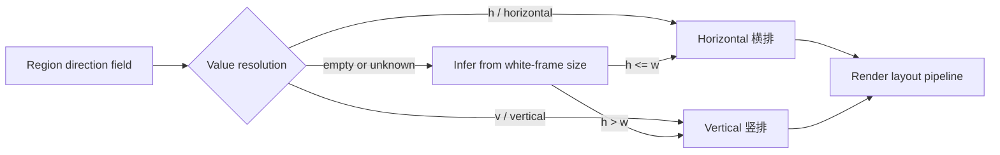
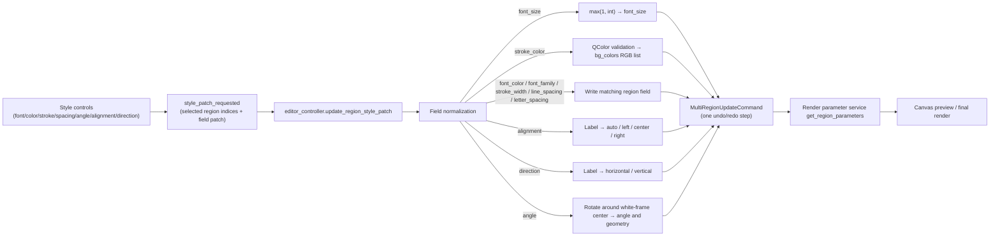

# Editor Style Properties

Use the “Style Settings” section of the property panel whenever you need to unify or fine-tune how text regions look: font, size, text color, stroke, line spacing, letter spacing, rotation angle, alignment, and layout direction. This guide covers region-level base styles only: each field change is emitted as one style patch that applies to all currently selected regions. Per-segment rich-text styles (bold, glow, ruby, TCY, and so on) are covered in [Floating rich text editor](./floating-rich-text.md), text content plus OCR/translation in [Region list and text editing](./region-list-and-text-editing.md), mask/brush/clone-stamp tools in [Canvas tools and selection](./canvas-tools-and-selection.md), and style persistence through project JSON in [Import, export, and writeback](./import-export-and-writeback.md).

## What you can do

- “Style Settings” is one of the three property-panel sections; the other two are “Image Editing” and “Text Content”. This guide covers the style section only.
- Style fields are per-region data fields (`font_family`, `font_size`, `bg_colors`, and so on), not global rendering-config keys. The global rendering group in Settings participates only as a fallback when a region has no corresponding field.
- With a single selection, the text, style, and action sections are enabled; with a multi-selection the text section is disabled while style and actions stay enabled, and changing any style field applies to all selected regions. With no selection all three sections are disabled. Multi-selection has no “mixed value” display; the style controls keep the value of the last single selection.
- Rich-text “local styles” (bold, italic, underline, strikethrough, text color, glow, outer stroke, TCY, ruby, local rotation, and so on) apply to one contiguous text segment and never write these region fields.
- A style preset saves only a subset of the region-level style fields; font size and angle are not saved.

## Use it in the editor

### Open the property panel and select regions

1. Open the editor. The left panel shows “Property Editor” by default.
2. Select one region on the canvas: the text, style, and action sections are enabled, and the style controls show that region's actual values.
3. Rubber-band or multi-select regions: the text section is disabled while the style and action sections stay enabled; changing any style field applies to all selected regions.
4. With no selection, all three sections are disabled and the style controls return to their initial defaults.
5. Before a canvas click the panel first forces pending property-panel text edits to be saved (`force_save_property_panel_edits()`), so edits are not lost when switching to the canvas.

### Change colors, stroke, and spacing

- Click the color button next to “Font Color” or “Stroke Color” to open the color flyout. It contains “Palette”, “Brightness”, “Custom”, “Common”, and “Recently used” groups, with HEX or RGB input. Click “Pick screen color” to enter the full-screen color sampler: left-click picks a color, right-click or Esc cancels.
- “Font Size” is controlled jointly by a spin box (8–1000) and a slider (8–150); the ranges differ because the slider covers only the common range.
- Setting “Stroke Width” to `0` disables the stroke.
- The color picker remembers picked colors under “Recently used” and persists them in the app configuration (up to 20), so they are directly selectable next time.

### Save and apply a style preset

1. After adjusting styles, click the save button (tooltip “Save current style combination”), enter a name, and save. The name must not be empty; if it already exists, confirm whether to overwrite it.
2. Choose a saved style from the “Style Preset:” dropdown to apply that combination to all currently selected regions; applying does not change font size or angle.
3. Click the delete button (tooltip “Delete selected saved style”) to delete the selected combination after a confirmation dialog.
4. If writing the config to disk fails, save or delete shows an error dialog.

### Adjust font size from the canvas

Hold Ctrl and scroll the wheel over the canvas to adjust the font size of all selected regions by about 5% of the current size per notch (clamped to a minimum of 1). Even with no selection the event is swallowed, so it never falls through to canvas zooming. Shift+wheel adjusts brush size, which belongs to the “Image Editing” section; see [Canvas tools and selection](./canvas-tools-and-selection.md).

## Parameters and options

See the [UI Options Reference](../../reference/options-i18n-matrix.md) for how each parameter's UI name, stored key, and default value map to each other.

#### Font {#font-family}

Choose the text font in Property panel → Style Settings. The font dropdown is sorted by the current UI language and lists the fonts installed on the system; leaving it empty follows the global rendering font. The canvas preview and final rendering update immediately, and the white frame is resized for the new font.

#### Font Size {#font-size}

Adjust the text size in Property panel → Style Settings: the spin box ranges 8–1000 and the slider ranges 8–150, kept in sync; the slider covers only the common range. You can also hold Ctrl and scroll the wheel over the canvas to resize all selected regions by about 5% of the current size per notch. The white frame is recomputed after a change and may overlap neighboring regions.

#### Font Color {#font-color}

Open the color picker in Property panel → Style Settings to choose the text color; you can enter HEX or RGB, or use “Pick screen color” to sample a color from the screen. Setting it overrides the original foreground color detected by OCR and shows immediately in the canvas preview and final rendering. Recently used colors are remembered so you can pick them directly next time.

#### Stroke Color {#stroke-color}

Open the color picker in Property panel → Style Settings to choose the stroke color. Whether a stroke is drawn is decided by “Stroke Width”: at `0` no stroke is drawn and the color has no effect.

#### Stroke Width {#stroke-width}

Adjust the stroke width in Property panel → Style Settings with the number input (0–1, step 0.01); the value is the stroke thickness relative to the font size, and `0` disables the stroke. The white frame is recomputed after a change.

#### Line Spacing {#line-spacing}

Adjust the line-spacing multiplier in Property panel → Style Settings with the number input (0.1–5, step 0.1); `1.0` means the default line spacing. The white frame is recomputed after a change.

#### Letter Spacing {#letter-spacing}

Adjust the letter-spacing multiplier in Property panel → Style Settings with the number input (0.1–5, step 0.1); `1.0` means the default letter spacing. The white frame is recomputed after a change.

#### Angle {#angle}

Enter the rotation angle in degrees in Property panel → Style Settings with the number input (-9999–9999, step 1); `0.0` means no rotation. The region geometry is recomputed around the white-frame center and the text box is drawn rotated by that angle.

#### Alignment {#alignment}

Choose how text sits inside the box from the dropdown in Property panel → Style Settings:

| Option | Description |
| --- | --- |
| Auto | The layout pipeline decides the alignment |
| Left | Text is aligned to the left edge of the box |
| Center | Text is centered horizontally inside the box |
| Right | Text is aligned to the right edge of the box |

#### Direction {#direction}

Choose the text layout direction from the dropdown in Property panel → Style Settings:

| Option | Description |
| --- | --- |
| Horizontal | Text runs left to right and wraps by line |
| Vertical | Text runs top to bottom and is laid out by column |

The dropdown does not offer “Auto”; a region without an explicit direction is shown by white-frame aspect ratio (taller than wide shows vertical, otherwise horizontal), and the inference only affects the panel display without writing back to the region data.

## How changes are saved

Every style-control change sends the “selected region indices + field patch” through `style_patch_requested` to the controller. The controller first normalizes the fields (integer font size, color-to-RGB conversion, alignment/direction label lookup, angle geometry rotation), then writes all selected regions with a single `MultiRegionUpdateCommand`, so one change corresponds to one undoable operation. The region data is then resolved by the render-parameter service for both canvas preview and final rendering.

Limitation note: the stroke color is written to `bg_colors` rather than to a same-named region field; font size, font family, line spacing, letter spacing, direction, and stroke width belong to `_FONT_AFFECTING_FIELDS` and resync the white frame, while color, alignment, and angle do not.

## Limitations and notes

- A style preset saves font, color, stroke, spacing, alignment, and direction, but not font size or angle; applying a preset never changes those two fields.
- “Copy Region / Paste Style” copies only `font_family`, `font_size`, `font_color`, `alignment`, `direction`, `line_spacing`, and `letter_spacing`; stroke color, stroke width, and angle are not copied. The right-click “🎨 粘贴样式” item is a hard-coded Chinese literal in the source, is not i18n'ed, and does not switch with the UI language.
- Multi-selection style edits apply the same patch to all selected regions and are recorded as one undo command; multi-selection has no “mixed value” display.
- Ctrl+wheel font-size adjustment on the canvas is a separate entry point that shares the `font_size` field with the panel spin box; Shift+wheel brush-size adjustment belongs to the “Image Editing” section.
- `line_spacing`/`letter_spacing` fall back to the rendering config (otherwise `1.0`) only when the region value is missing; an explicit value overrides the global one.
- The stroke color picker uses the `saved_stroke_colors` config key, but `AppSection` only defines `saved_colors`; cross-restart persistence may vary by release.
- Style fields affect only the editor preview and final rendering; they never change the OCR, translation, or mask stages.
