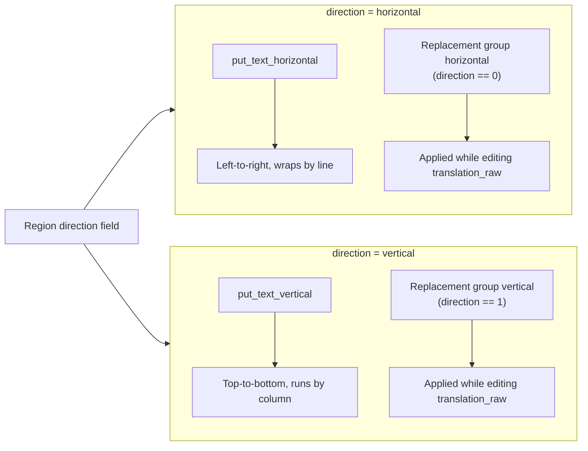

# Text Properties

Use this page when a line of dialogue needs to stand out, text must run vertically, spacing must be tuned, or a text region has to be rotated. It documents the text-typography fields in the editor’s “Property Editor”: Font, Font Size, Font Color, Line Spacing, Letter Spacing, Angle, Alignment, and Direction, together with their selection semantics, save timing, and rendering consumers.

Editing text content itself (original text, translation, pre-replacement translation, the placeholder/newline buttons, and the OCR/Translate buttons) is covered in [Region List and Text Editing](./region-list-and-text-editing.md); style presets and stroke are covered in [Style Properties](./style-properties.md); aligning/distributing regions on the canvas is covered in [Display, Compare, and Arrange](./display-compare-and-arrange.md).

## What you can do {#feature-boundary}

- The left-panel “Property Editor” contains, top to bottom, the “Image Editing”, “Text Content”, “Style Settings”, and “Actions” groups. This guide covers the typography fields in “Style Settings” that change a region’s text appearance: `Font:`, `Font Size:`, `Font Color:`, `Line Spacing:`, `Letter Spacing:`, `Angle:`, `Alignment:`, and `Direction:`.
- The “Text Content” and “Actions” groups belong to [Region List and Text Editing](./region-list-and-text-editing.md); this guide only references their field names and writeback semantics without repeating them.
- “Style Preset:”, “Stroke Color:”, and “Stroke Width:” in “Style Settings” belong to [Style Properties](./style-properties.md).
- The mask/brush/clone-stamp tools and layers in “Image Editing” belong to [Canvas Tools and Selection](./canvas-tools-and-selection.md) and [Mask, Paint, and Clone Stamp](./mask-paint-and-clone-stamp.md).
- The “Alignment:” field here is the text alignment inside the text box (auto/left/center/right). It is not the “Arrange” action that aligns multiple text boxes to each other; the latter belongs to [Display, Compare, and Arrange](./display-compare-and-arrange.md).

## Use it in the editor {#ui-operations}

### Property-panel sections and selection semantics {#panel-sections-and-selection}

After opening the editor, the left panel defaults to “Property Editor”. The selection state decides which of the four groups is enabled, handled centrally by `PropertyPanel.on_selection_changed()`:

| Selection state | Text Content | Style Settings | Actions | Behavior |
| --- | --- | --- | --- | --- |
| No selection | Disabled | Disabled | Disabled | Text boxes are cleared, font size resets to 12, line/letter spacing reset to 1.0, angle resets to 0, colors restore their defaults |
| Single selection | Enabled | Enabled | Enabled | The panel shows every field of that region and both text and typography can be edited |
| Multi selection | Disabled | Enabled | Enabled | Text boxes are cleared but the style controls stay enabled; typography changes apply to all selected regions as one undoable command |

Multi selection has no dedicated “mixed value” UI: the style controls keep their previous values, and any change emits `style_patch_requested(selected-indices, patch)`, which the controller normalizes and merges into a single `MultiRegionUpdateCommand`.

### Edit typography fields {#edit-typography-fields}

1. Select one text region on the canvas; the “Style Settings” group becomes enabled.
2. “Font:” is a searchable `FontComboBox` listing system fonts and fonts registered from the project `fonts/` directory; hovering a list item temporarily refreshes the text-box preview, while clicking commits the region `font_family`. Leaving or closing the list restores the current font. When “Disable System Fonts” is enabled in Typesetting, new choices here are limited to project fonts.
3. “Font Size:” is a number input (8–1000) plus a slider (8–150) that stay in sync; values beyond the slider range can still be typed into the input.
4. “Font Color:” is a color picker; recently used colors are saved to the `saved_colors` config entry.
5. “Line Spacing:” ranges from 0.1 to 5.0 in 0.1 steps; “Letter Spacing:” ranges from 0.1 to 5.0 in 0.01 steps. Both start at 1.0 and act as multipliers of the base spacing.
6. “Angle:” ranges from -9999 to 9999 degrees in whole-degree steps with a `°` suffix; changing it rotates the region geometry around the white-frame center.
7. “Alignment:” offers Auto/Left/Center/Right; “Direction:” offers only Horizontal/Vertical (`auto` is excluded; see [Parameters and options](#parameters)).
8. Every control change emits a style patch immediately; there is no separate “Save” step, and a batch of changes merges into one undoable command.

### Text content and actions {#text-content-and-actions}

The “Text Content” group maintains three text fields: source `text`, final `translation`, and pre-replacement `translation_raw`. “Show Translation (Raw)” is checked by default; when checked, the editor edits `translation_raw` and regeneration of `translation` through replacement rules happens in real time. The “Actions” group offers Copy/Paste/Delete. Field writeback, the `↵`/`[BR]` conversion, the placeholder/newline buttons, and the OCR/Translate buttons are detailed in [Region List and Text Editing](./region-list-and-text-editing.md).

## Parameters and options {#parameters}

See the [UI Options Reference](../../reference/options-i18n-matrix.md) for how each parameter's UI name, stored key, and default value map to each other.

#### Font {#font-family}

Choose the text font under “Font:” in Property panel → Style Settings. The dropdown is searchable and lists system fonts plus scalable fonts registered from the project `fonts/` directory, with display names localized per language; leaving it empty follows the global rendering font. An unavailable font does not block rendering: it falls back to the default font with a warning.

#### Font Size {#font-size}

Adjust the font size in Property panel → Style Settings: the number input ranges 8–1000 and the slider ranges 8–150, kept in sync; the slider covers only the common range. You can also hold Ctrl and scroll the wheel over the canvas to resize all selected regions. The white frame is recomputed after a change and may overlap neighboring regions.

#### Font Color {#font-color}

Open the color picker in Property panel → Style Settings to choose the text color. Setting it overrides the original foreground color detected by OCR and shows immediately in the canvas preview and final rendering; recently used colors are saved to the app config so you can pick them directly next time.

#### Line Spacing {#line-spacing}

Adjust the line-spacing multiplier in Property panel → Style Settings (0.1–5.0 in 0.1 steps); `1.0` means the default line spacing. The white frame is recomputed after a change.

#### Letter Spacing {#letter-spacing}

Adjust the letter-spacing multiplier in Property panel → Style Settings (0.1–5.0 in 0.01 steps); `1.0` means the default letter spacing. The white frame is recomputed after a change.

#### Angle {#angle}

Enter the rotation angle in degrees in Property panel → Style Settings (-9999–9999 in whole-degree steps); `0.0` means no rotation. The region geometry is rotated around the white-frame center and the text box is drawn rotated by that angle.

#### Alignment {#alignment}

Choose how text sits inside the box from the dropdown in Property panel → Style Settings:

| Option | Description |
| --- | --- |
| Auto | The layout pipeline decides the alignment |
| Left | Text is aligned to the left edge of the box |
| Center | Text is centered horizontally inside the box |
| Right | Text is aligned to the right edge of the box |

#### Direction {#direction}

Choose the text layout direction from the dropdown in Property panel → Style Settings (the dropdown does not offer “Auto”):

| Option | Description |
| --- | --- |
| Horizontal | Text runs left to right and wraps by line |
| Vertical | Text runs top to bottom and is laid out by column |

A region without an explicit direction is shown by white-frame aspect ratio (taller than wide shows vertical, otherwise horizontal); the inference does not write back to the region data. Horizontal and vertical take different layout and replacement paths; see [How direction changes rendering](#direction-render).

## How changes are saved {#runtime-behavior}

### Style-patch merging and save timing {#style-patch-flow}

The typography fields have no separate “Save” button: every control change emits a patch through `style_patch_requested`, and `EditorController.update_region_style_patch()` filters `_STYLE_PATCH_FIELDS`, normalizes values (`font_size` lower bound 1, spacing/stroke to float, `stroke_color` to `bg_colors` RGB, `alignment`/`direction` normalized), then merges all selected regions into one `MultiRegionUpdateCommand`, so a single change can be fully undone with `Ctrl+Z`. The `block_updates` flag stops the panel’s own refresh from re-emitting signals and creating a loop.

```mermaid
flowchart LR
    A["Typography control change\n(font/size/color/spacing/angle/alignment/direction)"] --> B["style_patch_requested\n(selected indices, patch)"]
    B --> C["update_region_style_patch"]
    C --> D["Filter _STYLE_PATCH_FIELDS and normalize"]
    D --> E{"angle in patch?"}
    E -->|yes| R["Rotate region geometry\naround white-frame center"]
    E -->|no| F["Compare per field, skip unchanged regions"]
    R --> F
    F --> G["Font-affecting field?\nfont_size/font_family/line_spacing/\nletter_spacing/direction"]
    G -->|yes| S["Sync white-frame size\nrecompute with calc_box_from_font"]
    G -->|no| H["MultiRegionUpdateCommand\n(one undoable command)"]
    S --> H
    H --> I["EditorModel updates all selected regions"]
    I --> J["Canvas re-render + undo history"]
```

### How direction changes rendering {#direction-render}

Direction is the only typography field that switches both the render function and the replacement-rule group: horizontal uses `put_text_horizontal` and the `horizontal` replacement group, while vertical uses `put_text_vertical` and the `vertical` replacement group. When editing `translation_raw`, `apply_replacements()` picks the group by the region’s current direction, so the same pre-replacement text can produce different final translations in horizontal versus vertical layout.

When a region has no explicit direction, the Property Editor infers the displayed value from the white-frame aspect ratio (taller than wide shows vertical) without writing region `direction`; the render service, in `calculate_default_parameters()`, derives the default direction by aspect ratio instead (ratio above 2 is horizontal, below 0.5 is vertical, otherwise `auto`).

## Limitations and notes {#dependencies-and-conflicts}

- Typography writeback depends on single selection or style-only multi selection: with multiple regions selected the text-content group is disabled and only typography changes broadcast to all selected regions.
- A text control being edited is not overwritten by ordinary refreshes; only asynchronous writebacks (`source="async"`) force-refresh text fields, protecting the caret and IME composition.
- The Property Editor’s sliders, number inputs, and dropdowns swallow the wheel only when they hold keyboard focus; otherwise the wheel goes to the parent scroll area and does not change values by accident.
- `Ctrl+wheel` resizes the font of all selected regions and `Shift+wheel` changes the shared brush size; both combinations are intercepted by the shortcut manager, see [Shortcuts](./shortcuts.md).
- Font size, letter spacing, line spacing, and direction are font-affecting fields; after writeback the white-frame size is resynced. The sync changes only the frame’s width, height, and center while keeping the body center fixed.
- The “Alignment:” field is text alignment inside the box; the six-way align/distribute actions in the “Arrange” menu align text boxes to each other. Do not mix the two.
- An unavailable font does not block rendering: it falls back to the default font with a warning; hand-editing JSON with a font-file path instead of a family name will not take effect.
- Stroke color/width and style presets belong to [Style Properties](./style-properties.md); this guide does not repeat their parameter definitions.
