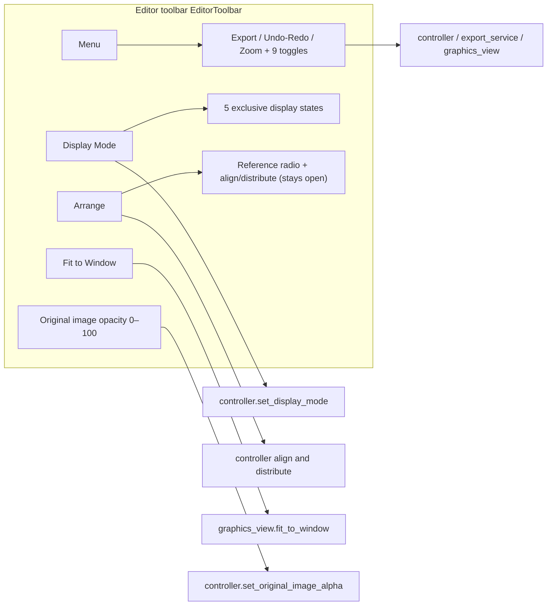

# Editor Toolbar and Menus

When you enter the editor, a fixed horizontal toolbar sits at the top. It groups high-frequency actions into three single-level dropdown menus (“Menu”, “Display Mode”, “Arrange”), exposes separate “Save” and “Export Image” buttons, and keeps two persistent controls (“Fit to Window” and original-image opacity). This guide explains how the three menus expand, where each menu item leads, and how the nine editor toggles are stored and persisted.

The complete options and canvas effects of “Display Mode” and “Arrange” live in [Display, Compare, and Arrange](./display-compare-and-arrange.md); canvas tools, property panels, the floating rich-text editor, shortcuts, and import/export are covered by [Canvas Tools and Selection](./canvas-tools-and-selection.md), [Text Properties](./text-properties.md), [Style Properties](./style-properties.md), [Floating Rich Text](./floating-rich-text.md), [Shortcuts](./shortcuts.md), and [Import/Export and Writeback](./import-export-and-writeback.md).

## What you can do

- The toolbar itself never switches pages: the back-to-home entry lives in the main-window sidebar, not in the editor toolbar.
- The “Menu” dropdown contains undo/redo, zoom in/out, and nine checkable toggles; the “Save” and “Export Image” buttons are separate actions.
- “Display Mode” is an exclusive radio selection that decides whether the canvas shows the original, text, boxes, nothing, or a two-panel comparison; “Arrange” provides a reference radio, alignment, and spacing distribution. Their complete options belong to [Display, Compare, and Arrange](./display-compare-and-arrange.md).
- Zoom in/out is view scaling only: it scales by 1.15 per step and clamps the canvas scale to `0.05`–`50.0`; “Fit to Window” only fits the view. Neither modifies any region data.
- The “Original Image Opacity” slider (0–100) controls only the transparency of the original-image overlay on the canvas; it is not an export parameter.
- The real shortcut registration is not in the toolbar: `Ctrl+S` (save), `Ctrl+Q` (export), and `Ctrl+Shift+R` (show/hide the floating rich-text editor) are registered by `EditorShortcutManager`; the toolbar only shows hint text.

## Use it in the editor

### Three dropdown menus

1. Open “Menu”: it shows undo/redo, zoom in/out, and nine checkable editor toggles. “Save” and “Export Image” are separate top-level buttons.

#### The nine edit toggles

The nine editor toggles in the “Menu” dropdown all carry a check mark. Their meanings and defaults are:

- **Enable Editor Snapping** (default `false`): snaps text-box rotation, movement, and scaling through the snapping logic.
- **Scale Text Boxes from Center** (default `false`): scales text boxes from their center point.
- **Show Rich Text Editor Popup** (default `true`): automatically opens the floating rich-text editor; `Ctrl+Shift+R` toggles it.
- **Pin Rich Text Editor Popup** (default `false`, `app.editor_rich_text_popup_pinned`): keeps the popup at its current position and prevents automatic hiding; changes are written to the configuration file immediately and restored after restart.
- **Auto Apply Rich Text Rules While Editing** (default `true`): applies rich-text styles automatically while editing.
- **Auto Save on Image Switch** (default `true`, `app.editor_auto_save_on_switch`): saves project data when switching images with unsaved edits.
- **Auto Export on Image Switch** (default `true`, `app.editor_auto_export_on_switch`): submits a rendered-image export when switching images with unsaved edits; export does not save project data.
- **Do Not Warn About Unsaved Changes** (default `false`, `app.editor_suppress_unsaved_warning`): when both automatic switch actions are off, skips the unsaved-edits dialog and discards the current unsaved project changes on switch.
- **Delete and Recover Removed Text** (default `false`): restores the original image area when deleting text boxes.

2. Open “Display Mode”: a radio group that switches between five canvas display states; see [Display, Compare, and Arrange](./display-compare-and-arrange.md) for the effects.
3. Open “Arrange”: first pick a reference (selection/canvas), then apply alignment or distribution; the menu stays open after a click so you can continue. See [Display, Compare, and Arrange](./display-compare-and-arrange.md) for the full options.

### Persistent toolbar controls

- Click “Fit to Window”: the current image is scaled to fill the canvas viewport while keeping its aspect ratio.
- Drag the “Original Image Opacity:” slider: `0` is fully transparent (showing the inpainted/cleaned background), `100` is fully opaque (showing the original); it starts at `0`.

## How changes are saved

### Menu expansion and language switching

All three dropdown buttons open single-level menus; there are no nested submenus, and icon, check/radio indicator, and text columns are laid out independently:

- “Menu” uses a `CheckableMenu` with a leading indicator column: checking one of the nine toggles shows the indicator, and the icon and text columns stay independent.
- The five “Display Mode” states and the “Arrange” reference options are exclusive `QActionGroup` radios.
- “Arrange” is a stay-open menu: it remains expanded after choosing a reference or applying an alignment/distribution so you can keep operating; clicking outside or pressing `Esc` closes it.
- On language switch, `EditorView.refresh_ui_texts()` calls `EditorToolbar.refresh_ui_texts()`, which rebuilds all three menus and restores the display mode, reference, toggles, and enabled states from internal fields so no state is lost.
- When the window is too narrow, toolbar content moves into a horizontal scroll area instead of wrapping or collapsing.

### Save, export, and automatic actions on image switch

- Clicking “Save” (or pressing `Ctrl+S`) writes project data and marks the current editor state clean; it does not render a final image.
- Clicking “Export Image” (or pressing `Ctrl+Q`) flushes pending drafts, creates an immutable render snapshot, and queues the final-image render; it does not write project data or mark the state clean.
- “Auto Save on Image Switch” and “Auto Export on Image Switch” are independent. If both are enabled, both actions run; neither substitutes for the other.
- If both automatic actions are disabled, “Do Not Warn About Unsaved Changes” skips the confirmation dialog and switches directly, discarding unsaved project changes. Otherwise the dialog offers save, discard, or cancel.

### Undo and redo

- Undo/redo is implemented with `QUndoStack` (`history_service`); after each command-state change, the controller updates the toolbar's undo/redo enabled state.
- The shortcut text on the toolbar is a hint only; the focus-aware registration lives in `EditorShortcutManager`.

### Zoom and fit to window

- “Zoom In (+)” / “Zoom Out (-)” call `_apply_zoom(1.15)` / `_apply_zoom(1 / 1.15)` per step and clamp the target scale to `0.05`–`50.0`.
- The canvas wheel zooms the same way (up zooms in, down zooms out, factor 1.15), anchored at the mouse position.
- “Fit to Window” calls `fitInView(..., KeepAspectRatio)` to place the current image fully inside the viewport.

### Original image opacity

- The slider value `0`–`100` maps to `0.0`–`1.0`: `0` is fully transparent (showing the inpainted/cleaned background) and `100` is fully opaque (showing the original).
- When an image loads and the user has not manually adjusted the opacity, the default depends on whether an inpainted image exists: `0` with one, `1` without. Once the user drags the slider, the session stops overriding it (`_user_adjusted_alpha`).
- Slider changes are mirrored back through the model's `original_image_alpha_changed` signal so external updates also refresh the slider position.

## Limitations and notes

- The toolbar only shows shortcut text and never registers `QAction` shortcuts, avoiding double triggers with `EditorShortcutManager`.
- The save/export actions are intentionally separate: saving persists project data, while exporting only renders the current snapshot.
- Turning off “Show Rich Text Editor Popup” immediately hides any visible floating editor; `Ctrl+Shift+R` performs the same toggle.
- “Pin Rich Text Editor Popup” persists through `app.editor_rich_text_popup_pinned`; it is restored from configuration after restart.
