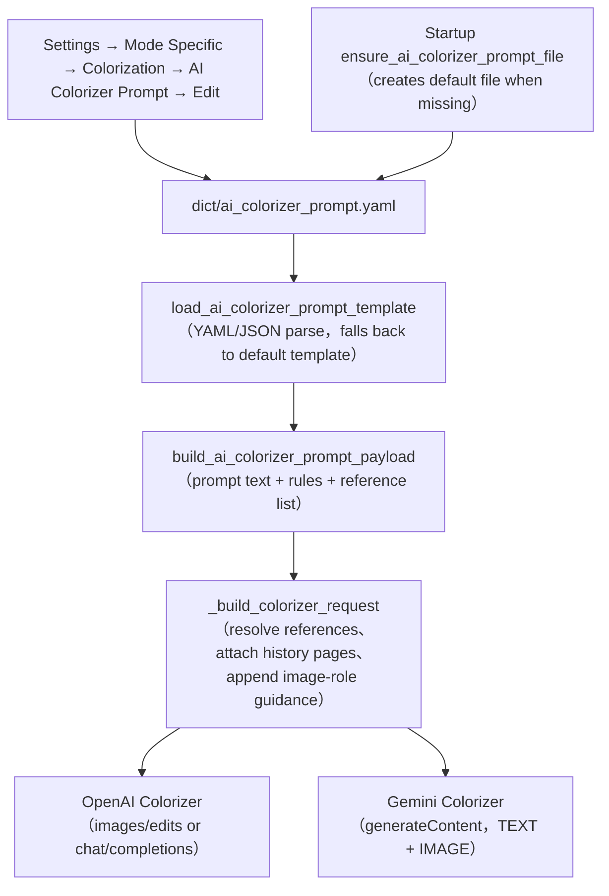
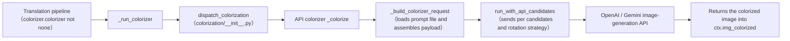

# AI Colorizer Prompt

When `OpenAI Colorizer` or `Gemini Colorizer` colorizes a manga page, the AI colorizer reads a fixed prompt file and sends its coloring instructions, colorization rules, and reference images together with the page image to the image-generation model. This guide documents where that file lives, which fields it contains, how it is loaded and injected into requests, and its boundary with the custom HQ translation prompt. Parameter details for the colorization model, colorization size, denoise strength, and history pages are in [Upscaling and colorization](../settings/upscale-and-colorization.md); the full prompt-list, apply, and preview workflow is in [Prompt list, apply, and preview](./list-apply-and-preview.md); translation prompts are covered in [Context and prompts](../translator/context-and-prompts.md).

## When to use it

- `colorizer.ai_colorizer_prompt_path` is the UI call key of the fixed prompt-edit action shown as “AI Colorizer Prompt” in Settings. It is not an ordinary configuration row and has no selectable-file combo box like `translator.high_quality_prompt_path`.
- Both the Settings edit action and the runtime request builder always target the default path `dict/ai_colorizer_prompt.yaml` (`DEFAULT_AI_COLORIZER_PROMPT_PATH`). Neither the Qt model `ColorizerSettings` nor the release file `config/config-example.json` persists a field with the same name; do not treat this key as a switchable translation-prompt path.
- This page never shows real prompt text, API keys, or user reference-image paths; it only documents the file structure, loading rules, and injection path.
- The offline colorizer `Manga Colorization v2` (`mc2`) does not read any prompt file; only `openai_colorizer` and `gemini_colorizer` load `dict/ai_colorizer_prompt.yaml`.

## Use it in Prompt Management

### Edit the AI colorizer prompt in Settings

1. Open “Settings”, select the “Mode Specific” tab, and locate the “Colorization” group.
2. Click “Edit” on the “AI Colorizer Prompt” row. The row only exposes an edit action; it has no path combo box or numeric input. The description panel reads “Fixed YAML prompt file used by OpenAI Colorizer and Gemini Colorizer. Click Edit to modify it directly.”
3. The “Edit Prompt” dialog title includes the file name and opens on the “Template Edit” tab, which contains three sections:
   - “Prompt Text”: the main coloring prompt in a multiline text box.
   - “Colorization Rules”: one rule per line, split into a list on save.
   - “Reference Images”: a two-column table with headers “Path” and “Description”; use “Add Reference Image” to pick an image file and enter a description, and “Delete Row” to remove rows.
4. “Add Section” re-inserts a removed section; sections can be moved up and down, but the on-screen order does not change the runtime loading order.
5. Switch to the “Raw Edit” tab to “Edit the raw file content directly”; the file must parse as YAML/JSON before saving, otherwise the status bar shows “Format Error”.
6. Click “Save” to write the file back and close; success shows “Saved successfully”, while failures show “Save failed” or “Serialize Error”.

Format essentials: `dict/ai_colorizer_prompt.yaml` is YAML whose root key is `ai_colorizer_prompt` (the coloring prompt string, can be empty), plus the `colorization_rules` and `reference_images` lists; edit the body via “Edit” in Settings; when the file is missing, the root is not an object, or the key is empty, the built-in default template is used.

Reference images give the AI colorizer color guidance: add well-colored samples—for example, an already-colored version of a character, or scene/background color examples—and the model sends them as suggestions together with the current page image to keep character and scene colors consistent across a batch or across pages. They are suggestions only, not strict pixel-for-pixel references; a missing reference image is only logged and skipped.

### Reach the dedicated editor from Prompt Management

The “Prompt Management” list is built by `get_hq_prompt_options()`, which excludes the system prompts and the three fixed AI prompt stems `ai_ocr_prompt`, `ai_colorizer_prompt`, and `ai_renderer_prompt`. Therefore `dict/ai_colorizer_prompt.yaml` itself is not listed there, which prevents it from being applied as a translation custom prompt.

When a user-created file contains colorizer-specific fields such as `ai_colorizer_prompt`, `colorization_rules`, or `reference_images`, `open_prompt_editor()` detects it by content (`is_ai_colorizer_prompt_file`) and opens the same `AIColorizerPromptEditorDialog`; the preview panel also renders the “Prompt Text / Colorization Rules / Reference Images” sections. Otherwise it falls back to the generic `PromptEditorDialog`.

## How prompts are loaded

### Prompt loading and request injection {#prompt-injection}

Limitation under the diagram: the file is loaded only when `colorizer.colorizer` is `openai_colorizer` or `gemini_colorizer`; `mc2`, `none`, and workflows that do not need colorization never read it. A missing reference image only logs a warning and is skipped; it does not abort the request.`n### Path into an AI colorization request {#request-path}

The `colorize_only` workflow returns `ctx.img_colorized` directly after colorization, skipping detection, OCR, translation, and typesetting; in the normal workflow, colorization runs after upscaling and before detection. AI colorization requests also apply the custom request parameters of the `colorizer` section (see the API-management pages), independently of the prompt file.

### History-page image context {#history-images}

`colorizer.ai_colorizer_history_pages` (“AI Colorizer History Pages”) affects only the OpenAI/Gemini colorizers: after each successful colorization the result image is kept in memory, and the next request attaches the most recent N colorized pages as `history_reference` images — image-only context, never text; `0` disables it. When fewer history pages exist, only the available ones are used; task ordering and concurrency isolation limit which pages are available.

## Limitations and notes

- Affects only AI colorizers: `mc2` and `none` never read the prompt file; rewriting it as a translation prompt does not change the offline colorizer.
- Not interchangeable with the custom HQ translation prompt: `translator.high_quality_prompt_path` is a selectable translation-prompt path, while `dict/ai_colorizer_prompt.yaml` is the fixed AI colorizer prompt file; `get_hq_prompt_options()` explicitly excludes AI prompt stems such as `ai_colorizer_prompt` so a colorizer file cannot be applied to a translation request.
- Reference-image paths can be user-private. Relative paths resolve in turn against the prompt directory, the image directory, the project root, and the current working directory; absolute paths are used directly. Public docs and screenshots must not contain these paths or images.
- Prompt content is business text. Before sharing logs, request exports, or debug directories, remove prompt bodies, reference-image paths, history-page images, and credentials.
- Raw mode in the editor requires parseable YAML/JSON; a non-object root, wrong field types, or a missing PyYAML makes the loader fall back to the default template, and the editor reports a format or serialization error on save.
