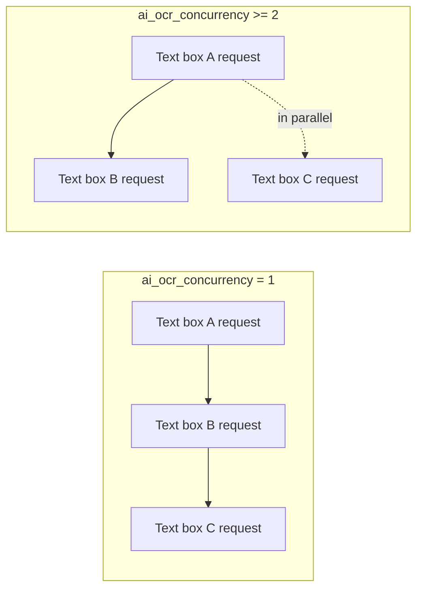
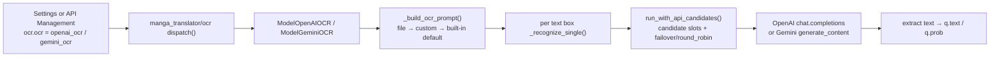

# AI OCR Prompt

When “OCR Model” is set to `openai_ocr` or `gemini_ocr`, AI OCR sends a prompt together with each cropped text-box image to the vision model. This guide documents the prompt's configuration keys, the prompt file under `dict/`, how it is loaded and injected, the path into the AI OCR request, and the boundary with custom HQ translation prompts. Overall OCR engine selection, credentials, and candidate slots are covered by [OCR, filter, and merge](../settings/ocr-filter-and-merge.md) and [API feature selectors](../api-management/feature-selectors.md); the generic prompt-file list and apply workflow is covered by [Prompt list, apply, and preview](./list-apply-and-preview.md).

## When to use it {#feature-boundary}

- `ocr.ai_ocr_prompt_path` is the fixed-prompt file action on the “AI OCR Prompt” row in Settings. It is bound to the backend `dict/ai_ocr_prompt.yaml` (auto-created when missing, migrating the legacy `dict/ai_ocr_prompt.json`) and is not itself persisted to `config/config.json`.
- `ocr.ai_ocr_custom_prompt` is a fallback prompt text that can be typed directly; `ocr.ai_ocr_concurrency` limits how many AI OCR requests are in flight for the same image.
- `dict/ai_ocr_prompt.yaml` is consumed only by `openai_ocr` / `gemini_ocr`; `translator.high_quality_prompt_path` is the custom prompt for HQ translation, and the two files and config keys cannot be interchanged.
- This page never embeds real prompt bodies or API keys; credentials, addresses, and models are covered by [API credentials, addresses, and models](../api-management/credentials-addresses-models.md).

## Use it in Prompt Management {#ui-operations}

### Configure in the “OCR” group of Settings {#configure-in-settings}

1. Open “Settings” and select the “OCR” group.
2. The “AI OCR Prompt” row is a fixed-prompt file action; click “Edit” to open the prompt editor.
3. Leave “AI OCR Custom Prompt” empty to use the file or the built-in default according to runtime precedence; a non-empty value takes part only when the file is empty or has no valid key.
4. Enter a positive integer in “AI OCR Concurrency”: `1` recognizes text boxes serially, `2` or higher recognizes several text boxes in parallel.
5. In the “OCR” tab of “API Management”, set the feature selector to OpenAI/Gemini and configure the `OCR_OPENAI_*` / `OCR_GEMINI_*` credential slots; see [API feature selectors](../api-management/feature-selectors.md).

### Edit the prompt file {#edit-prompt-file}

1. Clicking “Edit” in Settings opens the prompt editor (`SimplePromptEditorDialog`). The window title is “Edit: ai_ocr_prompt.yaml” and the card shows the relative path hint `dict/ai_ocr_prompt.yaml`.
2. The text box is prefilled with the current file content; when the file is missing it is created and prefilled with the built-in default prompt.
3. Click “Save” to write the plain text back to the file (a YAML `ai_ocr_prompt: |` block); click “Cancel” to discard changes. A write failure shows an “Error” message box and does not overwrite the original file.

Format essentials: `dict/ai_ocr_prompt.yaml` is YAML whose root key is `ai_ocr_prompt` (a string, can be empty); edit the body via “Edit” in Settings; when the file is missing or the key is empty, it falls back to “AI OCR Custom Prompt” and then the built-in default prompt.

## Parameters and options {#parameters-and-options}

> For the parameter reference (UI names, storage keys, and default values) on this page, see the reference page [UI Options Reference](../../reference/options-i18n-matrix.md).

#### AI OCR Prompt {#ocr-ai-ocr-prompt-path}

“AI OCR Prompt” is on Settings → OCR and is the fixed prompt-file action used by OpenAI OCR / Gemini OCR: clicking “Edit” opens the prompt editor to change the prompt body. It has no path combo box; the content is always written back to `dict/ai_ocr_prompt.yaml`. When the file is missing, it is created and prefilled with the built-in default prompt. Default: the built-in default prompt.

#### AI OCR Custom Prompt {#ocr-ai-ocr-custom-prompt}

“AI OCR Custom Prompt” is on Settings → OCR and is an optional text input. Leave it empty to use the prompt file or the built-in default; when filled, it participates only when the file is empty or has no valid key. Default: empty (disabled).

#### AI OCR Concurrency {#ocr-ai-ocr-concurrency}

“AI OCR Concurrency” is on Settings → OCR and is a positive-integer input that controls how many AI OCR requests are in flight for the same image: `1` recognizes text boxes serially, `2` or higher recognizes several text boxes in parallel. Higher concurrency recognizes a single image faster but makes API rate limits or quota more likely. Default: `10`.

Concurrency limits only how many AI OCR API requests are in flight for the same image; candidate-slot rotation still runs per request independently and is not changed by this setting.
## How prompts are loaded {#runtime-behavior}

### Prompt-file loading and precedence {#prompt-loading}

1. `ensure_ai_ocr_prompt_file()` guarantees that `dict/ai_ocr_prompt.yaml` exists: when missing it writes the built-in default, or migrates the legacy `dict/ai_ocr_prompt.json` content when present.
2. `load_ai_ocr_prompt_file()` parses `.yaml` / `.yml` / `.json` with `load_prompt_file()`; the root must be a dict and the first non-empty string key is returned in the order `ai_ocr_prompt` → `ocr_prompt` → `prompt`.
3. `_build_ocr_prompt()` precedence: file content → `ai_ocr_custom_prompt` → `DEFAULT_AI_OCR_PROMPT`.
4. The recognition response passes through `_normalize_ocr_text()`: line endings are unified, surrounding whitespace is stripped, and surrounding triple-backtick code fences are removed when the model returned Markdown.

### Path into the AI OCR request {#request-path}

The prompt is sent as the text part of a `user` message together with the text-box PNG: OpenAI uses `text` + `image_url` (base64 data URL) in `messages[0].content`; Gemini uses `text` + `inlineData` in `contents[0].parts`. When custom API parameters are enabled, the `ocr` section of `config/custom_api_params.json` (default `temperature: 0.0`) is merged into the request body; credentials and candidate endpoints are resolved from `.env` / API-management slots via `resolve_runtime_api_config(feature="ocr", ...)`.

## Limitations and notes {#dependencies-and-conflicts}

- `ocr.ocr` must be `openai_ocr` or `gemini_ocr`, otherwise the AI OCR prompt is not consumed; offline OCR (48px, PaddleOCR, etc.) uses its own model prompts and is out of scope here.
- The prompt file is consumed only by AI OCR; `translator.high_quality_prompt_path` is the custom HQ translation prompt, see [Context and prompts](../translator/context-and-prompts.md), and the two files cannot be interchanged.
- `ai_ocr_prompt` is a system-prompt stem, excluded from the “Prompt Management” list and the HQ prompt dropdown, so it never appears in [Prompt list, apply, and preview](./list-apply-and-preview.md); the only edit entry point is Settings.
- AI OCR requests are also affected by the Key/Base/Model slots, candidate-slot rotation, and custom request parameters in API Management; those mechanisms do not change prompt content.
- Prompt bodies are user content; before sharing logs, request exports, or debug directories, remove prompt text, text-box text, paths, and credentials.
