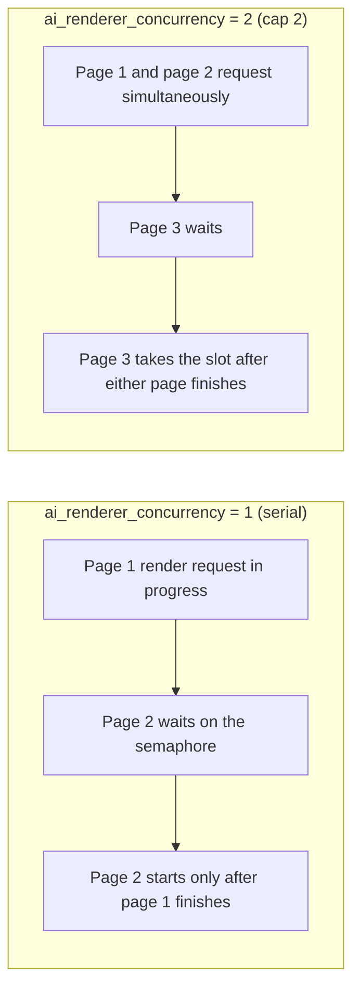
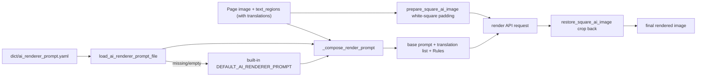
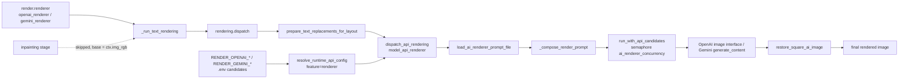

# AI Renderer Prompt

When the renderer is set to `openai_renderer` or `gemini_renderer`, page translations are no longer drawn by local font typesetting; the page image and region translations are sent to an image-generation model instead. This guide documents the fixed prompt file used by AI rendering, how it is loaded and injected, the path into an AI render request, and its boundary with the custom HQ translation prompt.

This guide does not cover the renderer enum, fonts, or typesetting parameters (see [Typesetting and rendering](../settings/typesetting-and-rendering.md)), API credentials, candidate slots, or rotation (see the API-management pages), nor the custom HQ translation prompt itself (see [Context and prompts](../translator/context-and-prompts.md)).

## When to use it {#feature-boundary}

- `render.renderer` decides whether AI rendering is used: `openai_renderer` / `gemini_renderer` go through an image-generation API, `default` uses local Qt/text_render drawing, and `none` skips text drawing.
- `render.ai_renderer_prompt_path` is the UI row key for a fixed prompt-file edit action in the “Typesetting” tab, not a persisted config value and not a switchable path; it always edits `dict/ai_renderer_prompt.yaml`.
- `render.ai_renderer_concurrency` limits how many AI render API requests run at the same time for the same provider.
- The AI renderer prompt is a fixed file. It belongs to a different feature than the user-selectable custom HQ prompt (`translator.high_quality_prompt_path`); the files must not be interchanged.

## Use it in Prompt Management {#ui-operations}

### Edit the AI renderer prompt in Settings {#edit-in-settings}

1. Open “Settings” and select the “Typesetting” group.
2. Find the “AI Renderer Prompt” row and click the “Edit” button on the right.
3. A prompt-edit dialog (`SimplePromptEditorDialog`) opens: the window title is “Edit: ai_renderer_prompt.yaml”, the title and section label are “AI Renderer Prompt”, and the path hint is `dict/ai_renderer_prompt.yaml` (selectable for copying).
4. The editor is a monospace text box that starts with the current prompt-file content; if the file is missing it shows the built-in default prompt. Clicking “Save” writes the file back as a YAML literal block; clicking “Cancel” discards changes; a failed save shows the “Error” dialog.

Format essentials: `dict/ai_renderer_prompt.yaml` is YAML whose root key is `ai_renderer_prompt` (a string, can be empty); edit the body via “Edit” in Settings; when the file is missing or the key is empty, the built-in default prompt is used.

### Boundary with Prompt Management {#prompt-management-boundary}

When “Prompt Management” is opened, the list contains only user prompt files; `get_hq_prompt_options()` scans `dict/` for `.yaml`, `.yml`, and `.json` files while excluding system-prompt stems such as `ai_renderer_prompt`. The AI renderer prompt therefore never appears in the “Apply Selected Prompt” candidates and is never overwritten by an HQ apply operation. The full Prompt Management workflow is covered in [Prompt list, apply, and preview](./list-apply-and-preview.md).

## Parameters and options {#parameters-and-options}

> For the parameter reference (UI names, storage keys, and default values) on this page, see the reference page [UI Options Reference](../../reference/options-i18n-matrix.md).

#### Renderer {#render-renderer}

The “Renderer” dropdown is in the Settings → Typesetting group and decides how the translation text is drawn: Default uses local font typesetting, OpenAI Renderer / Gemini Renderer redraw the translation with an image-generation API, and None draws nothing. With an AI renderer the inpainting stage is also skipped. Default: Default. See [Typesetting and Rendering](../settings/typesetting-and-rendering.md) for details.

#### AI Renderer Prompt {#render-ai-renderer-prompt-path}

“AI Renderer Prompt” is on the Settings → Typesetting tab and is the fixed prompt-file action used by OpenAI rendering / Gemini rendering: clicking “Edit” opens the prompt editor to change the prompt body. It has no path combo box; the content is always written back to `dict/ai_renderer_prompt.yaml`. When the file is missing, the built-in default prompt is shown. Default: the built-in default prompt.

#### AI Renderer Concurrency {#render-ai-renderer-concurrency}

“AI Renderer Concurrency” is on the Settings → Typesetting tab and is a positive-integer input that controls how many AI render API requests run at the same time for the same provider: a higher value lets more pages render at the same time in batch mode, but makes API rate limits or 429 responses more likely. Default: `1`.

Concurrency is grouped per provider: `openai_renderer` and `gemini_renderer` each have their own semaphore, so raising concurrency only affects pages of the same renderer. The real number of simultaneous requests is also bounded by API rate limits, candidate rotation, and network round trips, so it does not always equal the concurrency cap.
## Prompt-file loading and injection {#loading-and-injection}

### Fixed-file loading {#prompt-file-loading}

`dict/ai_renderer_prompt.yaml` is the fixed prompt file of the AI renderer. At startup, both `ConfigService.__init__` and `runtime_files.ensure_runtime_files()` call `ensure_ai_renderer_prompt_file()`: a missing file is written with the built-in default prompt, and a file matching a legacy prompt is upgraded to the default prompt, but already-modified user content is never overwritten.

### Injection into the render request {#prompt-injection}

When a request is built, `_build_base_prompt()` calls `ensure_ai_renderer_prompt_file()` again and loads via `load_ai_renderer_prompt_file(None)`; if loading fails or returns empty, it falls back to the built-in `DEFAULT_AI_RENDERER_PROMPT`. `_compose_render_prompt()` appends the following to the base prompt:

- a header line, “Translation list with original texts as reference:”;
- one `- translation: ...` entry per region with non-empty translation, plus `original: ...` (the source text as reference) and `direction: vertical|horizontal`;
- a fixed `Rules:` list (match each line to the corresponding bubble, render every translation including sound effects, keep the page layout and artwork intact, return only the rendered image).

Translation values are first flattened with `rich_text.plain_text_of()` and line breaks are escaped to `\\n`. Before sending, the page image is padded to a white square with `prepare_square_ai_image()`; after the response, `restore_square_ai_image()` crops it back to the original size, and a LANCZOS resize is applied when the returned size differs.

## Path into the AI render request {#request-path}

After `openai_renderer` / `gemini_renderer` is selected, the text-rendering stage calls `rendering.dispatch` (in `manga_translator/rendering/__init__.py`), which first runs `prepare_text_replacements_for_layout()` on the regions (applying replacement rules) and then calls `model_api_renderer.dispatch_api_rendering()`. The latter creates `OpenAIRenderer` or `GeminiRenderer` from `render.renderer` and runs `BaseAPIRenderer.render()`:

1. `_read_runtime_config()` reads the `.env` candidates through `resolve_runtime_api_config(feature="renderer", provider=...)`; OpenAI uses `RENDER_OPENAI_API_KEY` / `RENDER_OPENAI_API_BASE` / `RENDER_OPENAI_MODEL` (falling back to `OPENAI_API_KEY` / `OPENAI_API_BASE`), and Gemini uses `RENDER_GEMINI_API_KEY` / `RENDER_GEMINI_API_BASE` / `RENDER_GEMINI_MODEL` (falling back to `GEMINI_API_KEY` / `GEMINI_API_BASE`).
2. Regions with non-empty translations are kept; if there are none, the original image is returned as-is.
3. The prompt and the square page image are built (see the previous section).
4. After acquiring the semaphore, `run_with_api_candidates()` issues the request according to the candidate slots and strategy; a failing candidate rebuilds the client and rotation continues.
5. OpenAI uses `request_openai_image_with_fallback()` (trying compatible endpoints in order); Gemini uses `generate_content()` (`responseModalities: ["TEXT", "IMAGE"]`, with built-in safety thresholds off).
6. The result is cropped back to the original size and returned.

Another key path is the inpainting stage: `_should_skip_inpainting_for_ai_renderer()` skips inpainting when `render.renderer` is `openai_renderer` / `gemini_renderer` and sets `ctx.img_inpainted = ctx.img_rgb`, so the AI render base image is the original working image rather than the inpainted image.

## Boundary with the custom HQ prompt {#hq-prompt-boundary}

An AI render request reads only `dict/ai_renderer_prompt.yaml` and never reads the HQ custom prompt; conversely, HQ translation never reads the AI renderer prompt. Their text structures differ (the HQ prompt carries placeholders and an output format, while the AI renderer prompt is free text for an image model), so interchanging the files causes unexpected request behavior.

## Limitations and notes {#dependencies-and-conflicts}

- When `openai_renderer` / `gemini_renderer` is selected but the matching `.env` API key is missing, the UI shows the “API Keys Required” dialog before translation starts and blocks the launch. The OpenAI renderer allows an empty key when a local base address is configured (`allow_empty_api_key_for_local_base`); the Gemini renderer always requires a key.
- `RENDER_*` keys participate in the API-management candidate slots and rotation (`API_ROTATION_ENV_GROUPS`); rotation does not change `render.renderer` or the prompt file.
- With AI rendering, the inpainting stage is skipped and the base image is the original working image; mask, inpaint, and typesetting debug artifacts are not produced by this path.
- Replacement rules are applied to translations before the AI render request (`prepare_text_replacements_for_layout`), and rich-text rules run in the post-request sync stage.
- Concurrency, API rate limits, and candidate rotation together determine actual throughput; cancelled tasks must not share intermediate requests or user images.
- This page records only the prompt schema and sanitized placeholders, never real prompt bodies, keys, user names, or private absolute paths.
