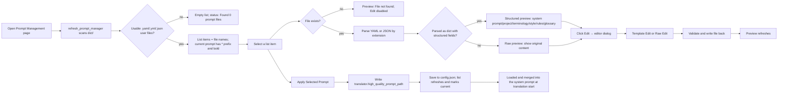

# Prompt List, Apply, and Preview

When a custom HQ prompt is maintained as a file, this page lists the user prompt files under `dict/`, writes the selected file into the translator configuration, previews file content, and opens the editor. It does not explain the meaning of the Custom Prompt parameter itself (see [Context and prompts](../translator/context-and-prompts.md)), nor does it manage the fixed system prompts or the AI OCR/colorizer/renderer prompts (see [System and translation prompts](./system-and-translation-prompts.md), [AI OCR prompt](./ai-ocr-prompt.md), [AI colorizer prompt](./ai-colorizer-prompt.md), and [AI renderer prompt](./ai-renderer-prompt.md)).

## When to use it {#feature-boundary}

- The list shows only user prompt files with `.yaml`, `.yml`, or `.json` under `dict/`, excluding system-prompt stems (`system_prompt_hq`, `system_prompt_hq_format`, `system_prompt_line_break`, `glossary_extraction_prompt`, `ai_ocr_prompt`, `ai_colorizer_prompt`, `ai_renderer_prompt`).
- “Apply Selected Prompt” writes `dict/<filename>` into `translator.high_quality_prompt_path` and persists it to `config/config.json`; it does not switch translator type, API credentials, or candidate slots.
- The preview has two display modes: structured and Raw. The Edit entry opens a secondary dialog; structured files contain two tabs: “Template Edit / Raw Edit”.
- This page never embeds real keys or private prompt bodies; local paths in error messages must not be copied into public reports.

## Use it in Prompt Management {#ui-operations}

### View the prompt list

1. Open “Prompt Management” from the left navigation. The page title is “Prompt Management” and the subtitle is “Manage and apply prompt files for translation”.
2. The “Prompt List” card shows the available files. The currently applied prompt carries a `* ` prefix, is bold, uses the accent color, and shows the tooltip “Current prompt: {filename}”.
3. The status label shows “Found {count} prompt files.”. Returning to this page or clicking “Refresh” rescans `dict/`; clicking “Open Directory” opens the `dict/` folder in the system file manager.

### Apply the selected prompt

1. Select a prompt file in the list.
2. Click “Apply Selected Prompt”, or double-click the list item.
3. The app writes `dict/<filename>` into `translator.high_quality_prompt_path` and saves the configuration; after the list refreshes, that item becomes the current prompt and the status label shows “Current prompt: {filename}”.
4. The same path appears in Settings → Translation under “Custom Prompt”.

### Preview structured and Raw content

- With no file selected, the “Prompt Preview” panel on the right shows “Select a prompt file to preview” and the Edit button is disabled.
- Once a file is selected, the title area shows the filename. If the file parses to a dict and contains structured fields (`system_prompt`, `project_data`, `style_guide`, `translation_rules`, `glossary`, or colorizer prompt fields), structured sections are rendered: system prompt, project/project data and terminology, style guide, translation rules, and glossary (categorized by Person/Location/Org/Item/Skill/Creature); colorizer files additionally show Prompt Text, Colorization Rules, and Reference Images.
- Content that cannot be parsed or is not structured shows “Unrecognized format – showing raw content” in a read-only text box.
- The preview is read-only; use the Edit button to modify the file.

### Open the editor

1. Click “Edit” in the top-right corner of the preview panel.
2. Structured files open the “Edit Prompt” dialog with two tabs, “Template Edit / Raw Edit”; non-structured files show only “Raw Edit”.
3. Template Edit organizes fields into sections and lets you add/remove fields with “Add Section” and move sections up/down; Raw Edit modifies the raw text directly.
4. Saving validates the format (YAML/JSON) and writes the UTF-8 file back; on success the status shows “Saved successfully” and the preview refreshes automatically. AI colorizer prompt files (`ai_colorizer_prompt.yaml`) open the dedicated colorizer prompt editor.

### New, copy, rename, and delete

- “New” creates a YAML prompt template; after entering a file name (without extension) it is written to `dict/`.
- “Copy” copies the selected file; the default new name is `original_copy`.
- “Rename” renames the selected file; if the renamed file is the current prompt, `translator.high_quality_prompt_path` is updated too.
- “Delete” shows “Confirm Delete” and asks “Are you sure you want to delete this prompt file?”; deleting the current prompt clears the path.
- New/Copy/Rename validate the file name (illegal characters, collisions, invalid extensions); on success the status label shows “Created/Copied/Renamed to/Deleted: {filename}”.

## Empty and error states {#empty-and-error-states}

| Trigger | List/status label | Preview panel | Available actions |
| --- | --- | --- | --- |
| No file selected | Status label stays “Found {count} prompt files.” | “Select a prompt file to preview”; Edit disabled | New / Refresh / Open Directory |
| `dict/` has no usable user files | “Found 0 prompt files.”; list is empty | Same as above (cleared state) | New / Open Directory |
| Selected file was deleted externally | The list item may still exist briefly | “File not found”; Edit disabled | Refresh / Delete |
| File exists but parsing fails or the root is not a dict | Status label unchanged | “Unrecognized format – showing raw content” | Edit (Raw Edit validates on save) |
| I/O error while reading the file | Status label unchanged | “Error reading file: {error}” | Edit |
| Format or serialization error while saving | Editor status area shows “Format Error / Serialize Error / Save failed” | — | Fix and save again |

Error messages may contain local paths or parse details; sanitize them before copying into public reports.

## How prompts are loaded {#runtime-behavior}

List refresh, selection preview, apply, and edit share one data flow:

- List source: `controller.get_hq_prompt_options()` scans `config_service.root_dir/dict`, collects only `.yaml/.yml/.json`, sorts by file name, and excludes system-prompt stems. `refresh_prompt_manager` uses a signature of “file tuple + current file name” to decide whether the list must be rebuilt.
- Apply action: `apply_selected_prompt` emits `setting_changed("translator.high_quality_prompt_path", "dict/<filename>")`; `app_logic.update_single_config` updates the config model and calls `save_config_file()` to persist. This key is not hot-reloaded into the translation service; it is read at translation start.
- Preview decision: `PromptPreviewPanel.load_file` first checks that the file exists, then parses with `yaml.safe_load` / `json.load`; `_is_structured` requires a dict root with at least one structured field. Parse failures or non-structured content always fall back to the Raw preview.
- Editor save: `PromptEditorDialog` collects fields and serializes them on the template tab (YAML with `allow_unicode`, JSON with `indent=2`), validates JSON/YAML syntax on the Raw tab, writes UTF-8 back, and the preview refreshes after closing.
- Final consumer: at translation start `_load_and_prepare_prompts` resolves the relative `dict/<filename>` to an absolute path and loads it with `load_custom_prompt` (which tries alternate extensions when the file is missing), storing the result in `ctx.custom_prompt_json`; `_build_system_prompt` flattens it with `_flatten_prompt_data` and places it before the base system prompt. With `extract_glossary` enabled, newly extracted terms are written back into the file’s `glossary` field through `merge_glossary_to_file`.

## Limitations and notes {#dependencies-and-conflicts}

- `translator.high_quality_prompt_path` is consumed by the OpenAI/Gemini translators (including the HQ variants); `_load_and_prepare_prompts` loads the custom prompt whenever this path is set. Translators such as Sakura do not read this field, so switching to one of them keeps the path in config but it is not consumed.
- The apply action only writes a config key; it does not switch translators or API candidate slots. See [Translator selection](../translator/selection-and-languages.md) and the API-management pages for those boundaries.
- The list excludes system prompts and the AI OCR/colorizer/renderer prompt files; those fixed prompts are edited in Settings → OCR / Typesetting / Mode Specific, not CRUD here.
- Deleting the current prompt clears the path; renaming the current prompt updates the path. Files are re-validated when applied.
- Prompt bodies are user content; before sharing logs, request exports, or debug directories, remove prompt text, local paths, and credentials.
