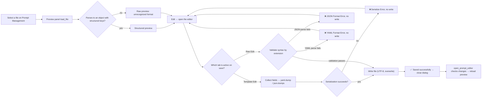

# Prompt Structured Editor

When you need to edit a custom translation prompt file under `dict/`, the “Edit” action on the Prompt Management page opens the structured editor. The editor offers two modes: “Template Edit”, which turns the structured fields of a YAML/JSON file into a form, and “Raw Edit”, which edits the file text directly. This guide covers how the two modes are decided, the fields and formats, validation errors, and how the file is consumed and restored after saving.

This guide covers the editor itself. The file list, create/copy/rename/delete, and applying a prompt are covered by [Prompt list, apply, and preview](./list-apply-and-preview.md); system prompts and output-format composition are covered by [System and translation prompts](./system-and-translation-prompts.md) and [Context and prompts](../translator/context-and-prompts.md).

## When to use it

- The structured editor reads and writes user prompt files under `dict/` (`.yaml`, `.yml`, `.json`); it never writes `.env`, `config.json`, or any API credential.
- The editor only writes the file back; “Apply Selected Prompt” writes the path to `translator.high_quality_prompt_path` and belongs to the prompt-list page.
- A file containing `ai_colorizer_prompt`, `colorization_rules`, or `reference_images` is recognized as an AI colorizer prompt and is opened by the dedicated colorizer editor instead of the generic structured fields.
- Fixed AI OCR and AI renderer prompts use their own simple editors in Settings and never enter this page's template fields; system prompt files (`system_prompt_hq`, `system_prompt_hq_format`, `system_prompt_line_break`, `glossary_extraction_prompt`) do not appear in the user prompt list.
- The page records structure and sanitized placeholders only; it never shows real prompt bodies, keys, or private paths.

## Use it in Prompt Management

### Open the editor {#open-editor}

1. Open “Prompt Management” and select a file in the “Prompt List” on the left. The “Prompt Preview” panel on the right shows a structured preview or the raw content.
2. Click “Edit” in the top-right of the preview panel to open the “Edit Prompt” dialog; the window title looks like “Edit Prompt – filename”.
3. When the file is missing, the preview panel shows “File not found” and “Edit” is disabled; when the file cannot be read, the editor status bar shows “Error: {error}”.
4. The “Custom Prompt” control in the “Translation” group of Settings is a combo box that only selects the current prompt file; editing the file content requires opening the editor from the Prompt Management page.

### Template Edit and Raw Edit tabs {#editor-tabs}

The top of the editor has two tabs:

- “Template Edit”: shown only when the file can be parsed into structured fields; it splits fields into a form and offers “Add Section”, move up/down, and delete actions.
- “Raw Edit”: always shown; it edits the raw file text in a monospace editor with the hint “Edit the raw file content directly”.

Files that do not match the format show only the “Raw Edit” tab. Both tabs share the same “Save” button and bottom status bar; after saving, the two tabs are synchronized.

## Structured fields and detection {#structured-fields}

### Structured detection {#structured-detection}

A file is parsed by extension first: `.yaml`/`.yml` use PyYAML `safe_load`, everything else uses `json.load`. The result must be an object (dict) and contain structured fields to be treated as structured. When parsing fails, the root is not an object, or none of the structured fields is present, the preview shows “Unrecognized format – showing raw content” and the editor keeps only the “Raw Edit” tab. Root-type errors correspond to “JSON root must be an object” and “YAML root must be a mapping” in the related editors.

### Fields and controls {#fields-table}

The Template Edit tab creates one section per field already present in the file; missing fields can be added with “Add Section”. Each section can be moved up, moved down, or deleted; the section order determines the key order of the saved file. Other keys without a dedicated control in the template are preserved as-is (“passthrough”) and are not dropped by a template save; for example `output_format`, `persona`, or future extension keys keep their values when data is collected.

### Glossary categories {#glossary-categories}

The tabs under `glossary` follow the fixed category order, and the category is the stored value rather than a translated label; for example, the English tab label for `Org` is Organization. Every category uses the same entry shape: top-level `original` is the canonical source name, while `aliases` stores its source-language aliases or forms. Each alias owns a `translations` list whose items contain `text` plus an optional `condition`. The editor presents these as Alias / Translation / Condition rows and groups repeated aliases into multiple translation branches. When a new entry has no aliases, its canonical name is copied into the first alias automatically. Every category may also have a `description`.

`overwrite` controls whether automatically extracted results may append new aliases for the same canonical original and is disabled by default. Automatic extraction returns top-level `original`, `category`, and `aliases`; each alias must contain exactly one `translations[].text`. An existing original accepts new aliases only when `overwrite: true`; an alias that already exists is discarded as a whole, so AI never appends a second translation to it. Conditions, descriptions, overwrite flags, and other unknown fields supplied by AI are not written back. Only the original single-`translation` glossary shape is supported as a legacy storage format and is converted to `aliases` after a structured save. Empty categories are kept so that `glossary` is not collapsed to an empty object after saving.

## Validation, saving, and recovery {#validation-save-restore}

### Saving from the Template tab {#template-save}

1. Clicking “Save” first collects data from the controls (`_collect_template_data`).
2. It serializes by file extension: `.yaml`/`.yml` use `yaml.dump(allow_unicode=True, default_flow_style=False, sort_keys=False)`; `.json` uses `json.dumps(indent=2, ensure_ascii=False)`.
3. A serialization exception shows “❌ Serialize Error” in the status bar and does not write the file.
4. On success the status bar shows “✅ Saved successfully”, the Raw tab is synchronized to the same text, and the dialog closes.

### Saving from the Raw tab {#raw-save}

Before writing, the Raw tab validates syntax by extension; validation failure does not write the file:

- `.json`: `json.loads(content)` fails → “❌ JSON Format Error”.
- `.yaml`/`.yml`: `yaml.safe_load(content)` fails → “❌ YAML Format Error”.

Validation checks syntax only, not the root type. The file is written as UTF-8 and overwrites the original in place. A write exception shows “❌ Save failed” and the dialog stays open.

### Statuses and errors {#status-errors}

| Status | Trigger | Result |
| --- | --- | --- |
| `Loaded successfully` | File read and parsed | Ready to edit |
| `Error: {error}` | File read failure | Error shown, empty content |
| `Serialize Error` | Template collection or serialization exception | No write; dialog stays open |
| `Format Error` | JSON/YAML syntax error in Raw | No write; dialog stays open |
| `Save failed` | File write exception | No write; dialog stays open |
| `Saved successfully` | Write succeeded | Both tabs synchronized; dialog closes |

### Closing and recovery {#close-restore}

- “Cancel” or closing the window never writes; edits live only in the current session's controls.
- After the editor closes, the caller reads `get_was_modified()`; if a save happened or the Raw tab differs from the original, the preview panel is reloaded to show the latest file content.
- Prompt files have no automatic backup: the editor overwrites in place and does not create a `.bak` before saving. Restoring old content requires your own copy or version control, unlike batch schemes which write `.bak`.
- If a file becomes unparseable, translation does not crash: it skips the custom prompt and keeps the built-in base system prompt. Fix the file and reopen the editor to restore the custom prompt.

## Runtime consumption {#runtime-consumption}

Before translation starts, `_load_and_prepare_prompts` reads `translator.high_quality_prompt_path` and parses the file with `load_custom_prompt` (lookup order `.yaml` → `.yml` → `.json`; a non-object root returns empty). The parsed structured data is then flattened into a text block by `_flatten_prompt_data` and injected into the OpenAI/Gemini system prompt; the target-language placeholder (written as a three-brace `target_lang` placeholder) is replaced with the full target-language name.

With “Auto Extract Glossary” (key `translator.extract_glossary`) enabled, newly extracted terms are merged back into the file's `glossary` by `merge_glossary_to_file` (writing YAML or JSON by extension). A new original creates a same-name first alias and stores the extracted value in that alias's `translations`. For an existing original, only genuinely new aliases are appended when the entry explicitly sets `overwrite: true`; an alias that already exists is ignored, even if the AI proposes another translation. Automatic merging never changes authored translations, conditions, descriptions, overwrite flags, or other authored branches. In other words, besides the editor, a running translation can also write the prompt file back when the conditions are met.

## Limitations and notes

- The format depends on PyYAML at runtime: when `PyYAML` is missing, `.yaml`/`.yml` cannot be parsed, the editor falls back to Raw mode, and translation skips the custom prompt.
- A prompt file affects only the translation request's system prompt; it does not store API credentials, choose a translator, or participate in API-slot rotation.
- A template save preserves unknown keys, but keys and formats you hand-write in the Raw tab are your responsibility; a wrong root type (for example a top-level list) is not recognized as structured.
- Do not put API keys, tokens, usernames, private absolute paths, or sensitive business text into a prompt file; the file is flattened verbatim into requests and may appear in logs and debug artifacts.
- Automatic glossary merging modifies the current prompt file; if you do not want the runtime to change the file, disable “Auto Extract Glossary” or use a read-only copy.
