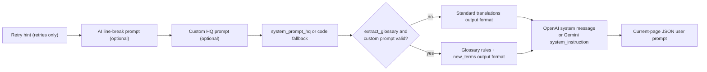
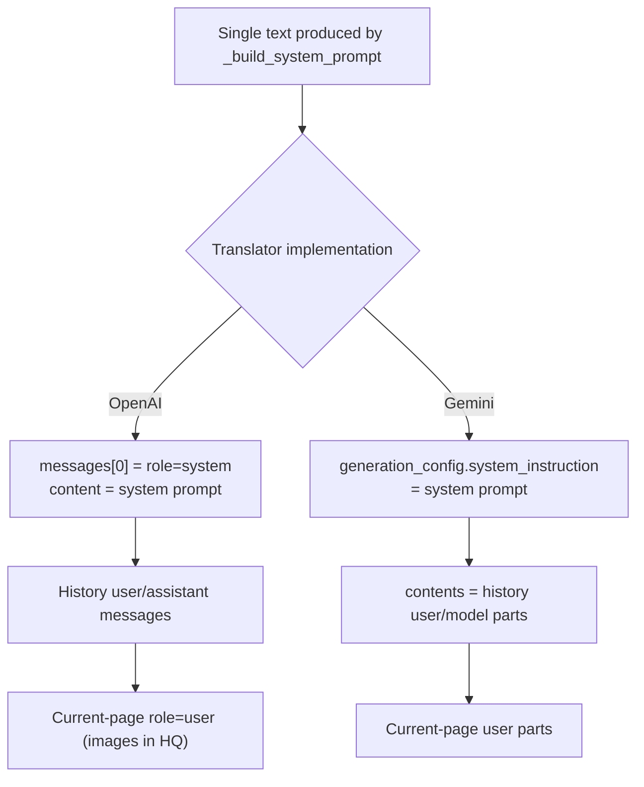

# System and Translation Prompts

Translation requests are driven by system prompts and translation prompts together: the system prompt files control “how to translate” and “what to output,” while translation prompts supply custom rules, glossary extraction, and AI line-breaking requirements. Use this page when you need to know when a prompt file is read, in what order it is concatenated, where the `target_lang` placeholder is replaced, and how the result enters an OpenAI/Gemini request.

This guide does not cover prompt-file listing, applying, or CRUD (see [Prompt list, apply, and preview](./list-apply-and-preview.md)), nor the structured editor (see [Structured prompt editor and format](./structured-editor-and-format.md)); AI OCR, AI colorizer, and AI renderer prompts are covered in [AI OCR prompt](./ai-ocr-prompt.md), [AI colorizer prompt](./ai-colorizer-prompt.md), and [AI renderer prompt](./ai-renderer-prompt.md). How history pages become messages is covered in [Context and Prompts](../translator/context-and-prompts.md).

## When to use it {#feature-boundary}

- Fixed system prompt files: `dict/system_prompt_hq.yaml` (base system prompt) and `dict/system_prompt_hq_format.yaml` (output format). They are loaded from `dict/` at runtime by filename stem, are not part of the user prompt list, and have no dedicated desktop editor.
- Translation prompts: the custom HQ prompt pointed to by `translator.high_quality_prompt_path` (user `.yaml`/`.yml`/`.json` files under `dict/`), `dict/glossary_extraction_prompt.yaml` (glossary-extraction rules), and `dict/system_prompt_line_break.yaml` (AI line-breaking prompt).
- Related config keys: `translator.high_quality_prompt_path`, `translator.extract_glossary`, `render.disable_auto_wrap`; full parameter documentation is in [Translation settings](../settings/translation.md) and [Typesetting and rendering](../settings/typesetting-and-rendering.md).
- This guide only explains how prompts are loaded, combined, and injected into the OpenAI/Gemini system instruction; it does not cover translator selection, API credentials, or candidate-slot rotation (see [Translator selection](../translator/selection-and-languages.md) and [API management](../api-management/slots-and-rotation.md)).
- No real API key, private prompt text, or local absolute path is written on this page. Prompt content is user data; remove it from logs, request exports, and debug directories before sharing.

## Plain Translation Prompt File Format {#custom-prompt-file-format}

Custom translation prompts use a template file: copy `dict/prompt_example.yaml` and rename it to your own file (for example `dict/my_manga_prompt.yaml`), then click “Apply Selected Prompt” on the Prompt Management page or choose it from the “Custom Prompt” dropdown under “Settings → Translation”. The file is YAML and its root must be an object, with this structure:

```yaml
system_prompt: ""
glossary:
  Person:
    - original: ""
      aliases:
        - original: ""
          translations:
            - text: ""
              condition: ""
      description: ""
      overwrite: false
  Location: []
  Org: []
  Item: []
  Skill: []
  Creature: []
```

- `system_prompt`: a string for the custom system prompt body; it can be empty. When empty, only the built-in base prompt is used; when filled, this content is prepended before the base prompt.
- `glossary`: the terminology table grouped by `Person` / `Location` / `Org` / `Item` / `Skill` / `Creature`. Every category uses the same shape: top-level `original` is the canonical source name, `aliases` stores its source-language forms, and each alias owns one or more manually authored `translations` with an optional `condition`; an empty array (such as `Location: []`) means the category has no entries.
- Placeholder: <code>&#123;&#123;&#123;target_lang&#125;&#125;&#125;</code> in the text is replaced with the target language name at each request construction, see [Placeholder replacement](#placeholders).

Desensitized example (structure and placeholder usage only, no real prompt content):

```yaml
system_prompt: |
  You are a manga translation assistant. Make the {{{target_lang}}} translation natural and keep character voice consistent.
glossary:
  Person:
    - original: "Example Character Name"
      aliases:
        - original: "Example Character Name"
          translations:
            - text: "Example Character Translation"
      description: "Example character description"
      overwrite: true
  Location: []
  Org:
    - original: "Example Organization Name"
      aliases:
        - original: "Example Organization Name"
          translations:
            - text: "Example Organization Translation"
      overwrite: false
  Item: []
  Skill: []
  Creature: []
```

## Use it in Prompt Management {#ui-operations}

### Select and apply a translation prompt in Prompt Management {#apply-translation-prompt}

Open “Prompt Management”. The “Prompt List” shows only user prompt files under `dict/` and excludes system prompt stems (`system_prompt_hq`, `system_prompt_hq_format`, `system_prompt_line_break`, `glossary_extraction_prompt`, `ai_ocr_prompt`, `ai_colorizer_prompt`, `ai_renderer_prompt`). Select a file and click “Apply Selected Prompt”; the app writes `dict/<filename>` to `translator.high_quality_prompt_path` and persists it, and the status label shows “Current prompt: {filename}”.

Full list, preview, and editing operations are in [Prompt list, apply, and preview](./list-apply-and-preview.md); structured editing and save validation are in [Structured prompt editor and format](./structured-editor-and-format.md).

### Enable the related toggles in Settings {#settings-toggles}

1. Open “Settings” → “Translation” and enable “Auto Extract Glossary”. This writes `translator.extract_glossary`; only when a parseable custom prompt also exists does the request append the glossary-extraction rules and the `new_terms` output format.
2. Open “Settings” → “Typesetting” and enable “AI Line Breaking”. This writes `render.disable_auto_wrap`; when enabled, the translation request loads `dict/system_prompt_line_break.yaml` and attaches `original_region_count` to each region in the user input JSON.
3. The on-screen name of `translator.high_quality_prompt_path` is “Custom Prompt”. Its dynamic-settings control is implemented in `dynamic_settings.py` (it rescans `dict/` and excludes system prompts when the dropdown opens); the actual entry point for setting this key is “Apply Selected Prompt” in Prompt Management.

## How prompts are loaded {#runtime-behavior}

### When files are loaded {#loading-timing}

Before a translation batch starts, `_load_and_prepare_prompts()` prepares the prompts once:

- If `translator.high_quality_prompt_path` is non-empty, the path is normalized (`normalize_server_resource_path`), relative paths are joined with `BASE_PATH`, and `load_custom_prompt()` parses the file. If the exact path does not exist, it retries with the extension replaced in the order `.yaml` → `.yml` → `.json`; parse failures only log a warning and do not abort translation.
- If `render.disable_auto_wrap` is true, `load_line_break_prompt()` loads `system_prompt_line_break` from `dict/` into `ctx.line_break_prompt_json`; a missing file is also only logged.

The base system prompt, output format, and glossary-extraction prompt are not preloaded: on every request construction (including retries), `_build_system_prompt()` reads `system_prompt_hq` and `system_prompt_hq_format` from `dict/` by stem, and glossary mode additionally reads `glossary_extraction_prompt`. The loader prefers `.yaml`, then `.yml`, then `.json`.

### Composition order {#composition-order}

`_build_system_prompt()` concatenates the prompts into a single text block in a fixed order: retry hint (retries only) → AI line-break prompt (optional) → custom HQ prompt (optional) → base system prompt → output format. The custom prompt is recursively flattened into a text block by `_flatten_prompt_data()`; when glossary extraction is enabled and the custom prompt is valid, the glossary-extraction rules and the extended `new_terms` output format are appended after the base prompt, with sections separated by `\n\n---\n\n`.



If the base system prompt is missing or empty, the in-code fallback (`_HQ_FALLBACK_PROMPT`) is used; a missing output-format prompt logs a warning but the request still goes out with weaker format constraints.

### Placeholder replacement {#placeholders}

Placeholders in prompt files are literal triple-brace markers (for example <code>&#123;&#123;&#123;target_lang&#125;&#125;&#125;</code>), not Python string-format syntax. At each request construction, the runtime replaces the marker with the full target-language name: `VALID_LANGUAGES` maps language codes to full names (such as `CHS` → `Chinese (Simplified)`, `JPN` → `Japanese`), and unknown codes are kept as-is. Replacement happens only in the in-memory request text; the `dict/` files are never rewritten by it.

| Placeholder | Files | Replaced when | Replaced with |
| --- | --- | --- | --- |
| <code>&#123;&#123;&#123;target_lang&#125;&#125;&#125;</code> | `system_prompt_hq`, `system_prompt_hq_format`, custom prompts, `glossary_extraction_prompt` | Every request construction | Full target-language name |
| <code>&#123;&#123;&#123;optional_new_terms_rule&#125;&#125;&#125;</code> | `system_prompt_hq_format` | Only when `extract_glossary=True` | Rule text requiring a `new_terms` key; empty in normal mode |
| <code>&#123;&#123;&#123;optional_new_terms_example_suffix&#125;&#125;&#125;</code> | `system_prompt_hq_format` | Only when `extract_glossary=True` | The `new_terms` section in the output JSON example; empty in normal mode |
| <code>&#123;&#123;&#123;optional_new_terms_final_instruction&#125;&#125;&#125;</code> | `system_prompt_hq_format` | Only when `extract_glossary=True` | The closing instruction to return `"new_terms": []` when none found; empty in normal mode |

### Path into the OpenAI/Gemini system instruction {#system-instruction-path}

The combined system prompt is injected as a single unit; it is never split into multiple system messages per file:



- OpenAI (`openai.py`, `openai_hq.py`): the system prompt is placed in `messages[0]` (`role=system`), followed by history `user`/`assistant` messages from `_build_openai_context_messages()`, then the current-page `user` request; the HQ user message includes image content.
- Gemini (`gemini.py`, `gemini_hq.py`): the system prompt is assigned to `generation_config.system_instruction`, and `contents` first carries history `user`/`model` parts from `_build_gemini_context_messages()`, then the current-page `user` parts.
- When glossary mode is enabled and the response contains `new_terms`, both OpenAI and Gemini call `merge_glossary_to_file()` to merge the new terms back into the `glossary` field of the custom prompt file (YAML or JSON depending on the extension).
- Streaming and non-streaming transports use the same system instruction and message construction; with `disable_auto_wrap` enabled, each region in the current-page user JSON carries `original_region_count` so final rendering can validate the `[BR]` marker count.

## Limitations and notes {#dependencies-and-conflicts}

- Enabling “Auto Extract Glossary” alone has no effect: the code requires `bool(custom_prompt_json) and extract_glossary` to both be true, i.e. a parseable custom prompt must exist and the toggle must be on.
- A missing base system prompt falls back to built-in code text; a missing format or glossary prompt only weakens constraints without crashing; an unparseable custom prompt is skipped and the base prompt is still used.
- Glossary write-back modifies the custom prompt file under `dict/`; to keep the runtime from editing files, turn off “Auto Extract Glossary” or use a read-only copy.
- System prompt files are excluded from the user prompt list and have no desktop editor; manual edits must keep the YAML/JSON root as an object.
- `render.disable_auto_wrap` affects both typesetting line wrapping and translation requests (line-break prompt + `original_region_count`); it is not a pure rendering toggle, and Qt's default `true` differs from the core/release default `false`.
- Prompt text may contain business content and goes verbatim into requests and logs; remove prompt bodies, history text, paths, and credentials before sharing.
