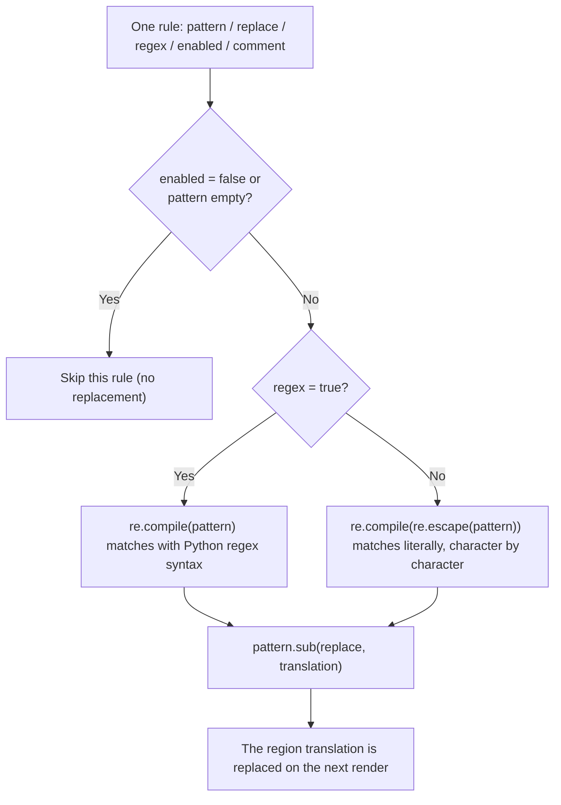
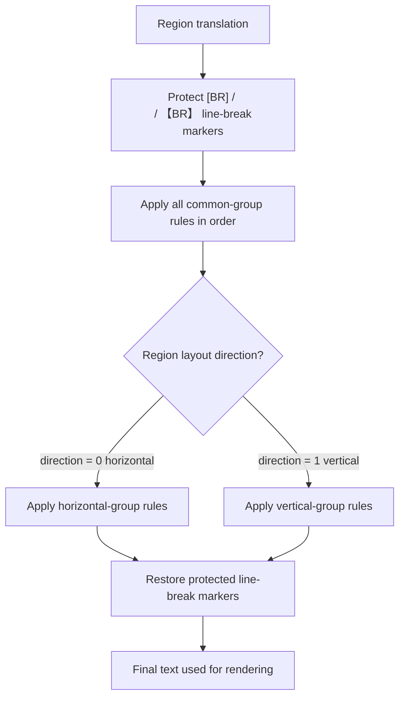
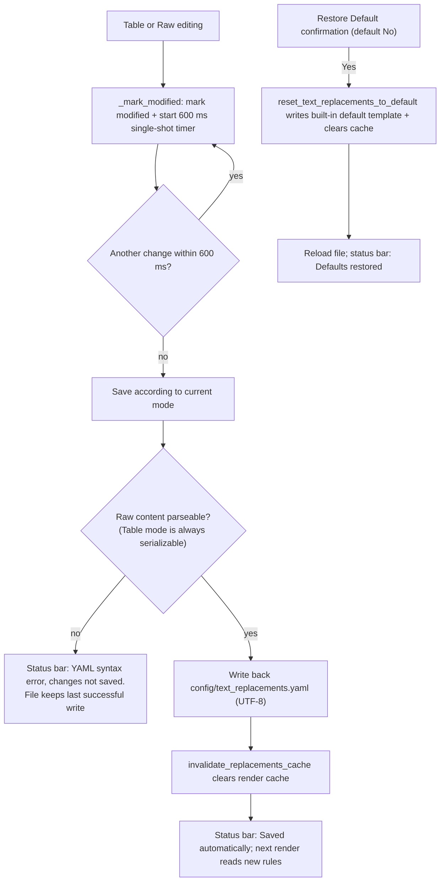

# Replacement Rules: Raw YAML Editing, Regex, and Save

Use the “Replacement Rules” page to edit `config/text_replacements.yaml` when you want to normalize translation text before it is typeset onto the image, for example to unify punctuation or fix half/full-width characters. The page offers a “Table View” and a “Raw Edit” mode over the same file; every rule is either a literal or a regex replacement, and changes are saved automatically. This guide covers both views, regex semantics, the save and restore mechanism, and how the rules are consumed at render time.

Row-level operations, group tabs, and the group execution order of the Table view are covered by [Table groups and order](./table-groups-and-order.md); rich-text rules (style matching applied to `translation` after replacements) are covered by [Rich-text rules](../rich-text-rules/table-raw-and-match.md).

## Where the rules apply {#feature-boundary}

- This page reads and writes only `config/text_replacements.yaml`: the file stores pre-render text replacement rules and never holds API credentials, translator selection, `.env`, or any other configuration.
- The Table view and the Raw view edit the same file and the same rule set; switching to Raw disables the table toolbar and filter row (`_set_table_controls_enabled(False)`) so both places are not edited at once.
- Rules are consumed only at render time by `apply_replacements` and act on the region translation (`region.translation`); they never change source text, OCR text, or translation requests.
- Rich-text rules read `translation` after replacements and apply style matching; they belong to another file, `config/rich_text_rules.yaml`, and another page.
- Do not put real business text, keys, usernames, or private absolute paths into the rule file; the content is read rule by rule by rendering and may appear in logs and debug artifacts.

## Use it in Replacement Rules {#ui-operations}

### Open the Replacement Rules page {#open-page}

1. Click “Replacement Rules” in the main navigation. Below the title, the subtitle reads “Manage text replacements (order: Common (Always), then Horizontal/Vertical; rules cascade from top to bottom).”.
2. The panel has a toolbar at the top, the “Table View / Raw Edit” mode switch in the middle, and a status bar at the bottom showing the current group's rule count and mode.
3. The panel exposes a `refresh()` public method (reload the file and reapply the current filter); switching language calls `refresh_ui_texts()` to refresh every button and column header.

### Table view editing {#table-view-editing}

1. Group tabs: `Common (Always)`, `Horizontal`, `Vertical`.
2. Columns: `Enabled` (`✓`/`✗`), `Pattern`, `Replace`, `Regex` (`✓`/`✗`), `Comment`. The `Enabled` and `Regex` columns are not directly editable; double-click a cell to toggle `✓`/`✗`.
3. Toolbar buttons: `Add Rule`, `Delete`, `↑`/`↓` (move up/down, icon-only buttons with no text), `Select All`, `Enable`/`Disable` (dynamic, based on the majority state of the selected rows), `Regex`/`Cancel Regex` (dynamic), and `Restore Default`.
4. “Add Rule” inserts a new row and immediately starts editing the `Pattern` cell; rows with an empty `Pattern` are skipped when saving.
5. The filter box (`Filter:`) performs a case-insensitive substring match over “Pattern / Replace / Comment”; it only affects display, never the file content.

### Raw YAML editing {#raw-yaml-editing}

1. Click “Raw Edit” to enter the monospace editor. The hint reads “Edit raw YAML content directly. Changes are saved automatically.” The editor disables line wrapping and provides simple YAML syntax highlighting (italic comments, bold keys).
2. When switching to Raw mode, any unsaved table changes are saved first, then the full serialized YAML is loaded into the editor; the editor therefore always shows content consistent with the table.
3. Switching back to “Table View” parses the editor content first: on a parse failure it shows “Parse Error / YAML syntax error, cannot switch to table view.” and stays in Raw mode; on success it rebuilds the three group tables.
4. In Raw mode you are responsible for the keys, indentation, and escaping you write; saving only validates that the content can be parsed as YAML, not that the root is an object (a wrong root type is only reported when switching back to the Table view).

## Rule format and regex semantics {#rule-format-and-regex}

### Rule fields {#rule-fields}

The top level of the file must be an object with three list keys: `common`, `horizontal`, `vertical`. Each rule is an object:

| Field | Required | Semantics |
| --- | --- | --- |
| `pattern` | Yes | Match pattern; parsed as Python `re` syntax when `regex: true`, otherwise matched as literal text |
| `replace` | Yes | Replacement text; backreferences such as `\1`, `\2` work in regex mode |
| `regex` | No | Default `false` (literal replacement); `true` treats `pattern` as a regular expression |
| `enabled` | No | Default `true`; `false` temporarily disables the rule |
| `comment` | No | Note; not used for matching |

### Literal vs regex replacement {#literal-vs-regex}

At runtime every rule is compiled once: literal replacement calls `re.compile(re.escape(pattern))`, regex replacement calls `re.compile(pattern)`; rules with an empty `pattern` or `enabled: false` are skipped. When a regex fails to compile (`re.error`), that rule is skipped with a warning log and does not affect other rules or fail rendering. Therefore:

- Regex special characters such as `.`, `(`, and `\` in a literal pattern are matched as-is and do not need escaping;
- Regex replacement follows Python `re` syntax: `\d`, `\.{3}`, and backreferences such as `\1` work; `\1` in `replace` refers to the first capture group.

### Groups, direction, and execution order {#groups-direction-and-order}

- The execution order is fixed: first the whole `common` group is applied in file order; then the `horizontal` (`direction == 0`, horizontal) or `vertical` (`direction == 1`, vertical) group is selected by the region layout direction and continues top to bottom.
- Within one group, rules cascade in YAML list order: the output of one rule is the input of the next, so “replace A then B” and “replace B then A” can produce different results.
- The direction is decided at render time: `_resolve_region_render_horizontal` first checks the region's forced direction (`horizontal`/`h` or `vertical`/`v`); on `auto` it falls back to the region's `horizontal` property.

### Line-break marker protection {#linebreak-protection}

`apply_replacements` first replaces line-break markers such as `[BR]`, `【BR】`, ` `, and ` ` with placeholders and restores them after replacement. Even if a rule targets these markers, it will not match the protected placeholders.

## Save and restore mechanism {#save-and-restore}

### Auto-save {#autosave}

Every edit action (cell change, double-click toggle, add/delete/move row, Raw text change) calls `_mark_modified`: it marks the panel as modified, starts a 600 ms single-shot debounce timer, and refreshes the status bar (appending `●`). When the timer fires and there are still unsaved changes, saving happens according to the current mode:

- In Table mode, content is serialized with `_tables_to_yaml()` (`allow_unicode=True`, `default_flow_style=False`, `sort_keys=False`; rows with an empty `Pattern` are skipped and `regex`/`enabled`/`comment` are omitted when default or empty);
- In Raw mode, syntax is validated with `yaml.safe_load` first, then the text is written back verbatim.

After a successful write the render cache is invalidated (`invalidate_replacements_cache`), the timer is stopped, the modified flag is cleared, and the status bar shows “Saved automatically”. Normal editing needs no manual save.

### Save and validation on mode switch {#mode-switch-save}

- Table → Raw: the current table content is saved once first (a failure only updates the status bar, no dialog), then the serialized result is loaded into the editor, so the Raw editor always reflects the table's final state.
- Raw → Table: the editor content is parsed first. A parse failure shows “Parse Error / YAML syntax error, cannot switch to table view.” and stays in Raw mode; on success, unsaved changes are saved first, then the three group tables are rebuilt.
- When a Raw auto-save fails (YAML syntax error), the status bar shows “YAML syntax error, changes not saved.” and the file keeps the last successfully written content; fix the syntax and edit or switch modes again to save.

### Restore defaults {#restore-default}

Clicking “Restore Default” shows a confirmation dialog (title “Restore Default”, text “Restore replacement rules to the built-in defaults? Current custom rules will be overwritten.”, buttons “Yes”/“No”, default “No”). After confirming:

1. The auto-save timer is stopped and `reset_text_replacements_to_default` writes the built-in default template to `config/text_replacements.yaml`;
2. The render cache is cleared, the file is reloaded, and the current filter is reapplied;
3. The status bar shows “Defaults restored” and the panel emits the `data_changed` signal.

Restoring defaults overwrites your custom rules directly and creates no `.bak` backup (unlike the backup/restore mechanism of Batch Management); make sure the current rules are no longer needed before confirming.

### Render cache and startup upgrade {#cache-and-startup}

- On the render side, `load_replacements` caches rules as “file path → (mtime, parsed result)”; both saving and restoring defaults clear the cache, so the next render reads the file again. Editing the file manually without changing mtime may hit the old cache.
- Startup initialization `ensure_runtime_files` deletes a `text_replacements.yaml` that still matches a legacy built-in template MD5 (two known old hashes: `5b8fbc89492ff2a1d5c064f5e85a458b`, `94b2787940afdde800db3aba0742ad98`), then `ensure_text_replacements_exists` recreates the built-in default template; user customizations are not touched.
- When the file is missing, the editor status bar shows “File not found”; when reading fails it shows “Load error: {error}”.

## Limitations and notes {#dependencies-and-conflicts}

- Rules act only on the pre-render translation: `prepare_text_replacements_for_layout` stores the pre-replacement text in `translation_raw` and writes the replaced result to `translation`; after rendering, `sync_translation_raw_from_layout` projects layout changes back to `translation_raw`.
- Rich-text document regions (`is_rich_text_document` is true) skip replacement; JSON exports of already-rendered images record `skip_text_replacements` so re-import rendering does not apply the rules twice.
- The rule file does not participate in translation requests, API candidate rotation, or dictionaries (`pre_dict`/`post_dict`); dictionaries are a separate `apply_dictionary` consumer.
- A regex syntax error only skips that rule and does not fail rendering, but the expected replacement of that rule will not take effect.
- Restore, save-failure, and Raw syntax-error handling are described above; do not include business text from the rule file when sharing logs or debug directories.