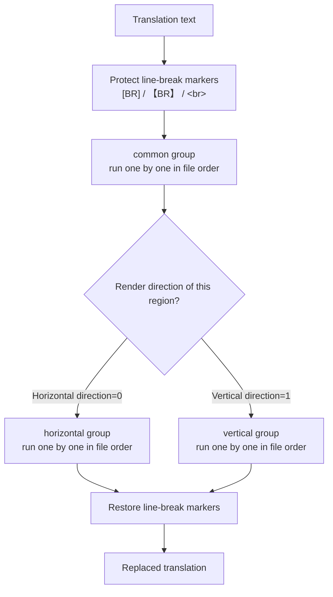
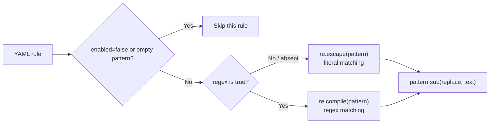
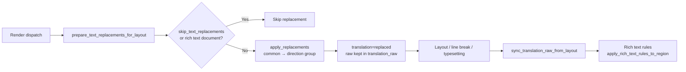

# Replacement Rule Table: Groups, Order, and Matching

Use this page when fixed words, punctuation, or vertical glyphs in translations need consistent rewriting. The “Replacement Rules” page maintains a set of rules applied to translations before rendering. Every rule is loaded from `config/text_replacements.yaml` and applied top to bottom in the fixed order “Common (Always), then Horizontal/Vertical”. This guide explains how the rules are grouped, ordered, and matched.

This guide covers the table view: groups, execution order, literal/regex matching, and where replacements run in the render pipeline. The raw YAML edit mode, regex syntax details, and the full save/restore behavior are covered by [Raw YAML, regex, and save](./raw-yaml-regex-and-save.md); the rich-text rules applied after replacements are covered by [Rich text rule table: table, raw, and match](../rich-text-rules/table-raw-and-match.md).

## Where the rules apply {#feature-boundary}

- The three groups are fixed as `common`, `horizontal`, and `vertical`: `common` always runs, `horizontal` runs only for horizontal rendering, and `vertical` runs only for vertical rendering.
- Each rule has five fields — `pattern`, `replace`, `regex`, `enabled`, `comment` — shown as five table columns in the table view.
- Rules execute top to bottom within the file: earlier rules in the same group run first, and the output of one rule keeps participating in later matches (cascade).
- This guide does not cover YAML syntax validation in Raw edit mode or restoring defaults (see [Raw YAML, regex, and save](./raw-yaml-regex-and-save.md)), nor the rich-text rules applied after replacement (see the [Rich text rules](../rich-text-rules/table-raw-and-match.md) pages).

## Edit the rule table in the UI {#edit-rule-table}

Open “Replacement Rules” in the main navigation. The subtitle under the page title summarizes the rule order (“Common (Always) → Horizontal/Vertical; rules cascade from top to bottom”). The page consists of one header card and one editor panel; there are no other tabs or dialogs.

### The three group tabs {#group-tabs}

At the top of the table view there is a group switcher with three fixed tabs. Switching tabs only changes which group you are editing; it does not modify the other groups and does not trigger any runtime behavior beyond saving.

### Table columns and toolbar {#table-columns-and-toolbar}

The table has five columns: Enabled, Pattern, Replace, Regex, and Comment. Enabled and Regex are flag columns (`✓`/`✗`); double-click a cell to toggle it. The `✓`/`✗` glyphs are code constants, not i18n keys.

The toolbar buttons, left to right, are: Add Rule, Delete, move up/down (`↑`/`↓`, icon-only with a fixed width), Select All, Enable/Disable, Regex/Cancel Regex, and Restore Default.

Steps:

1. Click “Add Rule” under a group tab. A new row is appended at the end: Enabled is `✓`, Regex is `✗`, and Pattern/Replace/Comment are empty; the “Pattern” cell enters edit mode automatically.
2. Enter content in the “Pattern” and “Replace” columns. Keep “Regex” as `✗` for literal replacement, or double-click it to `✓` for regex replacement.
3. Use move up/down (`↑`/`↓`) to change the order of the current selected row within the group; order decides the cascade sequence.
4. Select one or more rows, then click “Enable/Disable” or “Regex/Cancel Regex” to toggle them in bulk; the button label follows the majority state of the selected rows — for example, it shows “Disable” when most are enabled.
5. Click “Delete” to remove the current row (one row at a time). Edits trigger a 600 ms debounced auto-save; after a successful save the status bar shows “Saved automatically”.
6. Click “Restore Default” to open a confirmation dialog; confirming overwrites `config/text_replacements.yaml` with the built-in default template and reloads it.

“Select All” only selects the rows of the current group that are not hidden by the filter; hidden rows do not take part in the following Enable/Regex bulk toggles.

### Filter and status {#filter-and-status}

The filter box placeholder reads “Type to filter by pattern / replace / comment...”. Typing shows only the current-group rows whose Pattern, Replace, or Comment contains the text; filtering never changes the file content, and switching group tabs re-applies the filter.

The status bar at the bottom uses the format `group: enabled/total enabled ● [mode]`, for example `common: 2/3 enabled ● [Table View]`. `●` means there are unsaved changes; a missing file shows “File not found”, and a load failure shows “Load error”.

## Rule fields {#rule-fields}

> For the storage keys, defaults, and implementation details of every field on this page, see the reference page [UI Options Reference](../../reference/options-i18n-matrix.md).

The five table columns correspond to five pieces of information: Enabled, Pattern, Replace, Regex, and Comment. Regex, Enabled, and Comment are optional and are written back to YAML only when they differ from the default; the table save skips whole rows with an empty Pattern.

#### Pattern {#rule-pattern}

Enter the text to find in the “Pattern” column; a new rule enters edit mode there automatically. Rows with an empty pattern do not take part in replacement. With regex enabled the pattern is interpreted with Python `re` syntax; otherwise it is matched as plain text, and regex metacharacters need no escaping.

#### Replace {#rule-replace}

Enter the replacement text in the “Replace” column; it may be empty (which removes the matched text). Regex mode supports backreferences such as `\1`, see [Raw YAML, regex, and save](./raw-yaml-regex-and-save.md).

#### Regex {#rule-regex}

Toggle the “Regex” column (`✓`/`✗`), or select multiple rows and use the toolbar “Regex/Cancel Regex” bulk toggle. When enabled, Pattern is interpreted as a regular expression; when disabled, it is matched literally, character by character. A regex syntax error only skips that rule with a warning and does not affect the other rules.

#### Enabled {#rule-enabled}

Toggle the “Enabled” column (`✓`/`✗`); disabled rows are dimmed. A disabled rule stays in the file and in the table and is only skipped at runtime; flip it back to `✓` to re-enable it. The “enabled/total” numbers in the status bar are counted from the Enabled column.

#### Comment {#rule-comment}

Type notes in the “Comment” column; comments never participate in matching. The filter box matches Pattern, Replace, and Comment combined with a case-insensitive substring match.

## Groups and execution order {#groups-and-order}

For one translation string, the engine runs in this order: protect line-break markers, apply the `common` group, apply the `horizontal` or `vertical` group according to the region render direction, then restore the line-break markers.

The direction is decided by `_resolve_region_render_horizontal`: when a region has a forced direction (`h`/`horizontal` → horizontal, `v`/`vertical` → vertical) it follows the forced value; otherwise it falls back to the detected region direction (the `region.horizontal` property, inferred from the target-language preset or aspect ratio). The render direction is decided by render settings and detection results; replacement rules never change the direction.

Inside one group, earlier rules run first and later rules keep matching on the already replaced text, so the order directly affects the result. For example, running `A → B` first and then `B → C` turns `A` into `C`; if the two rules are reversed, `B → C` never matches `A`.

## Matching logic {#matching-logic}

Each rule is first compiled into `(compiled_pattern, replace_string)` and then applied to the text with `pattern.sub(replace, text)`. The `regex` field decides how the pattern matches:

- Literal matching: regex metacharacters such as `.`, `*`, and `(` in the pattern are escaped and the text is matched character by character.
- Regex matching: the pattern is compiled with Python `re` syntax and supports features such as backreferences; a syntax error skips that rule with a warning and does not affect the other rules.
- Line-break marker protection: `[BR]`, `【BR】`, ` `, and ` ` (case-insensitive) are replaced with placeholders before replacement and restored afterwards, so marker content is never rewritten.
- The entry-based version (`apply_replacements_to_entries`) additionally skips empty matches and matches crossing `\n`; the replacement characters inherit the style of the first character of the replaced span.
- The module also provides two helpers, `build_h2v_dict`/`build_v2h_dict`, that extract single-character literal mappings from the vertical/horizontal groups; the current render pipeline does not reference them (static check).

## Where replacements run in the render pipeline {#render-pipeline}

Replacement runs in the rendering stage, before layout measurement. The result is written to `region.translation` while the pre-replacement text stays in `region.translation_raw`; layout and line breaking can still modify the translation afterwards, and finally the changes are projected back to the raw coordinates and the rich-text rules run.

- When `skip_text_replacements` is true, replacement is skipped entirely: rendered JSON exports write `skip_text_replacements: true` so re-imported rendering does not apply the rules a second time; editor exports always mark the flag; when absent from JSON the default is `false`, so imported rendering applies replacement normally.
- Rich text documents (`is_rich_text_document`) and regions that already carry a replacement record are not replaced twice; the pre-replacement text is kept in `ReplacementLayoutRecord(raw_text, replaced_text)` so layout edits can be projected back to the raw coordinates.
- In the editor, editing the “pre-replacement translation” (`translation_raw`) calls `editor_controller._apply_translation_replacements`, which syncs to the translation in real time with the same engine and falls back to the raw text on failure.
- Rich text synchronization (`rich_text_sync.py`) runs the same common + direction groups on rich text entries (the “entry-based” version) and places the rich-text rules after replacement.

## Limitations and notes {#dependencies-and-conflicts}

- Which direction group runs depends on the region render direction, which is related to the “Direction” render setting and the detection result; replacement rules never change the direction.
- `text_replacements.yaml` and `rich_text_rules.yaml` are separate files: replacement runs before the rich-text rules, and the rich-text rules read the already-replaced translation.
- `batch_edit_schemes.yaml` lives in the same directory and uses the same YAML format, but belongs to the batch-management module and never enters the render pipeline.
- At startup, `ensure_runtime_files` creates a missing `config/text_replacements.yaml` and upgrades legacy default templates (identified by MD5) to the current built-in template; user custom content is never overwritten.
- Rule content may contain business terminology or special text. Before sharing logs, request exports, or debug directories, remove request bodies, historical text, paths, and credentials.