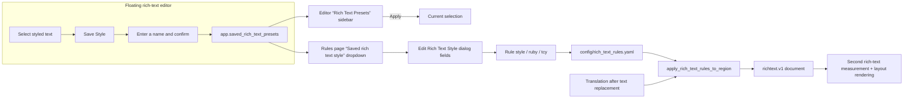

# Rich Text Styles and Presets

Use this page when a rule must do more than change text: it also adjusts font size, color, stroke, spacing, or direction on matched text, and when you want to load a style preset saved in the editor directly into a rule. Rule matching, table, and Raw editing are covered in [Rich-text rules: table, Raw, and matching](./table-raw-and-match.md); manually creating style presets in the editor is covered in [Floating rich-text editor](../editor/floating-rich-text.md).

## Where the rules apply

- Each rule stores its styling in the `style`, `ruby`, and `tcy` fields of `config/rich_text_rules.yaml`; every control in the “Edit Rich Text Style” dialog maps back to one of those fields.
- The “Saved rich text style:” dropdown only reads `app.saved_rich_text_presets`; this guide does not create, rename, or delete presets. Preset CRUD happens in the “Rich Text Presets” sidebar of the editor's floating rich-text panel.
- Automatic rules use “fill missing fields only” semantics: existing manual rich-text fields are preserved and rules only append fields that are not set yet. The editor's incremental path instead uses `skip` semantics and skips a whole match when the span carries manual rich text.
- `editor_auto_rich_text_rules` is the switch that auto-applies rules while typing in the editor; it is not the rules file itself and does not control the render pipeline.
- TCY and Ruby are node-level structures, not `TextStyle` fields; rules write them through the top-level `tcy` and `ruby` fields.

## Use it in Rich Text Rules

### Open the style dialog {#open-style-dialog}

1. Open the “Rich Text Rules” page.
2. Stay in “Table View” and choose the rule group: “Common (Always)”, “Horizontal”, or “Vertical”.
3. Double-click or select the “Edit Style” button in the “Rich Text Style” column of the target row to open the “Edit Rich Text Style” dialog.
4. Enable only the properties this rule should add; disabled fields are not written to the rule. The hint reads: “Enable only the style properties this rule should add. Existing matching rich-text fields are preserved and are not overwritten.”
5. Click “OK” to serialize the fields back into the rule and trigger autosave; click “Reset” to clear all styles; “Cancel” discards the changes. Serialization failure shows the “Invalid Style” warning.

### Load a saved style {#load-saved-style}

1. At the top of the “Edit Rich Text Style” dialog, choose a name from the “Saved rich text style:” dropdown.
2. Selecting a name loads every field of that preset into the controls at once (including Ruby and TCY); fine-tune as needed.
3. The first item is “Select saved rich text style” and does not represent any preset. The dropdown tooltip is “Choose a saved rich text style to load”.

### Style summary and filtering {#style-summary}

- The “Rich Text Style” column button shows an abbreviation summary of the set fields: `B` bold, `I` italic, `U` underline, `ST` strikethrough, `C` color, `%` scale, `WH` width/height stretch, `S` font size, `F` font family, `O` stroke, `OS` outer stroke, `G` glow, `D` emphasis, `FA` force advance, `K` kerning, `PK` pre kerning, `LK` line kerning, `NK` next kerning, `XY/Rot` other transforms, `R` ruby, `T` TCY.
- The filter box “Type to filter by pattern / style / comment...” also matches the style JSON, so you can locate rules by typing a color value or a font size.

## Style fields {#style-fields}

> For the storage keys, defaults, and implementation details of every field on this page, see the reference page [UI Options Reference](../../reference/options-i18n-matrix.md).

Each style field maps to one kind of styling in the rich-text document. Only the fields you enable in the dialog are written to the rule; before writing, the style passes through normalization and validation, and a rule that contains unknown fields fails to compile and is skipped as a whole. Field defaults are the dialog control defaults, not region or region-style defaults.

#### Bold {#field-bold}

Check the box to render matched text with bold glyphs; it does not conflict with Underline or Emphasis and can be combined.

#### Underline {#field-underline}

Check the box to draw an underline under matched text.

#### Strikethrough {#field-strikethrough}

Check the box to draw a line through matched text. Horizontal text uses a horizontal line through the glyph body; vertical text uses a vertical line through the column center.

#### Emphasis {#field-emphasis}

Check the box to add emphasis marks to matched text.

#### Vertical-in-Horizontal (TCY) {#field-tcy}

Check the box to lay out the matched run horizontally inside vertical text, for example runs of question and exclamation marks; only effective for the vertical direction.

#### Ruby Text {#field-ruby}

Enter ruby text and enable the field; the matched span is wrapped in a ruby node and the ruby text renders beside the annotated characters. An empty value is equivalent to no ruby.

#### Italic Angle {#field-italic}

Set the shear angle in degrees (positive tilts right). 0 means no italic, and a default 15-degree italic is also supported.

#### Text Color {#field-color}

Pick a color to use as the text foreground for matched text; recent colors accumulate in the picker's recent list.

#### Font Size {#field-font-size}

Set an absolute font size for matched text; matched regions get a second measurement at render time so the local size reaches the final render box.

#### Scale {#field-scale}

Scale matched text relative to the region font size; this is a different dimension from the absolute Font Size.

#### Width and Height Stretch {#field-stretch}

Set independent width and height factors for matched text. `1.00` preserves the original dimension, values above `1.00` stretch it, and values below `1.00` compress it. This changes the glyph appearance without changing the font size or text advance; vector outlines are transformed before rasterization, so no existing bitmap is rescaled.

#### Force Advance {#field-vertical-advance}

Force each character in vertical text to advance half or full width, used to correct punctuation placement.

#### Font Family {#field-font-family}

Choose the font used for matched text; the list comes from installed fonts and the project font directory, not a fixed enum.

#### Stroke {#field-stroke}

Set the stroke color and width drawn on matched text; recent stroke colors accumulate in the picker's recent list.

#### Outer Stroke {#field-outer-stroke}

Set the outer stroke color and width; the outer stroke sits farther out than Stroke and is used for stronger contrast.

#### Glow {#field-glow}

Set the glow color and blur value to add a halo around matched text.

#### Spacing {#field-kernings}

Adjust post-character, pre-character, previous-line, and next-line spacing; 0 means no adjustment and negative values tighten.

#### Rotation and Offset {#field-transform}

Set a local rotation angle and horizontal/vertical offsets in percent; the built-in vertical rule uses `rotation: -90` to rotate symbols without dedicated vertical glyphs by 90 degrees.

## Preset application {#preset-application}

### Save a preset in the floating editor {#save-preset-in-editor}

In the editor, select a styled range, open the floating rich-text editor, and use the “Save Style” button to save the current selection's style as a preset. The dialog asks for a name via “Enter style preset name:”, defaulting to “Rich Text Preset N”. An empty name shows “Style preset name cannot be empty”; a duplicate name asks “Style preset '{name}' already exists. Overwrite?”. A preset contains only `style`, `ruby`, and `tcy`; it never contains match conditions.

The preset list appears in the “Rich Text Presets” sidebar; each preset can be applied to the current selection, renamed, or deleted. With no presets it shows “No saved styles”. A failed save shows “Failed to save style preset”.

### Load a preset on the rules page {#load-preset-in-rules-page}

The “Saved rich text style:” dropdown on the rules page reads the same `app.saved_rich_text_presets`: each preset is validated by `normalize_rich_text_preset()`, normalized by `normalize_text_style()`, and its `tcy` and `ruby` are extracted and merged into the style. Choosing a name makes `load_style()` write every field into the style dialog controls; the dropdown is read-only, and the rules page offers no preset CRUD.

### Applying styles at render time {#render-time-application}

In the normal translation flow, rules run after text replacement and line breaking: `apply_rich_text_rules_to_region()` reads the replaced `translation` (or an existing `translation_rich`), matches in `common` → current-direction group order, appends `automatic_style` to the matched characters, and merges it into the final style with fill-missing semantics, producing a `richtext.v1` document; BR markers are then converted into paragraph boundaries. Matched regions get a second rich-text measurement so local sizes, scales, and strokes reach the final render box.

### Preset and rule data flow {#preset-data-flow}

## Limitations and notes

- The rule application order is fixed as `common` (always) → the current direction's `horizontal` / `vertical`; a later rule can override an earlier rule's same-named fields inside the automatic style, but existing manual rich-text fields always survive.
- The style dialog is shared with the “Apply rich text style” action of Batch Management (`RichTextStyleDialog`); this guide describes the rules scenario only, and the batch scenario is covered by [Batch management: preview, apply, and restore](../batch-management/preview-apply-restore.md).
- Presets and rules are two separate stores: presets live in `app.saved_rich_text_presets` (user `config.json`) and rules in `config/rich_text_rules.yaml`; loading a preset only fills the dialog fields and never creates a rule.
- When `editor_auto_rich_text_rules` is off, the editor stops auto-applying rules while typing, but the render pipeline still applies `config/rich_text_rules.yaml`.
- Style values may contain user business content (colors, font names, ruby text). Before sharing logs, config exports, or debug directories, remove rule bodies, preset names, colors, and ruby text.
