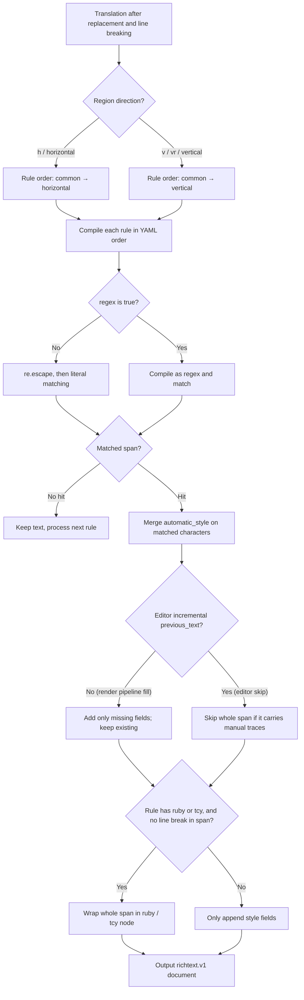

# Rich-Text Rules Table, Raw Editing, and Matching

Use the "Rich Text Rules" page when you want translated text to get bold, color, stroke, ruby, or tate-chu-yoko effects automatically instead of editing every region by hand. Rules match the translation after text replacement and before rendering, and only *add* rich-text fields that are not set yet; they never change the text itself. This guide documents the Table View and Raw Edit editing modes, the fields of each rule, and the matching and execution flow.

Text replacement rules are covered by [Replacement rules: table groups and order](../replacement-rules/table-groups-and-order.md) and [Replacement rules: raw YAML, regex, and saving](../replacement-rules/raw-yaml-regex-and-save.md). The meaning of individual style properties, saved style presets, and the in-editor style panel are covered by [Rich-text styles and presets](./styles-and-presets.md).

## Where the rules apply {#feature-boundary}

- Rich-text rules read the translation *after* replacement and line breaking: `[BR]`, `【BR】`, ` `, and newlines are first converted into paragraph boundaries, and rules never style the markers themselves.
- Rules run per group: `common` (always) first, then `horizontal` or `vertical` depending on the region direction.
- Rules only add style, ruby, and tate-chu-yoko (TCY) nodes; they do not replace text or delete existing manual rich-text fields. Whether a matched range with manual traces is touched is decided by the fill/skip policy (see the matching flow).
- This guide does not cover text replacement rules, manual editor styling, or saving/deleting style presets (see the linked pages), and it never stores API credentials or private user content.

## Use it in Rich Text Rules {#ui-operations}

### Open the rich-text rules page {#open-page}

1. Open the "Rich Text Rules" item in the left main navigation. The rule editor panel sits below the page title, with a status label at the bottom.
2. The toolbar at the top contains "Add Rule", "Delete", Move Up `↑`, Move Down `↓`, "Enable", "Regex", and "Restore Default".
3. Below the toolbar are the filter box and the "Table View" / "Raw Edit" mode switcher.

### Table View {#table-view}

Table View is the default mode and shows rules per group:

- Switch the current group with the "Common (Always)", "Horizontal", and "Vertical" tabs; they map to the YAML keys `common`, `horizontal`, and `vertical`.
- Each row has five columns: Enabled, Pattern, Rich Text Style, Regex, and Comment.
- The Enabled and Regex columns show `✓`/`✗`; double-click a cell to toggle it, or select multiple rows and click the toolbar "Enable" or "Regex" buttons to toggle them in bulk.
- The Rich Text Style column is a style button: it shows "Edit Style" when no style is set, and a style summary (for example `B I C % S` meaning bold, italic, color, scale, font size) once a style exists. Click the button to open the "Edit Rich Text Style" dialog.
- "Add Rule" inserts a row at the bottom and starts editing the Pattern cell; "Delete" removes selected rows; `↑`/`↓` move selected rows, and the order decides whether a later automatic rule overrides an earlier rule's same-named fields.
- The filter box does a case-insensitive contains match on pattern, style, and comment; it only hides non-matching rows and never changes data.

### Raw Edit {#raw-edit}

1. Switch to "Raw Edit" to edit the whole YAML document in a monospaced editor with YAML syntax highlighting; the hint reads "Edit raw YAML content directly. Changes are saved automatically.".
2. Switching from table to Raw serializes the current table data as YAML. Switching back parses and validates: the root must be a mapping and the three groups must be lists, otherwise a "YAML Error" warning appears and the editor stays in Raw mode.
3. After a change the status shows "Saving...", then after a 600 ms debounce the file is written and the status becomes "All changes saved". On write failure it shows "Save error: {error}" and the unsaved text stays in the editor.

### Style edit dialog {#style-dialog}

Click the style button in the Rich Text Style column to open the "Edit Rich Text Style" dialog:

- At the top, a preset can be loaded from the "Saved rich text style:" combo box.
- The "Switches" area provides "Bold", "Underline", "Strikethrough", "Emphasis", and "Vertical-in-Horizontal (TCY)".
- The remaining fields are optional and enabled with the checkbox on each row: Ruby Text, Italic Angle, Text Color, Font Size, Scale, Force Advance (Half/Full), Font Family, Stroke, Outer Stroke, Glow, Kerning, Pre Kerning, Line Kerning, Next Kerning, Rotation, Offset X, and Offset Y.
- The dialog hint reads "Enable only the style properties this rule should apply.". On OK the style is validated; an invalid style raises an "Invalid Style" warning.

## Parameters and options {#parameters-and-options}

> For the storage keys, defaults, and implementation details of every field on this page, see the reference page [UI Options Reference](../../reference/options-i18n-matrix.md).

Each rule is a record inside one of the groups of the rich-text rules file. The following subsections explain each field; the controls and display text are the ones described under "Style edit dialog".

#### Enabled {#rule-enabled}

The Enabled column (`✓`/`✗`) controls whether the rule participates in matching; a disabled rule is skipped entirely at compile time and does not affect other rules.

#### Pattern {#rule-pattern}

Enter the text to find in the Pattern column; rules with an empty pattern are skipped at compile time. With `regex: false` the pattern matches literally (metacharacters need no escaping), and with `regex: true` it is compiled as a regular expression. Zero-width hits are ignored.

#### Regex {#rule-regex}

The Regex column (`✓`/`✗`) or the toolbar Regex bulk toggle decides how Pattern is interpreted: enabled compiles it as a Python `re` regular expression with support for character classes, quantifiers, capture groups, and lookarounds; disabled matches literally. A regex error only skips that rule and logs a warning.

#### Rich Text Style {#rule-style}

Use the “Edit Rich Text Style” dialog to set the style appended to matched text; each field can be enabled or disabled independently. A rule with no style, no ruby, and no TCY is dropped at compile time.

#### Ruby Text {#rule-ruby}

Enter ruby text in the “Ruby Text” field of the “Edit Rich Text Style” dialog; when the matched span has no line-break markers and none of its characters carry manual nodes, the whole span is wrapped in a ruby node. Ruby and TCY are mutually exclusive (ruby wins).

#### Vertical-in-Horizontal (TCY) {#rule-tcy}

The “Vertical-in-Horizontal (TCY)” switch; it is effective only for the vertical direction (`vertical` group). A span without line breaks and without manual nodes is wrapped in a TCY node. Horizontal rules never take effect even with `tcy: true`.

#### Comment {#rule-comment}

Type notes in the Comment column; comments are only for display and filtering and never participate in matching.

#### Groups {#rule-groups}

The group tabs at the top of the table view map to the three top-level YAML group keys; rules run in `common` → the current direction's horizontal/vertical group order, and within a group they run in YAML order.

## Matching and execution flow {#matching-flow}

- Literal matching: with `regex: false`, `pattern` is escaped with `re.escape`, so metacharacters such as `[`, `(`, and `*` are treated as plain characters.
- Incremental semantics: the render pipeline passes no `previous_text`, so every hit counts as new; the editor passes the text before each change and only applies new hits that did not exist before, so old hits on unchanged text are not re-styled (manually cleared styles are not restored).
- Fill and skip: the render pipeline uses the `fill` policy and adds missing fields per field; the editor uses the `skip` policy and skips a whole span that carries any rich text the rule cannot produce (manual traces), only rules' own leftover styles are allowed to fill in.
- Node wrapping: `ruby` or vertical `tcy` wraps the whole span only when the span has no line-break markers and none of its characters carry manual nodes.
- Second measurement: regions hit by automatic rules are marked `_rich_text_rules_applied`; at render time they get an extra rich-text measurement with `skip_text_replacements=True` so local sizes, scales, and strokes reach the final render box, and the BR structure is not rewritten again.

## Limitations and notes {#dependencies-and-conflicts}

- Rich-text rules depend on text replacement running first: changing text clears the styling on the changed range, so styling must come after replacement. The fixed order is "properties → replacement → rich text".
- Rules only add styling and never change text: if the editor's applied result differs in visible text from the translation, the rule result is discarded and the sync result is kept.
- The built-in vertical example uses `transform.rotation: -90` to rotate symbols (the engine's positive angle is counterclockwise, so vertical takes `-90`); different directions use different rule groups.
- Existing manual rich-text fields are never overwritten by automatic rules; the editor `skip` policy leaves even the matched span untouched.
- The file is cached by mtime: after editing `config/rich_text_rules.yaml` externally, reload to pick it up; saving from the UI invalidates the cache and reloads.
- "Auto Apply Rich Text Rules While Editing" is an editor consumer switch, not rule-file content; turning it off stops editor auto-apply but the rendering pipeline still applies rules.
- Do not put API keys, tokens, usernames, private absolute paths, or business-sensitive text into rule comments; the rule file can appear in logs and debug artifacts.
