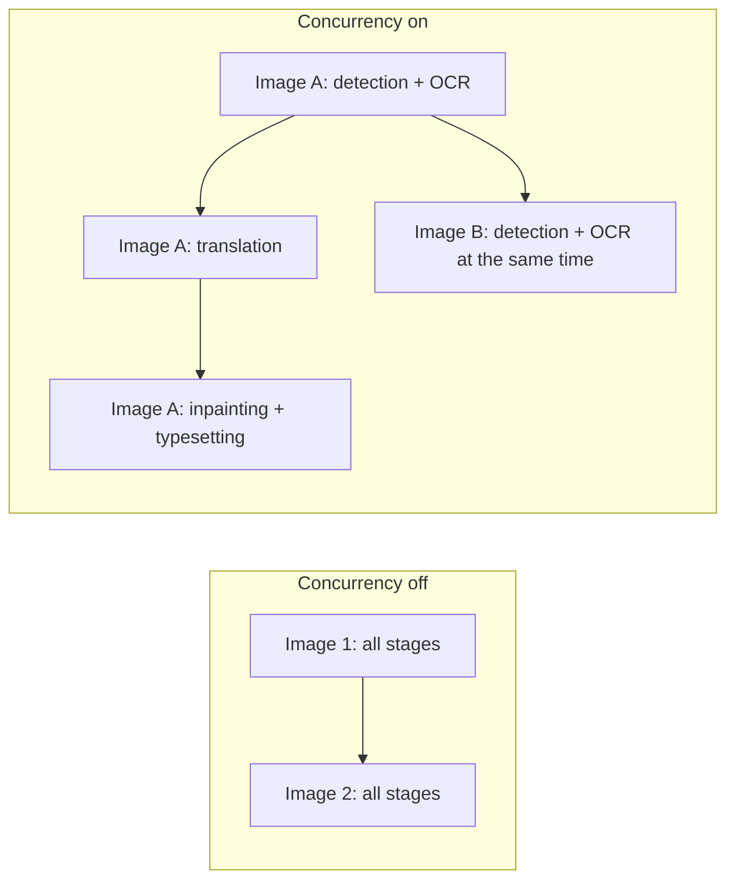
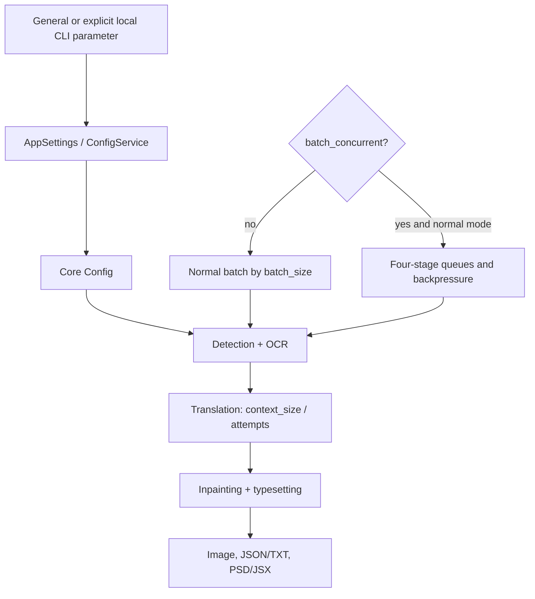

# CLI, Batch, and Output

This guide covers the CLI, batching, and output fields in General settings and explicit overrides from the local `local` CLI. It does not cover API credentials, detection/OCR/translator/typesetting algorithms. Configuration and screenshots must be sanitized: never show real keys, tokens, usernames, private absolute paths, user images, or private prompts.

## What these settings control {#feature-boundary}

This page includes logging, error isolation, GPU/ONNX, retries, translation context, batch/pipeline scheduling, format/quality/overwrite, text/JSON/TXT sidecars, source-directory output, PSD/JSX, the custom API-parameters file, and model cleanup after translation. `context_size` is actually in the Translation tab; workflow labels belong to the translation workspace, so this page records only their batch constraints.

## Change it in the desktop app {#ui-operations}

Open Settings and select the General tab. Numeric values use line edits, booleans use toggles, and `format` uses a combo box. The General layout comes from `tab_custom_1` in `settings_tab_layout.json`. Changes update memory and are merged to disk; importing configuration or switching presets can rebuild rows. The `Edit` action beside `use_custom_api_params` opens a JSON file; it is not another core configuration value.

The formal local CLI entry point is `manga_translator/args.py`: `python -m manga_translator local -i <sanitized input> [-o <sanitized output>]`. `-i/--input` accepts multiple values; `--config`, `-v/--verbose`, `--overwrite`, `--use-gpu`, `--disable-onnx-gpu`, `--format`, `--batch-size`, and `--attempts` can override configuration, but **an omitted value does not override it**. The formal top-level subcommands are `local`, `web`, `ws`, and `shared`; this page discusses only local input/output overrides.

## Parameters

> For the mapping of UI names, storage keys, and default values of the parameters on this page, see the [Settings Parameter Index](../../reference/settings-index.md).

#### Verbose Logging {#cli-verbose}

The “Verbose Logging” toggle is on Settings → General. Qt UI always creates `result/log_<timestamp>.txt` at startup, even when this toggle is off. Enabling it raises console output to DEBUG level and creates a per-image debug folder containing cached intermediate input, detection/OCR, inpainting, and rendering artifacts. Results are unchanged, but the extra files can be numerous and consume substantial disk space; use it only for troubleshooting. Default: `false`.

#### Retry Attempts {#cli-attempts}

“Retry Attempts” is an integer input. It sets how many times a translation request is retried after failure; `-1` means unlimited. It applies only to the translation/API request layer, not to a general detector/OCR/render retry, and it is not the high-quality retry. Default: `3`.

#### Ignore Errors {#cli-ignore-errors}

When the “Ignore Errors” toggle is enabled, a failed image is recorded and processing continues with the remaining images; it does not turn failure into success and does not swallow cancellation. Default: `false`.

#### Use GPU {#cli-use-gpu}

The “Use GPU” toggle decides whether model loading and inference use the GPU. It requires matching drivers, Torch/CUDA, and VRAM; enabling it does not guarantee that every implementation uses the GPU. Default: `true`.

#### Disable ONNX GPU Acceleration {#cli-disable-onnx-gpu}

The “Disable ONNX GPU Acceleration” toggle forces only ONNX sessions onto the CPU and does not disable Torch CUDA. It can avoid provider conflicts at a speed cost. Default: `false`.

#### Context Pages {#cli-context-size}

“Context Pages” is on the Translation tab and is an integer input. The translator builds context from recent non-empty history pages; `0` or a negative value disables it. See [Context and Prompts](../translator/context-and-prompts.md) for details.

#### Batch Size {#cli-batch-size}

“Batch Size” is an integer input that controls how many images are submitted per translation batch, the concurrent queue bound, and the memory peak; it is not the number of images running at once, and special modes may force 1. Default: `3`.

#### Concurrent Batch Processing {#cli-batch-concurrent}

When the “Concurrent Batch Processing” toggle is enabled, the detection+OCR, translation, inpainting, and typesetting stages run in parallel through queues. It is stage-level parallelism, not all images requesting the API simultaneously. TXT import, JSON-only, original/translation export, colorize/upscale/inpaint-only, and replacement translation force concurrency off.

This does not mean every image sends API requests simultaneously; the queue and batch size provide backpressure, and special workflows disable the mode. Default: `false`.

#### Output Format {#cli-format}

“Output Format” is a combo box on Settings → General that decides the extension used when saving images.

- Not Specified: preserve the original extension.
- `png`: PNG.
- `jpg`/`jpeg`/`jfif`: JPEG (requires RGB conversion).
- `webp`: WebP, supports quality.
- `avif`: AVIF, requires Pillow codec support.
- `bmp`: BMP (requires RGB conversion).
- `tiff`/`tif`: TIFF.
- `heic`/`heif`: HEIF, requires codec support.

Default: Not Specified.

#### Overwrite Existing Files {#cli-overwrite}

When the “Overwrite Existing Files” toggle is off, existing image output is skipped and TXT/JSON workflows check their corresponding files; results contain skipped items. Default: `false`.

#### Skip Images Without Text {#cli-skip-no-text}

When the “Skip Images Without Text” toggle is enabled, images with no translatable text after detection/OCR are skipped as a normal branch, not as an “Ignore Errors” exception. Default: `false`.

#### Editable Image {#cli-save-text}

When the “Editable Image” toggle is enabled, JSON sidecar data containing regions, original/translated text, dimensions, and rendering fields is exported; combined with “Export Original Text” it also exports the original TXT. Default: `true`.

#### Image Save Quality {#cli-save-quality}

“Image Save Quality” is an integer input applied to image, inpainting, and editor saves. Higher values usually make files larger; exact semantics depend on the encoder. Default: `100`.

#### Save to Source Directory {#cli-save-to-source-dir}

When the “Save to Source Directory” toggle is enabled, results are written beside the source under `manga_translator_work/result`; otherwise the output directory is used and relative structure is preserved when possible. The directory must be writable. Default: `false`.

#### Export Editable PSD {#cli-export-editable-psd}

When the “Export Editable PSD” toggle is enabled, the final stage creates Photoshop PSD/JSX; running the script requires Photoshop, and this is not an ordinary image format. Default: `false`.

#### Generate PSD Script Only {#cli-psd-script-only}

When the “Generate PSD Script Only” toggle is enabled, only the JSX script is generated and Photoshop is not run; the script can contain paths and must not be shared directly. Default: `false`.

#### Use Custom API Params {#use-custom-api-params}

When the “Use Custom API Params” toggle is enabled, `config/custom_api_params.json` is read to attach extra request parameters; the adjacent `Edit` button opens that JSON file. See [Custom Request Parameters](../api-management/custom-request-parameters.md) for details.

#### Unload Models After Translation {#app-unload-models-after-translation}

When the “Unload Models After Translation” toggle is enabled, the desktop unloads models after a task completes, reducing resident memory at the cost of the next task’s loading time. Default: `false`.

## How the settings take effect {#runtime-behavior}

UI/configuration file data goes through `AppSettings`/ConfigService, memory configuration, core `Config`, `MangaTranslator`, and export consumers. `local` in `mode/local.py` applies only explicitly supplied CLI values to `cli`; desktop `app_logic.py` additionally builds `save_info` with output directory, format, overwrite, and source-directory flags.

`batch_size` is the translation batch and concurrent translation queue bound; `batch_concurrent` is stage-pipeline parallelism, not an API concurrency count. TXT import, JSON-only, original/translation export, colorize/upscale/inpaint-only, and replacement translation disable it to preserve ordering and per-image file writes. `context_size` builds messages from recent non-empty pages; `attempts`, HQ quality retry, and API candidate rotation are separate layers; cancellation is not an ignorable error.

## Interactions and caveats {#dependencies-and-conflicts}

GPU backends require compatible drivers, Torch/CUDA, and ONNX providers. Larger batches, concurrency, more context, and high-quality output increase resource, token, or disk pressure; for OOM, lower batch size or disable concurrency before increasing retries. Disabled overwrite skips images/TXT/JSON. Template and JSON-only workflows require matching work-directory files. PSD execution requires Photoshop; JSX/JSON/TXT can expose paths and text, so sanitize before sharing. Format encoding depends on Pillow and platform codecs.
