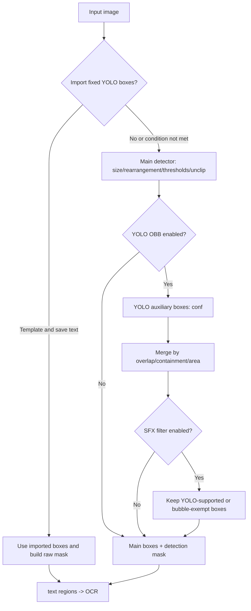
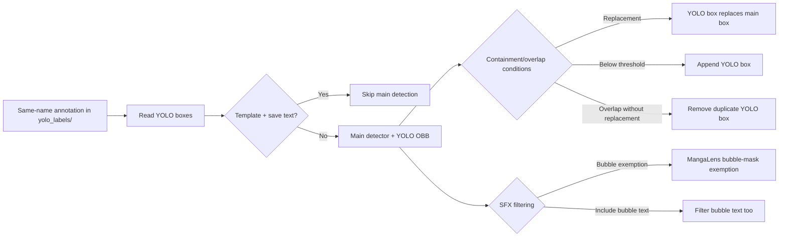

# Detection

This guide covers converting an input image into text regions, a detection mask, and detection results for OCR. OCR, text-line merging, mask refinement, and inpainting belong to their respective settings pages. This guide focuses on the controls in the Detection tab, detection-stage behavior, and the annotation/debug files it actually uses.

## Change it in the desktop app

In the desktop application, open “Settings” and select the “Detection” tab (the tab title is hard-coded in the layout and has no locale replacement). Basic items appear first; `Advanced` separates the size, threshold, and YOLO parameters. The dynamic settings page creates a combo box, toggle switch, or numeric input according to the current configuration type. Finishing an edit or changing a switch updates the in-memory configuration and schedules a merged config-file write.

Numeric inputs are submitted when they lose focus. Invalid numeric input does not become a valid core configuration value. Row labels are mapped by `app_logic.py` through the `label_*` keys above; configuration keys and environment-variable names must not be presented as UI labels.

## Parameters

> For the mapping of UI names, storage keys, and default values of the parameters on this page, see the [Settings Parameter Index](../../reference/settings-index.md).

#### Text Detector {#detector-detector-parameter}

The “Text Detector” combo box is on Settings → Detection and selects the main detector for text regions.

- `default`: default detector.
- `dbconvnext`: DBNet-family detector.
- `ctd`: manga-oriented detector.
- `craft`: general-purpose text detector (not recommended for manga).
- `none`: runs no detector and returns no detections.

Default: `default`.

#### Detection Size {#detector-detection-size}

“Detection Size” is an integer input that sets the size the detector uses to scale the image. Larger values generally retain more small-text detail at the cost of compute and memory; an excessive value can exhaust VRAM. Default: `2048`.

#### Long Image Rearrange Min Short Side {#detector-rearrange-short-side}

“Long Image Rearrange Min Short Side” is an integer input. When a long image is rearranged or tiled for detection, this value constrains the minimum effective short-side resolution; raising it keeps text clearer but costs more compute and memory. Default: `341`.

#### Text Threshold {#detector-text-threshold}

“Text Threshold” is a floating-point input. A higher text-confidence threshold is stricter and may miss text; lowering it retains weaker candidates and may add false positives. It controls the text response separately from “Box Generation Threshold”. Default: `0.5`.

#### Box Generation Threshold {#detector-box-threshold}

“Box Generation Threshold” is a floating-point input that sets the confidence gate for turning response candidates into text boxes. Lower values generally retain more boxes; higher values are stricter. Too low a value sends noise to OCR. Default: `0.5`.

#### Unclip Ratio {#detector-unclip-ratio}

“Unclip Ratio” is a floating-point input that controls how far a box expands from the text skeleton. Larger values generally make boxes larger and may include more background or neighboring text. Default: `2.5`.

#### Import Fixed YOLO Boxes {#detector-import-yolo-labels}

When the “Import Fixed YOLO Boxes” toggle is enabled, same-name annotations are read from `manga_translator_work/yolo_labels/`. The template-plus-save-text flow can bypass the main detector and use imported boxes; the normal flow replaces detected boxes with imported ones. Label files must match the image name and the expected format. Default: `false`.

#### Enable YOLO Detection {#detector-use-yolo-obb}

When the “Enable YOLO Detection” toggle is enabled, the main detector runs first and is followed by an oriented YOLO detector; containment and overlap decide whether boxes are replaced, removed, or appended, and the main result is the fallback when auxiliary detection fails. It requires the YOLO model; the import-translation flow forces it off. Default: `true`.

#### YOLO Confidence Threshold {#detector-yolo-obb-conf}

“YOLO Confidence Threshold” is a floating-point input used by YOLO assistance as its text-confidence gate. Raising it removes weak YOLO boxes; lowering it adds candidates and merging work. It does not replace the main detector’s “Text Threshold”. Default: `0.4`.

#### YOLO Overlap Removal Threshold {#detector-yolo-obb-overlap-threshold}

“YOLO Overlap Removal Threshold” is a floating-point input that decides overlap handling when YOLO boxes merge with main-detector boxes. At or above the threshold, containment and area decide replacement or removal; below it, a YOLO box may be appended. Default: `0.1`.

#### SFX Filter {#detector-use-sfx-filter}

“SFX Filter” does not filter text inside bubbles: bubble text is protected by the bubble mask by default and is only filtered when “Include Bubble Text in SFX Filter” is enabled. When enabled, main-detector boxes that are neither fully wrapped by a YOLO `other` box nor overlapped by a non-`other` YOLO box at the configured threshold are filtered; it depends on “Enable YOLO Detection”. Default: `false`.

#### Include Bubble Text in SFX Filter {#detector-sfx-filter-include-bubble-text}

When the “Include Bubble Text in SFX Filter” toggle is off, text inside a bubble that YOLO does not support remains protected by the bubble mask; enabling it skips that exemption and bubble text is filtered too. Enabling it can remove bubble dialogue. Default: `false`.

#### Min Box Area Ratio {#detector-min-box-area-ratio}

“Min Box Area Ratio” is a floating-point input that compares each box’s area with total image pixels. When greater than 0, boxes at or below the threshold are filtered; setting it to `0` disables this filter. A threshold that is too high loses small text. Default: `0`.

## How the settings take effect

### Detection branches and outputs {#detection-flow}

Long-image rearrangement tiles the image for detection and maps coordinates back during preprocessing. It can increase detection time and memory use. Here `mask_raw` means the raw mask returned by the detector or built from imported boxes; later stages decide how OCR and mask refinement consume it.

### Imported labels and hybrid detection {#yolo-merge-flow}

The diagrams express only branches confirmed by source; they are not a complete workflow diagram.

## Interactions and caveats

- The selected offline detector model must load on the selected device; GPU/ONNX backend issues affect detection but hardware installation is outside this page.
- YOLO OBB and SFX filtering require the auxiliary YOLO model. Without auxiliary results, the main detector result remains the fallback.
- `load_text` disables YOLO OBB. Imported labels can bypass the main detector under the template/save-text condition; in the normal flow they replace detector boxes and preserve or build a raw mask where possible.
- `text_threshold`, `box_threshold`, `unclip_ratio`, and area ratio belong to different postprocessing layers. Broad thresholds pass noise to OCR; strict thresholds can miss text.
- Long-image rearrangement, larger detection sizes, and YOLO assistance consume more resources. For OOM or missing-model errors, reduce size or disable assistance rather than sharing real credentials.
