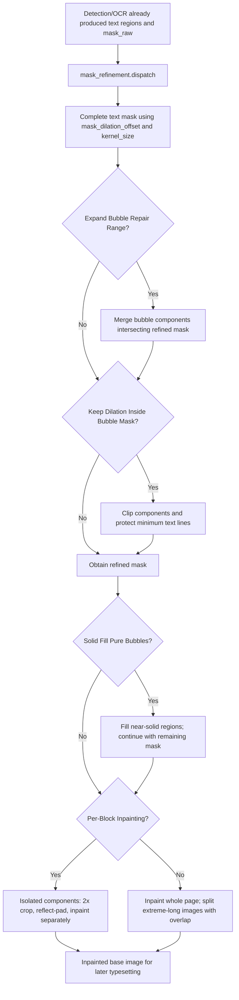

# Mask And Inpainting

This guide covers the Settings “Inpainting” group: how detected and OCR-associated text regions become an inpainting mask, and how source text inside that mask is removed. It does not change detector output, OCR recognition, or text filtering, and it does not document translated-text layout, fonts, or AI renderers; those belong to the Detection, OCR, and Typesetting pages respectively.

## Change it in the desktop app {#ui-operations}

Open Settings and select “Inpainting.” The layout shows the inpainting model, mask dilation, two bubble-range switches, solid filling, and per-block inpainting; after the “Advanced” divider it shows size, precision, kernel size, and the PyTorch-force switch. Dynamic setting rows use switches, integer inputs, or combo boxes. A change immediately updates in-memory `AppSettings`; the configuration service batches the configuration-file write after 250 ms. Numeric fields have no Apply button: their values are read when the next mask-refinement or inpainting stage runs.

The two bubble-related values are stored under the `ocr` configuration section, but deliberately appear on the Inpainting tab because they only affect the pre-inpainting mask. They neither recognize OCR text again nor filter it. The switches depend on MangaLens bubble results. If the cache cannot be read or detection fails, the code logs a warning and keeps the unmodified refined mask.

## Parameters

> For the mapping of UI names, storage keys, and default values of the parameters on this page, see the [Settings Parameter Index](../../reference/settings-index.md).

### Inpainting Model

The “Inpainting Model” combo box is on the Settings → Inpainting tab and determines which inpainting approach clears the source text inside the mask.

- `default`: default inpainting approach.
- `lama_large`: best quality and recommended.
- `lama_mpe`: faster.
- `sd`: optional inpainting approach.
- `none`: runs no model and fills the masked area white.
- `original`: returns the original image and keeps the source text.

Default: `lama_large`.

### Mask Dilation Offset and Kernel Size {#dilation-and-kernel}

“Mask Dilation Offset” and “Kernel Size” are integer inputs on the Settings → Inpainting tab.

- Mask Dilation Offset: controls how far the text mask expands to cover anti-aliasing and residual strokes. Larger values cover more; `0` means no extra expansion.
- Kernel Size: controls the kernel used to clean the mask during refinement.

Defaults: Mask Dilation Offset `50`; Kernel Size `3`.

### Keep Dilation Inside Bubble Mask and Expand Bubble Repair Range {#bubble-range}

These two switches are on the Settings → Inpainting tab and both depend on bubble detection; when no bubble is detected, the refined mask is kept.

- Keep Dilation Inside Bubble Mask: when enabled, the refined mask is constrained to the detected bubble range; intersecting components keep only the intersection with the bubble, so the mask does not spill onto line art or patterns.
- Expand Bubble Repair Range: when enabled, bubble components intersecting the refined mask are merged into it, which may enlarge the repair area.

Defaults: Keep Dilation Inside Bubble Mask `true`; Expand Bubble Repair Range `false`.

### Solid Fill Pure Bubbles

When enabled, near-solid backgrounds inside bubbles are filled directly and removed from the pending inpainting mask instead of going to the inpainting model; the optimization is skipped when bubble detection fails. Default: `false`.

### Per-Block Inpainting

When enabled, the refined mask is split into isolated connected components and each is inpainted separately; smaller crops use less context and fewer resources, but complex backgrounds may get worse. When disabled, the whole page is sent to the model once. Default: `false`.

### Inpainting Size and Inpainting Precision {#size-and-precision}

“Inpainting Size” and “Inpainting Precision” are after the “Advanced” divider.

- Inpainting Size: sets the input size for each inpainting run. Larger values are usually better quality but slower, and very large values can exhaust memory.
- Inpainting Precision: options are `fp32` (most accurate, slowest), `fp16` (balanced), and `bf16` (recommended).

Defaults: Inpainting Size `2048`; Inpainting Precision `fp32`.

### Force Use PyTorch Inpainting {#force-torch}

When enabled, the offline inpainting model is forced to load through the PyTorch backend. CPU normally prefers ONNX; enable this when ONNX has problems. Default: `false`.

## How the settings take effect {#runtime}

The main pipeline calls mask refinement with `ctx.mask_raw`, text regions, and the global parameters; it then calls inpainting with the resulting `ctx.mask`. With no text regions or an empty mask, the inpainting stage is skipped and the original work image remains. If refinement raises, the inpaint-only workflow falls back to simple dilation; whether an inpainting failure continues is governed by general `cli.ignore_errors`. When an AI renderer is selected, the main pipeline explicitly skips inpainting and renders on the original image. This renderer boundary does not change how this page stores its settings.

## Interactions and caveats {#dependencies}

- Mask refinement needs text regions and a raw mask from an earlier stage; with no text regions, these switches have nothing to process.
- Both bubble-range switches depend on MangaLens output. Cache misses, no detections, or errors retain the refined mask. They must not be described as OCR re-detection or OCR filtering.
- Larger size, higher precision, and whole-page inpainting increase memory/VRAM pressure. Extreme-long images are divided along their long axis with overlap before compositing.
- Per-block inpainting trades context for smaller crops; it is not the same feature as extreme-long-image splitting.
- `none` white fill, `original` image retention, and AI-renderer inpainting skip yield different outputs and must not substitute for one another.
