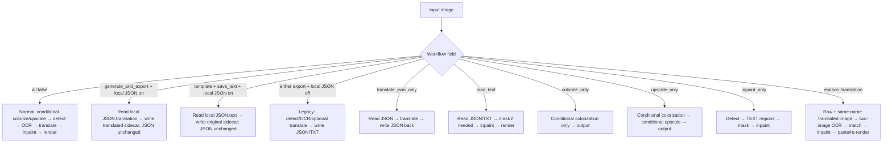
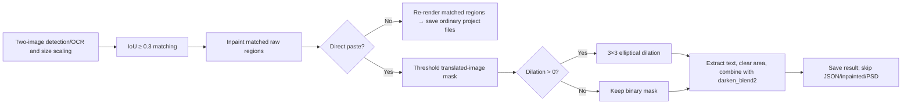

# Mode-Specific Workflows and Template Alignment

This guide covers the nine workflows on the translation page and the template-alignment parameters under “Mode Specific → Replace Translation”. It does not repeat upscale/colorization fields (see [Upscale and Colorization](./upscale-and-colorization.md)) or general stage parameters. Workflow choices are `cli` branches; template alignment is a `render` branch. The GUI clears all eight workflow flags before setting the selected one, so selecting one mode is exclusive; manually combining flags is not a supported contract.

## Change it in the desktop app

Choose a mode from the “Translation Workflow Mode:” combo box. The change is persisted immediately and refreshes the description and start button; existing output handling still follows “Overwrite Existing Files”. Replace Translation additionally requires a matching translated image.

“Enable Direct Paste Mode” and “Paste Mode Mask Dilation Pixels” are under Settings → Mode Specific → Replace Translation. The first is a toggle; the second is an integer, with `0` disabling dilation.

## Nine workflows and boundaries

The usual order is conditional colorization → conditional upscaling → detection → OCR → text-line merging → translation → mask refinement → inpainting → typesetting/rendering.

| UI mode | Input and discovery | Output | Stages, skips, and conflicts |
| --- | --- | --- | --- |
| Normal Translation | Main image | Main image; JSON when `save_text=true`, and possibly inpainted/editor-base images | Full main chain; the only mode that can enter `batch_concurrent` |
| Export Translation | Main image by default; existing project JSON when “Export Text from Local JSON Only” is on | Legacy detection/OCR/translation plus JSON and translated-sidecar writes by default; with the toggle on, only `<stem>_translated.<format>` and unchanged JSON | Toggle on skips image loading, detection, OCR, API translation, and JSON write-back; concurrency disabled |
| Export Original Text | Main image and template by default; existing project JSON when “Export Text from Local JSON Only” is on | Legacy detection/OCR and JSON write by default; with the toggle on, only `<stem>_original.<format>` and unchanged JSON | Toggle on skips image loading, detection, OCR, and JSON write-back; concurrency disabled |
| Translate JSON Only | Existing project JSON | Writes JSON back and deletes the original-text sidecar after success | Translates JSON only; skips image stages; concurrency disabled |
| Import Translation and Render | JSON and matching original/translated TXT | Main image, updated JSON, and inpainted image when needed | Import → mask (if needed) → inpaint → render; skips detection/OCR/translation; YOLO import may provide a detection fallback |
| Colorize Only | Main image | Main image and conditional editor-base image | Colorization only; skips upscaling and text chain; concurrency disabled |
| Upscale Only | Main image | Main image and conditional editor-base image | Conditional colorization → conditional upscaling; skips text chain; does not automatically disable the selected colorizer; concurrency disabled |
| Inpaint Only | Main image and detector | Main image | Conditional preprocessing → detection → literal `TEXT` regions → merge → mask → inpaint; skips OCR/translation/rendering; concurrency disabled |
| Replace Translation | Raw image and same-name translated image at `manga_translator_work/translated_images/<stem><ext>` | Main image; normal re-rendering may write JSON/inpainted image | Detect/OCR/merge both images → scale and match regions at IoU `0.3` → inpaint → paste or re-render; no translation service; concurrency disabled |

If `output_format` is missing or invalid, the template falls back to `json`; the new JSON work directory is preferred over the legacy image-directory location. Upscale Only does not automatically disable the colorizer, and Export Original Text additionally requires `save_text=true`.

## Parameters

> For the mapping of UI names, storage keys, and default values of the parameters on this page, see the [Settings Parameter Index](../../reference/settings-index.md).

#### Export Text from Local JSON Only {#cli-export-from-local-json}

Under Settings → Mode Specific → Text Export. Disabled by default and shared by Export Translation and Export Original Text. When enabled, the app reads each image's existing `manga_translator_work/json/<stem>_translations.json` and exports the `translation` or `text` field through the template. It does not open the image, run detection or OCR, call a translation API, or write the project JSON back, so edited translations cannot be overwritten. A missing project JSON fails that image explicitly and never falls back to OCR. When disabled, the legacy image detection/OCR flow remains active (including translation for Export Translation). Default: `false`.

#### Export Translation {#cli-generate-and-export}

Selecting “Export Translation” uses the legacy flow by default: open the main image, run detection, OCR, and translation, and write JSON plus the translated sidecar. Enabling “Export Text from Local JSON Only” instead exports `<stem>_translated.<format>` read-only from the existing project JSON without OCR or translation APIs. Default: `false` (workflow disabled; Normal Translation is the default mode).

#### Export Original Text {#cli-template}

Selecting “Export Original Text” detects and OCRs the main image by default; that branch also requires “Editable Image”. Enabling the local-JSON toggle instead exports `<stem>_original.<format>` read-only from the existing project JSON without detection/OCR. Default: `false` (workflow disabled; Normal Translation is the default mode).

#### Translate JSON Only {#cli-translate-json-only}

Select “Translate JSON Only” to read an existing project JSON, translate it, and write it back; the matching original-text sidecar is deleted after success. No image stages run. A compatible JSON file is required, and write-back is not controlled by the “Editable Image” option. Default: `false` (disabled; the default mode is Normal Translation).

#### Import Translation and Render {#cli-load-text}

Select “Import Translation and Render” to read JSON and matching original/translated TXT files: a refined mask is reused when present, otherwise the mask is refined before inpainting and rendering; detection, OCR, and translation are skipped. When a mask is missing and YOLO import is enabled, detection may be used as a fallback. Default: `false` (disabled; the default mode is Normal Translation).

#### Colorize Only {#cli-colorize-only}

Select “Colorize Only” to run the currently selected colorization model and save the result; upscaling, detection, OCR, translation, mask, inpainting, and rendering are skipped. With no colorizer selected, the image is passed through unchanged. Default: `false` (disabled; the default mode is Normal Translation).

#### Upscale Only {#cli-upscale-only}

Select “Upscale Only” to run conditional colorization and conditional upscaling and save the result; the text chain is skipped. The scale comes from the “Upscale Ratio” option; when it is “Not Use”, upscaling is skipped and a selected colorizer may still run first. Default: `false` (disabled; the default mode is Normal Translation).

#### Inpaint Only {#cli-inpaint-only}

Select “Inpaint Only” to run detection, mask refinement, and inpainting and save the result; OCR, translation, and rendering are skipped. Detected text regions are treated as regions to erase; with no regions or mask, the unmodified image is returned. Default: `false` (disabled; the default mode is Normal Translation).

#### Replace Translation {#cli-replace-translation}

Select “Replace Translation” to apply translations from a translated image to the corresponding regions of a raw image: both images are detected and OCR-processed, regions are matched at IoU `0.3` after scaling, and the matched raw regions are inpainted and pasted or re-rendered; no translation service is called. A same-name translated image under `manga_translator_work/translated_images/` is required. Direct paste does not write JSON, inpainted images, or PSD. Default: `false` (disabled; the default mode is Normal Translation).

#### Enable Direct Paste Mode {#render-enable-template-alignment}

Under Settings → Mode Specific → Replace Translation. When enabled, text is extracted with the translated-image mask, the repaired raw-image area is cleared, and the result is composited; when disabled, the common renderer re-typesets the matched regions. Only Replace Translation consumes this switch, and enabled mode skips JSON, inpainted-image, and PSD saves. Default: `false`.

#### Paste Mode Mask Dilation Pixels {#render-paste-mask-dilation-pixels}

Under Settings → Mode Specific → Replace Translation. Integer input. Positive values dilate the paste mask by pixels (larger values widen the pasted area); `0` or a negative value performs no dilation. Default: `10`.

## How the settings take effect {#workflow-branches}

### Direct paste and re-render {#paste-branches}

`batch_size` controls batch size in the non-concurrent entry point; `batch_concurrent` controls the cross-image concurrent pipeline. All special modes force concurrency off to preserve sidecar ordering, context isolation, and failure boundaries.

## Interactions and caveats

- The GUI makes workflow fields mutually exclusive; manually combined configuration has no simultaneous-execution contract.
- `save_text` is required by Export Original Text; JSON-only writes JSON unconditionally.
- `colorizer` and `upscale_ratio` are not rewritten by Colorize Only/Upscale Only; conditional preprocessing may still run.
- Replace Translation requires a same-name translated image; direct paste is not generic template import.
- Direct paste skips JSON, inpainted image, and PSD; ordinary re-rendering saves project files according to `save_text`.
- Replace Translation forces strict layout and disabled automatic wrapping; direct paste does not export PSD because it has no renderable text-region data.

## Translation template file format {#translation-template-format}

- `config/translation_template.json` is the text template used when exporting original/translated text (it is not a strict JSON configuration). The file starts with a configuration line `"output_format": "json"`, followed by item lines that contain the `<original>` and `<translated>` placeholders, for example `"<original>": "<translated>"`.
- `output_format` selects the extension of the exported files: original and translated text are saved as `<stem>_original.<format>` and `<stem>_translated.<format>`, so `json` exports JSON text files; safe extensions such as `txt` are also accepted (letters, digits, and `.`, `_`, `-`). A missing or invalid value falls back to `json`.
- Original-to-translated mapping: when exporting, the app replaces `<original>` with the OCR-recognized original text and `<translated>` with the translated text in each item line, producing one formatted line per text region, for example `"source text": "translated text"`.
- Default behavior: if the template file is missing or unreadable, the extension falls back to `json`; on startup, the app writes a built-in default template when the file does not exist.
