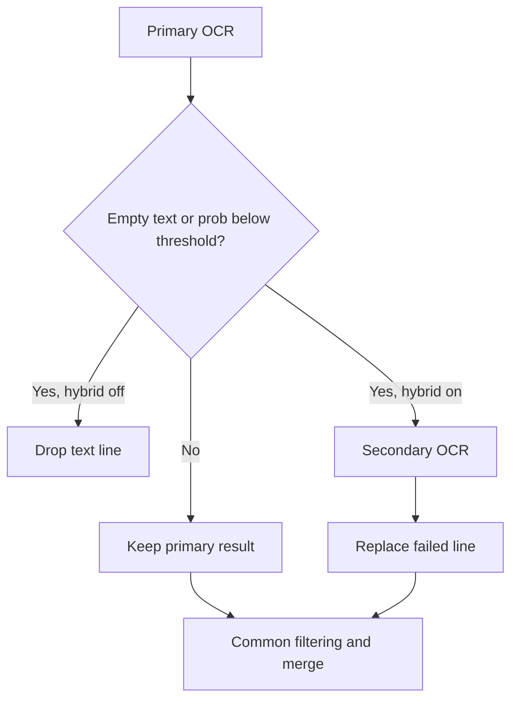
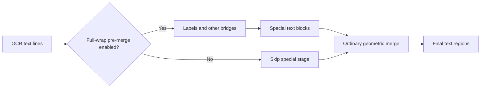
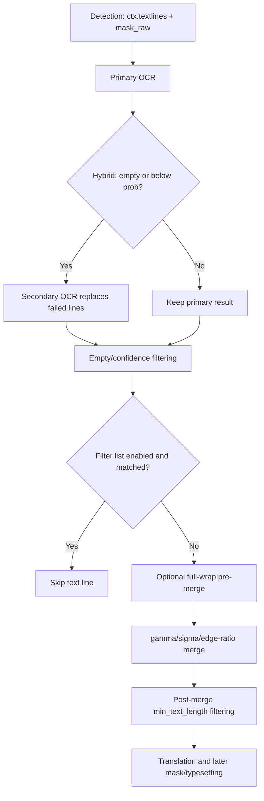

# OCR, Filtering, and Text-Line Merging

This guide covers the “OCR” settings tab: recognition after detection, bubble and confidence filtering, the filter list, and constraints before and after text-line merging. It does not document how detectors create boxes (see [Detection settings](./detection.md)) or translation, inpainting, and typesetting parameters.

## What these settings control {#feature-boundary}

The detector creates `ctx.textlines` and `mask_raw`; OCR writes text and probability for each box, OCR-stage filters remove invalid lines, and text lines are merged into text regions. Only then do regions enter translation. Bubble-repair options are documented here because they are related OCR settings, but their final consumer is mask refinement; detailed repair behavior belongs in [Mask and Inpainting](./mask-and-inpainting.md).

## Change it in the desktop app {#ui-operations}

1. Open Settings and select “OCR”. Toggles, numeric fields, and combo boxes edit configuration directly; fields after the “Advanced” divider remain on this page but are advanced controls.
2. “OCR Model” selects the primary engine. After “Enable Hybrid OCR” is enabled, empty or low-confidence lines are sent to “Secondary OCR”. Changing an OCR engine, hybrid switch, or secondary engine also refreshes the desktop API groups required by that implementation.
3. “AI OCR Prompt” is a file-edit action, not an ordinary `OcrConfig` field. It opens the fixed AI OCR prompt editor. Do not put prompt contents or credentials in this page.
4. “VLM OCR Language Hint” is used by prompt-capable vision-language OCR models such as PaddleOCR-VL; a non-empty “VLM OCR Custom Prompt (Override)” replaces the built-in language/prompt mode. Hayai OCR does not use either setting.
5. “Edit Filter List” opens the filter-list editor. Its structured page has “Contains Filter” (one contains rule per line) and “Exact Filter” (one exact rule per line); “Raw Edit” edits JSON directly. Use “Refresh” to reload, “Cancel” to discard, and “Save” to validate and save.
6. Blank rules are discarded. The raw JSON root must be an object. Structured saves preserve unknown top-level fields; invalid JSON shows “JSON format error” and is not saved.

## Parameters

> For the mapping of UI names, storage keys, and default values of the parameters on this page, see the [Settings Parameter Index](../../reference/settings-index.md).

#### OCR Model {#ocr-ocr}

The “OCR Model” combo box is on Settings → OCR and selects the primary OCR engine.

- `32px`: offline OCR (32px model).
- `48px`: offline OCR (48px model).
- `48px CTC`: offline OCR (48px CTC model).
- `Manga OCR`: lazily loaded manga-specific OCR.
- `PaddleOCR`: PaddleOCR engine.
- `PaddleOCR Korean`: Korean OCR.
- `PaddleOCR Latin`: Latin-script OCR.
- `PaddleOCR Thai`: Thai OCR.
- `PaddleOCR-VL`: VLM OCR engine.
- `Hayai OCR v2`: Hayai crop-level vision-language OCR model.
- `OpenAI OCR`: requires the corresponding API configuration.
- `Gemini OCR`: requires the corresponding API configuration.

Offline models load on the selected device; API engines need their API configuration. Default: `48px`.

#### Hybrid OCR {#hybrid-ocr}

When the “Enable Hybrid OCR” toggle is enabled, lines for which the primary OCR returns empty text or a value below “Text Region Min Probability” are handed to “Secondary OCR” for replacement; common filtering and merging still follow. The secondary model/API must be available, and loading, requests, and latency increase. Default: Enable Hybrid OCR `false`; Secondary OCR `mocr`.

#### Text Region Min Probability {#ocr-prob}

“Text Region Min Probability” is a nullable numeric field. Lines below this value are dropped or sent to the hybrid fallback; it controls both hybrid fallback and per-line post-OCR filtering, and it is not the detector’s “Text Threshold”. A high value triggers more fallback and drops more text. Default: `0.1`.

#### Ignore Non-Bubble Text {#ocr-ignore-bubble}

“Ignore Non-Bubble Text” is a 0–1 floating-point input where `0` disables it. Higher values are stricter: OCR backends drop non-bubble boxes before recognition. It can combine with model bubble filtering, reducing OCR input without refining the mask. Default: `0`.

#### Model Bubble Filter {#model-bubble-filter}

The “Enable Model Bubble Filter” toggle and the “Model Bubble Overlap Threshold” numeric field are on Settings → OCR. When enabled, a text box is retained only when its overlap with a detected bubble box reaches the threshold; lower is more permissive, and the same threshold is also used by pure-bubble filling. Default: Enable Model Bubble Filter `false`; Model Bubble Overlap Threshold `0.1`.

#### Minimum Text Length {#ocr-min-text-length}

“Minimum Text Length” is an integer input where `0` means no length deletion. It checks the text length of the final merged region, so short raw lines can still participate in merging; a large value may remove single-character text or sound effects. Default: `0`.

#### Enable Filter List {#filter-text-enabled}

The “Enable Filter List” toggle has an “Edit Filter List” button. When enabled, blank and low-confidence lines are dropped first, then exact and contains rules are matched case-insensitively; a matched line does not enter merging, translation, inpainting, or typesetting. Default: `false`.

#### Merge Tolerances {#merge-tolerances}

“Merge Distance Tolerance” and “Merge Outlier Tolerance” are floating-point inputs. The former relaxes the adjacent-line distance relative to font size; the latter relaxes the distance-outlier standard-deviation condition. Excessive values can merge text across bubbles. Defaults: `0.8` and `2.5`.

#### Merge Edge Ratio Threshold {#merge-edge-ratio}

“Merge Edge Ratio Threshold” is a floating-point input where `0` disables it. When enabled and a node has multiple neighbors, a longer edge is disconnected when its distance divided by the nearest distance exceeds the threshold; too small a value fragments text and too large a value weakens the guard. Default: `0`.

#### Require Full Wrap In Special Pre-Merge {#special-pre-merge}

When the “Require Full Wrap In Special Pre-Merge” toggle is on, full-wrap relationships are found first using strip/balloon labels; `other` boxes are bridges only and do not enter the final text block, then the remaining boxes use ordinary merging. Turning it off skips the special stage. Default: `true`.

#### VL and AI OCR parameters {#ocr-vl-and-ai}

- “VLM OCR Language Hint”: used by prompt-capable vision-language OCR models such as PaddleOCR-VL. Default: `Japanese`. Hayai OCR ignores this setting.
- “VLM OCR Custom Prompt (Override)”: a non-empty value overrides the built-in language/prompt mode for prompt-capable models; Hayai OCR ignores this setting.
- “AI OCR Prompt”: a fixed-prompt file action that opens the AI OCR prompt editor.
- “AI OCR Concurrency”: limits simultaneous AI OCR API requests; higher concurrency may trigger rate limits. Default: `10`.
- AI OCR custom prompt: empty by default.

OpenAI/Gemini OCR require the corresponding API configuration; no prompt or key is shown here.

## How the settings take effect {#runtime}

Post-OCR filtering occurs before merging, while minimum length is applied after merging. AI OCR concurrency limits OCR API requests only; it does not make the whole image pipeline concurrent.

## Interactions and caveats {#dependencies}

- Offline OCR requires its model and device backend; OpenAI/Gemini OCR requires credentials, address, and model in API Management.
- Hybrid OCR combined with a high `prob` causes more fallback inference/requests; an overly strict bubble threshold can miss text outside bubbles.
- Poor merge combinations cause cross-bubble over-merging or fragmentation. Bubble-repair intersection and dilation limits affect repair masks, not OCR text.
- AI OCR concurrency is constrained by API rate limits, quotas, network, and memory.

## Filter list file format {#filter-list-file-format}

- `config/filter_list.json` is the current filter-list file: a UTF-8 JSON root object with a `contains` array (contains rules) and an `exact` array (exact rules), one rule per entry; blank entries are dropped when the file is loaded or saved.
- `config/filter_list.txt` is the legacy line-based format: one rule per line, lines starting with `#` are comments, and the literal section headers `[包含过滤]` (Contains) and `[精确过滤]` (Exact) separate the two rule types. When the JSON file does not exist, the app migrates the TXT rules into `config/filter_list.json` on first load.
- Matching: an `exact` rule matches when the OCR text equals the rule exactly; a `contains` rule matches when the rule text appears anywhere in the OCR text. Both the rules and the OCR text are compared case-insensitively, and exact rules are checked before contains rules.
- Relationship with the toggle: rules take effect only when “Enable Filter List” is on; with the toggle off, the file is ignored. Text regions that match a rule are skipped and do not participate in merging, translation, inpainting, or typesetting.
